# CMS Workflow Specification

## Document Information

| Field | Value |
|-------|-------|
| **Document ID** | SS-WS3.0-CMS-WF |
| **Version** | 1.0 |
| **Date** | 2026-01-20 |
| **Author** | Obi Wan |
| **Status** | DRAFT |
| **Sprint** | WS3.0-S2 |
| **Task** | S2.2 |
| **Related Documents** | SS-WS3.0-CLS, SS-WS3.0-CMS-FR |

---

## 1. Executive Summary

This document defines all content management workflows for the Sommelier Spark CMS. It provides detailed step-by-step processes, decision points, error handling, and notifications for each workflow stage from content creation through archival.

**Key Statistics:**
- **6 Core Workflows**: Creation, Review, Publication, Revision, Archival, Emergency
- **8 Workflow Diagrams**: Visual representation of each process
- **12 Notification Types**: Event-driven communication
- **4 SLA Tiers**: Service level commitments

---

## 2. Workflow Overview

### 2.1 Workflow Summary

| Workflow | Purpose | Primary Actors | Typical Duration |
|----------|---------|----------------|------------------|
| Content Creation | Create new content items | Author | 30 min - 2 hours |
| Review/Approval | Validate content quality | Reviewer, Admin | 1-5 days |
| Publication | Make content live | Admin, System | Immediate - Scheduled |
| Revision | Update published content | Author, Reviewer | 1-3 days |
| Archival | Retire content | Admin | 7-day warning + immediate |
| Emergency | Urgent fixes | Senior Admin | 2 hours |

### 2.2 Complete Workflow Lifecycle

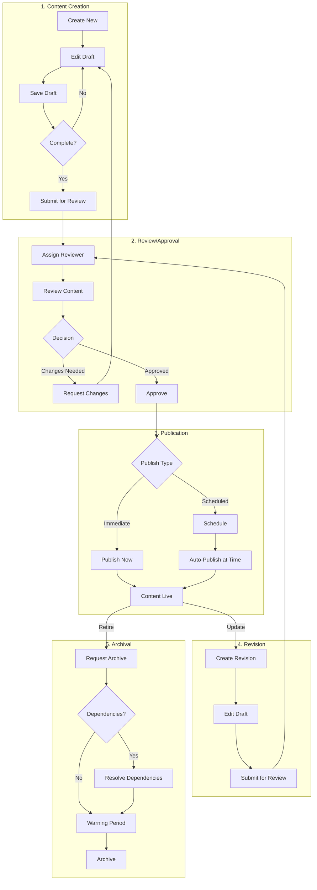

---

## 3. Content Creation Workflow

### 3.1 Workflow Diagram

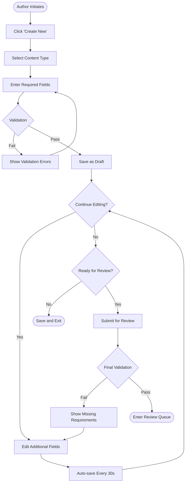

### 3.2 Step-by-Step Process

#### Step 1: Initiate Creation

| Attribute | Details |
|-----------|---------|
| **Actor** | Content Author, Content Admin, Org Admin |
| **Action** | Click "Create New" button in CMS |
| **Screen** | Content type selection modal |
| **Options** | Wine, Module, Lesson, Quiz, Question, Scenario |
| **Next** | Step 2 |

#### Step 2: Select Content Type

| Attribute | Details |
|-----------|---------|
| **Actor** | Author |
| **Action** | Select content type from options |
| **Screen** | Type selection with descriptions |
| **Validation** | User has permission for selected type |
| **Error** | "You don't have permission to create [type]" |
| **Next** | Step 3 |

#### Step 3: Enter Required Fields

| Attribute | Details |
|-----------|---------|
| **Actor** | Author |
| **Action** | Fill in required fields for content type |
| **Screen** | Content creation form |
| **Required Fields** | Varies by type (see Content Domain Model) |
| **Real-time Validation** | Field-level validation on blur |
| **Error Display** | Inline error messages below fields |
| **Next** | Step 4 (after validation passes) |

**Required Fields by Content Type:**

| Content Type | Required Fields |
|--------------|-----------------|
| Wine | name, region, country, wineType, grapeVarieties, priceTier |
| Module | title, description, category |
| Lesson | title, content, moduleId |
| Quiz | title, tier, passingScore |
| Question | question, questionType, options (min 2) |
| Scenario | title, description, category, difficulty, customerName |

#### Step 4: Save as Draft

| Attribute | Details |
|-----------|---------|
| **Actor** | System (automatic) or Author (manual) |
| **Action** | Save content with status = DRAFT |
| **System Actions** | - Generate unique ID |
| | - Set createdAt, createdBy |
| | - Set version = 1.0 |
| | - Create audit log entry |
| **Feedback** | "Draft saved successfully" toast |
| **Next** | Step 5 |

#### Step 5: Continue Editing (Optional)

| Attribute | Details |
|-----------|---------|
| **Actor** | Author |
| **Action** | Edit additional/optional fields |
| **Screen** | Full content editor |
| **Auto-save** | Every 30 seconds while editing |
| **Manual Save** | Ctrl+S or "Save" button |
| **Exit Options** | "Save and Close", "Save and Continue" |
| **Next** | Step 6 or Step 7 |

#### Step 6: Submit for Review

| Attribute | Details |
|-----------|---------|
| **Actor** | Author |
| **Action** | Click "Submit for Review" button |
| **Pre-submission Check** | Final validation of all required fields |
| **Validation Errors** | Block submission, show missing items |
| **Success** | Status changes to REVIEW |
| **System Actions** | - Lock content for editing |
| | - Set reviewRequestedAt |
| | - Assign reviewer (auto or manual) |
| | - Send notifications |
| | - Create audit log entry |
| **Next** | Review Workflow |

### 3.3 Error Handling

| Error Scenario | User Message | Recovery Action |
|----------------|--------------|-----------------|
| Required field missing | "Please fill in [field name]" | Highlight field, scroll to first error |
| Invalid format | "[Field] must be [format]" | Show format hint |
| Duplicate detected | "Similar content exists: [link]" | Offer to view existing or continue |
| Network error on save | "Save failed. Retrying..." | Auto-retry 3 times, then manual retry |
| Session expired | "Session expired. Please log in." | Save to local storage, prompt login |
| Permission denied | "You don't have permission" | Redirect to dashboard |

---

## 4. Review/Approval Workflow

### 4.1 Workflow Diagram

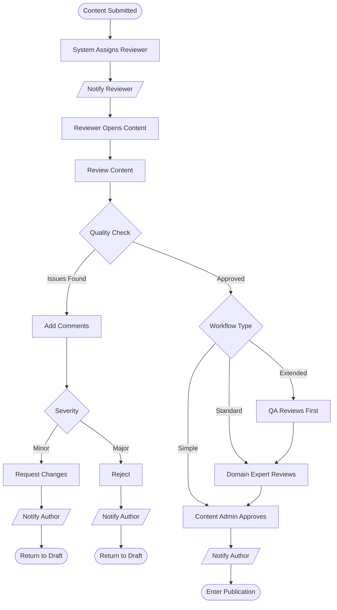

### 4.2 Step-by-Step Process

#### Step 1: Reviewer Assignment

| Attribute | Details |
|-----------|---------|
| **Actor** | System (automatic) or Content Admin (manual) |
| **Auto-Assignment Rules** | - Round-robin among available reviewers |
| | - Match reviewer expertise to content category |
| | - Balance workload across reviewers |
| **Manual Override** | Content Admin can reassign any time |
| **SLA** | Assignment within 1 hour |
| **Next** | Notification sent |

#### Step 2: Reviewer Notification

| Attribute | Details |
|-----------|---------|
| **Channels** | Email + In-app notification |
| **Email Subject** | "Review Required: [Content Title]" |
| **Email Content** | Content type, title, author, link to review |
| **In-app** | Badge on review queue, notification bell |
| **Reminder** | After 12 hours if not opened |

#### Step 3: Review Content

| Attribute | Details |
|-----------|---------|
| **Actor** | Domain Expert, QA Reviewer, or Content Admin |
| **Screen** | Side-by-side view: content preview + review panel |
| **Review Panel** | Checklist, comment fields, decision buttons |
| **Preview** | Exactly as learner would see |
| **Time Tracking** | System tracks time spent reviewing |

**Review Checklist by Content Type:**

| Content Type | Checklist Items |
|--------------|-----------------|
| Wine | Accuracy of facts, tasting notes quality, pairing validity |
| Module | Learning objectives clear, lesson flow logical |
| Quiz | Questions accurate, options fair, explanations helpful |
| Scenario | Dialogue realistic, scoring fair, paths complete |

#### Step 4: Make Decision

**Option A: Request Changes**

| Attribute | Details |
|-----------|---------|
| **When** | Minor issues that author can fix |
| **Required** | At least one comment explaining issue |
| **System Actions** | - Status → DRAFT |
| | - Unlock content for editing |
| | - Attach comments |
| | - Notify author |
| **Author Response** | Fix issues, resubmit |

**Option B: Reject**

| Attribute | Details |
|-----------|---------|
| **When** | Fundamental issues, not suitable for platform |
| **Required** | Detailed explanation |
| **System Actions** | - Status → DRAFT |
| | - Flag as rejected |
| | - Notify author |
| **Author Response** | Major revision or abandon |

**Option C: Approve**

| Attribute | Details |
|-----------|---------|
| **When** | Content meets all quality standards |
| **System Actions** | - Move to next approval stage (if any) |
| | - Or move to Publication queue |
| | - Notify author |

### 4.3 Multi-Stage Approval

#### Simple Workflow (Wine, Question)

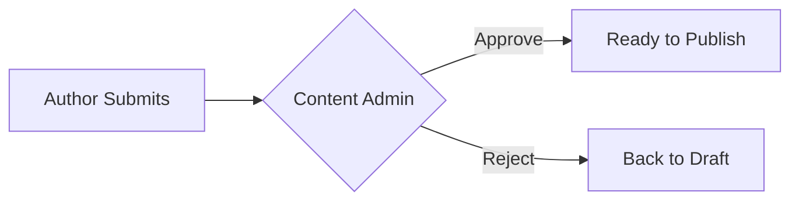

| Stage | Reviewer | Criteria |
|-------|----------|----------|
| 1 | Content Admin | Accuracy, completeness, formatting |

#### Standard Workflow (Module, Lesson, Quiz)

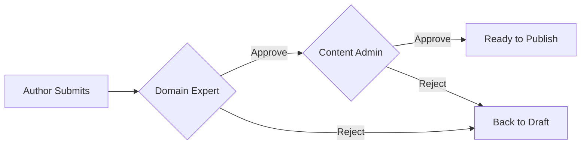

| Stage | Reviewer | Criteria |
|-------|----------|----------|
| 1 | Domain Expert | Wine/hospitality accuracy, educational value |
| 2 | Content Admin | Style, formatting, platform standards |

#### Extended Workflow (Scenario)

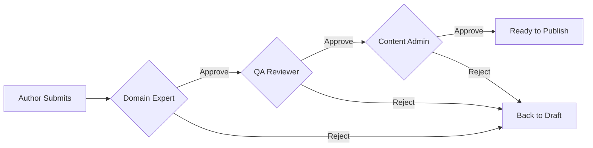

| Stage | Reviewer | Criteria |
|-------|----------|----------|
| 1 | Domain Expert | Dialogue realism, wine accuracy |
| 2 | QA Reviewer | All paths work, scoring correct, no dead ends |
| 3 | Content Admin | Final approval, style consistency |

### 4.4 Review Feedback Loop

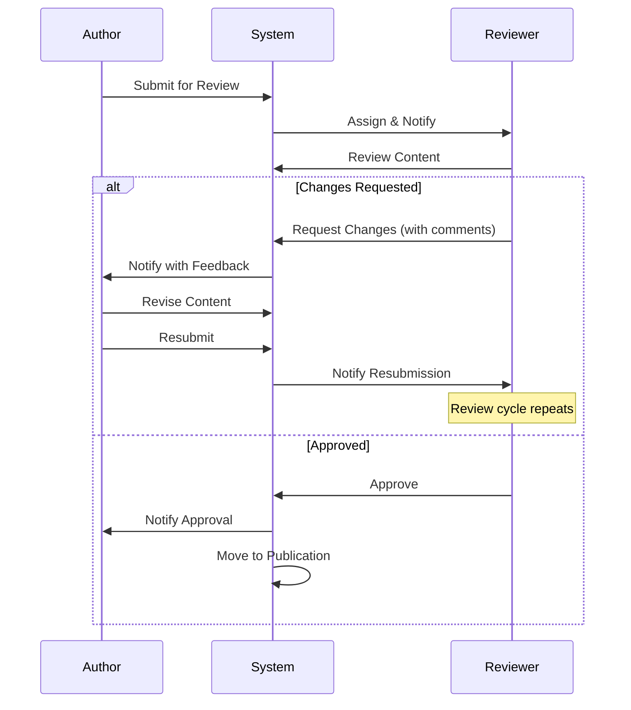

---

## 5. Publication Workflow

### 5.1 Workflow Diagram

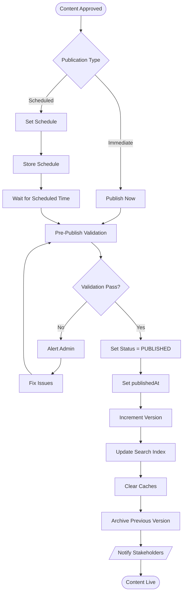

### 5.2 Immediate Publication

| Step | Action | Details |
|------|--------|---------|
| 1 | Admin clicks "Publish Now" | Button enabled after final approval |
| 2 | Pre-publish validation | Check all references valid, no broken links |
| 3 | Confirmation dialog | "Publish [Title] now? This will be visible to all users." |
| 4 | Execute publication | Database updates, status change |
| 5 | Post-publish tasks | Index update, cache clear |
| 6 | Notify stakeholders | Author, subscribers |

### 5.3 Scheduled Publication

| Step | Action | Details |
|------|--------|---------|
| 1 | Admin clicks "Schedule" | Opens date/time picker |
| 2 | Select publish date/time | Future date required, timezone shown |
| 3 | Confirm schedule | "Schedule [Title] for [DateTime]?" |
| 4 | System stores schedule | Status remains REVIEW (or new SCHEDULED state) |
| 5 | Scheduled job runs | At specified time, system executes publication |
| 6 | Failure handling | If fails, alert admin, retry once |

### 5.4 Pre-Publication Validation

| Check | Description | Failure Action |
|-------|-------------|----------------|
| Required fields complete | All mandatory fields have values | Block publish, show missing |
| References valid | Linked wines/quizzes/etc. exist and published | Block publish, show broken refs |
| Media accessible | Images/videos load correctly | Warn, allow override |
| No duplicate | No published content with same identifier | Block publish |
| Dependencies met | Prerequisites are published | Block publish |

### 5.5 Publication Actions

| Action | Timing | Details |
|--------|--------|---------|
| Set status = PUBLISHED | Immediate | Database update |
| Set publishedAt | Immediate | Timestamp |
| Set publishedBy | Immediate | Current admin user |
| Increment version | Immediate | If updating existing content |
| Archive previous | Immediate | Old version → ARCHIVED |
| Update search index | Within 30 seconds | Elasticsearch/Algolia update |
| Clear CDN cache | Within 1 minute | Invalidate cached content |
| Generate sitemap | Within 5 minutes | For SEO (if applicable) |

---

## 6. Revision Workflow

### 6.1 Workflow Diagram

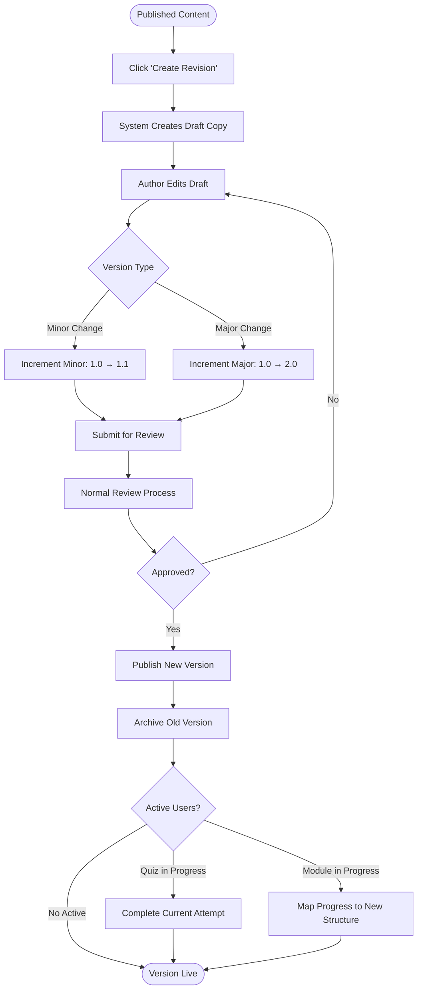

### 6.2 Step-by-Step Process

#### Step 1: Initiate Revision

| Attribute | Details |
|-----------|---------|
| **Actor** | Content Author, Content Admin |
| **Precondition** | Content is currently PUBLISHED |
| **Precondition** | No pending draft revision exists |
| **Action** | Click "Create Revision" on published content |
| **System** | Creates copy as DRAFT, links to published version |

#### Step 2: Edit Revision

| Attribute | Details |
|-----------|---------|
| **Actor** | Author |
| **Note** | Published version remains live during editing |
| **Screen** | Split view: current published vs draft changes |
| **Tracking** | System tracks all changes for diff |

#### Step 3: Determine Version Increment

| Change Type | Version Impact | Examples |
|-------------|----------------|----------|
| **Minor (1.0 → 1.1)** | Corrections, clarifications | Typo fix, add study tip, fix answer |
| **Major (1.0 → 2.0)** | Structural changes | Reorder lessons, change objectives, new questions |

System suggests based on changes detected:
- Only text changes → Suggest Minor
- Added/removed items → Suggest Major
- Changed structure → Suggest Major

#### Step 4: Submit and Review

Normal review workflow applies (see Section 4).

#### Step 5: Publish New Version

| Action | Details |
|--------|---------|
| New version → PUBLISHED | With new version number |
| Old version → ARCHIVED | Preserved for history |
| Version history | Updated with change summary |

### 6.3 Handling Active Users

#### Quiz In Progress

| Scenario | Action |
|----------|--------|
| User mid-quiz when version changes | Allow completion of current attempt |
| Score calculated | Use version they started with |
| Next attempt | Uses new version |
| Notification | None (seamless transition) |

#### Module In Progress

| Scenario | Action |
|----------|--------|
| Lesson structure unchanged | Progress preserved as-is |
| Lesson added | User sees new lesson as incomplete |
| Lesson removed | Mark as "legacy complete" |
| Lesson reordered | Map progress to new positions |

#### Scenario In Progress

| Scenario | Action |
|----------|--------|
| User mid-scenario | Allow completion |
| Paths changed | Invalidate if structure differs significantly |
| Next attempt | Uses new version |

### 6.4 Rollback Capability

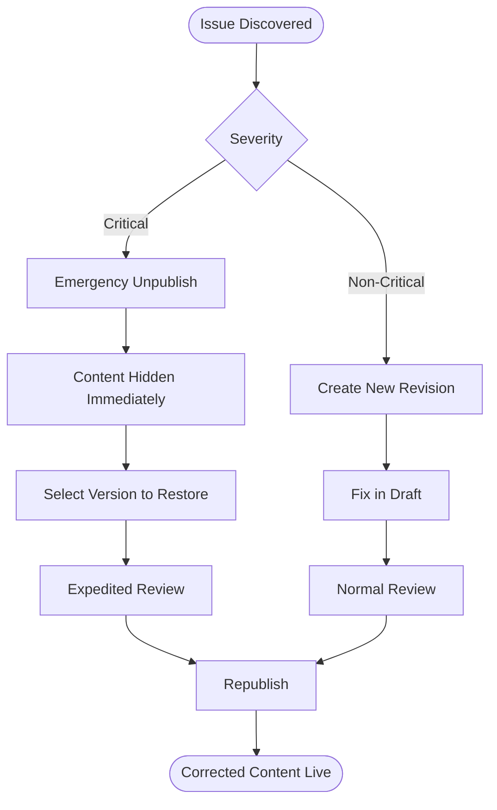

| Rollback Type | When to Use | Time to Resolve |
|---------------|-------------|-----------------|
| Emergency Unpublish | Critical error, misinformation | Minutes |
| Version Revert | Need previous version exactly | Hours |
| New Revision | Need to fix specific issues | Days |

---

## 7. Archival Workflow

### 7.1 Workflow Diagram

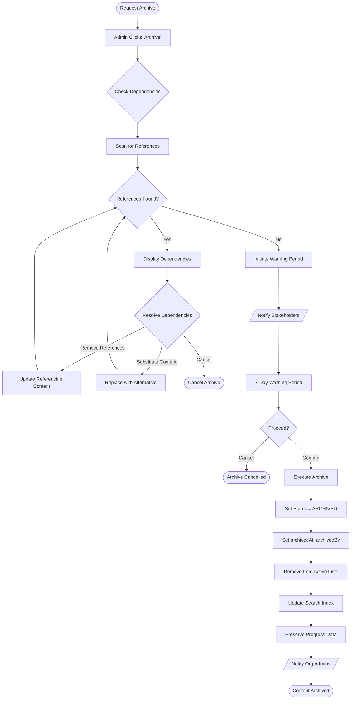

### 7.2 Step-by-Step Process

#### Step 1: Request Archive

| Attribute | Details |
|-----------|---------|
| **Actor** | Content Admin, Org Admin (org content only) |
| **Precondition** | Content is PUBLISHED |
| **Action** | Click "Archive" button |
| **Confirmation** | "Are you sure you want to archive [Title]?" |

#### Step 2: Dependency Check

| Reference Type | Example | Action Required |
|----------------|---------|-----------------|
| Wine in Quiz | Quiz question references wine | Remove question or substitute wine |
| Wine in Scenario | Scenario features wine | Update scenario or substitute wine |
| Lesson in Module | Module contains lesson | Remove lesson or move elsewhere |
| Quiz in Module | Module links to quiz | Remove link or substitute quiz |

**Dependency Display:**

```
Dependencies Found for "Château Margaux":
─────────────────────────────────────────
• Quiz: "Wine Fundamentals Bronze" (2 questions)
  - Question: "Which wine is from Bordeaux?"
  - Question: "Match the wine to its region"

• Scenario: "Anniversary Dinner" (1 reference)
  - Step 3: Wine recommendation

Options:
[ ] Remove all references (will require re-review)
[ ] Substitute with: [Select Wine ▼]
[Cancel] [Continue with Removal]
```

#### Step 3: Warning Period

| Phase | Duration | Actions |
|-------|----------|---------|
| Initiation | Day 0 | Admin confirms archive intent |
| Warning | Days 1-6 | Banner on content, notifications sent |
| Final Notice | Day 7 | Last chance notification |
| Execution | Day 7+ | Archive executed if not cancelled |

**Warning Notifications:**

| Recipient | Channel | Timing |
|-----------|---------|--------|
| Content Author | Email | Day 0, Day 5 |
| Org Admins | Email | Day 0 |
| Active Learners | In-app | Day 5 |

#### Step 4: Execute Archive

| Action | Details |
|--------|---------|
| Status → ARCHIVED | Database update |
| archivedAt = now | Timestamp |
| archivedBy = user | Who archived |
| Remove from lists | Not shown in active content |
| Update search | Remove from search index |
| Preserve progress | User progress data retained |
| Audit log | Full record of action |

### 7.3 Restore Process

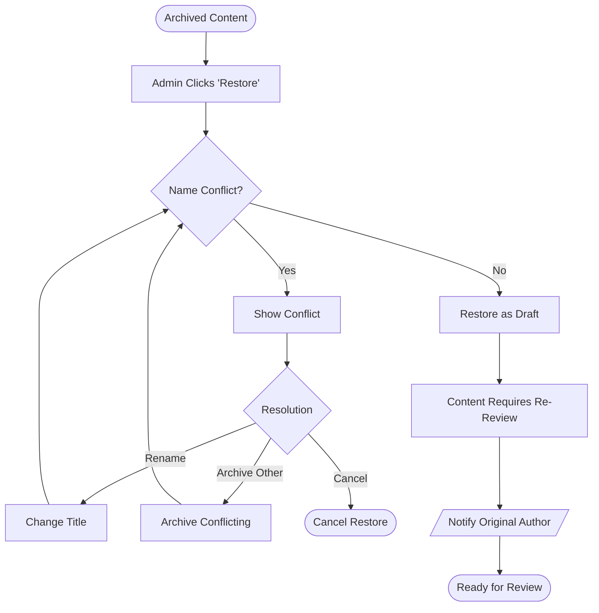

| Attribute | Details |
|-----------|---------|
| **Actor** | Content Admin only |
| **Result** | Content restored as DRAFT |
| **Review** | Must go through review again |
| **History** | Archive/restore recorded in audit |

### 7.4 Archive vs Delete

| Action | Reversible | Data Retained | When to Use |
|--------|------------|---------------|-------------|
| **Archive** | Yes | All content + progress | Standard retirement |
| **Soft Delete** | Yes (30 days) | Content only | Draft cleanup |
| **Permanent Delete** | No | Audit log only | Legal requirement |

**Permanent Delete Safeguards:**
1. Requires Content Admin + second approval
2. 7-day cooling-off period
3. Cannot delete if user progress exists
4. Full audit trail maintained

---

## 8. Emergency/Expedited Workflow

### 8.1 Workflow Diagram

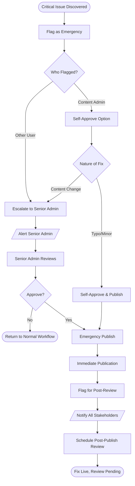

### 8.2 When to Use Emergency Workflow

| Scenario | Priority | Example |
|----------|----------|---------|
| Incorrect wine information | Critical | Wrong region, false health claim |
| Broken scenario (uncompletable) | Critical | Dead-end path, scoring error |
| Offensive content | Critical | Inappropriate language |
| Outdated information | High | Changed regulations |
| Typo in prominent location | Medium | Title spelling error |

### 8.3 Step-by-Step Process

#### Step 1: Flag as Emergency

| Attribute | Details |
|-----------|---------|
| **Actor** | Any CMS user (report) or Content Admin (flag) |
| **Action** | Click "Report Issue" or "Emergency Edit" |
| **Required** | Description of issue, severity selection |
| **System** | Creates emergency ticket, alerts admins |

#### Step 2: Senior Admin Review

| Attribute | Details |
|-----------|---------|
| **Actor** | Senior Content Admin (designated) |
| **SLA** | 2 hours response time |
| **Action** | Review issue, decide on action |
| **Options** | Approve emergency fix, request normal workflow |

#### Step 3: Emergency Publication

| Attribute | Details |
|-----------|---------|
| **Bypass** | Skips normal review stages |
| **Approval** | Senior Admin only |
| **Audit** | Enhanced logging (reason, approver, timestamp) |
| **Flag** | Content flagged for post-publish review |

#### Step 4: Post-Publish Review

| Attribute | Details |
|-----------|---------|
| **Timing** | Within 24-48 hours of emergency publish |
| **Actor** | Domain Expert (if bypassed) |
| **Purpose** | Verify fix is complete and accurate |
| **Outcome** | Clear flag or request further changes |

### 8.4 Audit Requirements

| Field | Required | Details |
|-------|----------|---------|
| Emergency reason | Yes | Why was emergency workflow used |
| Reporter | Yes | Who identified the issue |
| Approver | Yes | Senior admin who approved |
| Time to resolve | Yes | From report to publication |
| Post-review status | Yes | Completed or pending |
| Post-reviewer | Yes | Who conducted post-review |

---

## 9. Notifications

### 9.1 Notification Matrix

| Event | Recipients | Email | In-App | Push | Timing |
|-------|------------|-------|--------|------|--------|
| Content submitted for review | Assigned reviewers | ✓ | ✓ | — | Immediate |
| Review reminder | Assigned reviewer | ✓ | ✓ | — | After 12h |
| Review overdue | Reviewer + Admin | ✓ | ✓ | — | After 24h |
| Changes requested | Author | ✓ | ✓ | — | Immediate |
| Content rejected | Author | ✓ | ✓ | — | Immediate |
| Content approved | Author | ✓ | ✓ | — | Immediate |
| Content published | Author | ✓ | ✓ | — | Immediate |
| Scheduled publish reminder | Author + Admin | ✓ | — | — | 1h before |
| Content archived (warning) | Author + Admins | ✓ | ✓ | — | Day 0, Day 5 |
| Content archived (final) | Author + Admins | ✓ | ✓ | — | On archive |
| Emergency issue reported | All Admins | ✓ | ✓ | ✓ | Immediate |
| Emergency fix published | All stakeholders | ✓ | ✓ | — | Immediate |

### 9.2 Notification Templates

#### Content Submitted for Review

```
Subject: Review Required: [Content Type] - [Title]

Hi [Reviewer Name],

New content has been submitted for your review:

Type: [Content Type]
Title: [Title]
Author: [Author Name]
Submitted: [DateTime]

[Review Now →]

This review is due by [Due DateTime].

---
Sommelier Spark CMS
```

#### Changes Requested

```
Subject: Changes Requested: [Title]

Hi [Author Name],

Your content "[Title]" requires changes before it can be published.

Reviewer: [Reviewer Name]
Feedback:
"[Reviewer Comments]"

[View Feedback & Edit →]

Please address the feedback and resubmit when ready.

---
Sommelier Spark CMS
```

#### Content Approved

```
Subject: Approved: [Title] is Ready to Publish

Hi [Author Name],

Great news! Your content has been approved:

Title: [Title]
Approved by: [Approver Name]
Status: Ready to Publish

[View Content →]

The content will be published by an administrator shortly.

---
Sommelier Spark CMS
```

#### Emergency Alert

```
Subject: URGENT: Emergency Content Issue Reported

Hi [Admin Name],

An emergency content issue has been reported:

Content: [Title]
Reported by: [Reporter Name]
Severity: [Critical/High]
Issue: [Description]

[Review Issue Now →]

Please review within 2 hours.

---
Sommelier Spark CMS
```

### 9.3 Notification Preferences

Users can configure:

| Setting | Options | Default |
|---------|---------|---------|
| Email notifications | On/Off | On |
| In-app notifications | On/Off | On |
| Digest frequency | Immediate/Daily/Weekly | Immediate |
| Quiet hours | Time range | None |

---

## 10. Service Level Agreements (SLAs)

### 10.1 SLA Definitions

| Stage | Target Time | Measurement | Escalation Trigger |
|-------|-------------|-------------|-------------------|
| **Reviewer assignment** | 1 hour | From submission to assignment | Auto-assign if not done |
| **Review start** | 4 hours | From assignment to first action | Reminder notification |
| **Review completion** | 24 hours | From assignment to decision | Escalate to Content Admin |
| **Emergency review** | 2 hours | From flag to resolution | Escalate to Senior Admin |
| **Scheduled publish** | On time ±1 min | Scheduled time vs actual | Alert if delayed |
| **Archive warning** | 7 days | Warning period duration | N/A (fixed) |

### 10.2 Escalation Matrix

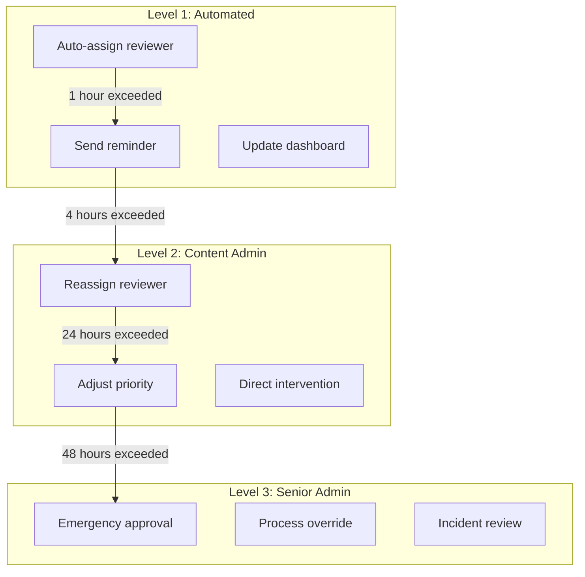

### 10.3 SLA Reporting

| Metric | Target | Measurement Period |
|--------|--------|-------------------|
| Review completion rate | 95% within SLA | Monthly |
| Average review time | < 18 hours | Monthly |
| Emergency response time | < 1.5 hours avg | Monthly |
| Scheduled publish accuracy | 99.9% on time | Monthly |
| Escalation rate | < 10% | Monthly |

---

## 11. Appendix

### 11.1 Workflow Summary

| Workflow | Steps | Diagram |
|----------|-------|---------|
| Content Creation | 6 | Section 3.1 |
| Review/Approval | 4 | Section 4.1 |
| Publication | 6 | Section 5.1 |
| Revision | 5 | Section 6.1 |
| Archival | 4 | Section 7.1 |
| Emergency | 4 | Section 8.1 |

**Total: 6 workflows documented**

### 11.2 Diagram Summary

| Diagram | Section | Type |
|---------|---------|------|
| Complete Workflow Lifecycle | 2.2 | Flowchart |
| Content Creation | 3.1 | Flowchart |
| Review/Approval | 4.1 | Flowchart |
| Multi-Stage Approval (3 diagrams) | 4.3 | Flowcharts |
| Review Feedback Loop | 4.4 | Sequence |
| Publication | 5.1 | Flowchart |
| Revision | 6.1 | Flowchart |
| Rollback | 6.4 | Flowchart |
| Archival | 7.1 | Flowchart |
| Restore | 7.3 | Flowchart |
| Emergency | 8.1 | Flowchart |
| Escalation | 10.2 | Flowchart |

**Total: 13 diagrams created**

### 11.3 Notification Summary

| # | Notification | Trigger |
|---|--------------|---------|
| 1 | Review assigned | Content submitted |
| 2 | Review reminder | 12h no action |
| 3 | Review overdue | 24h exceeded |
| 4 | Changes requested | Reviewer feedback |
| 5 | Content rejected | Review decision |
| 6 | Content approved | Review decision |
| 7 | Content published | Publication complete |
| 8 | Scheduled reminder | 1h before publish |
| 9 | Archive warning (initial) | Archive initiated |
| 10 | Archive warning (final) | Day 5 of warning |
| 11 | Content archived | Archive complete |
| 12 | Emergency alert | Issue reported |
| 13 | Emergency resolved | Fix published |

**Total: 13 notification types defined**

### 11.4 Revision History

| Version | Date | Author | Changes |
|---------|------|--------|---------|
| 1.0 | 2026-01-20 | Obi Wan | Initial draft |

---

*End of Document*
