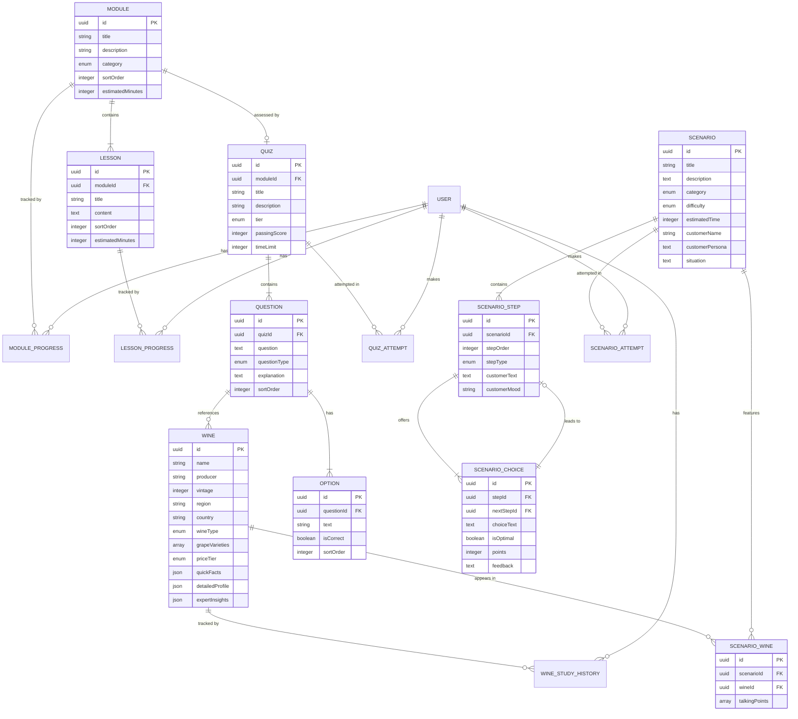
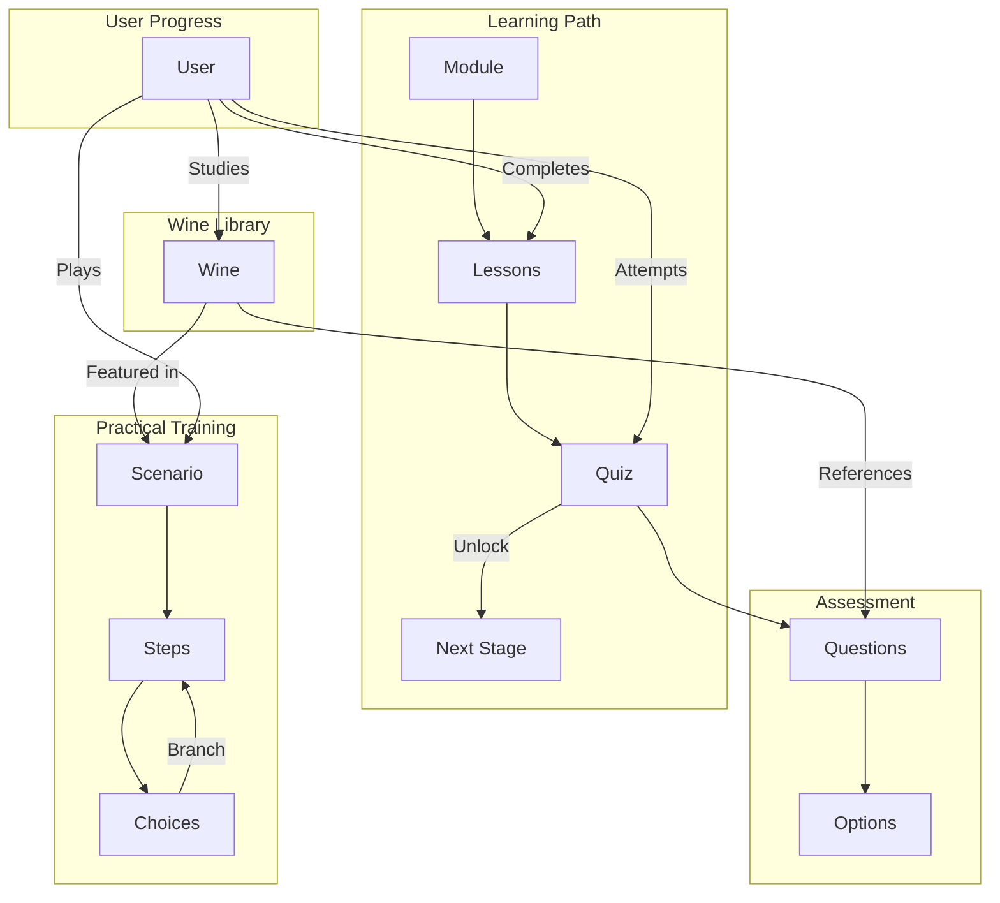

# Content Domain Model

## Document Information

| Field | Value |
|-------|-------|
| **Document ID** | SS-WS3.0-CDM |
| **Version** | 1.0 |
| **Date** | 2026-01-20 |
| **Author** | Obi Wan |
| **Status** | DRAFT |
| **Sprint** | WS3.0-S1 |
| **Task** | S1.1 |

---

## 1. Executive Summary

This document defines the Content Domain Model for Sommelier Spark, establishing the canonical structure for all content entities across the platform. The model is derived from analysis of both the iOS application (`sommelier_spark_ios`) and Web application (`sommelier_spark`) codebases.

**Key Statistics:**
- **6 Primary Entities**: Wine, Module, Lesson, Quiz, Question, Scenario
- **12 Relationships**: Interconnections between content entities
- **4 Major Taxonomies**: Wine Types, Price Tiers, Content Categories, Difficulty Tiers

---

## 2. Content Entities

### 2.1 Wine Entity

The Wine entity is the core content element representing individual wines in the learning library.

#### 2.1.1 Core Attributes

| Attribute | Type | Required | Description |
|-----------|------|----------|-------------|
| `id` | UUID | Yes | Unique identifier |
| `name` | String | Yes | Wine name (e.g., "Château Margaux") |
| `producer` | String | No | Producer/estate name |
| `vintage` | Integer | No | Year produced (null for NV wines) |
| `region` | String | Yes | Geographic region (e.g., "Margaux") |
| `country` | String | Yes | Country of origin (e.g., "France") |
| `wineType` | Enum | Yes | See Wine Types taxonomy |
| `grapeVarieties` | String[] | Yes | Array of grape varietals |
| `priceTier` | Enum | Yes | See Price Tiers taxonomy |
| `foodPairings` | String[] | No | Food pairing suggestions |
| `servingTemperature` | String | No | Recommended serving temperature |
| `imageUrl` | String | No | Wine bottle image URL |
| `version` | Integer | Yes | Content version (default: 1) |

#### 2.1.2 Progressive Disclosure Content

Wines implement a **three-level progressive disclosure** model to support differentiated learning:

**Level 1: Quick Facts** (Required)
| Field | Type | Description |
|-------|------|-------------|
| `tastingNotes` | String | Brief tasting description |
| `pairings` | String[] | Simple food pairing list |
| `keyPoints` | String[] | Essential facts to remember |
| `pronunciation` | String | Phonetic pronunciation guide |
| `studyTips` | String | Learning tips for beginners |
| `quickQuiz` | String | Quick knowledge check question |

**Level 2: Detailed Profile** (Optional - Unlocks at Silver)
| Field | Type | Description |
|-------|------|-------------|
| `appearance` | String | Visual characteristics |
| `nose` | String | Aromatic profile |
| `palate` | String | Taste characteristics |
| `production` | String | Winemaking methods |
| `sensoryTraining` | String | How to identify this wine |
| `pairingRationale` | String | Why certain pairings work |
| `regionContext` | String | Regional significance |
| `quickQuiz` | String | Intermediate knowledge check |

**Level 3: Expert Insights** (Optional - Unlocks at Gold)
| Field | Type | Description |
|-------|------|-------------|
| `history` | String | Historical background |
| `terroir` | String | Terroir analysis |
| `aging` | String | Aging potential and recommendations |
| `servingTemp` | String | Detailed serving guidance |
| `sommelierTips` | String | Professional service tips |
| `marketInsight` | String | Market positioning and trends |
| `blindTastingClues` | String | Identification cues |
| `quickQuiz` | String | Advanced knowledge check |

#### 2.1.3 Wine Relationships

- **ScenarioWine** → Links wines to scenarios where they appear
- **WineStudyHistory** → Tracks user study progress per wine

---

### 2.2 Module Entity

Modules are learning units that contain related lessons organized around a topic.

#### 2.2.1 Attributes

| Attribute | Type | Required | Description |
|-----------|------|----------|-------------|
| `id` | UUID | Yes | Unique identifier |
| `title` | String | Yes | Module title |
| `description` | String | Yes | Module description |
| `category` | Enum | Yes | See Content Categories taxonomy |
| `sortOrder` | Integer | Yes | Display order |
| `estimatedMinutes` | Integer | Yes | Total estimated time |
| `imageUrl` | String | No | Module thumbnail |
| `tier` | Enum | No | Implied by content (Bronze/Silver/Gold) |

#### 2.2.2 Module Relationships

- **Lesson[]** → Contains multiple lessons
- **Quiz** → Optional associated quiz
- **ModuleProgress** → User progress tracking

#### 2.2.3 Completion Criteria

- Module is **complete** when all lessons are marked complete
- Completion unlocks associated quizzes and advanced content

---

### 2.3 Lesson Entity

Lessons are individual learning units within a module.

#### 2.3.1 Attributes

| Attribute | Type | Required | Description |
|-----------|------|----------|-------------|
| `id` | UUID | Yes | Unique identifier |
| `moduleId` | UUID | Yes | Parent module reference |
| `title` | String | Yes | Lesson title |
| `content` | Text (HTML) | Yes | Rich text lesson content |
| `sortOrder` | Integer | Yes | Order within module |
| `estimatedMinutes` | Integer | Yes | Estimated completion time |

#### 2.3.2 Content Format

Lesson content is stored as **HTML markup** supporting:
- Headings (`<h2>`, `<h3>`)
- Paragraphs (`<p>`)
- Lists (`<ul>`, `<ol>`)
- Emphasis (`<strong>`, `<em>`)
- Custom sections (`<div class="...">`)

#### 2.3.3 Lesson Relationships

- **Module** → Belongs to one module
- **LessonProgress** → User completion tracking

#### 2.3.4 Learning Objectives

Each lesson should address:
- One primary learning objective
- 2-3 supporting concepts
- Practical application examples

---

### 2.4 Quiz Entity

Quizzes assess user knowledge and gate progression through tier levels.

#### 2.4.1 Attributes

| Attribute | Type | Required | Description |
|-----------|------|----------|-------------|
| `id` | UUID | Yes | Unique identifier |
| `title` | String | Yes | Quiz title |
| `description` | String | No | Quiz description |
| `category` | String | No | Content category |
| `tier` | Enum | Yes | bronze / silver / gold |
| `passingScore` | Integer | Yes | Required percentage to pass |
| `timeLimit` | Integer | No | Time limit in minutes |
| `moduleId` | UUID | No | Associated module |

#### 2.4.2 Tier-Based Pass Thresholds

| Tier | Pass Threshold | Typical Time Limit |
|------|----------------|-------------------|
| **Bronze** | 70% | 12-15 minutes |
| **Silver** | 80% | 15-20 minutes |
| **Gold** | 90% | 20-25 minutes |

#### 2.4.3 Scoring Rules

1. Each question is worth equal points
2. No partial credit for multiple-select questions
3. Score = (Correct Answers / Total Questions) × 100
4. Pass/Fail determined by tier threshold
5. Best score is retained across attempts

#### 2.4.4 Unlock Conditions

| Tier | Prerequisites |
|------|---------------|
| Bronze | None (always available) |
| Silver | Pass Bronze quiz in same category |
| Gold | Pass Silver quiz in same category |

#### 2.4.5 Quiz Relationships

- **Question[]** → Contains multiple questions
- **Module** → Optional associated module
- **QuizAttempt** → User attempt history

---

### 2.5 Question Entity

Questions are the atomic assessment units within quizzes.

#### 2.5.1 Attributes

| Attribute | Type | Required | Description |
|-----------|------|----------|-------------|
| `id` | UUID | Yes | Unique identifier |
| `quizId` | UUID | Yes | Parent quiz reference |
| `question` | Text | Yes | Question text |
| `questionType` | Enum | Yes | Question type |
| `explanation` | Text | No | Answer explanation |
| `sortOrder` | Integer | Yes | Order within quiz |
| `difficulty` | Enum | No | Easy / Medium / Hard |
| `relatedWineIds` | UUID[] | No | Associated wines |

#### 2.5.2 Question Types

| Type | Description | Answer Format |
|------|-------------|---------------|
| `multiple_choice` | Single correct answer | Select one option |
| `multiple_select` | Multiple correct answers | Select all that apply |
| `true_false` | Binary true/false | Select True or False |
| `matching` | Match items between lists | Connect pairs |

#### 2.5.3 Option Structure

| Attribute | Type | Required | Description |
|-----------|------|----------|-------------|
| `id` | UUID | Yes | Option identifier |
| `questionId` | UUID | Yes | Parent question |
| `text` | String | Yes | Option text |
| `isCorrect` | Boolean | Yes | Whether correct answer |
| `sortOrder` | Integer | Yes | Display order |

#### 2.5.4 Question Relationships

- **Quiz** → Belongs to one quiz
- **Option[]** → Has multiple answer options
- **Wine[]** → May reference related wines

---

### 2.6 Scenario Entity

Scenarios are interactive customer service simulations with branching dialogue.

#### 2.6.1 Core Attributes

| Attribute | Type | Required | Description |
|-----------|------|----------|-------------|
| `id` | UUID | Yes | Unique identifier |
| `title` | String | Yes | Scenario title |
| `description` | Text | Yes | Scenario description |
| `category` | Enum | Yes | See Scenario Categories |
| `difficulty` | Enum | Yes | BRONZE / SILVER / GOLD |
| `estimatedTime` | Integer | Yes | Estimated minutes |
| `customerName` | String | Yes | Customer character name |
| `customerPersona` | Text | Yes | Customer background/personality |
| `situation` | Text | Yes | Setup description |
| `isActive` | Boolean | Yes | Whether scenario is live |

#### 2.6.2 Scenario Categories

| Category | Description |
|----------|-------------|
| `WINE_PAIRING` | Recommending wines with food |
| `CUSTOMER_SERVICE` | General customer interaction |
| `UPSELLING` | Premium recommendation skills |
| `DIETARY_ALLERGIES` | Handling dietary restrictions |
| `WINE_FAULTS` | Identifying and handling wine faults |
| `SPECIAL_OCCASIONS` | Event and celebration recommendations |

#### 2.6.3 Decision Tree Structure

**ScenarioStep**
| Attribute | Type | Required | Description |
|-----------|------|----------|-------------|
| `id` | UUID | Yes | Step identifier |
| `scenarioId` | UUID | Yes | Parent scenario |
| `stepOrder` | Integer | Yes | Sequence order |
| `stepType` | Enum | Yes | DIALOGUE / ACTION / OBSERVATION / CONCLUSION |
| `customerText` | Text | Yes | What customer says |
| `customerMood` | String | No | Customer emotional state |
| `context` | Text | No | Scene context |
| `hint` | Text | No | Optional hint |

**ScenarioChoice**
| Attribute | Type | Required | Description |
|-----------|------|----------|-------------|
| `id` | UUID | Yes | Choice identifier |
| `stepId` | UUID | Yes | Parent step |
| `choiceText` | Text | Yes | Staff response option |
| `isOptimal` | Boolean | Yes | Best choice flag |
| `points` | Integer | Yes | Points awarded (0-10) |
| `feedback` | Text | Yes | Explanation of choice |
| `customerReaction` | Text | No | How customer responds |
| `nextStepId` | UUID | No | Next step (null = end) |
| `sortOrder` | Integer | Yes | Display order |

#### 2.6.4 Scoring Rubric

1. Each choice awards 0-10 points
2. Optimal choices award maximum points (typically 10)
3. Suboptimal choices award partial points (1-8)
4. Poor choices award 0-2 points
5. Final score = (Points Earned / Max Possible) × 100

| Difficulty | Pass Threshold |
|------------|----------------|
| BRONZE | 70% |
| SILVER | 80% |
| GOLD | 90% |

#### 2.6.5 Scenario Relationships

- **ScenarioStep[]** → Contains dialogue steps
- **ScenarioWine[]** → References wines used in scenario
- **ScenarioAttempt** → User attempt history

---

## 3. Entity Relationship Diagram



---

## 4. Categories and Taxonomies

### 4.1 Wine Types

| Type | Description | Example |
|------|-------------|---------|
| `red` | Red wines | Cabernet Sauvignon, Pinot Noir |
| `white` | White wines | Chardonnay, Sauvignon Blanc |
| `rosé` | Rosé wines | Provence Rosé, White Zinfandel |
| `sparkling` | Sparkling wines | Champagne, Prosecco, Cava |
| `dessert` | Sweet/dessert wines | Sauternes, Late Harvest |
| `fortified` | Fortified wines | Port, Sherry, Madeira |

### 4.2 Price Tiers

| Tier | Typical Price Range | Description |
|------|---------------------|-------------|
| `budget` | Under $15 | Entry-level, everyday wines |
| `moderate` | $15 - $30 | Quality wines for regular enjoyment |
| `premium` | $30 - $75 | Special occasion wines |
| `luxury` | Over $75 | Fine wines, collectibles |

### 4.3 Content Categories

| Category | Description | Example Topics |
|----------|-------------|----------------|
| `wine_fundamentals` | Basic wine knowledge | What is wine, wine making |
| `grape_varieties` | Grape variety education | Major red/white grapes |
| `regions_appellations` | Geographic wine regions | France, Italy, New World |
| `tasting_techniques` | Wine tasting skills | Systematic tasting, blind tasting |
| `food_pairing` | Food and wine matching | Pairing principles, cuisine types |
| `service_skills` | Wine service techniques | Opening, pouring, decanting |
| `wine_knowledge` | Advanced wine topics | Wine faults, storage, aging |

### 4.4 Content Tiers

| Tier | Level | Pass Threshold | Target Audience |
|------|-------|----------------|-----------------|
| `bronze` | Beginner | 70% | New staff, wine enthusiasts |
| `silver` | Intermediate | 80% | Experienced staff, pursuing certification |
| `gold` | Advanced | 90% | Sommeliers, managers, experts |

### 4.5 Region Hierarchy

```
Country
└── Region
    └── Sub-region/Appellation
        └── Commune/Village
```

**Example:**
```
France
├── Burgundy
│   ├── Côte de Nuits
│   │   ├── Gevrey-Chambertin
│   │   └── Vosne-Romanée
│   └── Côte de Beaune
│       ├── Meursault
│       └── Puligny-Montrachet
├── Bordeaux
│   ├── Left Bank
│   │   ├── Margaux
│   │   └── Pauillac
│   └── Right Bank
│       ├── Saint-Émilion
│       └── Pomerol
└── Champagne
    ├── Montagne de Reims
    └── Côte des Blancs
```

### 4.6 Grape Varieties

**Red Grapes:**
- Cabernet Sauvignon
- Merlot
- Pinot Noir
- Syrah/Shiraz
- Grenache
- Sangiovese
- Nebbiolo
- Tempranillo
- Malbec
- Zinfandel

**White Grapes:**
- Chardonnay
- Sauvignon Blanc
- Riesling
- Pinot Grigio/Pinot Gris
- Gewürztraminer
- Chenin Blanc
- Viognier
- Albariño
- Grüner Veltliner
- Sémillon

---

## 5. Content Relationships Summary

### 5.1 Relationship Matrix

| From Entity | To Entity | Relationship | Cardinality |
|-------------|-----------|--------------|-------------|
| Module | Lesson | Contains | 1:N |
| Module | Quiz | Assessed by | 1:0..1 |
| Quiz | Question | Contains | 1:N |
| Question | Option | Has | 1:N |
| Question | Wine | References | N:M |
| Scenario | ScenarioStep | Contains | 1:N |
| ScenarioStep | ScenarioChoice | Offers | 1:N |
| ScenarioChoice | ScenarioStep | Leads to | N:0..1 |
| Scenario | Wine | Features | N:M |
| User | Wine | Studies | N:M |
| User | Lesson | Completes | N:M |
| User | Quiz | Attempts | N:M |
| User | Scenario | Attempts | N:M |

### 5.2 Dependency Graph



---

## 6. Data Validation Rules

### 6.1 Wine Validation

| Rule | Description |
|------|-------------|
| Name required | Non-empty string |
| Region required | Non-empty string |
| Country required | Non-empty string |
| Wine type valid | Must be valid enum value |
| Grape varieties | At least one variety |
| Price tier valid | Must be valid enum value |
| Quick facts required | Level 1 content mandatory |
| Vintage | If present, must be 1900-current year |

### 6.2 Module/Lesson Validation

| Rule | Description |
|------|-------------|
| Title required | Non-empty string |
| At least one lesson | Modules must contain ≥1 lesson |
| Sort order unique | No duplicate sort orders within module |
| Estimated time positive | Must be > 0 |

### 6.3 Quiz Validation

| Rule | Description |
|------|-------------|
| Title required | Non-empty string |
| Passing score range | 0-100 |
| At least one question | Quizzes must contain ≥1 question |
| Time limit positive | If set, must be > 0 |

### 6.4 Question Validation

| Rule | Description |
|------|-------------|
| Question text required | Non-empty string |
| At least two options | Questions must have ≥2 options |
| At least one correct | Must have ≥1 correct answer |
| Multiple choice | Exactly one correct answer |
| True/false | Exactly two options (True/False) |

### 6.5 Scenario Validation

| Rule | Description |
|------|-------------|
| Title required | Non-empty string |
| Customer name required | Non-empty string |
| At least one step | Scenarios must have ≥1 step |
| Each step has choices | Steps must have ≥2 choices |
| Reachable steps | All steps must be reachable from step 1 |
| Termination | At least one path must end (nextStepId = null) |

---

## 7. Appendix

### 7.1 Current Content Statistics

**From iOS App Analysis:**
| Entity | Count |
|--------|-------|
| Wines | 23 |
| Modules | 7 |
| Lessons | 24 |
| Quizzes | 21 |
| Questions | 210 |
| Scenarios | 7 |

**From Web App Analysis:**
| Entity | Count |
|--------|-------|
| Wines | 15+ |
| Modules | 6 |
| Lessons | ~25 |
| Quizzes | 10+ |
| Questions | ~100+ |
| Scenarios | 8+ |

### 7.2 Source File References

**iOS App (`sommelier_spark_ios`):**
- Data files: `/public/data/*.json`
- Type definitions: `/src/lib/data.ts`
- Progress tracking: `/src/lib/progress.ts`

**Web App (`sommelier_spark`):**
- Database schema: `/prisma/schema.prisma`
- Seed data: `/prisma/seed.ts`
- API routes: `/src/app/api/`
- Tier logic: `/src/lib/tiers.ts`

### 7.3 Revision History

| Version | Date | Author | Changes |
|---------|------|--------|---------|
| 1.0 | 2026-01-20 | Obi Wan | Initial draft |

---

*End of Document*
