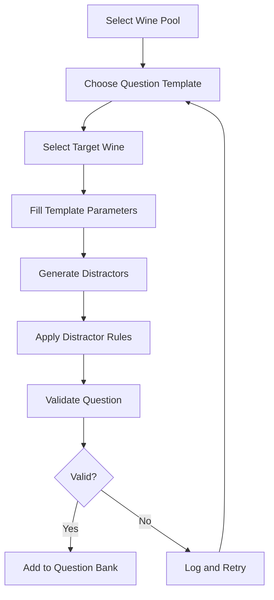
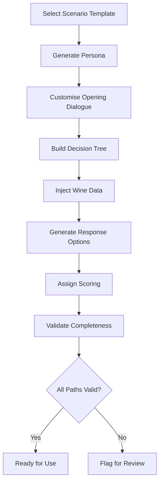
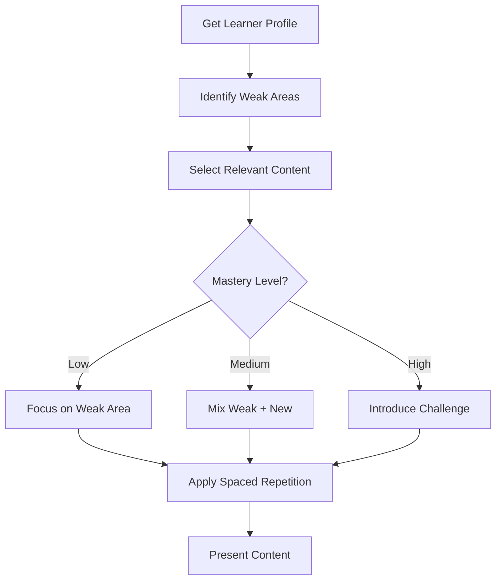

# Content Generation Rules

## Document Information

| Field | Value |
|-------|-------|
| **Document ID** | SS-WS3.0-LE-CGR |
| **Version** | 1.0 |
| **Date** | 2026-01-20 |
| **Author** | Obi Wan |
| **Status** | DRAFT |
| **Classification** | CONFIDENTIAL (IP-sensitive) |
| **Sprint** | WS3.0-S3 |
| **Task** | S3.2 |
| **Related Documents** | SS-WS3.0-CDM, SS-WS3.0-LE-REQ |

---

## CONFIDENTIALITY NOTICE

This document contains proprietary and confidential information relating to the Sommelier Spark Learning Content Engine algorithms and templates. This is patent-pending technology. Distribution is restricted to authorised personnel only. Do not copy, distribute, or disclose without written permission.

---

## 1. Executive Summary

This document defines the rules, templates, and algorithms for generating learning content in Sommelier Spark. It specifies how the Learning Engine transforms wine list data into educational questions, scenarios, and adaptive learning experiences.

### 1.1 Document Statistics

| Category | Count |
|----------|-------|
| Question Templates | 18 |
| Distractor Rules | 12 |
| Scenario Templates | 12 |
| Persona Attributes | 8 |
| Difficulty Calibration Dimensions | 6 |
| Content Variation Rules | 10 |
| Quality Thresholds | 8 |
| Template Variables | 25 |

### 1.2 Generation Philosophy

| Principle | Description |
|-----------|-------------|
| **Data-Driven** | All content derives from actual wine list attributes |
| **Pedagogically Sound** | Templates follow proven learning design principles |
| **Difficulty Calibrated** | Content scales appropriately across tiers |
| **Quality Assured** | Multiple validation layers ensure accuracy |
| **Diverse** | Variation rules prevent repetition and bias |

---

## 2. Question Generation Templates

Question templates define patterns for generating assessment questions from wine data. Each template specifies the question format, parameter sources, answer selection logic, and distractor rules.

### 2.1 Identification Questions

#### QT-ID-001: Region Identification

| Field | Value |
|-------|-------|
| **Template ID** | QT-ID-001 |
| **Name** | Region Identification |
| **Tier** | Bronze |
| **Question Type** | Single Choice |

**Template:**
```
Which of the following wines is from {region}?
```

**Parameters:**
| Parameter | Source | Example |
|-----------|--------|---------|
| `{region}` | wine.region | "Burgundy" |

**Answer Selection:**
- **Correct:** Wine where wine.region matches target region

**Distractor Rules:**
- Option B: Wine from geographically neighbouring region (DG-004)
- Option C: Wine from same country, different region
- Option D: Wine from different country entirely

**Example Output:**
```
Which of the following wines is from Burgundy?

A) Gevrey-Chambertin 2018 ✓
B) Beaujolais Villages 2021 (neighbouring region)
C) Château Margaux 2015 (France, but Bordeaux)
D) Barolo 2017 (Italy)
```

---

#### QT-ID-002: Grape Variety Identification

| Field | Value |
|-------|-------|
| **Template ID** | QT-ID-002 |
| **Name** | Grape Variety Identification |
| **Tier** | Bronze |
| **Question Type** | Single Choice |

**Template:**
```
Which wine is made primarily from {grape}?
```

**Parameters:**
| Parameter | Source | Example |
|-----------|--------|---------|
| `{grape}` | wine.grapeVarieties[0] | "Pinot Noir" |

**Answer Selection:**
- **Correct:** Wine where primary grape matches target

**Distractor Rules:**
- Option B: Wine made from commonly confused grape (DG-002)
- Option C: Wine made from same colour grape, different variety
- Option D: Wine made from different colour grape

**Example Output:**
```
Which wine is made primarily from Pinot Noir?

A) Chambolle-Musigny 2019 ✓
B) Gamay Beaujolais 2021 (commonly confused with Pinot)
C) Côtes du Rhône 2020 (red, but Grenache/Syrah)
D) Sancerre 2022 (Sauvignon Blanc)
```

---

#### QT-ID-003: Wine Type Identification

| Field | Value |
|-------|-------|
| **Template ID** | QT-ID-003 |
| **Name** | Wine Type Identification |
| **Tier** | Bronze |
| **Question Type** | Single Choice |

**Template:**
```
Which of these is a {wineType} wine?
```

**Parameters:**
| Parameter | Source | Example |
|-----------|--------|---------|
| `{wineType}` | wine.wineType | "sparkling" |

**Answer Selection:**
- **Correct:** Wine matching target wine type

**Distractor Rules:**
- Option B: Wine of different type from same region
- Option C: Wine of different type with similar name
- Option D: Wine of different type entirely

**Example Output:**
```
Which of these is a sparkling wine?

A) Champagne Brut NV ✓
B) Chablis Premier Cru 2020 (still white, same region)
C) Crémant d'Alsace (sparkling - if this is wrong, use still)
D) Sauternes 2018 (dessert wine)
```

---

#### QT-ID-004: Producer Identification

| Field | Value |
|-------|-------|
| **Template ID** | QT-ID-004 |
| **Name** | Producer Identification |
| **Tier** | Silver |
| **Question Type** | Single Choice |

**Template:**
```
Which wine is produced by {producer}?
```

**Parameters:**
| Parameter | Source | Example |
|-----------|--------|---------|
| `{producer}` | wine.producer | "Domaine de la Romanée-Conti" |

**Answer Selection:**
- **Correct:** Wine from target producer

**Distractor Rules:**
- Option B: Wine from producer in same region (DG-004)
- Option C: Wine from producer with similar name (DG-003)
- Option D: Wine from well-known producer, different region

**Example Output:**
```
Which wine is produced by Domaine de la Romanée-Conti?

A) La Tâche Grand Cru 2018 ✓
B) Domaine Leroy Musigny 2017 (same region, different producer)
C) Romanée-Saint-Vivant Domaine de l'Arlot (similar name)
D) Château Pétrus 2015 (famous, but Bordeaux)
```

---

#### QT-ID-005: Country Identification

| Field | Value |
|-------|-------|
| **Template ID** | QT-ID-005 |
| **Name** | Country Identification |
| **Tier** | Bronze |
| **Question Type** | Single Choice |

**Template:**
```
Which wine comes from {country}?
```

**Parameters:**
| Parameter | Source | Example |
|-----------|--------|---------|
| `{country}` | wine.country | "New Zealand" |

**Answer Selection:**
- **Correct:** Wine from target country

**Distractor Rules:**
- Option B: Wine from neighbouring/similar country
- Option C: Wine from country with similar wine style
- Option D: Wine from different continent

---

### 2.2 Pairing Questions

#### QT-PA-001: Food Pairing Basic

| Field | Value |
|-------|-------|
| **Template ID** | QT-PA-001 |
| **Name** | Food Pairing Basic |
| **Tier** | Bronze |
| **Question Type** | Single Choice |

**Template:**
```
Which wine would best pair with {food}?
```

**Parameters:**
| Parameter | Source | Example |
|-----------|--------|---------|
| `{food}` | wine.foodPairings[random] | "grilled salmon" |

**Answer Selection:**
- **Correct:** Wine with target food in foodPairings array

**Distractor Rules:**
- Option B: Wine that could pair but not ideal (DG-006)
- Option C: Wine with conflicting flavour profile
- Option D: Wine that would clash with the dish

**Example Output:**
```
Which wine would best pair with grilled salmon?

A) Sancerre 2022 ✓ (citrus, mineral, classic pairing)
B) Chablis 2021 (could work, but oakier)
C) Barolo 2017 (too tannic for fish)
D) Amarone 2016 (would overpower)
```

---

#### QT-PA-002: Food Pairing Reasoning

| Field | Value |
|-------|-------|
| **Template ID** | QT-PA-002 |
| **Name** | Food Pairing Reasoning |
| **Tier** | Silver |
| **Question Type** | Single Choice |

**Template:**
```
Why does {wine_name} pair well with {food}?
```

**Parameters:**
| Parameter | Source | Example |
|-----------|--------|---------|
| `{wine_name}` | wine.name | "Muscadet" |
| `{food}` | wine.foodPairings[0] | "oysters" |

**Answer Selection:**
- **Correct:** Accurate pairing rationale from wine.pairingRationale or generated

**Distractor Rules:**
- Option B: Partially correct but missing key element
- Option C: Applies to different wine/food combination
- Option D: Contradicts pairing principles

**Example Output:**
```
Why does Muscadet pair well with oysters?

A) The wine's high acidity and mineral notes complement the
   briny, mineral character of the oysters ✓
B) The tannins in the wine cut through the oyster's richness
C) The residual sugar balances the saltiness
D) The oak aging adds complexity to the pairing
```

---

#### QT-PA-003: What NOT to Pair

| Field | Value |
|-------|-------|
| **Template ID** | QT-PA-003 |
| **Name** | What NOT to Pair |
| **Tier** | Gold |
| **Question Type** | Single Choice |

**Template:**
```
Which food would be the WORST pairing for {wine_name}?
```

**Parameters:**
| Parameter | Source | Example |
|-----------|--------|---------|
| `{wine_name}` | wine.name | "Sauternes" |

**Answer Selection:**
- **Correct:** Food that would clash with wine characteristics

**Distractor Rules:**
- Option B: Classic pairing (from wine.foodPairings)
- Option C: Acceptable pairing
- Option D: Good alternative pairing

---

### 2.3 Tasting Note Questions

#### QT-TN-001: Aroma Identification

| Field | Value |
|-------|-------|
| **Template ID** | QT-TN-001 |
| **Name** | Aroma Identification |
| **Tier** | Silver |
| **Question Type** | Single Choice |

**Template:**
```
Which aroma is typically found in {wine_name}?
```

**Parameters:**
| Parameter | Source | Example |
|-----------|--------|---------|
| `{wine_name}` | wine.name | "Gewürztraminer" |

**Answer Selection:**
- **Correct:** Aroma from wine.nose or wine.tastingNotes

**Distractor Rules:**
- Option B: Aroma from different grape variety
- Option C: Aroma that contradicts the wine style
- Option D: Aroma associated with wine fault

**Example Output:**
```
Which aroma is typically found in Gewürztraminer?

A) Lychee and rose petals ✓
B) Gooseberry and grass (Sauvignon Blanc)
C) Wet stone and petrol (aged Riesling)
D) Volatile acidity (fault)
```

---

#### QT-TN-002: Flavour Profile

| Field | Value |
|-------|-------|
| **Template ID** | QT-TN-002 |
| **Name** | Flavour Profile |
| **Tier** | Silver |
| **Question Type** | Single Choice |

**Template:**
```
How would you describe the flavour profile of {wine_name}?
```

**Parameters:**
| Parameter | Source | Example |
|-----------|--------|---------|
| `{wine_name}` | wine.name | "Châteauneuf-du-Pape" |

**Answer Selection:**
- **Correct:** Description from wine.palate or wine.tastingNotes

**Distractor Rules:**
- Option B: Description of similar wine, different region
- Option C: Opposite flavour profile (DG-006)
- Option D: Description with incorrect technical details

---

#### QT-TN-003: Visual Characteristics

| Field | Value |
|-------|-------|
| **Template ID** | QT-TN-003 |
| **Name** | Visual Characteristics |
| **Tier** | Gold |
| **Question Type** | Single Choice |

**Template:**
```
What visual characteristics would you expect from {wine_name}?
```

**Parameters:**
| Parameter | Source | Example |
|-----------|--------|---------|
| `{wine_name}` | wine.name | "Vintage Port 2011" |

**Answer Selection:**
- **Correct:** Description from wine.appearance

**Distractor Rules:**
- Option B: Characteristics of younger version
- Option C: Characteristics of different wine type
- Option D: Characteristics indicating a fault

---

### 2.4 Service Questions

#### QT-SV-001: Serving Temperature

| Field | Value |
|-------|-------|
| **Template ID** | QT-SV-001 |
| **Name** | Serving Temperature |
| **Tier** | Bronze |
| **Question Type** | Single Choice |

**Template:**
```
What is the ideal serving temperature for {wine_name}?
```

**Parameters:**
| Parameter | Source | Example |
|-----------|--------|---------|
| `{wine_name}` | wine.name | "Champagne Brut" |

**Answer Selection:**
- **Correct:** Temperature from wine.servingTemperature

**Distractor Rules:**
- Option B: Temperature for opposite wine colour
- Option C: Too warm (would damage wine)
- Option D: Too cold (would mute flavours)

**Example Output:**
```
What is the ideal serving temperature for Champagne Brut?

A) 6-8°C ✓
B) 16-18°C (red wine temperature)
C) Room temperature (~20°C)
D) Ice cold (0-2°C)
```

---

#### QT-SV-002: Decanting Requirements

| Field | Value |
|-------|-------|
| **Template ID** | QT-SV-002 |
| **Name** | Decanting Requirements |
| **Tier** | Silver |
| **Question Type** | Single Choice |

**Template:**
```
How long should {wine_name} be decanted before serving?
```

**Parameters:**
| Parameter | Source | Example |
|-----------|--------|---------|
| `{wine_name}` | wine.name | "Barolo 2015" |

**Answer Selection:**
- **Correct:** Time from wine.decantingTime

**Distractor Rules:**
- Option B: Time appropriate for younger/lighter wine
- Option C: Excessive time (would oxidise)
- Option D: No decanting needed (when it is needed)

---

#### QT-SV-003: Glassware Selection

| Field | Value |
|-------|-------|
| **Template ID** | QT-SV-003 |
| **Name** | Glassware Selection |
| **Tier** | Silver |
| **Question Type** | Single Choice |

**Template:**
```
Which glass is most appropriate for serving {wine_name}?
```

**Parameters:**
| Parameter | Source | Example |
|-----------|--------|---------|
| `{wine_name}` | wine.name | "Pinot Noir" |

**Answer Selection:**
- **Correct:** Glass type appropriate for wine style

**Distractor Rules:**
- Option B: Glass for different wine type
- Option C: Generic wine glass
- Option D: Inappropriate glass (e.g., flute for still wine)

---

### 2.5 Advanced Questions

#### QT-AD-001: Wine Comparison

| Field | Value |
|-------|-------|
| **Template ID** | QT-AD-001 |
| **Name** | Wine Comparison |
| **Tier** | Gold |
| **Question Type** | Single Choice |

**Template:**
```
How does {wine_a} differ from {wine_b}?
```

**Parameters:**
| Parameter | Source | Example |
|-----------|--------|---------|
| `{wine_a}` | wine[0].name | "Left Bank Bordeaux" |
| `{wine_b}` | wine[1].name | "Right Bank Bordeaux" |

**Answer Selection:**
- **Correct:** Accurate comparison of key differences

**Distractor Rules:**
- Option B: Reversed characteristics
- Option C: Differences that don't apply
- Option D: Characteristics they share, not differ

**Example Output:**
```
How does Left Bank Bordeaux differ from Right Bank Bordeaux?

A) Left Bank is Cabernet-dominant while Right Bank is
   Merlot-dominant ✓
B) Left Bank is Merlot-dominant while Right Bank is
   Cabernet-dominant (reversed)
C) Left Bank uses only Chardonnay (incorrect grape)
D) Both are identical in grape composition (they differ)
```

---

#### QT-AD-002: Vintage Characteristics

| Field | Value |
|-------|-------|
| **Template ID** | QT-AD-002 |
| **Name** | Vintage Characteristics |
| **Tier** | Gold |
| **Question Type** | Single Choice |

**Template:**
```
What distinguishes the {vintage} vintage in {region}?
```

**Parameters:**
| Parameter | Source | Example |
|-----------|--------|---------|
| `{vintage}` | wine.vintage | "2015" |
| `{region}` | wine.region | "Bordeaux" |

**Answer Selection:**
- **Correct:** Accurate vintage characteristics

**Distractor Rules:**
- Option B: Characteristics of different vintage
- Option C: Generic statement not specific to vintage
- Option D: Incorrect weather/harvest conditions

---

#### QT-AD-003: Price Tier Justification

| Field | Value |
|-------|-------|
| **Template ID** | QT-AD-003 |
| **Name** | Price Tier Justification |
| **Tier** | Silver |
| **Question Type** | Single Choice |

**Template:**
```
Why is {wine_name} priced in the {priceTier} category?
```

**Parameters:**
| Parameter | Source | Example |
|-----------|--------|---------|
| `{wine_name}` | wine.name | "Château Margaux 2015" |
| `{priceTier}` | wine.priceTier | "luxury" |

**Answer Selection:**
- **Correct:** Accurate factors explaining price point

**Distractor Rules:**
- Option B: Factors that would make it cheaper
- Option C: Factors that don't affect price
- Option D: Incorrect production/quality claims

---

### 2.6 Question Template Summary

| Template ID | Name | Tier | Type |
|-------------|------|------|------|
| QT-ID-001 | Region Identification | Bronze | Single Choice |
| QT-ID-002 | Grape Variety Identification | Bronze | Single Choice |
| QT-ID-003 | Wine Type Identification | Bronze | Single Choice |
| QT-ID-004 | Producer Identification | Silver | Single Choice |
| QT-ID-005 | Country Identification | Bronze | Single Choice |
| QT-PA-001 | Food Pairing Basic | Bronze | Single Choice |
| QT-PA-002 | Food Pairing Reasoning | Silver | Single Choice |
| QT-PA-003 | What NOT to Pair | Gold | Single Choice |
| QT-TN-001 | Aroma Identification | Silver | Single Choice |
| QT-TN-002 | Flavour Profile | Silver | Single Choice |
| QT-TN-003 | Visual Characteristics | Gold | Single Choice |
| QT-SV-001 | Serving Temperature | Bronze | Single Choice |
| QT-SV-002 | Decanting Requirements | Silver | Single Choice |
| QT-SV-003 | Glassware Selection | Silver | Single Choice |
| QT-AD-001 | Wine Comparison | Gold | Single Choice |
| QT-AD-002 | Vintage Characteristics | Gold | Single Choice |
| QT-AD-003 | Price Tier Justification | Silver | Single Choice |
| QT-TF-001 | True/False Facts | Bronze | True/False |

**Total Question Templates: 18**

---

## 3. Distractor Generation Rules

Distractor rules define how to generate plausible but incorrect answer options.

### 3.1 Rule Definitions

| Rule ID | Rule Name | Description | Application |
|---------|-----------|-------------|-------------|
| DG-001 | Same Category | Select item from same classification | Red wine → other red wines |
| DG-002 | Common Confusion | Use known misconceptions | "Chablis is a grape" (it's a region) |
| DG-003 | Similar Name | Sound-alike or look-alike names | Pouilly-Fumé vs Pouilly-Fuissé |
| DG-004 | Geographic Neighbour | Nearby region or country | Burgundy vs Beaujolais |
| DG-005 | Same Producer | Different wine from same producer | Other Château Margaux wines |
| DG-006 | Opposite Characteristic | Contrasting attribute | Light-bodied vs full-bodied |
| DG-007 | Same Grape Different Region | Same variety, different origin | NZ Sauvignon vs Loire Sauvignon |
| DG-008 | Price Adjacent | Wine in nearby price tier | Premium vs Fine |
| DG-009 | Vintage Confusion | Different vintage of same wine | 2015 vs 2016 |
| DG-010 | Style Confusion | Different style of same type | Brut vs Demi-Sec Champagne |
| DG-011 | Partial Match | Some but not all criteria | Right grape, wrong region |
| DG-012 | Expert Trap | Technically close, but wrong | For Gold tier questions |

### 3.2 Distractor Selection by Tier

| Tier | Primary Rules | Distractor Difficulty |
|------|---------------|----------------------|
| **Bronze** | DG-001, DG-004, DG-006 | Obviously different |
| **Silver** | DG-002, DG-003, DG-005, DG-007 | Plausibly wrong |
| **Gold** | DG-008, DG-009, DG-010, DG-011, DG-012 | Very close, tricky |

### 3.3 Distractor Quality Requirements

| Requirement | Description |
|-------------|-------------|
| Same data type | All options must be same category (all wines, all regions, etc.) |
| No obvious elimination | Distractors should not be easily eliminated |
| Consistent length | Options should be similar length |
| No "all of the above" | Avoid compound answer options |
| Unique options | No duplicate or near-duplicate options |

### 3.4 Distractor Examples by Rule

#### DG-002: Common Confusion Examples

| Wine Topic | Common Confusion | Correct Fact |
|------------|------------------|--------------|
| Chablis | "It's a grape variety" | It's a region (uses Chardonnay) |
| Champagne | "All sparkling wine is Champagne" | Only from Champagne region |
| Pinot Grigio/Gris | "They're different grapes" | Same grape, different names |
| Sauternes | "It's fortified" | It's naturally sweet (noble rot) |
| Chianti | "Must be 100% Sangiovese" | Can include other varieties |

#### DG-003: Similar Name Examples

| Target | Confusion Pair | Difference |
|--------|----------------|------------|
| Pouilly-Fumé | Pouilly-Fuissé | Loire (Sauvignon) vs Burgundy (Chardonnay) |
| Montrachet | Montagny | Grand Cru vs Village |
| Côtes du Rhône | Côte-Rôtie | Regional vs Cru |
| Rioja | Ribera del Duero | Different Spanish regions |
| Riesling | Rivesaltes | Grape vs Sweet wine region |

---

## 4. Scenario Generation Templates

Scenario templates define blueprints for interactive customer service simulations.

### 4.1 Bronze Tier Scenarios

#### ST-BC-001: Budget-Conscious Celebration

| Field | Value |
|-------|-------|
| **Template ID** | ST-BC-001 |
| **Name** | Budget-Conscious Celebration |
| **Tier** | Bronze |
| **Category** | Budget Constraint |
| **Estimated Time** | 5 minutes |

**Persona:**
```yaml
type: Couple
occasion: Anniversary
budget: £30-50 per bottle
knowledge: Low
mood: Wants to impress but price-conscious
personality: Slightly nervous
```

**Opening Dialogue:**
```
"We're celebrating our anniversary tonight. We'd love something
special but we're trying to stick to around {budget}. What would
you recommend?"
```

**Decision Points:**

| Step | Situation | Choices | Points |
|------|-----------|---------|--------|
| 1 | Initial response | Acknowledge occasion warmly (3), Jump to recommendations (1), Ask about budget first (0) | 0-3 |
| 2 | Preference discovery | Ask red/white preference (3), Assume preference (1), List all options (1) | 0-3 |
| 3 | Recommendation | Describe 2-3 options with context (3), Just list names (1), Recommend most expensive (0) | 0-3 |
| 4 | Follow-up question | "What makes this one special?" - Explain story/quality (3), Just say it's good (1) | 0-3 |

**Success Criteria:**
- Wine within stated budget
- Appropriate for celebration context
- Guest feels valued, not judged

**Scoring:**
| Range | Rating | Description |
|-------|--------|-------------|
| 90-100 | Excellent | Perfect handling, guest delighted |
| 70-89 | Good | Met needs, minor improvements possible |
| <70 | Needs Work | Missed key points or made guest uncomfortable |

---

#### ST-PA-001: Basic Pairing Request

| Field | Value |
|-------|-------|
| **Template ID** | ST-PA-001 |
| **Name** | Basic Pairing Request |
| **Tier** | Bronze |
| **Category** | Pairing Request |
| **Estimated Time** | 4 minutes |

**Persona:**
```yaml
type: Solo diner or couple
occasion: Casual dinner
budget: No specific limit mentioned
knowledge: Low to medium
mood: Curious, wants guidance
personality: Open to suggestions
```

**Opening Dialogue:**
```
"I'm having the {menu_item}. What wine would you recommend?"
```

**Menu Items Pool:**
- Grilled salmon
- Roast chicken
- Beef steak
- Vegetable risotto
- Caesar salad

**Decision Points:**

| Step | Situation | Optimal Response |
|------|-----------|-----------------|
| 1 | Initial pairing request | Confirm the dish and ask about preferences |
| 2 | Provide recommendation | Offer 2 options with pairing rationale |
| 3 | Handle question | Explain why the pairing works |
| 4 | Confirm selection | Reassure choice and note any service details |

---

#### ST-PD-001: Preference Discovery

| Field | Value |
|-------|-------|
| **Template ID** | ST-PD-001 |
| **Name** | Preference Discovery |
| **Tier** | Bronze |
| **Category** | Preference Discovery |
| **Estimated Time** | 5 minutes |

**Persona:**
```yaml
type: Individual
occasion: Casual
budget: Medium
knowledge: Low - knows what they like but not wine terminology
mood: Relaxed
personality: Easy-going
```

**Opening Dialogue:**
```
"I usually drink {familiar_wine}, but I'm looking to try something
different. Any suggestions?"
```

**Familiar Wine Pool:**
- "Pinot Grigio"
- "Merlot"
- "Sauvignon Blanc"
- "Prosecco"

**Decision Points:**

| Step | Situation | Optimal Response |
|------|-----------|-----------------|
| 1 | Understand current preference | Ask what they enjoy about their usual wine |
| 2 | Gauge adventure level | Ask how different they want to go |
| 3 | Offer bridge wine | Suggest something with familiar elements plus new |
| 4 | Reassure and confirm | Explain how it connects to their preference |

---

### 4.2 Silver Tier Scenarios

#### ST-OH-001: Price Objection Handling

| Field | Value |
|-------|-------|
| **Template ID** | ST-OH-001 |
| **Name** | Price Objection Handling |
| **Tier** | Silver |
| **Category** | Objection Handling |
| **Estimated Time** | 6 minutes |

**Persona:**
```yaml
type: Business diners (2-4 people)
occasion: Business dinner
budget: Moderate, but price-conscious
knowledge: Medium
mood: Wants value, slightly skeptical
personality: Direct, businesslike
```

**Opening Dialogue:**
```
"We'd like a nice bottle of red. What do you have?"
[After recommendation]
"That seems quite expensive. Why does it cost that much?"
```

**Decision Points:**

| Step | Situation | Optimal Response |
|------|-----------|-----------------|
| 1 | Initial recommendation | Offer premium option appropriate to business dinner |
| 2 | Price objection | Explain value factors without being defensive |
| 3 | Alternative request | Offer comparable quality at lower price point |
| 4 | Final selection | Confirm choice positively regardless of price point |

**Key Skills Tested:**
- Value articulation
- Non-defensive response
- Offering alternatives gracefully

---

#### ST-OH-002: Unfamiliar Wine Objection

| Field | Value |
|-------|-------|
| **Template ID** | ST-OH-002 |
| **Name** | Unfamiliar Wine Objection |
| **Tier** | Silver |
| **Category** | Objection Handling |
| **Estimated Time** | 5 minutes |

**Persona:**
```yaml
type: Couple
occasion: Date night
budget: Medium-High
knowledge: Medium - comfortable with familiar wines
mood: Cautious about trying new things
personality: Risk-averse but persuadable
```

**Opening Dialogue:**
```
"We've never heard of that wine. Is it any good? We usually
stick to {familiar_wine} because we know we like it."
```

**Decision Points:**

| Step | Situation | Optimal Response |
|------|-----------|-----------------|
| 1 | Express unfamiliarity | Validate their comfort zone, build intrigue |
| 2 | Compare to familiar | Draw parallels to wines they know |
| 3 | Offer reassurance | Suggest taste before committing (if possible) |
| 4 | Handle acceptance/rejection | Gracefully proceed with either outcome |

---

#### ST-DN-001: Dietary/Special Needs

| Field | Value |
|-------|-------|
| **Template ID** | ST-DN-001 |
| **Name** | Dietary/Special Needs |
| **Tier** | Silver |
| **Category** | Special Dietary |
| **Estimated Time** | 6 minutes |

**Persona:**
```yaml
type: Group (4 people, one with restriction)
occasion: Celebration
budget: Medium-High
knowledge: Varies
mood: Concerned about accommodation
personality: Advocate for restricted person, slightly anxious
```

**Opening Dialogue:**
```
"One of our party is {restriction}. Do you have any wines
that would work for them?"
```

**Restrictions Pool:**
- Vegan (no fining agents from animal products)
- Sulphite-sensitive
- Low-alcohol preference
- Organic/biodynamic only

**Decision Points:**

| Step | Situation | Optimal Response |
|------|-----------|-----------------|
| 1 | Acknowledge restriction | Show knowledge and willingness to help |
| 2 | Check wine knowledge | Know which wines meet requirement |
| 3 | Offer options | Provide 2-3 suitable choices |
| 4 | Address group | Ensure solution works for whole table |

---

### 4.3 Gold Tier Scenarios

#### ST-UP-001: Upsell Opportunity

| Field | Value |
|-------|-------|
| **Template ID** | ST-UP-001 |
| **Name** | Upsell Opportunity |
| **Tier** | Gold |
| **Category** | Upsell |
| **Estimated Time** | 7 minutes |

**Persona:**
```yaml
type: Affluent couple
occasion: Special celebration (engagement, promotion)
budget: Flexible, not mentioned
knowledge: Medium-High
mood: Celebratory, open to indulgence
personality: Appreciates quality, status-conscious
```

**Opening Dialogue:**
```
"We're celebrating {special_occasion}! We usually order
{usual_wine}, but tonight feels like it deserves something
extra special."
```

**Decision Points:**

| Step | Situation | Optimal Response |
|------|-----------|-----------------|
| 1 | Recognise opportunity | Congratulate warmly, confirm desire to elevate |
| 2 | Gauge budget indirectly | Ask about preferences rather than price |
| 3 | Present premium option | Tell the story, create occasion memory |
| 4 | Handle hesitation | Reinforce occasion worthiness without pressure |
| 5 | Close elegantly | Confirm with enthusiasm regardless of outcome |

**Key Skills Tested:**
- Reading customer signals
- Non-pushy premium suggestion
- Creating memorable experience

---

#### ST-DG-001: Difficult Guest

| Field | Value |
|-------|-------|
| **Template ID** | ST-DG-001 |
| **Name** | Difficult Guest |
| **Tier** | Gold |
| **Category** | Difficult Customer |
| **Estimated Time** | 8 minutes |

**Persona:**
```yaml
type: Self-proclaimed wine expert
occasion: Business entertainment (hosting clients)
budget: High
knowledge: High (or thinks so)
mood: Wants to impress, may challenge recommendations
personality: Know-it-all, possibly condescending
```

**Opening Dialogue:**
```
"I'm quite particular about wine. I've been collecting
for years. Let me see your wine list... Hmm, do you have
anything interesting? I doubt you'll have anything I
haven't tried."
```

**Decision Points:**

| Step | Situation | Optimal Response |
|------|-----------|-----------------|
| 1 | Initial dismissiveness | Stay professional, show genuine knowledge |
| 2 | Knowledge test | Answer accurately without being defensive |
| 3 | Recommendation challenged | Stand by recommendation with confidence |
| 4 | Find common ground | Discover shared appreciation |
| 5 | Turn the interaction | Leave guest impressed and satisfied |

**Key Skills Tested:**
- Maintaining composure under pressure
- Demonstrating expertise without arrogance
- De-escalation techniques

---

#### ST-MG-001: Mixed Group Preferences

| Field | Value |
|-------|-------|
| **Template ID** | ST-MG-001 |
| **Name** | Mixed Group Preferences |
| **Tier** | Gold |
| **Category** | Complex Group |
| **Estimated Time** | 8 minutes |

**Persona:**
```yaml
type: Large group (6-8 people)
occasion: Birthday dinner
budget: Pooled, moderate per person
knowledge: Mixed (some know wine, some don't)
mood: Festive but with conflicting preferences
personality: Multiple voices, potential disagreement
```

**Opening Dialogue:**
```
Guest 1: "I only drink red."
Guest 2: "I prefer something light and crisp."
Guest 3: "Whatever's cheapest is fine for me."
Guest 4: "It's my birthday - I want something special!"
```

**Decision Points:**

| Step | Situation | Optimal Response |
|------|-----------|-----------------|
| 1 | Multiple competing needs | Acknowledge all preferences positively |
| 2 | Propose solution | Suggest multiple bottles strategy |
| 3 | Navigate budget concerns | Handle diplomatically |
| 4 | Prioritise birthday person | Ensure they feel special |
| 5 | Confirm group consensus | Get buy-in from table |

---

### 4.4 Scenario Template Summary

| Template ID | Name | Tier | Category |
|-------------|------|------|----------|
| ST-BC-001 | Budget-Conscious Celebration | Bronze | Budget Constraint |
| ST-PA-001 | Basic Pairing Request | Bronze | Pairing Request |
| ST-PD-001 | Preference Discovery | Bronze | Preference Discovery |
| ST-OH-001 | Price Objection Handling | Silver | Objection Handling |
| ST-OH-002 | Unfamiliar Wine Objection | Silver | Objection Handling |
| ST-DN-001 | Dietary/Special Needs | Silver | Special Dietary |
| ST-UP-001 | Upsell Opportunity | Gold | Upsell |
| ST-DG-001 | Difficult Guest | Gold | Difficult Customer |
| ST-MG-001 | Mixed Group Preferences | Gold | Complex Group |
| ST-SO-001 | Special Occasion VIP | Gold | Special Occasion |
| ST-WF-001 | Wine Fault Discovery | Silver | Problem Resolution |
| ST-RT-001 | Return/Exchange Request | Silver | Problem Resolution |

**Total Scenario Templates: 12**

---

## 5. Persona Generation Rules

Persona rules define how to create realistic customer characters for scenarios.

### 5.1 Persona Attributes

| Attribute | Options | Selection Rule |
|-----------|---------|----------------|
| **Knowledge Level** | Novice, Intermediate, Expert | Based on scenario tier |
| **Budget** | Low (<£30), Medium (£30-60), High (£60-100), Luxury (£100+) | Random or specified |
| **Occasion** | Casual dinner, Business, Date, Celebration, Special event | Random or specified |
| **Personality** | Easy-going, Demanding, Indecisive, Know-it-all, Nervous, Rushed | Based on tier |
| **Party Size** | Solo, Couple, Small group (3-4), Large group (5+) | Random or specified |
| **Preferences** | Red lover, White only, Adventurous, Traditional, No preference | Random |
| **Restrictions** | None, Vegetarian, Vegan, Allergies, Religious, Low-alcohol | Random weighted |
| **Mood** | Relaxed, Stressed, Celebratory, Skeptical, Curious | Context-based |

### 5.2 Knowledge Level by Tier

| Tier | Knowledge Distribution |
|------|----------------------|
| **Bronze** | 70% Novice, 25% Intermediate, 5% Expert |
| **Silver** | 30% Novice, 50% Intermediate, 20% Expert |
| **Gold** | 10% Novice, 40% Intermediate, 50% Expert |

### 5.3 Personality by Tier

| Tier | Personality Distribution |
|------|-------------------------|
| **Bronze** | 60% Easy-going, 20% Curious, 15% Nervous, 5% Other |
| **Silver** | 30% Easy-going, 30% Demanding, 20% Indecisive, 20% Other |
| **Gold** | 20% Easy-going, 30% Demanding, 25% Know-it-all, 25% Other |

### 5.4 Persona Name Generation

| Gender | First Names | Last Names |
|--------|-------------|------------|
| Male | James, Michael, David, Robert, William, Thomas, Charles, Richard | Smith, Johnson, Williams, Brown, Jones, Wilson, Taylor, Anderson |
| Female | Sarah, Emma, Olivia, Charlotte, Sophie, Emily, Alice, Grace | Davies, Evans, Roberts, White, Clark, Hall, Young, King |
| Neutral | Alex, Sam, Jordan, Taylor, Morgan, Casey, Riley, Jamie | Miller, Moore, Walker, Martin, Jackson, Thompson, Harris, Lewis |

### 5.5 Persona Backstory Elements

| Element | Options |
|---------|---------|
| **Profession** | Finance, Tech, Healthcare, Legal, Creative, Hospitality, Education, Retail |
| **Wine Journey** | New to wine, Casual drinker, Enthusiast, Collector, Industry professional |
| **Dining Frequency** | First visit, Occasional, Regular, VIP |
| **Reference Point** | Usually drinks {wine}, Remembers {experience}, Read about {wine} |

---

## 6. Difficulty Calibration Rules

Difficulty rules define how content characteristics vary by tier.

### 6.1 Calibration Matrix

| Aspect | Bronze | Silver | Gold |
|--------|--------|--------|------|
| **Wine Obscurity** | Common, well-known | Less common, regional | Obscure, rare, specialty |
| **Question Complexity** | Single attribute | Multiple attributes | Analysis, comparison, synthesis |
| **Scenario Pressure** | Relaxed, forgiving guest | Moderate pressure, some challenges | Time pressure, demanding guest |
| **Expected Knowledge** | Basic facts | Detailed knowledge | Expert understanding |
| **Distractor Difficulty** | Obviously different | Plausibly wrong | Very close, tricky |
| **Pass Threshold** | 70% | 80% | 90% |

### 6.2 Wine Selection by Tier

| Tier | Wine Selection Criteria |
|------|------------------------|
| **Bronze** | Major regions, common grapes, widely available wines |
| **Silver** | Sub-regions, less common grapes, specific producers |
| **Gold** | Micro-regions, rare grapes, collector wines, vintages |

### 6.3 Question Complexity Scaling

| Tier | Question Characteristics |
|------|-------------------------|
| **Bronze** | One fact recall, clear correct answer, obvious distractors |
| **Silver** | Connect 2 facts, reasoning required, plausible distractors |
| **Gold** | Apply knowledge, compare/analyse, expert-level distractors |

### 6.4 Scenario Complexity Scaling

| Tier | Scenario Characteristics |
|------|-------------------------|
| **Bronze** | Single customer need, clear solution, positive outcome likely |
| **Silver** | Competing needs, objections to handle, outcome depends on skill |
| **Gold** | Multiple challenges, time pressure, difficult personalities |

---

## 7. Content Variation Rules

Variation rules ensure generated content is diverse and balanced.

### 7.1 Variation Rules

| Rule ID | Rule Name | Description |
|---------|-----------|-------------|
| VR-001 | No Duplicate Questions | Same question text never repeated in quiz |
| VR-002 | Wine Rotation | Each wine appears in similar number of questions |
| VR-003 | Region Balance | All regions get proportional coverage by wine count |
| VR-004 | Grape Variety Coverage | All grape varieties appear in questions |
| VR-005 | Question Type Mix | Each quiz has variety of question types |
| VR-006 | Scenario Persona Variety | Different personas across scenarios |
| VR-007 | Price Tier Distribution | Questions cover all price tiers |
| VR-008 | Colour Balance | Red, white, rosé, sparkling proportionally represented |
| VR-009 | Difficulty Distribution | Within-tier variation (easy/medium/hard) |
| VR-010 | Template Rotation | Don't use same template consecutively |

### 7.2 Coverage Targets

| Dimension | Target | Measurement |
|-----------|--------|-------------|
| Wine coverage | 100% | Every wine in at least 3 questions |
| Region coverage | 100% | Every region in at least 2 questions |
| Grape coverage | 100% | Every grape variety represented |
| Question type coverage | All types | Each quiz uses at least 3 question types |
| Price tier coverage | All tiers | Each tier represented in curriculum |

### 7.3 Distribution Algorithms

#### Wine Question Distribution

```
For each wine in wine_list:
    min_appearances = 3
    max_appearances = 7

    # Weight by wine characteristics
    if wine.priceTier == 'luxury':
        weight = 1.5  # More questions for premium wines
    else:
        weight = 1.0

    target_appearances = min_appearances + (weight * tier_factor)

    # Spread across question types
    distribute_across_types(wine, target_appearances)
```

#### Region Balance Algorithm

```
For each region in unique_regions:
    wine_count = count_wines_in_region(region)
    total_wines = len(wine_list)

    # Proportional representation
    region_question_share = wine_count / total_wines
    target_questions = total_quiz_questions * region_question_share

    ensure_minimum(region, min_questions=2)
```

---

## 8. Quality Thresholds

Quality thresholds define minimum standards for generated content.

### 8.1 Quality Metrics

| Metric | Threshold | Measurement | Action if Failed |
|--------|-----------|-------------|------------------|
| Question Clarity Score | > 4.0/5.0 | Automated readability analysis | Flag for review |
| Distractor Plausibility | > 3.5/5.0 | Expert rating | Regenerate distractors |
| Scenario Completability | > 70% users | Completion rate tracking | Simplify scenario |
| Expert Review Pass Rate | > 90% | Manual review results | Revise template |
| Learner Feedback Score | > 3.5/5.0 | Post-completion rating | Flag for improvement |
| Answer Accuracy | 100% | Expert validation | Block until fixed |
| Grammar/Spelling | 0 errors | Automated check | Auto-correct or flag |
| Template Fill Rate | 100% | All placeholders resolved | Block generation |

### 8.2 Automated Quality Checks

| Check | Description | Pass Criteria |
|-------|-------------|---------------|
| Placeholder Resolution | All {variables} filled | No unresolved placeholders |
| Duplicate Detection | No identical questions | Similarity < 90% |
| Option Count | Correct number of options | Exactly 4 for multiple choice |
| Correct Answer Present | One correct answer marked | Exactly 1 isCorrect = true |
| Distractor Validity | All distractors are valid wines | All exist in database |
| Content Length | Within acceptable range | Min/max character limits |
| Profanity Filter | No inappropriate content | Zero matches |

### 8.3 Review Queue Triggers

| Trigger | Threshold | Review Type |
|---------|-----------|-------------|
| Low feedback score | < 3.0/5.0 | Domain expert review |
| High skip rate | > 30% skip | Content quality review |
| Frequent incorrect | > 50% get wrong | Question clarity review |
| Generation failure | Any failure | Template review |
| New template | First use | Expert validation |

---

## 9. Template Variables

Standard placeholders used across all templates.

### 9.1 Wine Variables

| Variable | Description | Source | Example |
|----------|-------------|--------|---------|
| `{wine_name}` | Full wine name | wine.name | "Château Margaux 2015" |
| `{wine_name_short}` | Short wine name | wine.name (truncated) | "Château Margaux" |
| `{producer}` | Producer/estate name | wine.producer | "Château Margaux" |
| `{region}` | Wine region | wine.region | "Margaux" |
| `{country}` | Country of origin | wine.country | "France" |
| `{grape}` | Primary grape variety | wine.grapeVarieties[0] | "Cabernet Sauvignon" |
| `{grapes}` | All grape varieties | wine.grapeVarieties.join(", ") | "Cabernet Sauvignon, Merlot" |
| `{colour}` | Wine colour | wine.wineType mapped | "red" |
| `{wineType}` | Wine type | wine.wineType | "red" |
| `{vintage}` | Vintage year | wine.vintage | "2015" |
| `{priceTier}` | Price category | wine.priceTier | "luxury" |
| `{price}` | Actual price | wine.price | "£450" |

### 9.2 Tasting Variables

| Variable | Description | Source | Example |
|----------|-------------|--------|---------|
| `{aroma}` | Key aroma | wine.nose | "blackcurrant" |
| `{aromas}` | All aromas | wine.nose | "blackcurrant, cedar, tobacco" |
| `{flavour}` | Key flavour | wine.palate | "dark fruit" |
| `{appearance}` | Visual description | wine.appearance | "deep ruby" |
| `{body}` | Body description | wine.body | "full-bodied" |
| `{tannins}` | Tannin level | wine.tannins | "firm" |
| `{acidity}` | Acidity level | wine.acidity | "medium-high" |

### 9.3 Service Variables

| Variable | Description | Source | Example |
|----------|-------------|--------|---------|
| `{servingTemp}` | Serving temperature | wine.servingTemperature | "16-18°C" |
| `{decantTime}` | Decanting time | wine.decantingTime | "2-3 hours" |
| `{glass}` | Recommended glass | derived | "Bordeaux glass" |
| `{food}` | Food pairing | wine.foodPairings[random] | "lamb" |
| `{foods}` | All food pairings | wine.foodPairings.join(", ") | "lamb, beef, game" |

### 9.4 Scenario Variables

| Variable | Description | Source | Example |
|----------|-------------|--------|---------|
| `{budget}` | Budget range | persona.budget | "£30-50" |
| `{occasion}` | Event type | persona.occasion | "anniversary" |
| `{party_size}` | Number of guests | persona.partySize | "4" |
| `{customer_name}` | Customer name | persona.name | "James" |
| `{restriction}` | Dietary restriction | persona.restriction | "vegan" |
| `{familiar_wine}` | Wine they know | persona.familiarWine | "Pinot Grigio" |
| `{menu_item}` | Food ordered | scenario.menuItem | "grilled salmon" |
| `{special_occasion}` | Celebration type | persona.specialOccasion | "engagement" |
| `{usual_wine}` | Their regular choice | persona.usualWine | "Merlot" |

---

## 10. Generation Algorithms Overview

### 10.1 Question Generation Flow



### 10.2 Scenario Generation Flow



### 10.3 Adaptive Selection Algorithm



---

## 11. Appendix

### 11.1 Template Summary Statistics

| Category | Count |
|----------|-------|
| Question Templates | 18 |
| Distractor Rules | 12 |
| Scenario Templates | 12 |
| Persona Attributes | 8 |
| Variation Rules | 10 |
| Quality Thresholds | 8 |
| Template Variables | 25 |

### 11.2 Question Template by Tier

| Tier | Templates | IDs |
|------|-----------|-----|
| Bronze | 7 | QT-ID-001, QT-ID-002, QT-ID-003, QT-ID-005, QT-PA-001, QT-SV-001, QT-TF-001 |
| Silver | 7 | QT-ID-004, QT-PA-002, QT-TN-001, QT-TN-002, QT-SV-002, QT-SV-003, QT-AD-003 |
| Gold | 4 | QT-PA-003, QT-TN-003, QT-AD-001, QT-AD-002 |

### 11.3 Scenario Template by Tier

| Tier | Templates | IDs |
|------|-----------|-----|
| Bronze | 3 | ST-BC-001, ST-PA-001, ST-PD-001 |
| Silver | 5 | ST-OH-001, ST-OH-002, ST-DN-001, ST-WF-001, ST-RT-001 |
| Gold | 4 | ST-UP-001, ST-DG-001, ST-MG-001, ST-SO-001 |

### 11.4 Related Documents

| Document | ID | Relevance |
|----------|----|-----------|
| Content Domain Model | SS-WS3.0-CDM | Wine entity attributes used in templates |
| Learning Engine Requirements | SS-WS3.0-LE-REQ | Requirements these rules implement |
| Content Lifecycle Specification | SS-WS3.0-CLS | Generated content states |

### 11.5 Revision History

| Version | Date | Author | Changes |
|---------|------|--------|---------|
| 1.0 | 2026-01-20 | Obi Wan | Initial draft |

---

*End of Content Generation Rules*

**CONFIDENTIAL - Patent-Pending Technology**
