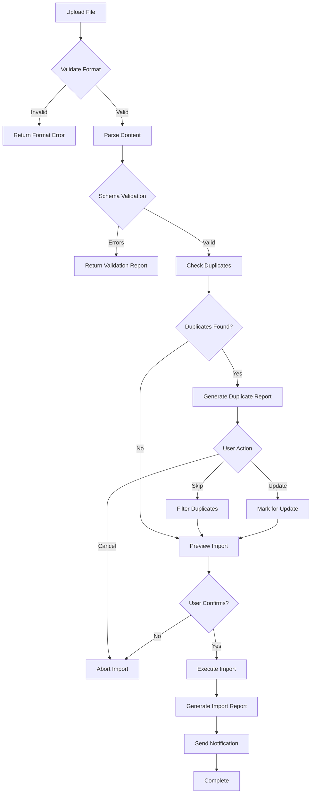
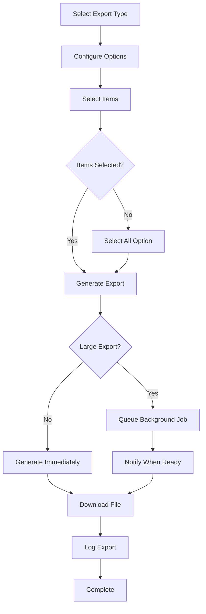

# Content Import/Export Specification

## Document Information

| Field | Value |
|-------|-------|
| **Document ID** | SS-WS3.0-CMS-IE |
| **Version** | 1.0 |
| **Date** | 2026-01-20 |
| **Author** | Obi Wan |
| **Status** | DRAFT |
| **Sprint** | WS3.0-S2 |
| **Task** | S2.3 |
| **Related Documents** | SS-WS3.0-CDM (Content Domain Model), SS-WS3.0-CMS-FR (CMS Functional Requirements) |

---

## 1. Executive Summary

This specification defines the import and export capabilities for the Sommelier Spark Content Management System. Import functionality is critical for customer onboarding, enabling organizations to quickly populate the platform with their existing wine lists and training content. Export functionality supports data portability, backup, and integration with external systems.

### 1.1 Scope

| In Scope | Out of Scope |
|----------|--------------|
| Wine data import/export | Real-time API sync |
| Module structure import/export | Image file imports |
| Quiz/Question import/export | Video content imports |
| Scenario import/export | Legacy system migrations |
| Validation and error handling | Third-party integrations |
| Template generation | Automated scheduling |

### 1.2 Key Benefits

| Benefit | Description |
|---------|-------------|
| **Rapid Onboarding** | Organizations can import existing wine lists in minutes |
| **Bulk Operations** | Efficiently manage hundreds of content items |
| **Data Portability** | Export data for backup or external analysis |
| **Template-Driven** | Downloadable templates reduce errors |
| **Validation First** | Preview and fix errors before committing |

---

## 2. Supported File Formats

### 2.1 Format Matrix

| Format | Extension | Import | Export | Best For |
|--------|-----------|--------|--------|----------|
| CSV | `.csv` | Yes | Yes | Wine lists, simple tabular data |
| Excel | `.xlsx` | Yes | Yes | Wine lists with multiple sheets |
| JSON | `.json` | Yes | Yes | Structured content (quizzes, scenarios) |
| PDF | `.pdf` | No | Yes | Reports, certificates, archives |

### 2.2 Format Specifications

#### 2.2.1 CSV Requirements

| Requirement | Value |
|-------------|-------|
| Encoding | UTF-8 (with BOM for Excel compatibility) |
| Delimiter | Comma (`,`) |
| Quote Character | Double quote (`"`) |
| Escape Character | Double quote (`""`) |
| Line Ending | CRLF or LF |
| Header Row | Required (first row) |
| Maximum File Size | 10 MB |
| Maximum Rows | 10,000 |

#### 2.2.2 Excel Requirements

| Requirement | Value |
|-------------|-------|
| Format | Office Open XML (.xlsx) |
| Maximum File Size | 25 MB |
| Maximum Rows per Sheet | 10,000 |
| Maximum Sheets | 10 |
| Header Row | Required (row 1 of each sheet) |
| Formulas | Not evaluated (values only) |

#### 2.2.3 JSON Requirements

| Requirement | Value |
|-------------|-------|
| Encoding | UTF-8 |
| Format | Standard JSON (RFC 8259) |
| Maximum File Size | 50 MB |
| Maximum Array Items | 10,000 |
| Nesting Depth | Maximum 10 levels |
| Date Format | ISO 8601 (`YYYY-MM-DDTHH:mm:ssZ`) |

---

## 3. Wine Import Schema

Wine import is the most critical import capability, enabling organizations to onboard their existing wine lists quickly.

### 3.1 CSV/Excel Column Definitions

| Column | Required | Type | Max Length | Description | Example |
|--------|----------|------|------------|-------------|---------|
| `name` | Yes | String | 255 | Wine name | Château Margaux 2015 |
| `producer` | Yes | String | 255 | Producer/winery name | Château Margaux |
| `vintage` | No | Integer | 4 | Vintage year (null for NV) | 2015 |
| `type` | Yes | Enum | 20 | Wine type code | RED |
| `region` | Yes | String | 255 | Primary region | Margaux |
| `country` | Yes | String | 100 | Country of origin | France |
| `appellation` | No | String | 255 | Appellation/sub-region | Margaux AOC |
| `grapeVarieties` | Yes | String | 500 | Comma-separated varieties | Cabernet Sauvignon, Merlot |
| `abv` | No | Decimal | - | Alcohol by volume (%) | 13.5 |
| `priceTier` | Yes | Enum | 20 | Price tier code | PREMIUM |
| `contentTier` | Yes | Enum | 10 | Content depth tier | SILVER |
| `quickFacts` | Yes | String | 1000 | Level 1 content | A prestigious First Growth... |
| `detailedProfile` | No | String | 5000 | Level 2 content | Detailed tasting notes... |
| `expertInsights` | No | String | 10000 | Level 3 content | Winemaker interview... |
| `tastingNotes` | No | String | 2000 | Structured tasting notes | Ruby red with garnet... |
| `foodPairings` | No | String | 1000 | Comma-separated pairings | Lamb, Beef, Hard Cheese |
| `servingTemperature` | No | String | 50 | Serving temperature | 16-18°C |
| `decantingTime` | No | String | 50 | Recommended decanting | 2-3 hours |
| `externalId` | No | String | 100 | External system reference | SKU-12345 |
| `categories` | No | String | 500 | Comma-separated categories | THEORY, TASTING |

### 3.2 Wine Type Codes

| Code | Display Name |
|------|--------------|
| `RED` | Red Wine |
| `WHITE` | White Wine |
| `ROSE` | Rosé Wine |
| `SPARKLING` | Sparkling Wine |
| `FORTIFIED` | Fortified Wine |
| `DESSERT` | Dessert Wine |

### 3.3 Price Tier Codes

| Code | Display Name | Typical Range |
|------|--------------|---------------|
| `ENTRY` | Entry Level | Under £15 |
| `PREMIUM` | Premium | £15 - £50 |
| `FINE` | Fine Wine | £50 - £150 |
| `PRESTIGE` | Prestige | Over £150 |

### 3.4 Content Tier Codes

| Code | Pass Threshold | Content Depth |
|------|----------------|---------------|
| `BRONZE` | 70% | Quick Facts only |
| `SILVER` | 80% | Quick Facts + Detailed Profile |
| `GOLD` | 90% | All three levels |

### 3.5 Wine Validation Rules

| Field | Rule | Error Code |
|-------|------|------------|
| `name` | Required, non-empty | `WINE_NAME_REQUIRED` |
| `name` | Unique within organization | `WINE_NAME_DUPLICATE` |
| `producer` | Required, non-empty | `WINE_PRODUCER_REQUIRED` |
| `vintage` | If provided, 1900-current year+5 | `WINE_VINTAGE_INVALID` |
| `type` | Must match enum values | `WINE_TYPE_INVALID` |
| `region` | Required, non-empty | `WINE_REGION_REQUIRED` |
| `country` | Required, valid country | `WINE_COUNTRY_INVALID` |
| `grapeVarieties` | At least one variety | `WINE_GRAPE_REQUIRED` |
| `abv` | If provided, 0.0-25.0 | `WINE_ABV_INVALID` |
| `priceTier` | Must match enum values | `WINE_PRICE_TIER_INVALID` |
| `contentTier` | Must match enum values | `WINE_CONTENT_TIER_INVALID` |
| `quickFacts` | Required, 50-1000 chars | `WINE_QUICK_FACTS_INVALID` |
| `detailedProfile` | Required if tier SILVER/GOLD | `WINE_DETAILED_REQUIRED` |
| `expertInsights` | Required if tier GOLD | `WINE_EXPERT_REQUIRED` |

### 3.6 Sample Wine CSV

```csv
name,producer,vintage,type,region,country,appellation,grapeVarieties,abv,priceTier,contentTier,quickFacts,detailedProfile,expertInsights,tastingNotes,foodPairings,servingTemperature,decantingTime,externalId,categories
"Château Margaux 2015","Château Margaux",2015,RED,"Margaux","France","Margaux AOC","Cabernet Sauvignon, Merlot, Petit Verdot",13.5,PRESTIGE,GOLD,"A legendary First Growth from the renowned 2015 vintage, Château Margaux represents the pinnacle of Bordeaux winemaking.","The 2015 vintage at Château Margaux is considered one of the finest in recent memory. The wine shows remarkable depth and complexity...","Interview with winemaker: 'The 2015 vintage gave us perfect conditions throughout the growing season...'","Deep ruby with purple highlights. Intense aromas of blackcurrant, violet, and graphite.","Lamb, Beef Wellington, Aged Comté",16-18°C,2-3 hours,SKU-MAR-2015,"THEORY, TASTING"
"Cloudy Bay Sauvignon Blanc 2023","Cloudy Bay",2023,WHITE,"Marlborough","New Zealand","Marlborough","Sauvignon Blanc",13.0,PREMIUM,SILVER,"New Zealand's most famous Sauvignon Blanc, setting the standard for the Marlborough region.","Cloudy Bay pioneered the Marlborough Sauvignon Blanc style in 1985. The 2023 vintage showcases...",,"Pale straw with green tints. Vibrant citrus and tropical fruit aromas.","Seafood, Goat Cheese, Asian Cuisine",8-10°C,,SKU-CB-2023,TASTING
"Veuve Clicquot Yellow Label NV","Veuve Clicquot",,SPARKLING,"Champagne","France","Champagne AOC","Pinot Noir, Chardonnay, Pinot Meunier",12.0,PREMIUM,BRONZE,"The iconic yellow label champagne, known for its consistency and celebratory character.",,,"Golden yellow with fine persistent bubbles. Fresh and fruity with apple and citrus notes.","Appetizers, Oysters, Light Seafood",6-8°C,,SKU-VC-NV,SERVICE
```

---

## 4. Module Import Schema

### 4.1 JSON Structure

```json
{
  "modules": [
    {
      "title": "String (required, max 255)",
      "description": "String (required, max 2000)",
      "category": "Enum (required)",
      "difficultyTier": "Enum (required)",
      "estimatedDuration": "Integer (minutes)",
      "learningObjectives": ["String array"],
      "prerequisites": ["Module ID array"],
      "externalId": "String (optional)",
      "lessons": [
        {
          "title": "String (required)",
          "content": "String (markdown, required)",
          "orderIndex": "Integer (required)",
          "estimatedDuration": "Integer (minutes)",
          "externalId": "String (optional)"
        }
      ]
    }
  ]
}
```

### 4.2 Module Field Definitions

| Field | Required | Type | Description |
|-------|----------|------|-------------|
| `title` | Yes | String | Module title (max 255 chars) |
| `description` | Yes | String | Module description (max 2000 chars) |
| `category` | Yes | Enum | Content category code |
| `difficultyTier` | Yes | Enum | BRONZE, SILVER, or GOLD |
| `estimatedDuration` | No | Integer | Duration in minutes |
| `learningObjectives` | No | Array | List of learning objectives |
| `prerequisites` | No | Array | Module IDs that must be completed first |
| `externalId` | No | String | External system reference |
| `lessons` | Yes | Array | Array of lesson objects |

### 4.3 Category Codes

| Code | Display Name |
|------|--------------|
| `THEORY` | Wine Theory |
| `TASTING` | Tasting Skills |
| `SERVICE` | Wine Service |
| `REGIONS` | Wine Regions |
| `VARIETIES` | Grape Varieties |
| `PAIRING` | Food & Wine Pairing |
| `BUSINESS` | Wine Business |

### 4.4 Module Validation Rules

| Field | Rule | Error Code |
|-------|------|------------|
| `title` | Required, 3-255 chars | `MODULE_TITLE_INVALID` |
| `title` | Unique within organization | `MODULE_TITLE_DUPLICATE` |
| `description` | Required, 10-2000 chars | `MODULE_DESC_INVALID` |
| `category` | Must match enum | `MODULE_CATEGORY_INVALID` |
| `difficultyTier` | Must match enum | `MODULE_TIER_INVALID` |
| `lessons` | At least 1 lesson required | `MODULE_LESSONS_REQUIRED` |
| `lessons.title` | Required, 3-255 chars | `LESSON_TITLE_INVALID` |
| `lessons.content` | Required, non-empty | `LESSON_CONTENT_REQUIRED` |
| `lessons.orderIndex` | Unique within module | `LESSON_ORDER_DUPLICATE` |

### 4.5 Sample Module JSON

```json
{
  "modules": [
    {
      "title": "Introduction to Bordeaux",
      "description": "A comprehensive introduction to the wines of Bordeaux, covering the region's history, key appellations, and grape varieties.",
      "category": "REGIONS",
      "difficultyTier": "BRONZE",
      "estimatedDuration": 45,
      "learningObjectives": [
        "Identify the five First Growth châteaux",
        "Explain the Left Bank vs Right Bank distinction",
        "Describe the key grape varieties used in Bordeaux"
      ],
      "externalId": "MOD-BDX-101",
      "lessons": [
        {
          "title": "The History of Bordeaux",
          "content": "# The History of Bordeaux\n\nBordeaux has been producing wine for over 2,000 years...\n\n## Roman Origins\n\nThe Romans first planted vines in the region...",
          "orderIndex": 1,
          "estimatedDuration": 15
        },
        {
          "title": "Understanding Appellations",
          "content": "# Bordeaux Appellations\n\nThe Bordeaux wine region contains over 60 appellations...\n\n## Left Bank\n\nDominated by Cabernet Sauvignon...",
          "orderIndex": 2,
          "estimatedDuration": 20
        },
        {
          "title": "Key Grape Varieties",
          "content": "# Bordeaux Grape Varieties\n\n## Red Varieties\n\n### Cabernet Sauvignon\nThe king of the Left Bank...",
          "orderIndex": 3,
          "estimatedDuration": 10
        }
      ]
    }
  ]
}
```

---

## 5. Quiz Import Schema

### 5.1 JSON Structure

```json
{
  "quizzes": [
    {
      "title": "String (required)",
      "description": "String (optional)",
      "moduleId": "UUID or externalId (required)",
      "difficultyTier": "Enum (required)",
      "passingScore": "Integer (required, 0-100)",
      "timeLimit": "Integer (minutes, optional)",
      "shuffleQuestions": "Boolean (default true)",
      "shuffleOptions": "Boolean (default true)",
      "externalId": "String (optional)",
      "questions": [
        {
          "text": "String (required)",
          "type": "Enum (required)",
          "points": "Integer (default 1)",
          "explanation": "String (optional)",
          "orderIndex": "Integer (required)",
          "options": [
            {
              "text": "String (required)",
              "isCorrect": "Boolean (required)",
              "orderIndex": "Integer (required)"
            }
          ]
        }
      ]
    }
  ]
}
```

### 5.2 Question Type Codes

| Code | Display Name | Options Required |
|------|--------------|------------------|
| `SINGLE_CHOICE` | Single Choice | 2-6 options, exactly 1 correct |
| `MULTIPLE_CHOICE` | Multiple Choice | 2-6 options, 1+ correct |
| `TRUE_FALSE` | True/False | Exactly 2 options |
| `ORDERING` | Ordering/Sequence | 2-10 items to order |

### 5.3 Quiz Validation Rules

| Field | Rule | Error Code |
|-------|------|------------|
| `title` | Required, 3-255 chars | `QUIZ_TITLE_INVALID` |
| `moduleId` | Must reference valid module | `QUIZ_MODULE_INVALID` |
| `difficultyTier` | Must match enum | `QUIZ_TIER_INVALID` |
| `passingScore` | 0-100 | `QUIZ_PASSING_SCORE_INVALID` |
| `questions` | At least 1 question | `QUIZ_QUESTIONS_REQUIRED` |
| `questions.text` | Required, 10-1000 chars | `QUESTION_TEXT_INVALID` |
| `questions.type` | Must match enum | `QUESTION_TYPE_INVALID` |
| `questions.options` | At least 2 options | `QUESTION_OPTIONS_REQUIRED` |
| `options.isCorrect` | At least 1 correct for SINGLE_CHOICE | `OPTION_NO_CORRECT` |
| `options.isCorrect` | Exactly 1 correct for SINGLE_CHOICE | `OPTION_MULTIPLE_CORRECT` |

### 5.4 Sample Quiz JSON

```json
{
  "quizzes": [
    {
      "title": "Bordeaux Fundamentals Quiz",
      "description": "Test your knowledge of Bordeaux wine basics",
      "moduleId": "MOD-BDX-101",
      "difficultyTier": "BRONZE",
      "passingScore": 70,
      "timeLimit": 15,
      "shuffleQuestions": true,
      "shuffleOptions": true,
      "externalId": "QUIZ-BDX-101",
      "questions": [
        {
          "text": "Which grape variety dominates the Left Bank of Bordeaux?",
          "type": "SINGLE_CHOICE",
          "points": 1,
          "explanation": "Cabernet Sauvignon thrives in the gravelly soils of the Left Bank, particularly in the Médoc.",
          "orderIndex": 1,
          "options": [
            {"text": "Merlot", "isCorrect": false, "orderIndex": 1},
            {"text": "Cabernet Sauvignon", "isCorrect": true, "orderIndex": 2},
            {"text": "Cabernet Franc", "isCorrect": false, "orderIndex": 3},
            {"text": "Petit Verdot", "isCorrect": false, "orderIndex": 4}
          ]
        },
        {
          "text": "Château Margaux is classified as a First Growth.",
          "type": "TRUE_FALSE",
          "points": 1,
          "explanation": "Château Margaux was one of four wines originally classified as First Growth in the 1855 Classification.",
          "orderIndex": 2,
          "options": [
            {"text": "True", "isCorrect": true, "orderIndex": 1},
            {"text": "False", "isCorrect": false, "orderIndex": 2}
          ]
        },
        {
          "text": "Which of the following are Left Bank appellations? (Select all that apply)",
          "type": "MULTIPLE_CHOICE",
          "points": 2,
          "orderIndex": 3,
          "options": [
            {"text": "Margaux", "isCorrect": true, "orderIndex": 1},
            {"text": "Saint-Émilion", "isCorrect": false, "orderIndex": 2},
            {"text": "Pauillac", "isCorrect": true, "orderIndex": 3},
            {"text": "Pomerol", "isCorrect": false, "orderIndex": 4}
          ]
        }
      ]
    }
  ]
}
```

---

## 6. Scenario Import Schema

### 6.1 JSON Structure

```json
{
  "scenarios": [
    {
      "title": "String (required)",
      "description": "String (required)",
      "difficultyTier": "Enum (required)",
      "estimatedDuration": "Integer (minutes)",
      "wineIds": ["Wine ID or externalId array"],
      "passingScore": "Integer (0-100)",
      "externalId": "String (optional)",
      "steps": [
        {
          "orderIndex": "Integer (required)",
          "situation": "String (required)",
          "question": "String (required)",
          "choices": [
            {
              "text": "String (required)",
              "feedback": "String (required)",
              "points": "Integer (required)",
              "nextStepIndex": "Integer (optional)",
              "orderIndex": "Integer (required)"
            }
          ]
        }
      ]
    }
  ]
}
```

### 6.2 Scenario Validation Rules

| Field | Rule | Error Code |
|-------|------|------------|
| `title` | Required, 3-255 chars | `SCENARIO_TITLE_INVALID` |
| `description` | Required, 10-2000 chars | `SCENARIO_DESC_INVALID` |
| `difficultyTier` | Must match enum | `SCENARIO_TIER_INVALID` |
| `wineIds` | All must reference valid wines | `SCENARIO_WINE_INVALID` |
| `steps` | At least 1 step required | `SCENARIO_STEPS_REQUIRED` |
| `steps.situation` | Required, non-empty | `STEP_SITUATION_REQUIRED` |
| `steps.question` | Required, non-empty | `STEP_QUESTION_REQUIRED` |
| `steps.choices` | At least 2 choices | `STEP_CHOICES_REQUIRED` |
| `choices.text` | Required, non-empty | `CHOICE_TEXT_REQUIRED` |
| `choices.feedback` | Required, non-empty | `CHOICE_FEEDBACK_REQUIRED` |
| `choices.points` | -10 to 10 | `CHOICE_POINTS_INVALID` |

### 6.3 Sample Scenario JSON

```json
{
  "scenarios": [
    {
      "title": "Wine Service: Fine Dining Experience",
      "description": "Guide a guest through wine selection at an upscale restaurant, demonstrating proper service techniques and wine knowledge.",
      "difficultyTier": "SILVER",
      "estimatedDuration": 10,
      "wineIds": ["SKU-MAR-2015", "SKU-CB-2023"],
      "passingScore": 70,
      "externalId": "SCEN-SERVICE-001",
      "steps": [
        {
          "orderIndex": 1,
          "situation": "A well-dressed couple is seated at Table 12 for their anniversary dinner. They are reviewing the wine list and seem uncertain.",
          "question": "How do you approach the table?",
          "choices": [
            {
              "text": "Wait for them to call you over",
              "feedback": "While not wrong, proactive service is preferred in fine dining. Guests may feel neglected.",
              "points": 0,
              "nextStepIndex": 2,
              "orderIndex": 1
            },
            {
              "text": "Approach and offer assistance with the wine list",
              "feedback": "Excellent! Proactive assistance shows attentiveness without being intrusive.",
              "points": 2,
              "nextStepIndex": 2,
              "orderIndex": 2
            },
            {
              "text": "Immediately suggest the most expensive wine",
              "feedback": "This appears pushy and does not consider the guests' preferences. Service should be guest-focused.",
              "points": -1,
              "nextStepIndex": 2,
              "orderIndex": 3
            }
          ]
        },
        {
          "orderIndex": 2,
          "situation": "The gentleman mentions they are celebrating their 10th anniversary and asks for a special red wine recommendation. They will be having the beef tenderloin.",
          "question": "Which wine do you recommend?",
          "choices": [
            {
              "text": "Recommend the Château Margaux 2015, explaining it's a celebratory First Growth perfect for the occasion",
              "feedback": "Perfect choice! The wine matches the occasion's significance and pairs excellently with beef. You demonstrated both wine knowledge and occasion awareness.",
              "points": 3,
              "orderIndex": 1
            },
            {
              "text": "Recommend the Cloudy Bay Sauvignon Blanc as it's very popular",
              "feedback": "While Cloudy Bay is excellent, a white Sauvignon Blanc is not ideal with beef tenderloin, and the choice doesn't reflect the special occasion.",
              "points": -1,
              "orderIndex": 2
            },
            {
              "text": "Ask about their budget before making any recommendation",
              "feedback": "While budget awareness is important, asking directly about budget in fine dining can be uncomfortable. Better to offer options at different price points.",
              "points": 1,
              "orderIndex": 3
            }
          ]
        }
      ]
    }
  ]
}
```

---

## 7. Import Process Workflow

### 7.1 Import Flow Diagram



### 7.2 Import States

| State | Description |
|-------|-------------|
| `PENDING` | File uploaded, awaiting processing |
| `VALIDATING` | Schema and business rule validation in progress |
| `VALIDATION_FAILED` | Validation errors found |
| `AWAITING_CONFIRMATION` | Validated, awaiting user confirmation |
| `PROCESSING` | Import in progress |
| `COMPLETED` | Import successful |
| `COMPLETED_WITH_ERRORS` | Partial import (some rows failed) |
| `FAILED` | Import failed completely |
| `CANCELLED` | User cancelled import |

### 7.3 Import Process Steps

| Step | Description | System Actions |
|------|-------------|----------------|
| 1. Upload | User uploads file | Validate file type and size |
| 2. Parse | System parses file | Extract rows/objects, check encoding |
| 3. Validate | Schema validation | Check required fields, data types, enum values |
| 4. Business Rules | Business validation | Check duplicates, references, permissions |
| 5. Preview | Show preview | Display parsed data, highlight issues |
| 6. Confirm | User confirms | User reviews and approves |
| 7. Execute | Process import | Create/update records in database |
| 8. Report | Generate report | Summary of imported/failed items |
| 9. Notify | Send notification | Email confirmation to user |

### 7.4 Duplicate Handling Strategies

| Strategy | Code | Description |
|----------|------|-------------|
| Skip | `SKIP` | Do not import duplicate items |
| Update | `UPDATE` | Update existing items with import data |
| Create New | `CREATE` | Create new items (allow duplicates) |
| Error | `ERROR` | Treat duplicates as errors |

### 7.5 Duplicate Detection Rules

| Entity | Duplicate Key | Scope |
|--------|---------------|-------|
| Wine | `name` + `vintage` | Organization |
| Module | `title` | Organization |
| Lesson | `title` | Module |
| Quiz | `title` | Module |
| Question | `text` | Quiz |
| Scenario | `title` | Organization |

---

## 8. Export Process

### 8.1 Export Flow Diagram



### 8.2 Export Options

| Option | Description | Default |
|--------|-------------|---------|
| Format | CSV, XLSX, JSON, PDF | CSV |
| Include Related | Include related entities | No |
| Date Range | Filter by date range | All |
| Status Filter | Filter by status | Published only |
| Fields | Select specific fields | All |

### 8.3 Export Size Limits

| Export Type | Immediate | Background |
|-------------|-----------|------------|
| Wines | Up to 1,000 | 1,000+ |
| Modules | Up to 100 | 100+ |
| Quizzes | Up to 100 | 100+ |
| Scenarios | Up to 50 | 50+ |

---

## 9. Error Handling

### 9.1 Error Response Format

```json
{
  "success": false,
  "importId": "uuid",
  "timestamp": "2026-01-20T10:30:00Z",
  "summary": {
    "totalRows": 100,
    "validRows": 85,
    "errorRows": 15,
    "warningRows": 5
  },
  "errors": [
    {
      "row": 5,
      "field": "type",
      "value": "INVALID",
      "code": "WINE_TYPE_INVALID",
      "message": "Wine type must be one of: RED, WHITE, ROSE, SPARKLING, FORTIFIED, DESSERT",
      "severity": "ERROR"
    }
  ]
}
```

### 9.2 Error Severity Levels

| Severity | Description | Import Behavior |
|----------|-------------|-----------------|
| `ERROR` | Invalid data, cannot import | Row skipped |
| `WARNING` | Data issue, can import | Row imported with warning |
| `INFO` | Informational | Row imported normally |

### 9.3 Common Error Codes

| Code | Message | Resolution |
|------|---------|------------|
| `FILE_TOO_LARGE` | File exceeds maximum size | Reduce file size or split into batches |
| `INVALID_FORMAT` | Unsupported file format | Use CSV, XLSX, or JSON |
| `ENCODING_ERROR` | Invalid character encoding | Save file as UTF-8 |
| `HEADER_MISSING` | Required header column missing | Add missing column |
| `REQUIRED_FIELD_EMPTY` | Required field is empty | Provide value |
| `INVALID_ENUM` | Value not in allowed list | Use valid enum code |
| `DUPLICATE_FOUND` | Duplicate item exists | Choose duplicate strategy |
| `REFERENCE_NOT_FOUND` | Referenced item not found | Import referenced item first |
| `PERMISSION_DENIED` | Insufficient permissions | Request appropriate role |
| `QUOTA_EXCEEDED` | Organization limit reached | Upgrade subscription or delete items |

### 9.4 Error Recovery Options

| Option | Description |
|--------|-------------|
| Fix and Retry | User corrects errors and re-uploads |
| Partial Import | Import valid rows, skip errors |
| Download Error Report | Get detailed CSV of errors |
| Rollback | Undo completed import |

---

## 10. Permissions Matrix

### 10.1 Import Permissions

| Role | Wine | Module | Quiz | Scenario |
|------|------|--------|------|----------|
| Content Author | Create Draft | Create Draft | Create Draft | Create Draft |
| Content Admin | Create/Update All | Create/Update All | Create/Update All | Create/Update All |
| Domain Expert | - | - | - | - |
| QA Reviewer | - | - | - | - |
| Org Admin | Create/Update (Org) | Create/Update (Org) | Create/Update (Org) | Create/Update (Org) |
| System Admin | Full Access | Full Access | Full Access | Full Access |

### 10.2 Export Permissions

| Role | Wine | Module | Quiz | Scenario |
|------|------|--------|------|----------|
| Content Author | Own Content | Own Content | Own Content | Own Content |
| Content Admin | All Content | All Content | All Content | All Content |
| Domain Expert | Assigned Content | Assigned Content | Assigned Content | Assigned Content |
| QA Reviewer | Assigned Content | Assigned Content | Assigned Content | Assigned Content |
| Org Admin | Org Content | Org Content | Org Content | Org Content |
| System Admin | Full Access | Full Access | Full Access | Full Access |
| Learner | - | - | - | - |

### 10.3 Import State Permissions

| Action | Content Author | Content Admin | Org Admin |
|--------|----------------|---------------|-----------|
| Upload File | Yes | Yes | Yes |
| Cancel Import | Own Only | All | Org Only |
| Confirm Import | Own Only | All | Org Only |
| Rollback Import | No | Yes | No |
| View Import History | Own Only | All | Org Only |

---

## 11. API Endpoints

### 11.1 Import Endpoints

| Method | Endpoint | Description |
|--------|----------|-------------|
| `POST` | `/api/v1/imports/wines` | Upload wine import file |
| `POST` | `/api/v1/imports/modules` | Upload module import file |
| `POST` | `/api/v1/imports/quizzes` | Upload quiz import file |
| `POST` | `/api/v1/imports/scenarios` | Upload scenario import file |
| `GET` | `/api/v1/imports/{id}` | Get import status |
| `GET` | `/api/v1/imports/{id}/preview` | Get import preview |
| `POST` | `/api/v1/imports/{id}/confirm` | Confirm and execute import |
| `POST` | `/api/v1/imports/{id}/cancel` | Cancel import |
| `GET` | `/api/v1/imports/{id}/errors` | Get detailed error report |
| `POST` | `/api/v1/imports/{id}/rollback` | Rollback completed import |

### 11.2 Export Endpoints

| Method | Endpoint | Description |
|--------|----------|-------------|
| `POST` | `/api/v1/exports/wines` | Export wines |
| `POST` | `/api/v1/exports/modules` | Export modules |
| `POST` | `/api/v1/exports/quizzes` | Export quizzes |
| `POST` | `/api/v1/exports/scenarios` | Export scenarios |
| `GET` | `/api/v1/exports/{id}` | Get export status |
| `GET` | `/api/v1/exports/{id}/download` | Download export file |

### 11.3 Template Endpoints

| Method | Endpoint | Description |
|--------|----------|-------------|
| `GET` | `/api/v1/templates/wines.csv` | Download wine CSV template |
| `GET` | `/api/v1/templates/wines.xlsx` | Download wine Excel template |
| `GET` | `/api/v1/templates/modules.json` | Download module JSON template |
| `GET` | `/api/v1/templates/quizzes.json` | Download quiz JSON template |
| `GET` | `/api/v1/templates/scenarios.json` | Download scenario JSON template |

---

## 12. Implementation Notes

### 12.1 Performance Considerations

| Consideration | Approach |
|---------------|----------|
| Large Files | Stream processing, chunked uploads |
| Background Processing | Queue-based import for large datasets |
| Database Transactions | Batch inserts with rollback capability |
| Memory Management | Process rows incrementally |
| Progress Tracking | WebSocket updates for long imports |

### 12.2 Security Considerations

| Concern | Mitigation |
|---------|------------|
| File Validation | Validate MIME type and content |
| Size Limits | Enforce maximum file size |
| Injection Attacks | Sanitize all input values |
| Data Isolation | Enforce organization boundaries |
| Audit Logging | Log all import/export operations |
| Rate Limiting | Limit import frequency per user |

### 12.3 Subscription Tier Limits

| Feature | Starter | Professional | Enterprise |
|---------|---------|--------------|------------|
| Wine Import (per month) | 500 | 2,000 | Unlimited |
| Module Import (per month) | 20 | 100 | Unlimited |
| Export Frequency | 10/day | 50/day | Unlimited |
| Background Processing | No | Yes | Yes |
| Rollback Capability | No | Yes | Yes |
| API Access | No | Yes | Yes |

---

## 13. Appendix

### 13.1 Sample Error Report CSV

```csv
Row,Field,Value,Error Code,Message,Severity
5,type,INVALID,WINE_TYPE_INVALID,"Wine type must be one of: RED, WHITE, ROSE, SPARKLING, FORTIFIED, DESSERT",ERROR
8,quickFacts,,WINE_QUICK_FACTS_INVALID,"Quick facts is required and must be 50-1000 characters",ERROR
12,vintage,1850,WINE_VINTAGE_INVALID,"Vintage must be between 1900 and 2031",ERROR
15,abv,25.5,WINE_ABV_INVALID,"ABV must be between 0.0 and 25.0",WARNING
```

### 13.2 Import Request Example

```bash
curl -X POST \
  https://api.sommelierspark.com/api/v1/imports/wines \
  -H "Authorization: Bearer <token>" \
  -H "Content-Type: multipart/form-data" \
  -F "file=@wines.csv" \
  -F "duplicateStrategy=SKIP" \
  -F "validateOnly=false"
```

### 13.3 Export Request Example

```bash
curl -X POST \
  https://api.sommelierspark.com/api/v1/exports/wines \
  -H "Authorization: Bearer <token>" \
  -H "Content-Type: application/json" \
  -d '{
    "format": "XLSX",
    "filters": {
      "type": ["RED", "WHITE"],
      "contentTier": ["SILVER", "GOLD"]
    },
    "fields": ["name", "producer", "vintage", "type", "region"],
    "includeRelated": false
  }'
```

### 13.4 Glossary

| Term | Definition |
|------|------------|
| Import | Process of uploading external data into the system |
| Export | Process of downloading system data to external file |
| Validation | Checking data against schema and business rules |
| Preview | Showing parsed data before committing import |
| Rollback | Reversing a completed import operation |
| Template | Pre-formatted file with correct structure |
| Batch | Processing multiple items in a single operation |

### 13.5 Revision History

| Version | Date | Author | Changes |
|---------|------|--------|---------|
| 1.0 | 2026-01-20 | Obi Wan | Initial draft |

---

*End of Content Import/Export Specification*
