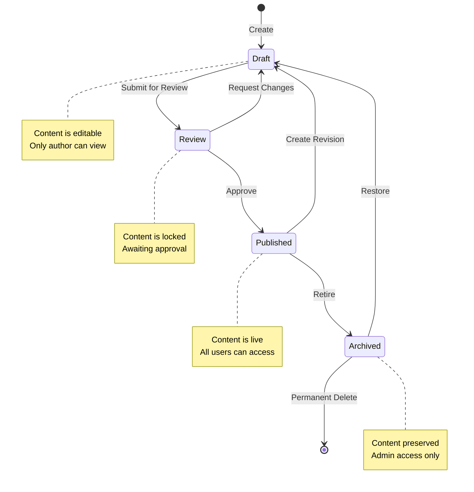
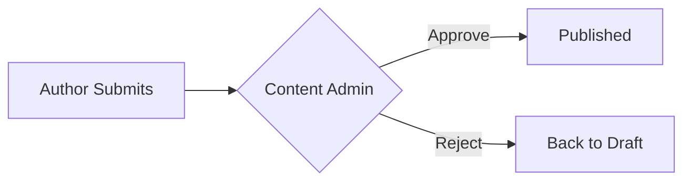
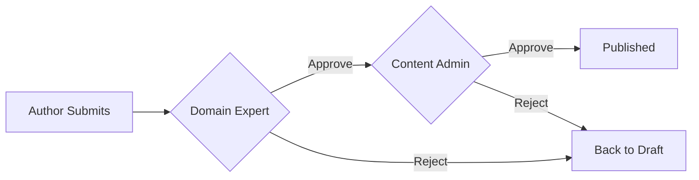
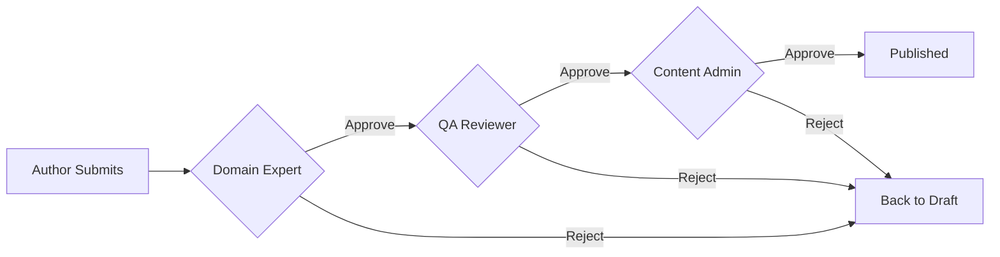
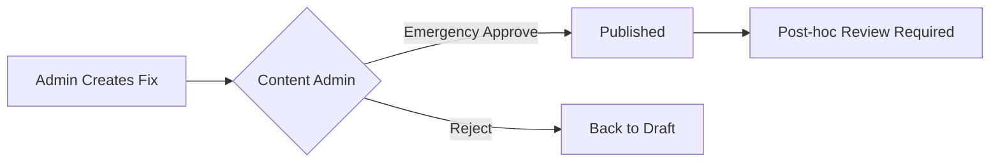
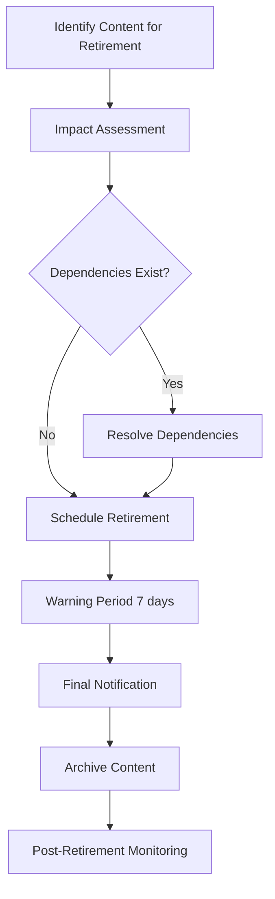

# Content Lifecycle Specification

## Document Information

| Field | Value |
|-------|-------|
| **Document ID** | SS-WS3.0-CLS |
| **Version** | 1.0 |
| **Date** | 2026-01-20 |
| **Author** | Obi Wan |
| **Status** | DRAFT |
| **Sprint** | WS3.0-S1 |
| **Task** | S1.2 |
| **Related Documents** | SS-WS3.0-CDM (Content Domain Model) |

---

## 1. Executive Summary

This document defines the complete lifecycle for all content in the Sommelier Spark platform. It establishes the states, transitions, versioning strategy, approval workflows, and retirement procedures that govern how content moves from creation to retirement.

**Key Statistics:**
- **4 Content States**: Draft, Review, Published, Archived
- **6 State Transitions**: Defined paths between states
- **4 Approval Workflows**: Simple, Standard, Extended, Expedited
- **5 Roles**: Content Author, Content Admin, Domain Expert, QA Reviewer, Org Admin

---

## 2. Content States

All content entities (Wine, Module, Lesson, Quiz, Question, Scenario) follow the same state model.

### 2.1 State Definitions

| State | Code | Description | Visibility |
|-------|------|-------------|------------|
| **Draft** | `DRAFT` | Content is being created or edited. May be incomplete or contain errors. | Author only |
| **Review** | `REVIEW` | Content is complete and awaiting approval. Locked for editing. | Author + Reviewers |
| **Published** | `PUBLISHED` | Content is live and visible to end users. Active in learning paths. | All users |
| **Archived** | `ARCHIVED` | Content is retired but preserved for historical reference. | Admins only |

### 2.2 State Attributes

Each content item tracks the following state-related attributes:

| Attribute | Type | Description |
|-----------|------|-------------|
| `status` | Enum | Current state (DRAFT, REVIEW, PUBLISHED, ARCHIVED) |
| `version` | Integer | Current version number |
| `createdAt` | DateTime | When content was first created |
| `createdBy` | UUID | User who created the content |
| `updatedAt` | DateTime | Last modification timestamp |
| `updatedBy` | UUID | User who last modified |
| `publishedAt` | DateTime | When content was published (null if never) |
| `publishedBy` | UUID | User who published |
| `archivedAt` | DateTime | When content was archived (null if active) |
| `archivedBy` | UUID | User who archived |
| `reviewRequestedAt` | DateTime | When review was requested |
| `reviewRequestedBy` | UUID | User who requested review |

---

## 3. State Transitions

### 3.1 Transition Diagram



### 3.2 Transition Definitions

#### 3.2.1 Draft → Review (Submit for Review)

| Attribute | Value |
|-----------|-------|
| **Trigger** | Author clicks "Submit for Review" |
| **Who Can Trigger** | Content Author, Content Admin |
| **Preconditions** | - All required fields populated |
| | - Content passes validation rules |
| | - No broken references to other content |
| **Automatic Actions** | - Set `status` = REVIEW |
| | - Set `reviewRequestedAt` = now |
| | - Set `reviewRequestedBy` = current user |
| | - Lock content for editing |
| | - Notify assigned reviewers |
| | - Create audit log entry |
| **Notifications** | Email/in-app to all assigned reviewers |

#### 3.2.2 Review → Published (Approve)

| Attribute | Value |
|-----------|-------|
| **Trigger** | Reviewer clicks "Approve and Publish" |
| **Who Can Trigger** | Content Admin (final approver in workflow) |
| **Preconditions** | - All required approvals received |
| | - No outstanding change requests |
| | - Content passes final validation |
| **Automatic Actions** | - Set `status` = PUBLISHED |
| | - Set `publishedAt` = now |
| | - Set `publishedBy` = current user |
| | - Increment `version` if updating existing |
| | - Archive previous version (if exists) |
| | - Update search indexes |
| | - Clear content caches |
| | - Create audit log entry |
| **Notifications** | Email/in-app to content author |

#### 3.2.3 Review → Draft (Request Changes)

| Attribute | Value |
|-----------|-------|
| **Trigger** | Reviewer clicks "Request Changes" with comments |
| **Who Can Trigger** | Domain Expert, Content Admin, QA Reviewer |
| **Preconditions** | - Content is in REVIEW state |
| | - Reviewer provides feedback comments |
| **Automatic Actions** | - Set `status` = DRAFT |
| | - Unlock content for editing |
| | - Attach reviewer comments |
| | - Create audit log entry |
| **Notifications** | Email/in-app to content author with feedback |

#### 3.2.4 Published → Draft (Create Revision)

| Attribute | Value |
|-----------|-------|
| **Trigger** | Author clicks "Create New Version" |
| **Who Can Trigger** | Content Author, Content Admin |
| **Preconditions** | - Content is currently PUBLISHED |
| | - No pending revision already in progress |
| **Automatic Actions** | - Create copy of content as new DRAFT |
| | - Link draft to published version |
| | - Published version remains live |
| | - Create audit log entry |
| **Notifications** | None (author-initiated) |
| **Notes** | Published version stays live until new version is approved |

#### 3.2.5 Published → Archived (Retire)

| Attribute | Value |
|-----------|-------|
| **Trigger** | Admin clicks "Archive Content" |
| **Who Can Trigger** | Content Admin, Org Admin |
| **Preconditions** | - Content is currently PUBLISHED |
| | - Warning period completed (7 days) |
| | - Dependent content resolved |
| **Automatic Actions** | - Set `status` = ARCHIVED |
| | - Set `archivedAt` = now |
| | - Set `archivedBy` = current user |
| | - Remove from active content lists |
| | - Update search indexes |
| | - Preserve user progress data |
| | - Create audit log entry |
| **Notifications** | Email to affected org admins |

#### 3.2.6 Archived → Draft (Restore)

| Attribute | Value |
|-----------|-------|
| **Trigger** | Admin clicks "Restore Content" |
| **Who Can Trigger** | Content Admin |
| **Preconditions** | - Content is currently ARCHIVED |
| | - No naming conflicts with active content |
| **Automatic Actions** | - Set `status` = DRAFT |
| | - Clear archive timestamp |
| | - Content requires re-review before publish |
| | - Create audit log entry |
| **Notifications** | Email to original author (if still active) |

---

## 4. Versioning Strategy

### 4.1 Version Number Format

Content uses **semantic versioning** with the format: `MAJOR.MINOR`

| Component | Increment When | Example |
|-----------|----------------|---------|
| **MAJOR** | Significant content restructure, learning objective changes, or breaking changes to assessments | 1.0 → 2.0 |
| **MINOR** | Corrections, clarifications, additions that don't change core learning outcomes | 1.0 → 1.1 |

### 4.2 Version Increment Rules

| Change Type | Version Impact | Examples |
|-------------|----------------|----------|
| Typo fix | Minor (1.0 → 1.1) | Spelling correction, grammar fix |
| Content clarification | Minor (1.0 → 1.1) | Rewording for clarity |
| Add supplementary info | Minor (1.0 → 1.1) | Adding a study tip |
| Fix incorrect answer | Minor (1.0 → 1.1) | Correcting quiz answer |
| Add new question | Minor (1.0 → 1.1) | Adding question to quiz |
| Restructure module | Major (1.0 → 2.0) | Reordering lessons |
| Change learning objectives | Major (1.0 → 2.0) | New module goals |
| Change passing threshold | Major (1.0 → 2.0) | 70% → 80% pass rate |
| Major content rewrite | Major (1.0 → 2.0) | Complete lesson rewrite |

### 4.3 Version History Retention

| Retention Type | Duration | Storage |
|----------------|----------|---------|
| **Active versions** | Indefinite | Primary database |
| **Previous published versions** | 2 years | Archive storage |
| **Draft versions** | 90 days after superseded | Archive storage |
| **Deleted content** | 30 days (soft delete) | Recycle bin |

### 4.4 Version Comparison

The system supports comparing versions to identify changes:

```
Version Diff: Wine "Château Margaux" (v1.2 → v1.3)
─────────────────────────────────────────────────
Modified Fields:
  - quickFacts.tastingNotes: "Dark fruits..." → "Concentrated dark fruits..."
  - quickFacts.pairings: Added "Roast duck"

Unchanged Fields: 23
Modified By: john.smith@example.com
Modified At: 2026-01-15 14:30:00
```

---

## 5. Approval Workflows

### 5.1 Workflow Types

| Workflow | Complexity | Approvers | Typical Duration |
|----------|------------|-----------|------------------|
| **Simple** | Low | Content Admin (1) | 1-2 days |
| **Standard** | Medium | Content Admin + Domain Expert (2) | 3-5 days |
| **Extended** | High | Content Admin + Domain Expert + QA (3) | 5-7 days |
| **Expedited** | Urgent | Content Admin (1) | Same day |

### 5.2 Workflow Assignment by Content Type

| Content Type | Default Workflow | Rationale |
|--------------|------------------|-----------|
| **Wine** | Simple | Factual content, lower risk |
| **Module** | Standard | Structural impact on learning paths |
| **Lesson** | Standard | Core educational content |
| **Quiz** | Standard | Assessment accuracy critical |
| **Question** | Simple | Individual items, validated within quiz |
| **Scenario** | Extended | Complex branching, customer-facing simulation |

### 5.3 Workflow Diagrams

#### Simple Workflow (Wine, Question)



#### Standard Workflow (Module, Lesson, Quiz)



#### Extended Workflow (Scenario)



#### Expedited Workflow (Emergency Fixes)



### 5.4 Workflow Approval Matrix

| Role | Simple | Standard | Extended | Expedited |
|------|--------|----------|----------|-----------|
| Content Author | Submit | Submit | Submit | — |
| Domain Expert | — | Review | Review | — |
| QA Reviewer | — | — | Review | — |
| Content Admin | Final Approve | Final Approve | Final Approve | Approve |

### 5.5 Escalation Rules

| Condition | Action |
|-----------|--------|
| Review pending > 3 days | Reminder to reviewer |
| Review pending > 5 days | Escalate to Content Admin |
| Review pending > 7 days | Auto-assign backup reviewer |
| Reviewer unavailable | Reassign to available reviewer |

---

## 6. Role Permissions

### 6.1 Permission Matrix

| Permission | Content Author | Content Admin | Domain Expert | QA Reviewer | Org Admin |
|------------|----------------|---------------|---------------|-------------|-----------|
| **Create content** | ✓ | ✓ | — | — | — |
| **Edit own draft** | ✓ | ✓ | — | — | — |
| **Edit any draft** | — | ✓ | — | — | — |
| **Edit org content** | — | — | — | — | ✓ |
| **Submit for review** | ✓ | ✓ | — | — | — |
| **Review content** | — | ✓ | ✓ | ✓ | — |
| **Approve/Publish** | — | ✓ | — | — | — |
| **Publish org content** | — | — | — | — | ✓ |
| **Archive content** | — | ✓ | — | — | ✓ (org) |
| **Restore content** | — | ✓ | — | — | — |
| **Delete permanently** | — | ✓ | — | — | — |
| **View all versions** | ✓ | ✓ | ✓ | ✓ | ✓ |
| **View audit log** | Own only | ✓ | — | — | Org only |

### 6.2 Role Definitions

#### Content Author
- Creates and edits content they own
- Cannot publish without approval
- Can view their content in all states

#### Content Admin
- Full control over all content
- Final approval authority
- Manages content lifecycle
- Access to all audit logs

#### Domain Expert
- Subject matter experts (sommeliers, educators)
- Reviews content for accuracy and quality
- Cannot publish directly
- Provides feedback and approval recommendation

#### QA Reviewer
- Tests scenarios and interactive content
- Verifies branching logic and scoring
- Checks user experience
- Required for Extended workflow

#### Org Admin
- Manages content for their organisation
- Can publish org-specific content
- Limited to organisation scope
- Cannot modify global content

### 6.3 Scope Limitations

| Role | Global Content | Organisation Content | Brand Content |
|------|----------------|----------------------|---------------|
| Content Author | Create/Edit own | — | — |
| Content Admin | Full access | Full access | Full access |
| Domain Expert | Review only | Review only | Review only |
| QA Reviewer | Review only | Review only | Review only |
| Org Admin | View only | Full access | Full access |
| Brand Admin | View only | View only | Full access |

---

## 7. Rollback Procedures

### 7.1 When to Rollback

| Scenario | Rollback Type | Urgency |
|----------|---------------|---------|
| Critical error in published content | Immediate | High |
| Incorrect quiz answers discovered | Version revert | Medium |
| Outdated information published | Version revert | Medium |
| Broken scenario paths | Immediate | High |
| Accidental publish | Unpublish | High |

### 7.2 Rollback Methods

#### Method 1: Unpublish (Emergency)

For critical issues requiring immediate removal from user access.

```
Procedure: Emergency Unpublish
─────────────────────────────
1. Content Admin navigates to content
2. Clicks "Emergency Unpublish"
3. Confirms action with reason
4. Content status → DRAFT
5. Users see "Content temporarily unavailable"
6. Audit log records action
7. Stakeholders notified automatically
```

**Impact on Users:**
- Content immediately inaccessible
- In-progress activities gracefully terminated
- User progress preserved

#### Method 2: Version Revert

For reverting to a previous known-good version.

```
Procedure: Version Revert
─────────────────────────
1. Content Admin navigates to version history
2. Selects target version to restore
3. System creates diff comparison
4. Admin confirms revert
5. Target version copied as new DRAFT
6. Fast-track through approval (Expedited)
7. New version published
8. Old version auto-archived
```

**Impact on Users:**
- Brief transition period
- Minimal disruption if versions similar
- Progress preserved if structure unchanged

#### Method 3: Content Replace

For replacing content with corrected version already prepared.

```
Procedure: Content Replace
──────────────────────────
1. Corrected version prepared in DRAFT
2. Content Admin initiates replacement
3. System validates compatibility
4. Atomic swap: old archived, new published
5. Caches invalidated
6. Users see new content immediately
```

### 7.3 User Progress Handling

| Change Type | Progress Impact | Action |
|-------------|-----------------|--------|
| Minor text changes | None | Progress preserved |
| Question wording change | None | Progress preserved |
| Question answer change | Recalculate scores | Notify affected users |
| Question added | None | Progress preserved |
| Question removed | Adjust totals | Recalculate percentages |
| Lesson removed | Mark as legacy complete | Preserve completion |
| Module restructured | Map to new structure | Migration script |
| Scenario path changed | Invalidate attempts | Users restart scenario |

### 7.4 Rollback Notifications

| Recipient | Notification Type | Content |
|-----------|-------------------|---------|
| Content Author | Email + In-app | Reason for rollback, action required |
| Org Admins | Email | Content status change |
| Affected Users | In-app | "Content has been updated" |
| Content Admin | Audit log | Full rollback record |

---

## 8. Content Retirement

### 8.1 Retirement Process Overview



### 8.2 Pre-Retirement Checklist

| Check | Description | Required |
|-------|-------------|----------|
| Dependency scan | Identify content referencing this item | Yes |
| User progress review | Count users with progress on this content | Yes |
| Replacement content | Identify or create replacement if needed | Recommended |
| Stakeholder approval | Org admin sign-off for org content | Yes |
| Communication plan | How users will be informed | Yes |

### 8.3 Warning Period

| Phase | Duration | Actions |
|-------|----------|---------|
| **Pre-warning** | Before T-7 | Admin review, dependency resolution |
| **Warning** | T-7 to T-1 | Banner on content, email to active users |
| **Final notice** | T-1 | Push notification to recent users |
| **Retirement** | T-0 | Content archived |

### 8.4 Dependency Resolution

When content depends on content being retired:

| Dependent Type | Resolution Options |
|----------------|-------------------|
| Quiz references Wine | Remove question or substitute wine |
| Scenario features Wine | Update scenario or substitute wine |
| Module contains Lesson | Remove lesson or move to another module |
| Question in Quiz | Remove question, adjust scoring |

### 8.5 User Communication

#### Retirement Notice Template

```
Subject: Content Update Notice - [Content Title]

Dear [User Name],

The following content will be retired on [Date]:

  [Content Type]: [Content Title]

What this means for you:
• Your progress has been preserved in your learning history
• [Replacement content is available / No replacement needed]
• Completed achievements remain on your profile

If you have questions, contact your administrator.

Thank you for your continued learning!
The Sommelier Spark Team
```

### 8.6 Archive vs Permanent Delete

| Action | When Used | Reversible | Data Retained |
|--------|-----------|------------|---------------|
| **Archive** | Standard retirement | Yes | All content + metadata |
| **Permanent Delete** | Legal/compliance requirement | No | Audit log only |

**Permanent Delete Safeguards:**
- Requires Content Admin + second approval
- 7-day cooling-off period
- Cannot delete if user progress exists (must anonymize first)
- Full audit trail maintained

---

## 9. Audit Trail

### 9.1 Audit Log Structure

| Field | Type | Description |
|-------|------|-------------|
| `id` | UUID | Audit entry ID |
| `timestamp` | DateTime | When action occurred |
| `userId` | UUID | Who performed action |
| `userEmail` | String | User email (denormalized) |
| `action` | Enum | Action type |
| `contentType` | Enum | Wine, Module, Lesson, etc. |
| `contentId` | UUID | Content item ID |
| `contentTitle` | String | Content title (denormalized) |
| `previousState` | JSON | State before change |
| `newState` | JSON | State after change |
| `reason` | String | Optional reason/comment |
| `ipAddress` | String | User IP address |

### 9.2 Audited Actions

| Action Code | Description |
|-------------|-------------|
| `CONTENT_CREATED` | New content created |
| `CONTENT_UPDATED` | Content modified |
| `STATUS_CHANGED` | State transition |
| `REVIEW_SUBMITTED` | Sent for review |
| `REVIEW_APPROVED` | Review approved |
| `REVIEW_REJECTED` | Review rejected with feedback |
| `PUBLISHED` | Content published |
| `UNPUBLISHED` | Content unpublished |
| `ARCHIVED` | Content archived |
| `RESTORED` | Content restored from archive |
| `DELETED` | Content permanently deleted |
| `VERSION_CREATED` | New version created |
| `ROLLBACK` | Version rollback |

### 9.3 Audit Retention

| Log Type | Retention Period |
|----------|------------------|
| State changes | 7 years |
| Content edits | 2 years |
| View/access logs | 90 days |
| Delete actions | Permanent |

---

## 10. Implementation Notes

### 10.1 Database Schema Additions

The following fields should be added to content entities:

```sql
-- Status and versioning fields
ALTER TABLE wines ADD COLUMN status VARCHAR(20) DEFAULT 'DRAFT';
ALTER TABLE wines ADD COLUMN version INTEGER DEFAULT 1;
ALTER TABLE wines ADD COLUMN published_at TIMESTAMP;
ALTER TABLE wines ADD COLUMN published_by UUID;
ALTER TABLE wines ADD COLUMN archived_at TIMESTAMP;
ALTER TABLE wines ADD COLUMN archived_by UUID;
ALTER TABLE wines ADD COLUMN review_requested_at TIMESTAMP;
ALTER TABLE wines ADD COLUMN review_requested_by UUID;

-- Similar for modules, lessons, quizzes, scenarios
```

### 10.2 API Endpoints

| Endpoint | Method | Description |
|----------|--------|-------------|
| `/content/{type}/{id}/submit-review` | POST | Submit for review |
| `/content/{type}/{id}/approve` | POST | Approve content |
| `/content/{type}/{id}/reject` | POST | Reject with feedback |
| `/content/{type}/{id}/publish` | POST | Publish content |
| `/content/{type}/{id}/unpublish` | POST | Emergency unpublish |
| `/content/{type}/{id}/archive` | POST | Archive content |
| `/content/{type}/{id}/restore` | POST | Restore from archive |
| `/content/{type}/{id}/versions` | GET | Get version history |
| `/content/{type}/{id}/versions/{v}` | GET | Get specific version |
| `/content/{type}/{id}/diff/{v1}/{v2}` | GET | Compare versions |
| `/audit-log` | GET | Query audit log |

### 10.3 Background Jobs

| Job | Schedule | Purpose |
|-----|----------|---------|
| `ReviewReminderJob` | Daily | Send reminders for pending reviews |
| `EscalationJob` | Daily | Escalate overdue reviews |
| `RetirementWarningJob` | Daily | Send retirement warnings |
| `ArchiveCleanupJob` | Weekly | Clean up old archived versions |
| `AuditLogArchiveJob` | Monthly | Archive old audit entries |

---

## 11. Appendix

### 11.1 State Transition Summary Table

| From State | To State | Transition | Trigger | Who |
|------------|----------|------------|---------|-----|
| — | Draft | Create | New content | Author, Admin |
| Draft | Review | Submit | Author submits | Author, Admin |
| Review | Draft | Reject | Reviewer rejects | Expert, Admin, QA |
| Review | Published | Approve | Final approval | Admin |
| Published | Draft | Revise | Create revision | Author, Admin |
| Published | Archived | Retire | Admin archives | Admin, Org Admin |
| Archived | Draft | Restore | Admin restores | Admin |
| Archived | — | Delete | Permanent delete | Admin (+ approval) |

### 11.2 Workflow Summary by Content Type

| Content Type | Workflow | Approvers | Est. Time |
|--------------|----------|-----------|-----------|
| Wine | Simple | Content Admin | 1-2 days |
| Module | Standard | Domain Expert → Content Admin | 3-5 days |
| Lesson | Standard | Domain Expert → Content Admin | 3-5 days |
| Quiz | Standard | Domain Expert → Content Admin | 3-5 days |
| Question | Simple | Content Admin | 1-2 days |
| Scenario | Extended | Domain Expert → QA → Content Admin | 5-7 days |

### 11.3 Quick Reference: Content States

```
┌─────────────────────────────────────────────────────────────┐
│                     CONTENT STATES                          │
├─────────────────────────────────────────────────────────────┤
│  DRAFT     │ Editable    │ Author only    │ Work in progress│
│  REVIEW    │ Locked      │ Author+Reviewers│ Awaiting approval│
│  PUBLISHED │ Live        │ All users      │ Active content   │
│  ARCHIVED  │ Preserved   │ Admins only    │ Retired          │
└─────────────────────────────────────────────────────────────┘
```

### 11.4 Revision History

| Version | Date | Author | Changes |
|---------|------|--------|---------|
| 1.0 | 2026-01-20 | Obi Wan | Initial draft |

---

*End of Document*
