# Content-to-Learning Mapping

## Document Information

| Field | Value |
|-------|-------|
| **Document ID** | SS-WS3.0-LE-CLM |
| **Version** | 1.0 |
| **Date** | 2026-01-20 |
| **Author** | Obi Wan |
| **Status** | DRAFT |
| **Classification** | CONFIDENTIAL (IP-sensitive) |
| **Sprint** | WS3.0-S3 |
| **Task** | S3.3 |
| **Related Documents** | SS-WS3.0-CDM, SS-WS3.0-LE-REQ, SS-WS3.0-LE-CGR |

---

## CONFIDENTIALITY NOTICE

This document contains proprietary and confidential information relating to the Sommelier Spark Learning Content Engine transformation algorithms. This is patent-pending technology representing the core value proposition of the platform. Distribution is restricted to authorised personnel only.

---

## 1. Executive Summary

This document defines how wine and content data transforms into personalised learning curricula — the core "magic" of Sommelier Spark. It explains the complete journey from a raw wine list to a comprehensive, tiered training programme tailored to each organisation.

### 1.1 The Transformation Promise

| Input | Output |
|-------|--------|
| Organisation's wine list (CSV/data) | Complete training curriculum |
| Menu items (optional) | Role-relevant scenarios |
| Staff roles | Personalised learning paths |
| **Time to value** | **< 5 minutes** |

### 1.2 Document Statistics

| Category | Count |
|----------|-------|
| Attribute Mappings | 18 |
| Module Generation Rules | 12 |
| Coverage Requirements | 8 |
| Gap Handling Scenarios | 6 |
| Transformation Diagrams | 6 |
| Refresh/Update Rules | 8 |

---

## 2. Wine Attribute to Question Type Mapping

This section defines which wine attributes generate which types of questions, ensuring comprehensive coverage of all wine knowledge.

### 2.1 Core Attribute Mappings

| Wine Attribute | Source Field | Question Types Generated | Tier(s) | Example Question |
|----------------|--------------|--------------------------|---------|------------------|
| **Region** | `wine.region` | Identification, Geography | Bronze | "Which wine is from Bordeaux?" |
| **Country** | `wine.country` | Identification, Geography | Bronze | "Which wine is from France?" |
| **Grape Variety** | `wine.grapeVarieties` | Identification, Characteristics | Bronze/Silver | "Which wine is made from Pinot Noir?" |
| **Wine Type** | `wine.wineType` | Identification, Category | Bronze | "Which of these is a sparkling wine?" |
| **Producer** | `wine.producer` | Producer Knowledge | Silver | "Which wine is from Domaine Leroy?" |
| **Vintage** | `wine.vintage` | Age, Storage, Readiness | Silver/Gold | "Which vintage is drinking well now?" |
| **Price Tier** | `wine.priceTier` | Value, Budget, Upselling | Silver | "Which is your best value red under £40?" |

### 2.2 Tasting Attribute Mappings

| Wine Attribute | Source Field | Question Types Generated | Tier(s) | Example Question |
|----------------|--------------|--------------------------|---------|------------------|
| **Appearance** | `wine.appearance` | Visual Identification | Gold | "What colour would you expect from aged Barolo?" |
| **Nose/Aromas** | `wine.nose` | Aroma Identification | Silver/Gold | "Which wine has notes of blackcurrant and cedar?" |
| **Palate** | `wine.palate` | Flavour Description | Silver/Gold | "Which wine is described as 'rich and velvety'?" |
| **Tasting Notes** | `wine.tastingNotes` | Tasting, Description | Silver/Gold | "Which wine displays 'mineral and citrus' notes?" |
| **Body** | derived | Style Characteristics | Silver | "Which wine is full-bodied?" |
| **Tannins** | derived | Structure Understanding | Silver/Gold | "Which wine has firm tannins?" |
| **Acidity** | derived | Balance Understanding | Silver/Gold | "Which wine has high acidity?" |

### 2.3 Service Attribute Mappings

| Wine Attribute | Source Field | Question Types Generated | Tier(s) | Example Question |
|----------------|--------------|--------------------------|---------|------------------|
| **Serving Temperature** | `wine.servingTemperature` | Service Knowledge | Bronze | "At what temperature should this be served?" |
| **Decanting Time** | `wine.decantingTime` | Service Knowledge | Silver | "How long should this wine be decanted?" |
| **Food Pairings** | `wine.foodPairings` | Pairing, Recommendation | Bronze/Silver | "Which wine pairs best with lamb?" |
| **Pairing Rationale** | `wine.pairingRationale` | Pairing Reasoning | Silver/Gold | "Why does this wine pair well with fish?" |

### 2.4 Attribute to Question Type Matrix

| Attribute | Identification | Pairing | Tasting | Service | Comparison | Reasoning |
|-----------|---------------|---------|---------|---------|------------|-----------|
| region | ✓ | — | — | — | ✓ | — |
| country | ✓ | — | — | — | — | — |
| grapeVarieties | ✓ | — | ✓ | — | ✓ | — |
| wineType | ✓ | — | — | ✓ | — | — |
| producer | ✓ | — | — | — | — | — |
| vintage | ✓ | — | — | — | ✓ | ✓ |
| priceTier | — | — | — | — | ✓ | ✓ |
| tastingNotes | — | — | ✓ | — | ✓ | — |
| foodPairings | — | ✓ | — | — | — | ✓ |
| servingTemperature | — | — | — | ✓ | — | — |

### 2.5 Question Generation Priority

| Priority | Attributes | Rationale |
|----------|------------|-----------|
| 1 (Essential) | region, grapeVarieties, wineType, foodPairings | Core knowledge for any staff |
| 2 (Important) | country, servingTemperature, producer | Practical service knowledge |
| 3 (Advanced) | tastingNotes, vintage, priceTier | Deeper understanding |
| 4 (Expert) | appearance, nose, palate, pairingRationale | Sommelier-level expertise |

---

## 3. Wine Category to Module Topic Mapping

This section defines how wine categories automatically generate relevant learning modules.

### 3.1 Red Wine Modules

| Wine Category | Generated Module Topics | Minimum Wines | Tier |
|---------------|-------------------------|---------------|------|
| Red wines (general) | "Your Red Wine Selection" | 3 | Bronze |
| Red wines (varied) | "Red Grape Varieties" | 4+ varieties | Bronze/Silver |
| Red wines (regional) | "Red Wine Regions" | 3+ regions | Silver |
| Red wines (premium) | "Premium Red Wines" | 2+ luxury tier | Gold |

**Module Content Mapping:**

| Topic | Content Sources | Lessons Generated |
|-------|-----------------|-------------------|
| Red Grape Varieties | wine.grapeVarieties where wineType='red' | 1 lesson per 2-3 varieties |
| Red Wine Regions | wine.region where wineType='red' | 1 lesson per region |
| Tannins & Structure | wine.tastingNotes (tannin references) | 2-3 lessons |
| Red Wine Service | wine.servingTemperature, decantingTime | 2 lessons |

### 3.2 White Wine Modules

| Wine Category | Generated Module Topics | Minimum Wines | Tier |
|---------------|-------------------------|---------------|------|
| White wines (general) | "Your White Wine Selection" | 3 | Bronze |
| White wines (varied) | "White Grape Varieties" | 4+ varieties | Bronze/Silver |
| White wines (regional) | "White Wine Regions" | 3+ regions | Silver |
| White wines (premium) | "Premium White Wines" | 2+ luxury tier | Gold |

**Module Content Mapping:**

| Topic | Content Sources | Lessons Generated |
|-------|-----------------|-------------------|
| White Grape Varieties | wine.grapeVarieties where wineType='white' | 1 lesson per 2-3 varieties |
| White Wine Regions | wine.region where wineType='white' | 1 lesson per region |
| Acidity & Freshness | wine.tastingNotes (acidity references) | 2-3 lessons |
| White Wine Service | wine.servingTemperature | 1-2 lessons |

### 3.3 Sparkling Wine Modules

| Wine Category | Generated Module Topics | Minimum Wines | Tier |
|---------------|-------------------------|---------------|------|
| Sparkling wines | "Sparkling & Celebration" | 2 | Bronze |
| Champagne present | "Champagne Excellence" | 1+ Champagne | Silver |
| Multiple methods | "Sparkling Methods" | 3+ types | Silver |
| Premium sparkling | "Prestige Cuvées" | 1+ prestige | Gold |

**Module Content Mapping:**

| Topic | Content Sources | Lessons Generated |
|-------|-----------------|-------------------|
| Sparkling Types | wine.region (Champagne, Prosecco, Cava, etc.) | 1 lesson per type |
| Production Methods | Traditional, Tank, Pet-nat | 2-3 lessons |
| Sparkling Service | wine.servingTemperature, glassware | 2 lessons |
| Celebration Occasions | Service context | 1-2 lessons |

### 3.4 Rosé Wine Modules

| Wine Category | Generated Module Topics | Minimum Wines | Tier |
|---------------|-------------------------|---------------|------|
| Rosé wines | "Rosé Wine Guide" | 2 | Bronze |
| Rosé variety | "Rosé Styles & Regions" | 3+ | Silver |

### 3.5 Dessert Wine Modules

| Wine Category | Generated Module Topics | Minimum Wines | Tier |
|---------------|-------------------------|---------------|------|
| Dessert wines | "Sweet Wine Selection" | 1 | Bronze |
| Multiple styles | "Dessert Wine Styles" | 2+ styles | Silver |
| Premium dessert | "Noble Rot & Ice Wine" | 1+ premium | Gold |

### 3.6 Fortified Wine Modules

| Wine Category | Generated Module Topics | Minimum Wines | Tier |
|---------------|-------------------------|---------------|------|
| Fortified wines | "Fortified Wine Basics" | 1 | Bronze |
| Port present | "Port Wine Guide" | 2+ Port | Silver |
| Sherry present | "Sherry Styles" | 2+ Sherry | Silver |
| Multiple types | "Fortified Mastery" | 4+ fortified | Gold |

### 3.7 Cross-Category Modules

| Module Topic | Trigger Condition | Tier |
|--------------|-------------------|------|
| "Food Pairing Fundamentals" | Always generated | Bronze |
| "Food Pairing at {Org Name}" | Menu data available | Silver |
| "Wine Service Excellence" | Always generated | Bronze |
| "Understanding Wine Faults" | Silver curriculum | Silver |
| "Guest Recommendation Skills" | Always generated | Silver |
| "Handling Difficult Situations" | Gold curriculum | Gold |
| "Premium Wine Knowledge" | Luxury wines present | Gold |

---

## 4. Wine List to Curriculum Structure Transformation

This section details the complete transformation process from raw wine list to structured curriculum.

### 4.1 Transformation Overview

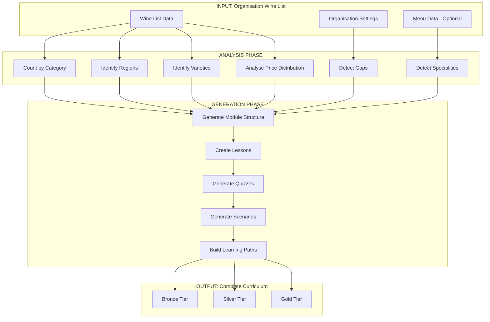

### 4.2 Analysis Phase Detail

#### Step 1: Category Count Analysis

```
Input: Wine List
Process:
  FOR each wine in wine_list:
    category_counts[wine.wineType] += 1
    region_counts[wine.region] += 1
    variety_counts[wine.grapeVarieties[0]] += 1
    price_tier_counts[wine.priceTier] += 1

Output: Distribution statistics
```

**Example Analysis Output:**

| Category | Count | Percentage | Module Trigger |
|----------|-------|------------|----------------|
| Red | 22 | 44% | ✓ Full red curriculum |
| White | 18 | 36% | ✓ Full white curriculum |
| Sparkling | 6 | 12% | ✓ Sparkling module |
| Rosé | 2 | 4% | ✓ Combined "Other" module |
| Dessert | 2 | 4% | ✓ Combined "Other" module |
| **Total** | **50** | **100%** | |

#### Step 2: Region Analysis

```
Input: Wine List
Process:
  FOR each wine in wine_list:
    regions.add({
      name: wine.region,
      country: wine.country,
      wines: wines_in_region,
      categories: wine_types_in_region
    })

Output: Region map with wine counts
```

**Example Region Output:**

| Region | Country | Wine Count | Types | Module Generated |
|--------|---------|------------|-------|------------------|
| Bordeaux | France | 8 | Red | "Bordeaux Reds" |
| Burgundy | France | 6 | Red, White | "Burgundy Selection" |
| Champagne | France | 4 | Sparkling | "Champagne" |
| Marlborough | NZ | 3 | White | Combined in "New World Whites" |
| Rioja | Spain | 3 | Red | Combined in "Spanish Reds" |

#### Step 3: Grape Variety Analysis

```
Input: Wine List
Process:
  FOR each wine in wine_list:
    FOR each grape in wine.grapeVarieties:
      varieties[grape].count += 1
      varieties[grape].wines.add(wine)

Output: Variety map with representation
```

**Example Variety Output:**

| Variety | Count | Colour | Coverage Target |
|---------|-------|--------|-----------------|
| Cabernet Sauvignon | 8 | Red | Full lesson |
| Chardonnay | 7 | White | Full lesson |
| Pinot Noir | 5 | Red | Full lesson |
| Sauvignon Blanc | 4 | White | Combined lesson |
| Merlot | 3 | Red | Combined lesson |

#### Step 4: Price Distribution Analysis

```
Input: Wine List
Process:
  FOR each wine in wine_list:
    price_bands[wine.priceTier] += 1
    price_ranges.min = MIN(price_ranges.min, wine.price)
    price_ranges.max = MAX(price_ranges.max, wine.price)

Output: Price distribution for scenario generation
```

**Example Price Output:**

| Price Tier | Count | Range | Scenario Usage |
|------------|-------|-------|----------------|
| Entry | 8 | £28-35 | Budget scenarios |
| Premium | 22 | £35-60 | Standard recommendations |
| Fine | 15 | £60-120 | Special occasion |
| Luxury | 5 | £120-450 | Upsell scenarios |

### 4.3 Generation Phase Detail

#### Module Structure Generation

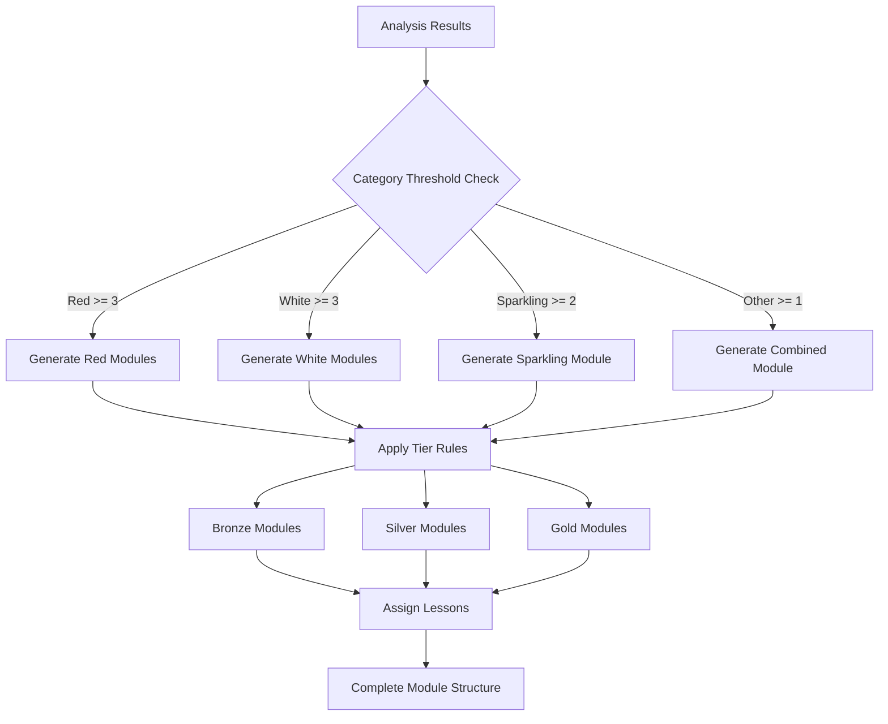

### 4.4 Example Transformation Output

**Input: The Ivy Restaurant Wine List**

```
Organisation: The Ivy Restaurant
Total Wines: 50
- 22 Red (8 regions, 6 grape varieties)
- 18 White (5 regions, 4 varieties)
- 6 Sparkling (3 types)
- 4 Other (2 rosé, 2 dessert)
Price Range: £28 - £450
```

**Output: Generated Curriculum**

```
┌─────────────────────────────────────────────────────────────┐
│                    BRONZE TIER (Foundation)                  │
├─────────────────────────────────────────────────────────────┤
│ Module 1: Welcome to The Ivy Wine Collection                │
│   - Lesson 1.1: Overview of Our Selection (50 wines)        │
│   - Lesson 1.2: Wine Categories Explained                   │
│   - Lesson 1.3: Reading Our Wine List                       │
│   Est. Time: 30 minutes                                     │
│                                                             │
│ Module 2: The Ivy Red Wines                                 │
│   - Lesson 2.1: Our Bordeaux Selection (8 wines)            │
│   - Lesson 2.2: Burgundy & Rhône (6 wines)                  │
│   - Lesson 2.3: Italian & Spanish Reds (5 wines)            │
│   - Lesson 2.4: New World Reds (3 wines)                    │
│   Est. Time: 45 minutes                                     │
│                                                             │
│ Module 3: The Ivy White Wines                               │
│   - Lesson 3.1: French Whites (10 wines)                    │
│   - Lesson 3.2: New World Whites (8 wines)                  │
│   Est. Time: 35 minutes                                     │
│                                                             │
│ Module 4: Sparkling & Special Wines                         │
│   - Lesson 4.1: Champagne Selection (4 wines)               │
│   - Lesson 4.2: Other Sparkling (2 wines)                   │
│   - Lesson 4.3: Rosé & Dessert Wines (4 wines)              │
│   Est. Time: 30 minutes                                     │
│                                                             │
│ Assessment: Bronze Quiz (10 questions, 70% pass)            │
│ Scenarios: 3 Bronze scenarios                               │
│ Total Bronze Time: 4-5 hours                                │
├─────────────────────────────────────────────────────────────┤
│                    SILVER TIER (Intermediate)                │
├─────────────────────────────────────────────────────────────┤
│ Module 5: Regional Deep Dive                                │
│   - Lesson 5.1: Bordeaux Left Bank vs Right Bank            │
│   - Lesson 5.2: Burgundy Appellations                       │
│   - Lesson 5.3: Understanding Champagne Houses              │
│   Est. Time: 50 minutes                                     │
│                                                             │
│ Module 6: Food Pairing at The Ivy                           │
│   - Lesson 6.1: Pairing with Seafood Menu                   │
│   - Lesson 6.2: Pairing with Meat Dishes                    │
│   - Lesson 6.3: Pairing with Vegetarian Options             │
│   - Lesson 6.4: Dessert Wine Pairing                        │
│   Est. Time: 45 minutes                                     │
│                                                             │
│ Module 7: Guest Preference Discovery                        │
│   - Lesson 7.1: Reading Guest Cues                          │
│   - Lesson 7.2: Budget-Sensitive Recommendations            │
│   - Lesson 7.3: Expanding Guest Horizons                    │
│   Est. Time: 40 minutes                                     │
│                                                             │
│ Assessment: Silver Quiz (10 questions, 80% pass)            │
│ Scenarios: 3 Silver scenarios                               │
│ Total Silver Time: 4-5 hours (cumulative: 8-10 hours)       │
├─────────────────────────────────────────────────────────────┤
│                      GOLD TIER (Advanced)                    │
├─────────────────────────────────────────────────────────────┤
│ Module 8: Advanced Tasting & Description                    │
│   - Lesson 8.1: Systematic Tasting Approach                 │
│   - Lesson 8.2: Describing Wine to Guests                   │
│   - Lesson 8.3: Identifying Wine Faults                     │
│   Est. Time: 55 minutes                                     │
│                                                             │
│ Module 9: Premium Wine Service                              │
│   - Lesson 9.1: Our Prestige Wines (5 wines)                │
│   - Lesson 9.2: Decanting & Advanced Service                │
│   - Lesson 9.3: Vintage Knowledge                           │
│   Est. Time: 45 minutes                                     │
│                                                             │
│ Module 10: Mastering Difficult Situations                   │
│   - Lesson 10.1: Handling Complaints                        │
│   - Lesson 10.2: The Knowledgeable Guest                    │
│   - Lesson 10.3: Group Dynamics                             │
│   Est. Time: 40 minutes                                     │
│                                                             │
│ Assessment: Gold Quiz (10 questions, 90% pass)              │
│ Scenarios: 3 Gold scenarios                                 │
│ Total Gold Time: 4-5 hours (cumulative: 12-15 hours)        │
└─────────────────────────────────────────────────────────────┘
```

---

## 5. Coverage Requirements

This section defines the requirements ensuring all content is represented in the curriculum.

### 5.1 Coverage Metrics

| Coverage Type | Requirement | Verification Method | Threshold |
|---------------|-------------|---------------------|-----------|
| Wine Coverage | 100% of org wines in curriculum | Count check | 100% |
| Region Coverage | All represented regions taught | Region list audit | 100% |
| Grape Coverage | All varieties represented | Variety list audit | 100% |
| Price Tier Coverage | All price ranges addressed | Price distribution | 100% |
| Question Coverage | Each wine in 2+ questions | Question audit | 100% |
| Scenario Coverage | Each wine type in 1+ scenario | Scenario audit | 100% |
| Module Balance | No module >40% of curriculum | Module size check | <40% |
| Tier Balance | Content at all three tiers | Tier distribution | All tiers |

### 5.2 Coverage Verification Process

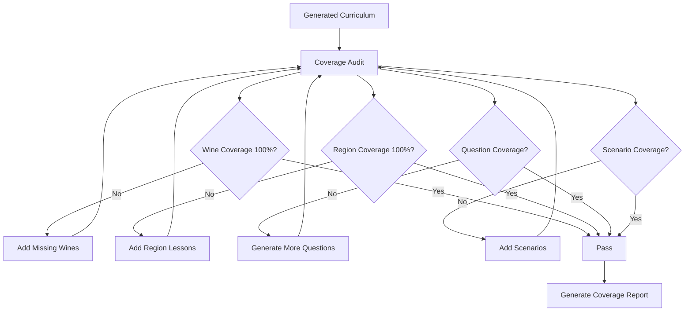

### 5.3 Coverage Report Structure

```
COVERAGE REPORT: The Ivy Restaurant
Generated: 2026-01-20 14:30:00
═══════════════════════════════════════════════════════════════

WINE COVERAGE
─────────────
Total wines in list: 50
Wines in curriculum: 50 (100%) ✓
Wines in questions: 50 (100%) ✓
Average questions per wine: 3.2

REGION COVERAGE
───────────────
Total regions: 12
Regions with lessons: 12 (100%) ✓
Regions by representation:
  - Bordeaux: 8 wines, 2 lessons ✓
  - Burgundy: 6 wines, 2 lessons ✓
  - Champagne: 4 wines, 1 lesson ✓
  [...]

GRAPE VARIETY COVERAGE
──────────────────────
Total varieties: 10
Varieties covered: 10 (100%) ✓

PRICE TIER COVERAGE
───────────────────
Entry: 8 wines, represented ✓
Premium: 22 wines, represented ✓
Fine: 15 wines, represented ✓
Luxury: 5 wines, represented ✓

QUESTION DISTRIBUTION
─────────────────────
Total questions generated: 160
  Bronze: 40 (25%)
  Silver: 60 (37.5%)
  Gold: 60 (37.5%)
Questions per wine: min=2, max=5, avg=3.2 ✓

SCENARIO COVERAGE
─────────────────
Red wines in scenarios: ✓
White wines in scenarios: ✓
Sparkling in scenarios: ✓
All price tiers in scenarios: ✓

STATUS: COMPLETE ✓
```

---

## 6. Gap Analysis Process

This section defines how the system handles missing or limited content.

### 6.1 Gap Detection Algorithm

```
Function: detect_gaps(wine_list, org_settings)

Inputs:
  - wine_list: Array of wine objects
  - org_settings: Organisation configuration

Process:
  gaps = []

  # Check category gaps
  FOR category IN [red, white, sparkling, rose, dessert, fortified]:
    count = count_wines(wine_list, category)
    IF count == 0:
      gaps.add({type: 'missing_category', category: category})
    ELIF count < MIN_THRESHOLD[category]:
      gaps.add({type: 'low_count', category: category, count: count})

  # Check region diversity
  regions = unique_regions(wine_list)
  IF regions.count < 3:
    gaps.add({type: 'limited_regions', count: regions.count})

  # Check price range
  price_range = max_price - min_price
  IF price_range < RECOMMENDED_RANGE:
    gaps.add({type: 'limited_price_range', range: price_range})

  # Check total count
  IF wine_list.count < 10:
    gaps.add({type: 'very_small_list', count: wine_list.count})
  ELIF wine_list.count > 200:
    gaps.add({type: 'very_large_list', count: wine_list.count})

Return: gaps
```

### 6.2 Gap Handling Scenarios

#### Scenario 1: Missing Wine Category

| Gap | Detection | Actions |
|-----|-----------|---------|
| No sparkling wines | `sparkling_count == 0` | Skip sparkling module |
| | | Remove sparkling questions |
| | | Remove sparkling scenarios |
| | | Generate recommendation |

**System Response:**
```
GAP DETECTED: No sparkling wines in list

ACTIONS TAKEN:
✗ Module "Sparkling & Celebration" - SKIPPED
✗ 8 sparkling questions - NOT GENERATED
✗ 2 sparkling scenarios - NOT GENERATED

CURRICULUM ADJUSTED:
- Bronze Tier: 3 modules (was 4)
- Silver Tier: 3 modules (unchanged)
- Gold Tier: 3 modules (unchanged)

RECOMMENDATION:
Consider adding 2-3 sparkling options to offer guests:
- Entry: Prosecco DOC (~£32/bottle)
- Premium: Champagne NV (~£55/bottle)
- Celebration: Champagne Vintage (~£85/bottle)
```

#### Scenario 2: Limited Regions (e.g., Only French wines)

| Gap | Detection | Actions |
|-----|-----------|---------|
| Single-country list | `unique_countries.count == 1` | Adjust module naming |
| | | Focus on regional depth |
| | | Add country context |
| | | Note limitation |

**System Response:**
```
GAP DETECTED: Wine list is 100% French

ACTIONS TAKEN:
✓ Modules renamed: "French Wine Regions" instead of "World Regions"
✓ Deep regional focus enabled
✓ Added French wine context lessons

CURRICULUM ADJUSTMENT:
- Module 5: "French Appellations Deep Dive" (was "World Wine Regions")
- Added: Comparison lessons between French regions

RECOMMENDATION:
Your French-focused list is excellent for depth. Consider:
- Adding 2-3 New World comparisons for guest variety
- Suggested: NZ Sauvignon Blanc, Argentine Malbec, Australian Shiraz
```

#### Scenario 3: Limited Price Range

| Gap | Detection | Actions |
|-----|-----------|---------|
| Narrow range | `max_price - min_price < £30` | Adjust scenarios |
| | | Modify upsell content |
| | | Focus on value |

**System Response:**
```
GAP DETECTED: Limited price range (£32-58)

ACTIONS TAKEN:
✓ Upsell scenarios adjusted to smaller increments
✓ Budget scenarios calibrated to actual range
✓ "Premium Wine Service" module simplified

RECOMMENDATION:
Consider expanding range for:
- By-the-glass options: £8-12 wines
- Special occasions: 1-2 wines at £80+
```

#### Scenario 4: Very Small Wine List (<10 wines)

| Gap | Detection | Actions |
|-----|-----------|---------|
| Very small list | `wine_count < 10` | Compress curriculum |
| | | Combine modules |
| | | Reduce quiz length |
| | | Focus on mastery |

**System Response:**
```
GAP DETECTED: Small wine list (8 wines)

ACTIONS TAKEN:
✓ Curriculum compressed to essential modules
✓ All wines featured prominently
✓ Quiz reduced to 5 questions per tier
✓ Focus on deep knowledge of each wine

GENERATED CURRICULUM:
- Bronze: 2 modules (not 4)
- Silver: 2 modules (not 3)
- Gold: 1 module (not 3)
- Total time: 6-8 hours (not 12-15)

RECOMMENDATION:
Small list allows staff to know every wine intimately.
Consider expanding to 15-20 wines for variety.
```

#### Scenario 5: Very Large Wine List (>200 wines)

| Gap | Detection | Actions |
|-----|-----------|---------|
| Very large list | `wine_count > 200` | Create wine tiers |
| | | Focus on key wines |
| | | Generate reference modules |
| | | Enable search/lookup |

**System Response:**
```
GAP DETECTED: Large wine list (287 wines)

ACTIONS TAKEN:
✓ Wines categorised into focus tiers:
  - Core: 50 most important wines (full curriculum)
  - Extended: 100 additional wines (reference)
  - Complete: All 287 wines (lookup only)
✓ Role-based paths created:
  - Server path: Core wines
  - Sommelier path: Core + Extended
✓ Reference modules generated for Extended wines

CURRICULUM STRUCTURE:
- Core curriculum: Standard 10 modules
- Reference appendix: 8 additional modules
- Searchable wine database: All 287 wines

RECOMMENDATION:
Large list handled via tiered approach.
Staff should master Core wines first.
```

#### Scenario 6: Missing Tasting Notes

| Gap | Detection | Actions |
|-----|-----------|---------|
| No tasting data | `wines_with_notes < 50%` | Skip tasting questions |
| | | Recommend data enrichment |
| | | Use generic descriptors |

**System Response:**
```
GAP DETECTED: 60% of wines missing tasting notes

ACTIONS TAKEN:
✓ Tasting questions reduced for affected wines
✓ Generic tasting templates applied where possible
✓ Data enrichment recommendation generated

RECOMMENDATION:
Add tasting notes to improve curriculum quality:
- High priority: 15 wines in "Premium" tier
- Medium priority: 22 wines in "Core" selection
- Use: Sommelier Spark tasting note templates
```

---

## 7. Module Generation Rules

This section defines the rules governing how modules are created.

### 7.1 Module Structure Rules

| Rule ID | Rule | Description | Threshold |
|---------|------|-------------|-----------|
| MG-001 | Minimum wines per module | At least 3 wines to create dedicated module | 3 wines |
| MG-002 | Maximum wines per module | Split if more than 15 wines | 15 wines |
| MG-003 | Lesson count per module | Each module has 3-7 lessons | 3-7 lessons |
| MG-004 | Lesson length | Each lesson is 5-10 minutes reading time | 5-10 min |
| MG-005 | Progressive disclosure | Simple facts first, details later | Order enforced |
| MG-006 | Organisation naming | Include org name where appropriate | Dynamic |

### 7.2 Module Naming Rules

| Rule ID | Rule | Example |
|---------|------|---------|
| MG-007 | Welcome module includes org name | "Welcome to The Ivy Wine Collection" |
| MG-008 | Category modules are possessive | "Your Red Wine Selection" |
| MG-009 | Regional modules name region | "Bordeaux Excellence" |
| MG-010 | Skill modules are action-oriented | "Mastering Food Pairing" |
| MG-011 | Advanced modules indicate level | "Advanced Tasting Skills" |
| MG-012 | No abbreviations in titles | "Sauvignon Blanc" not "Sauv Blanc" |

### 7.3 Module Content Structure

```
MODULE TEMPLATE:
├── Module Title
├── Module Description (50-100 words)
├── Learning Objectives (3-5 items)
├── Estimated Time
├── Lessons[]
│   ├── Lesson Title
│   ├── Lesson Content (HTML/Markdown)
│   ├── Featured Wines[]
│   ├── Key Points (3-5 items)
│   └── Quick Quiz (1-2 questions)
└── Module Summary
```

### 7.4 Lesson Generation Rules

| Rule | Description |
|------|-------------|
| One primary topic per lesson | Don't mix regions and varieties |
| Feature 2-5 wines per lesson | Enough for comparison, not overwhelming |
| Include practical application | "You might recommend this when..." |
| End with key takeaways | 3-5 bullet points |
| Include quick knowledge check | 1-2 embedded questions |

---

## 8. Quiz Generation from Wine List

This section defines how quizzes are generated from the wine list.

### 8.1 Quiz Generation Algorithm

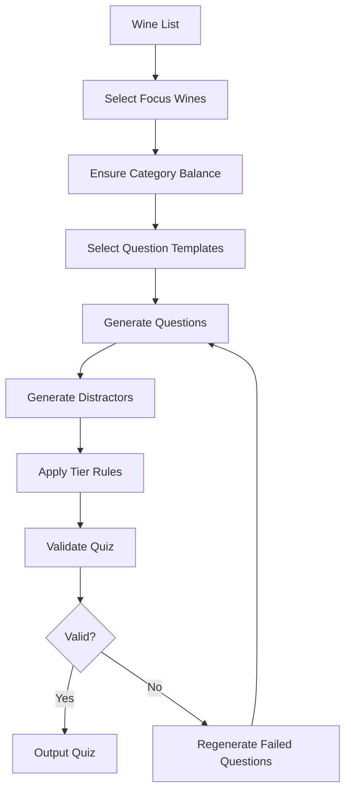

### 8.2 Bronze Quiz Generation

**Input:** 50 wines

**Process:**
1. Select 7-10 wines for quiz focus
2. Ensure category balance (proportional to list)
3. Generate 1-2 questions per wine
4. Use Bronze templates only
5. Set pass threshold: 70%

**Output Configuration:**

| Element | Specification |
|---------|---------------|
| Total questions | 10 |
| Question mix | 2 region, 2 grape, 2 pairing, 2 type, 2 service |
| Time limit | 15 minutes |
| Pass threshold | 70% (7/10) |
| Retakes allowed | Unlimited |

**Example Bronze Quiz:**

```
THE IVY RESTAURANT - BRONZE ASSESSMENT
Time: 15 minutes | Pass: 70% (7/10)

Q1. Which wine is from the Bordeaux region?
    A) Château Margaux 2015 ✓
    B) Barolo 2017
    C) Rioja Reserva 2018
    D) Marlborough Sauvignon Blanc 2022

Q2. Which grape variety is Chablis made from?
    A) Chardonnay ✓
    B) Sauvignon Blanc
    C) Riesling
    D) Chablis (trick - it's a region)

Q3. What temperature should Champagne be served?
    A) 6-8°C ✓
    B) 12-14°C
    C) 16-18°C
    D) Room temperature

[... 7 more questions ...]
```

### 8.3 Silver Quiz Generation

**Additional Parameters:**
- Include producer identification
- Include pairing reasoning
- Include regional detail
- Pass threshold: 80%

**Question Distribution:**

| Type | Count | Templates Used |
|------|-------|----------------|
| Producer identification | 2 | QT-ID-004 |
| Pairing reasoning | 2 | QT-PA-002 |
| Tasting notes | 2 | QT-TN-001, QT-TN-002 |
| Service detail | 2 | QT-SV-002, QT-SV-003 |
| Regional knowledge | 2 | QT-ID-001 (harder wines) |

### 8.4 Gold Quiz Generation

**Additional Parameters:**
- Include wine comparison
- Include vintage knowledge
- Include expert-level distractors
- Pass threshold: 90%

**Question Distribution:**

| Type | Count | Templates Used |
|------|-------|----------------|
| Wine comparison | 2 | QT-AD-001 |
| Vintage characteristics | 2 | QT-AD-002 |
| What NOT to pair | 2 | QT-PA-003 |
| Visual characteristics | 2 | QT-TN-003 |
| Price tier reasoning | 2 | QT-AD-003 |

---

## 9. Scenario Generation from Wine List

This section defines how scenarios integrate organisation-specific data.

### 9.1 Scenario Generation Flow

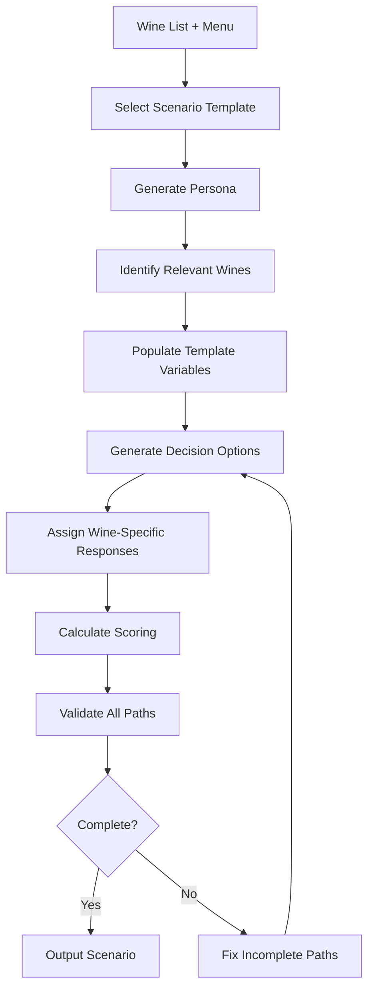

### 9.2 Wine Selection for Scenarios

```
Function: select_wines_for_scenario(template, wine_list)

IF template.type == "budget_constraint":
  RETURN wines WHERE price BETWEEN template.budget_min AND template.budget_max

IF template.type == "pairing_request":
  RETURN wines WHERE foodPairings CONTAINS template.food_item

IF template.type == "upsell":
  RETURN {
    starting_wine: wine WHERE priceTier == "premium",
    upsell_target: wine WHERE priceTier == "fine" OR "luxury"
  }

IF template.type == "difficult_guest":
  RETURN wines WHERE priceTier == "luxury" OR producer IS well_known
```

### 9.3 Example Scenario Generation

**Input:**
- Template: ST-BC-001 (Budget-Conscious Celebration)
- Wine List: The Ivy (50 wines)
- Budget Parameter: £30-50

**Wine Selection:**
```
Wines matching £30-50:
- Château Pichon Baron 2016 (£48)
- Cloudy Bay Sauvignon Blanc 2022 (£42)
- Châteauneuf-du-Pape 2019 (£45)
- Chablis Premier Cru 2021 (£38)
```

**Generated Scenario:**

```
SCENARIO: Anniversary Celebration at The Ivy
Tier: Bronze | Est. Time: 5 minutes

PERSONA:
Name: James & Sarah
Occasion: 5th Wedding Anniversary
Budget: £30-50
Knowledge: Low
Mood: Wants to impress but careful with money

OPENING:
"We're celebrating our anniversary tonight! We'd love something
special but we're trying to keep it around £40-50. What would
you recommend?"

STEP 1: Initial Response
─────────────────────────
Situation: Couple looks expectant, Sarah is glancing at the wine list.

CHOICES:
A) "Congratulations! We have some lovely options in that range.
    Are you thinking red or white?"
    → Points: 3 (acknowledges, asks preference)
    → Next: Step 2a

B) "Let me check what we have around that price..."
    → Points: 1 (functional but cold)
    → Next: Step 2b

C) "For a special occasion, you might want to consider
    spending a bit more..."
    → Points: 0 (ignores budget, pushy)
    → Next: Step 2c

STEP 2a: Preference Discovery
─────────────────────────────
Customer: "We both enjoy red wine, something smooth?"

CHOICES:
A) "Perfect! I'd recommend our Châteauneuf-du-Pape 2019 at £45.
    It's beautifully smooth with ripe fruit - perfect for a
    celebration. Alternatively, the Château Pichon Baron at £48
    is elegant and silky."
    → Points: 3 (two options, within budget, descriptive)
    → Next: Step 3 (Selection)

B) "The Châteauneuf-du-Pape is nice."
    → Points: 1 (correct wine, no description)
    → Next: Step 3

C) "Our smoothest red is the Château Margaux at £180..."
    → Points: 0 (ignores budget completely)
    → Next: Step 2c (price objection)

[... continues with full decision tree ...]

SUCCESS CRITERIA:
✓ Wine within £30-50 budget
✓ Appropriate for celebration
✓ Guest feels valued
✓ Clear recommendation with reasoning

SCORING:
- Excellent (90-100%): 9-10 points
- Good (70-89%): 7-8 points
- Needs Work (<70%): <7 points
```

---

## 10. Learning Path Generation

This section defines how learning paths are constructed from the curriculum.

### 10.1 Certification Requirements

| Certification | Required Modules | Required Quiz | Required Scenarios | Est. Time |
|---------------|------------------|---------------|-------------------|-----------|
| **Bronze** | Modules 1-4 | Bronze Quiz (70%) | 2 Bronze scenarios | 4-6 hours |
| **Silver** | Bronze + Modules 5-7 | Silver Quiz (80%) | 2 Silver scenarios | +4-5 hours |
| **Gold** | Silver + Modules 8-10 | Gold Quiz (90%) | 2 Gold scenarios | +4-5 hours |

### 10.2 Learning Path Structure

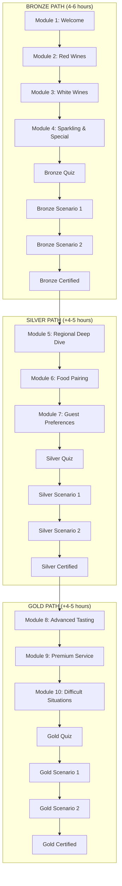

### 10.3 Path Progress Rules

| Rule | Description |
|------|-------------|
| Sequential modules | Must complete in order within tier |
| Quiz gate | Must pass quiz before scenarios |
| Scenario minimum | Must pass 2/3 scenarios with 70%+ |
| Tier prerequisite | Must complete lower tier first |
| Progress persistence | Progress saved, can resume |
| Retake policy | Unlimited retakes with 24hr cooldown |

### 10.4 Role-Based Path Variations

| Role | Path Variation | Focus Areas |
|------|----------------|-------------|
| **Server** | Standard path | All modules, practical focus |
| **Sommelier** | Extended path | + Deep regional knowledge |
| **Manager** | Abbreviated path | Bronze + team oversight modules |
| **Bartender** | Focused path | Emphasis on sparkling, by-glass |

---

## 11. Transformation Diagrams

### 11.1 Complete Transformation Overview

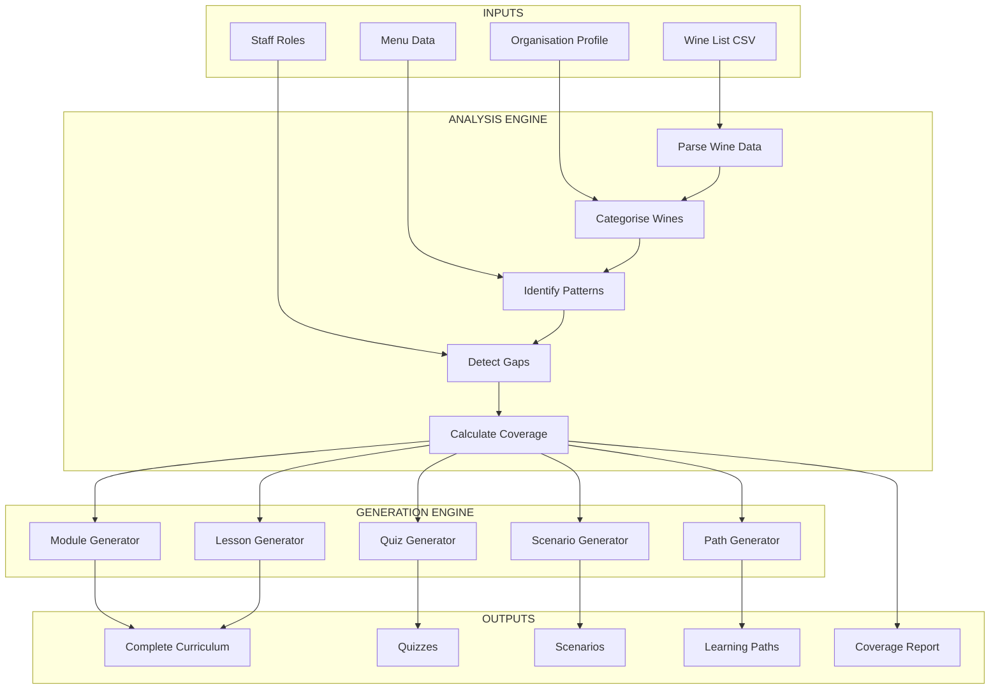

### 11.2 Wine Attributes to Questions Flow

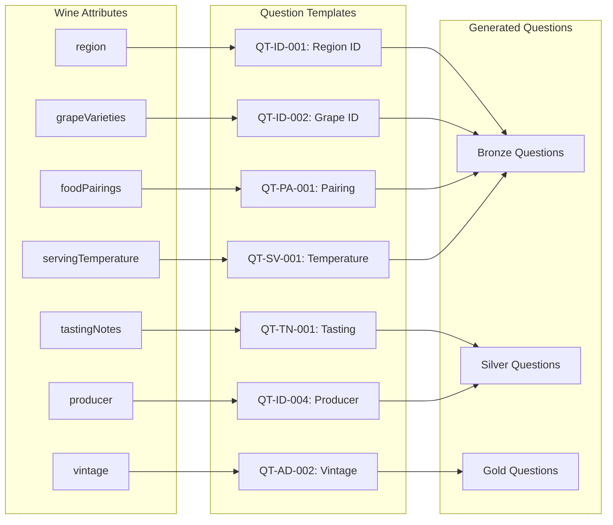

### 11.3 Wine List + Menu to Scenarios Flow

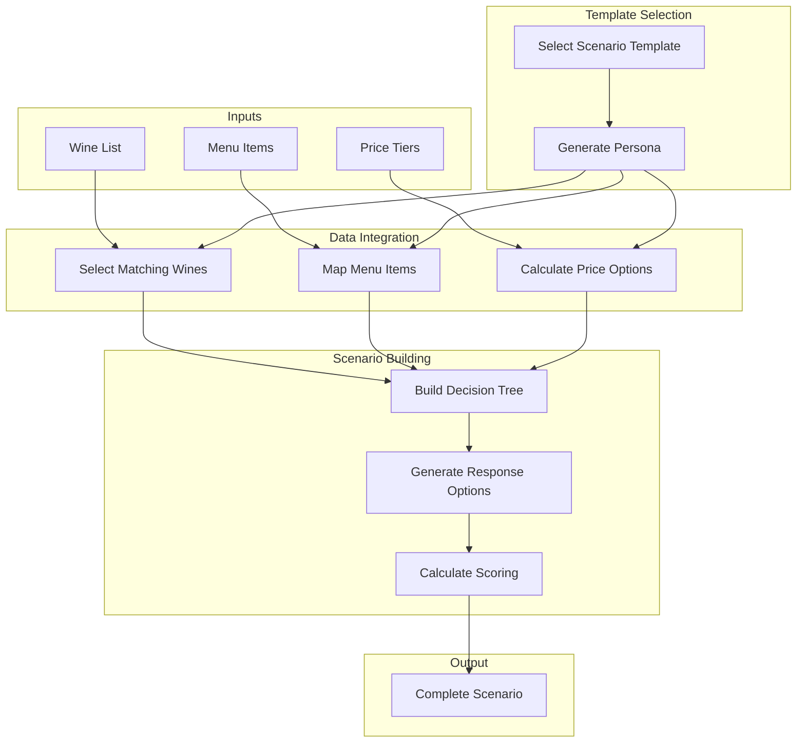

### 11.4 Progress Data to Adaptive Recommendations

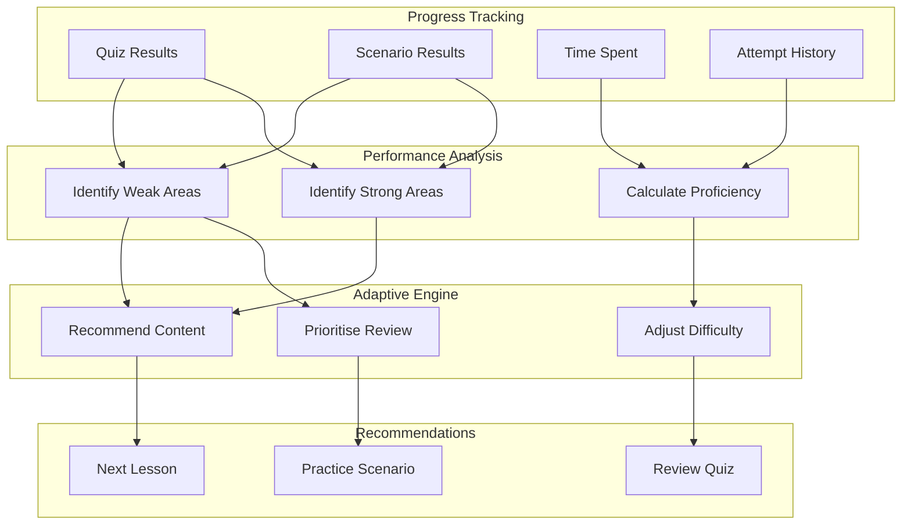

### 11.5 Curriculum Update Flow

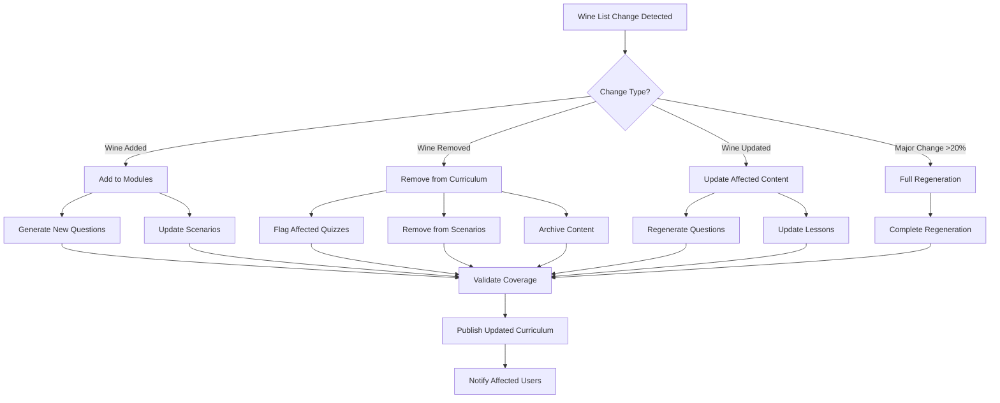

### 11.6 End-to-End Transformation Example

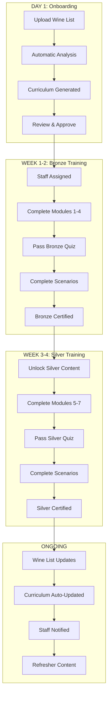

---

## 12. Refresh and Update Rules

This section defines how the curriculum responds to wine list changes.

### 12.1 Change Detection

| Change Type | Detection Method | Trigger |
|-------------|------------------|---------|
| Wine added | New wine ID in import | Automatic |
| Wine removed | Wine ID missing from import | Automatic |
| Wine updated | Attribute value changed | Automatic |
| Major restructure | >20% wines changed | Flagged for review |

### 12.2 Update Actions by Change Type

| Change Type | Curriculum Action | Quiz Action | Scenario Action |
|-------------|-------------------|-------------|-----------------|
| **Wine Added** | Add to relevant modules | Generate 2-3 new questions | Consider for scenarios |
| **Wine Removed** | Remove from lessons | Flag affected questions | Remove from scenarios |
| **Wine Updated** | Regenerate affected lessons | Regenerate affected questions | Update if used |
| **Region Added** | Create new regional content | Generate regional questions | N/A |
| **Price Changed** | Update price references | Update budget questions | Recalculate scenarios |
| **Major Change (>20%)** | Full regeneration recommended | Full quiz regeneration | Full scenario regeneration |

### 12.3 Update Process Flow

```
WINE LIST UPDATE PROCESS

1. DETECTION
   - System compares new import to current data
   - Identifies: additions, removals, modifications
   - Calculates change percentage

2. IMPACT ANALYSIS
   - Maps affected content:
     - Which modules reference changed wines?
     - Which questions use changed wines?
     - Which scenarios feature changed wines?
   - Assesses learner impact:
     - Users in progress
     - Recently certified users

3. UPDATE EXECUTION
   IF change_percentage < 5%:
     - Incremental update
     - Silent curriculum refresh
   ELIF change_percentage < 20%:
     - Standard update
     - Notify admins
     - Offer refresh training
   ELSE:
     - Major update flag
     - Admin approval required
     - Recommend recertification

4. VALIDATION
   - Run coverage checks
   - Validate question integrity
   - Test scenario completeness

5. NOTIFICATION
   - Admin: Change summary report
   - Learners: Optional update notification
   - In-progress: Minimal disruption
```

### 12.4 User Impact Handling

| User State | Update Impact | Action |
|------------|---------------|--------|
| Not started | No impact | Uses updated curriculum |
| In progress | Minimal impact | Completes current version, refresher offered |
| Certified | May need refresh | Notified of changes, optional refresher |
| Taking quiz | Protected | Completes current quiz version |

### 12.5 Version Management

| Element | Versioning Strategy |
|---------|---------------------|
| Curriculum | Major.Minor (1.0, 1.1, 2.0) |
| Modules | Module version linked to curriculum |
| Questions | Individual version, linked to wine version |
| Scenarios | Individual version, regenerated on major change |

---

## 13. Appendix

### 13.1 Mapping Summary Statistics

| Category | Count |
|----------|-------|
| Wine Attribute Mappings | 18 |
| Question Type Mappings | 10 |
| Module Topic Mappings | 24 |
| Coverage Requirements | 8 |
| Gap Handling Scenarios | 6 |
| Module Generation Rules | 12 |
| Quiz Generation Rules | 6 |
| Scenario Integration Rules | 8 |
| Learning Path Rules | 6 |
| Transformation Diagrams | 6 |
| Update/Refresh Rules | 8 |

### 13.2 Quick Reference: Attribute → Question

| Attribute | Bronze | Silver | Gold |
|-----------|--------|--------|------|
| region | ✓ | ✓ | ✓ |
| country | ✓ | — | — |
| grapeVarieties | ✓ | ✓ | — |
| wineType | ✓ | — | — |
| producer | — | ✓ | ✓ |
| vintage | — | ✓ | ✓ |
| tastingNotes | — | ✓ | ✓ |
| foodPairings | ✓ | ✓ | ✓ |
| servingTemperature | ✓ | — | — |

### 13.3 Quick Reference: Category → Modules

| Category | Min Wines | Bronze Module | Silver Module | Gold Module |
|----------|-----------|---------------|---------------|-------------|
| Red | 3 | "Your Red Wines" | "Regional Deep Dive" | "Premium Reds" |
| White | 3 | "Your White Wines" | "White Wine Mastery" | "Premium Whites" |
| Sparkling | 2 | "Sparkling Selection" | "Champagne & Beyond" | "Prestige Cuvées" |
| Rosé | 2 | Combined module | — | — |
| Dessert | 1 | Combined module | "Sweet Wine Styles" | — |
| Fortified | 1 | Combined module | "Port & Sherry" | — |

### 13.4 Related Documents

| Document | ID | Relevance |
|----------|----|-----------|
| Content Domain Model | SS-WS3.0-CDM | Wine attributes mapped |
| Learning Engine Requirements | SS-WS3.0-LE-REQ | Requirements implemented |
| Content Generation Rules | SS-WS3.0-LE-CGR | Templates referenced |

### 13.5 Revision History

| Version | Date | Author | Changes |
|---------|------|--------|---------|
| 1.0 | 2026-01-20 | Obi Wan | Initial draft |

---

*End of Content-to-Learning Mapping*

**CONFIDENTIAL - Patent-Pending Technology**
