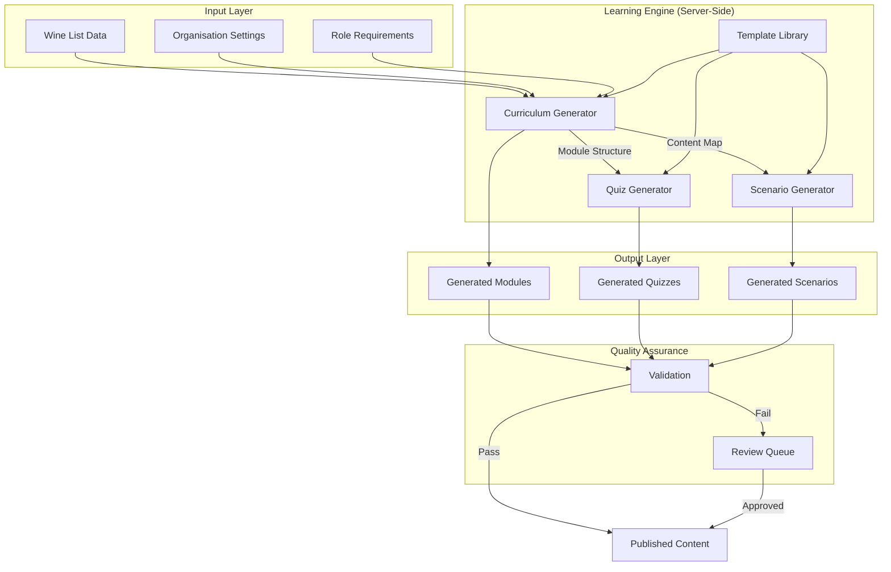
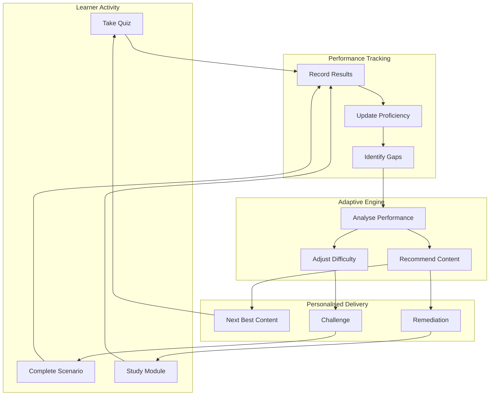

# Learning Engine Requirements

## Document Information

| Field | Value |
|-------|-------|
| **Document ID** | SS-WS3.0-LE-REQ |
| **Version** | 1.0 |
| **Date** | 2026-01-20 |
| **Author** | Obi Wan |
| **Status** | DRAFT |
| **Classification** | CONFIDENTIAL (IP-sensitive) |
| **Sprint** | WS3.0-S3 |
| **Task** | S3.1 |
| **Related Documents** | SS-WS3.0-CDM, SS-WS3.0-CLS, SS-WS3.0-ORG, SS-WS3.0-CMS-FR |

---

## CONFIDENTIALITY NOTICE

This document contains proprietary and confidential information relating to the Sommelier Spark Learning Content Engine, which is patent-pending technology. Distribution is restricted to authorised personnel only. Do not copy, distribute, or disclose without written permission.

---

## 1. Executive Summary

This document defines the comprehensive requirements for the Sommelier Spark Learning Content Engine — the patent-pending system that automatically generates personalised training content from organisation wine lists. This is the core intellectual property and key differentiator of the Sommelier Spark platform.

### 1.1 Key Capabilities

| Capability | Description |
|------------|-------------|
| **Curriculum Generation** | Auto-create learning modules from wine list data |
| **Quiz Generation** | Auto-generate questions with calibrated difficulty |
| **Scenario Generation** | Auto-build customer service simulations |
| **Adaptive Learning** | Personalise content based on learner performance |
| **Learning Paths** | Optimise content sequence for efficient mastery |

### 1.2 Business Value

| Benefit | Impact |
|---------|--------|
| Rapid Onboarding | Organisations training-ready in hours, not weeks |
| 100% Coverage | Every wine on the list covered in training |
| Personalisation | Training adapts to each learner's needs |
| Scalability | Supports unlimited wines and learners |
| Consistency | Standardised quality across all generated content |

### 1.3 Document Statistics

| Category | Requirement Count |
|----------|-------------------|
| Curriculum Generation | 18 |
| Quiz Generation | 19 |
| Scenario Generation | 17 |
| Adaptive Learning | 14 |
| Learning Paths | 12 |
| Quality Assurance | 13 |
| IP Protection | 10 |
| Performance | 9 |
| **Total** | **112** |

---

## 2. Curriculum Generation Requirements

The Curriculum Generation engine automatically creates structured learning modules from an organisation's wine list data.

### 2.1 Core Generation Requirements

| Req ID | Requirement | Priority | Notes |
|--------|-------------|----------|-------|
| LE-CG-001 | System shall generate learning modules from organisation wine list | Must | Core capability |
| LE-CG-002 | System shall sequence content from simple to complex within each topic | Must | Pedagogical best practice |
| LE-CG-003 | System shall ensure 100% coverage of all wines in curriculum | Must | No wine left behind |
| LE-CG-004 | System shall create role-based learning paths (server vs sommelier vs manager) | Should | Different depth per role |
| LE-CG-005 | System shall detect content gaps and recommend additions | Should | Proactive gap analysis |
| LE-CG-006 | System shall complete full curriculum generation in under 5 minutes | Must | Performance requirement |
| LE-CG-007 | System shall generate Bronze/Silver/Gold tiered content automatically | Must | Matches tier system |

### 2.2 Module Structure Requirements

| Req ID | Requirement | Priority | Notes |
|--------|-------------|----------|-------|
| LE-CG-008 | System shall group wines by logical categories (region, type, price tier) | Must | Logical organisation |
| LE-CG-009 | System shall generate module titles and descriptions automatically | Must | Human-readable titles |
| LE-CG-010 | System shall calculate estimated completion time per module | Must | Time estimates |
| LE-CG-011 | System shall create lesson content for each wine using progressive disclosure | Must | Level 1/2/3 content |
| LE-CG-012 | System shall generate learning objectives per module | Should | Clear outcomes |
| LE-CG-013 | System shall identify prerequisite relationships between modules | Should | Dependency mapping |

### 2.3 Content Enrichment Requirements

| Req ID | Requirement | Priority | Notes |
|--------|-------------|----------|-------|
| LE-CG-014 | System shall enrich wine data with regional context | Should | Educational context |
| LE-CG-015 | System shall generate grape variety overview modules | Should | Foundation knowledge |
| LE-CG-016 | System shall create service technique modules based on wine types | Should | Practical skills |
| LE-CG-017 | System shall detect and merge near-duplicate wines intelligently | Must | Data quality |
| LE-CG-018 | System shall support incremental curriculum updates when wine list changes | Must | Delta updates |

### 2.4 Curriculum Generation Summary

| Priority | Count |
|----------|-------|
| Must | 11 |
| Should | 7 |
| Could | 0 |
| **Total** | **18** |

---

## 3. Quiz Generation Requirements

The Quiz Generation engine automatically creates assessment questions from wine data with appropriate difficulty calibration.

### 3.1 Core Question Generation Requirements

| Req ID | Requirement | Priority | Notes |
|--------|-------------|----------|-------|
| LE-QG-001 | System shall generate questions from wine attributes | Must | Attribute-based questions |
| LE-QG-002 | System shall create plausible wrong answers (distractors) from same domain | Must | Quality distractors |
| LE-QG-003 | System shall calibrate question difficulty to tier (Bronze/Silver/Gold) | Must | Difficulty scaling |
| LE-QG-004 | System shall balance question coverage across all wines | Must | Fair distribution |
| LE-QG-005 | System shall maintain a question bank per organisation | Should | Reusable questions |
| LE-QG-006 | System shall achieve >95% question validity rate | Must | Quality threshold |
| LE-QG-007 | System shall generate questions in under 30 seconds per quiz | Must | Performance target |

### 3.2 Question Type Requirements

| Req ID | Requirement | Priority | Notes |
|--------|-------------|----------|-------|
| LE-QG-008 | System shall generate identification questions ("Which wine is from X?") | Must | Region/country/producer |
| LE-QG-009 | System shall generate pairing questions ("What pairs with this wine?") | Must | Food pairing knowledge |
| LE-QG-010 | System shall generate tasting note questions ("What characterises this wine?") | Must | Sensory knowledge |
| LE-QG-011 | System shall generate service questions ("What temperature for this wine?") | Must | Practical service |
| LE-QG-012 | System shall generate comparison questions ("How does A differ from B?") | Should | Higher-order thinking |
| LE-QG-013 | System shall generate true/false questions from wine facts | Must | Variety in format |
| LE-QG-014 | System shall generate matching questions (wine to region, grape to wine) | Should | Pattern recognition |

### 3.3 Question Quality Requirements

| Req ID | Requirement | Priority | Notes |
|--------|-------------|----------|-------|
| LE-QG-015 | System shall ensure distractors are from same category as correct answer | Must | Fair distractors |
| LE-QG-016 | System shall avoid ambiguous question wording | Must | Clear questions |
| LE-QG-017 | System shall generate explanations for each question | Should | Learning from mistakes |
| LE-QG-018 | System shall track question performance metrics (pass rate, discrimination) | Should | Item analysis |
| LE-QG-019 | System shall retire poorly-performing questions automatically | Could | Quality maintenance |

### 3.4 Quiz Generation Summary

| Priority | Count |
|----------|-------|
| Must | 12 |
| Should | 6 |
| Could | 1 |
| **Total** | **19** |

---

## 4. Scenario Generation Requirements

The Scenario Generation engine automatically creates interactive customer service simulations featuring wines from the organisation's list.

### 4.1 Core Scenario Generation Requirements

| Req ID | Requirement | Priority | Notes |
|--------|-------------|----------|-------|
| LE-SG-001 | System shall generate customer personas with realistic backgrounds | Must | Character depth |
| LE-SG-002 | System shall create situation templates for common service scenarios | Must | Reusable templates |
| LE-SG-003 | System shall build branching decision trees with meaningful choices | Must | Non-linear paths |
| LE-SG-004 | System shall integrate organisation's wine list and menu data | Must | Real product knowledge |
| LE-SG-005 | System shall scale difficulty by tier (Bronze/Silver/Gold) | Must | Progressive challenge |
| LE-SG-006 | System shall achieve >70% scenario completion rate target | Should | Engagement metric |
| LE-SG-007 | System shall generate scenarios in under 1 minute each | Must | Performance target |

### 4.2 Scenario Type Requirements

| Req ID | Requirement | Priority | Notes |
|--------|-------------|----------|-------|
| LE-SG-008 | System shall generate pairing request scenarios ("What wine with the fish?") | Must | Core skill |
| LE-SG-009 | System shall generate budget constraint scenarios ("Under £50") | Must | Price sensitivity |
| LE-SG-010 | System shall generate preference discovery scenarios ("I usually drink...") | Must | Needs assessment |
| LE-SG-011 | System shall generate objection handling scenarios ("Too expensive") | Should | Difficult customers |
| LE-SG-012 | System shall generate upsell opportunity scenarios | Should | Commercial skills |
| LE-SG-013 | System shall generate special occasion scenarios (anniversary, celebration) | Should | Occasion matching |
| LE-SG-014 | System shall generate dietary/allergy scenarios (vegan, sulphite-free) | Should | Accommodation skills |

### 4.3 Scenario Quality Requirements

| Req ID | Requirement | Priority | Notes |
|--------|-------------|----------|-------|
| LE-SG-015 | System shall ensure all scenario paths lead to valid conclusions | Must | No dead ends |
| LE-SG-016 | System shall generate realistic customer dialogue | Must | Natural conversation |
| LE-SG-017 | System shall provide constructive feedback for each choice | Must | Learning moments |

### 4.4 Scenario Generation Summary

| Priority | Count |
|----------|-------|
| Must | 11 |
| Should | 6 |
| Could | 0 |
| **Total** | **17** |

---

## 5. Adaptive Learning Requirements

The Adaptive Learning engine personalises the learning experience based on individual learner performance and preferences.

### 5.1 Performance Tracking Requirements

| Req ID | Requirement | Priority | Notes |
|--------|-------------|----------|-------|
| LE-AL-001 | System shall track individual learner performance across all content | Must | Foundation for adaptation |
| LE-AL-002 | System shall identify weak areas per learner (by topic, wine, skill) | Must | Gap identification |
| LE-AL-003 | System shall calculate learner proficiency scores by category | Must | Skill mapping |
| LE-AL-004 | System shall track time spent per content item | Should | Engagement data |
| LE-AL-005 | System shall record attempt history with timestamps | Must | Learning patterns |

### 5.2 Personalisation Requirements

| Req ID | Requirement | Priority | Notes |
|--------|-------------|----------|-------|
| LE-AL-006 | System shall recommend next content based on identified gaps | Should | Targeted learning |
| LE-AL-007 | System shall adjust difficulty dynamically based on performance | Could | Real-time adaptation |
| LE-AL-008 | System shall implement spaced repetition for long-term retention | Could | Memory science |
| LE-AL-009 | System shall detect mastery and advance learner automatically | Should | Progress acceleration |
| LE-AL-010 | System shall surface struggling content for additional practice | Should | Remediation |

### 5.3 Learning Analytics Requirements

| Req ID | Requirement | Priority | Notes |
|--------|-------------|----------|-------|
| LE-AL-011 | System shall generate individual learning reports | Should | Personal dashboards |
| LE-AL-012 | System shall predict time to certification based on progress | Could | Forecasting |
| LE-AL-013 | System shall identify at-risk learners (likely to fail/drop out) | Could | Intervention triggers |
| LE-AL-014 | System shall benchmark learner against peers (anonymised) | Could | Comparative context |

### 5.4 Adaptive Learning Summary

| Priority | Count |
|----------|-------|
| Must | 5 |
| Should | 5 |
| Could | 4 |
| **Total** | **14** |

---

## 6. Learning Path Requirements

The Learning Path engine generates optimal content sequences to guide learners from novice to certification.

### 6.1 Path Generation Requirements

| Req ID | Requirement | Priority | Notes |
|--------|-------------|----------|-------|
| LE-LP-001 | System shall generate optimal content sequence per certification tier | Must | Efficient paths |
| LE-LP-002 | System shall estimate total time to completion per path | Must | Planning data |
| LE-LP-003 | System shall define milestones within each learning path | Must | Progress markers |
| LE-LP-004 | System shall map paths to certification levels (Bronze → Silver → Gold) | Must | Clear progression |
| LE-LP-005 | System shall create role-specific paths (server, sommelier, manager) | Should | Role relevance |

### 6.2 Path Optimisation Requirements

| Req ID | Requirement | Priority | Notes |
|--------|-------------|----------|-------|
| LE-LP-006 | System shall balance theory and practical content in paths | Should | Engagement |
| LE-LP-007 | System shall incorporate prerequisite dependencies in sequencing | Must | Logical order |
| LE-LP-008 | System shall allow path customisation by organisation admin | Should | Flexibility |
| LE-LP-009 | System shall support deadline-driven path compression | Should | Time constraints |

### 6.3 Path Tracking Requirements

| Req ID | Requirement | Priority | Notes |
|--------|-------------|----------|-------|
| LE-LP-010 | System shall track learner position in path | Must | Progress visibility |
| LE-LP-011 | System shall visualise path progress graphically | Should | User experience |
| LE-LP-012 | System shall notify learners of upcoming milestones | Should | Motivation |

### 6.4 Learning Path Summary

| Priority | Count |
|----------|-------|
| Must | 6 |
| Should | 6 |
| Could | 0 |
| **Total** | **12** |

---

## 7. Quality Assurance Requirements

The Quality Assurance system ensures generated content meets educational standards and organisational requirements.

### 7.1 Template Validation Requirements

| Req ID | Requirement | Priority | Notes |
|--------|-------------|----------|-------|
| LE-QA-001 | System shall validate templates before use in generation | Must | Template integrity |
| LE-QA-002 | System shall verify template placeholders resolve to valid data | Must | Data completeness |
| LE-QA-003 | System shall test generated content against quality rules | Must | Automated QA |
| LE-QA-004 | System shall flag content that fails quality checks for review | Must | Human oversight |

### 7.2 Review and Approval Requirements

| Req ID | Requirement | Priority | Notes |
|--------|-------------|----------|-------|
| LE-QA-005 | System shall support expert review of generated content | Should | Domain validation |
| LE-QA-006 | System shall allow organisation admin to preview before publishing | Must | Org control |
| LE-QA-007 | System shall track review status of generated content | Should | Audit trail |
| LE-QA-008 | System shall support batch approval of generated content | Should | Efficiency |

### 7.3 Feedback and Improvement Requirements

| Req ID | Requirement | Priority | Notes |
|--------|-------------|----------|-------|
| LE-QA-009 | System shall collect learner feedback on content quality | Should | User input |
| LE-QA-010 | System shall calculate content quality scores from metrics | Should | Quality measurement |
| LE-QA-011 | System shall support A/B testing of generated content variants | Could | Optimisation |
| LE-QA-012 | System shall track and improve generation accuracy over time | Should | Continuous improvement |
| LE-QA-013 | System shall report on content quality metrics to administrators | Should | Visibility |

### 7.4 Quality Assurance Summary

| Priority | Count |
|----------|-------|
| Must | 5 |
| Should | 7 |
| Could | 1 |
| **Total** | **13** |

---

## 8. IP Protection Requirements

The IP Protection requirements ensure the proprietary Learning Engine algorithms and templates remain secure.

### 8.1 Algorithm Protection Requirements

| Req ID | Requirement | Priority | Notes |
|--------|-------------|----------|-------|
| LE-IP-001 | Generation algorithms shall execute server-side only | Must | No client exposure |
| LE-IP-002 | Client applications shall receive generated content only, not algorithms | Must | Output only |
| LE-IP-003 | API shall not expose generation logic or parameters | Must | API security |
| LE-IP-004 | Source code for generation engine shall be access-controlled | Must | Code security |
| LE-IP-005 | Generation engine shall be deployed in isolated secure environment | Must | Infrastructure security |

### 8.2 Data Protection Requirements

| Req ID | Requirement | Priority | Notes |
|--------|-------------|----------|-------|
| LE-IP-006 | Template library shall be encrypted at rest | Must | Data encryption |
| LE-IP-007 | Template library shall be encrypted in transit | Must | Transport security |
| LE-IP-008 | Audit logs shall track all generation activity with user attribution | Must | Accountability |
| LE-IP-009 | Generated content shall include watermark/attribution metadata | Should | Provenance |
| LE-IP-010 | System shall detect and block bulk content scraping attempts | Should | Anti-scraping |

### 8.3 IP Protection Summary

| Priority | Count |
|----------|-------|
| Must | 8 |
| Should | 2 |
| Could | 0 |
| **Total** | **10** |

---

## 9. Performance Requirements

Performance requirements ensure the Learning Engine operates within acceptable time and quality bounds.

### 9.1 Generation Performance Requirements

| Req ID | Requirement | Priority | Target | Notes |
|--------|-------------|----------|--------|-------|
| LE-PF-001 | Full curriculum generation shall complete within time limit | Must | < 5 minutes | For typical wine list (50-200 wines) |
| LE-PF-002 | Single quiz generation shall complete within time limit | Must | < 30 seconds | 10-20 questions |
| LE-PF-003 | Single scenario generation shall complete within time limit | Must | < 1 minute | Including branching |
| LE-PF-004 | Incremental curriculum update shall complete within time limit | Must | < 1 minute | Delta processing |

### 9.2 Quality Performance Requirements

| Req ID | Requirement | Priority | Target | Notes |
|--------|-------------|----------|--------|-------|
| LE-PF-005 | Question validity rate shall meet threshold | Must | > 95% | Questions without errors |
| LE-PF-006 | Scenario completion rate shall meet threshold | Should | > 70% | Learners who finish |
| LE-PF-007 | Learner satisfaction rating shall meet threshold | Should | > 80% positive | Post-completion survey |
| LE-PF-008 | Content coverage shall be complete | Must | 100% | All wines in curriculum |

### 9.3 Scalability Requirements

| Req ID | Requirement | Priority | Target | Notes |
|--------|-------------|----------|--------|-------|
| LE-PF-009 | System shall support concurrent generation requests | Must | 10+ simultaneous | Multi-tenant |

### 9.4 Performance Summary

| Priority | Count |
|----------|-------|
| Must | 6 |
| Should | 3 |
| Could | 0 |
| **Total** | **9** |

---

## 10. Technical Architecture Overview

### 10.1 Generation Pipeline

### 10.2 Adaptive Learning Loop

---

## 11. Data Model Extensions

### 11.1 Generation Tracking Entities

| Entity | Purpose | Key Attributes |
|--------|---------|----------------|
| `GenerationJob` | Tracks generation requests | id, type, status, organisationId, startedAt, completedAt |
| `GeneratedContent` | Links generated content to source | id, jobId, contentType, contentId, templateId, sourceWineIds |
| `LearnerProfile` | Stores adaptive learning data | id, userId, proficiencyScores, weakAreas, learningStyle |
| `ContentPerformance` | Tracks content effectiveness | id, contentId, attempts, passRate, avgScore, feedback |

### 11.2 Generation Job States

| State | Description |
|-------|-------------|
| `PENDING` | Job queued, awaiting processing |
| `PROCESSING` | Generation in progress |
| `VALIDATING` | Quality checks running |
| `AWAITING_REVIEW` | Requires human review |
| `COMPLETED` | Successfully generated |
| `FAILED` | Generation failed |

---

## 12. Requirements Summary

### 12.1 Requirements by Category

| Category | Code Prefix | Count |
|----------|-------------|-------|
| Curriculum Generation | LE-CG | 18 |
| Quiz Generation | LE-QG | 19 |
| Scenario Generation | LE-SG | 17 |
| Adaptive Learning | LE-AL | 14 |
| Learning Paths | LE-LP | 12 |
| Quality Assurance | LE-QA | 13 |
| IP Protection | LE-IP | 10 |
| Performance | LE-PF | 9 |
| **Total** | | **112** |

### 12.2 Requirements by Priority

| Priority | Count | Percentage |
|----------|-------|------------|
| Must | 64 | 57% |
| Should | 42 | 38% |
| Could | 6 | 5% |
| **Total** | **112** | **100%** |

### 12.3 Must-Have Requirements by Category

| Category | Must Count |
|----------|------------|
| Curriculum Generation | 11 |
| Quiz Generation | 12 |
| Scenario Generation | 11 |
| Adaptive Learning | 5 |
| Learning Paths | 6 |
| Quality Assurance | 5 |
| IP Protection | 8 |
| Performance | 6 |
| **Total Must** | **64** |

---

## 13. Success Metrics

### 13.1 Generation Quality Metrics

| Metric | Target | Measurement |
|--------|--------|-------------|
| Question Validity Rate | > 95% | Questions passing automated QA |
| Scenario Completion Rate | > 70% | Learners who finish scenarios |
| Content Coverage | 100% | All wines appear in curriculum |
| Generation Success Rate | > 99% | Jobs completing without failure |

### 13.2 Learner Outcome Metrics

| Metric | Target | Measurement |
|--------|--------|-------------|
| Learner Satisfaction | > 80% positive | Post-completion survey |
| Knowledge Retention | > 75% at 30 days | Follow-up assessment |
| Certification Pass Rate | > 85% first attempt | Bronze tier benchmark |
| Time to Certification | < baseline | Compared to manual curriculum |

### 13.3 Business Metrics

| Metric | Target | Measurement |
|--------|--------|-------------|
| Onboarding Time | < 24 hours | Wine list to training ready |
| Content Freshness | < 1 day lag | Time to reflect wine list changes |
| Admin Time Saved | > 80% | vs manual curriculum creation |

---

## 14. Appendix

### 14.1 Glossary

| Term | Definition |
|------|------------|
| Learning Engine | The automated system that generates training content |
| Curriculum | Complete set of learning modules for an organisation |
| Distractor | Plausible but incorrect answer option in a question |
| Adaptive Learning | Personalising content based on learner performance |
| Spaced Repetition | Technique for optimising long-term memory retention |
| Learning Path | Sequenced content designed to achieve certification |
| Template | Reusable pattern for generating content |
| Proficiency Score | Measure of learner knowledge in a specific area |

### 14.2 Question Type Matrix

| Question Type | Attributes Used | Difficulty | Tier |
|---------------|-----------------|------------|------|
| Region Identification | region, country | Easy | Bronze |
| Grape Variety | grapeVarieties | Easy | Bronze |
| Wine Type | wineType | Easy | Bronze |
| Food Pairing | foodPairings | Medium | Bronze/Silver |
| Service Temperature | servingTemperature | Medium | Silver |
| Tasting Notes | tastingNotes, appearance, nose, palate | Medium | Silver |
| Producer Recognition | producer | Medium | Silver |
| Price Tier | priceTier | Medium | Silver |
| Terroir Analysis | region, terroir | Hard | Gold |
| Blind Tasting | All sensory | Hard | Gold |
| Wine Comparison | Multiple wines | Hard | Gold |

### 14.3 Scenario Template Categories

| Category | Customer Type | Complexity | Tier |
|----------|---------------|------------|------|
| Simple Pairing | Casual diner | Low | Bronze |
| Budget Request | Price-conscious | Low | Bronze |
| Preference Discovery | Regular guest | Medium | Silver |
| Special Occasion | Celebrant | Medium | Silver |
| Dietary Needs | Restricted diet | Medium | Silver |
| Difficult Customer | Complainer | High | Gold |
| VIP Service | High-value guest | High | Gold |
| Sommelier Challenge | Knowledgeable guest | High | Gold |

### 14.4 Related Documents

| Document | ID | Relevance |
|----------|----|-----------|
| Content Domain Model | SS-WS3.0-CDM | Entity definitions for generated content |
| Content Lifecycle Specification | SS-WS3.0-CLS | State management for generated content |
| Organization Model | SS-WS3.0-ORG | Multi-tenant requirements |
| CMS Functional Requirements | SS-WS3.0-CMS-FR | Integration with CMS |

### 14.5 Revision History

| Version | Date | Author | Changes |
|---------|------|--------|---------|
| 1.0 | 2026-01-20 | Obi Wan | Initial draft |

---

*End of Learning Engine Requirements*

**CONFIDENTIAL - Patent-Pending Technology**
