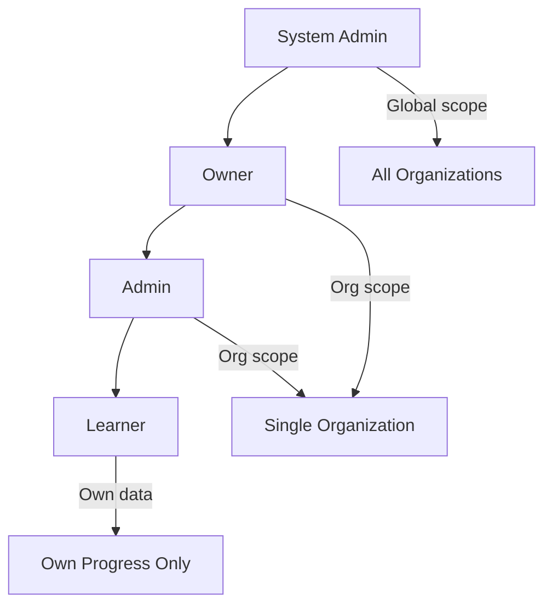
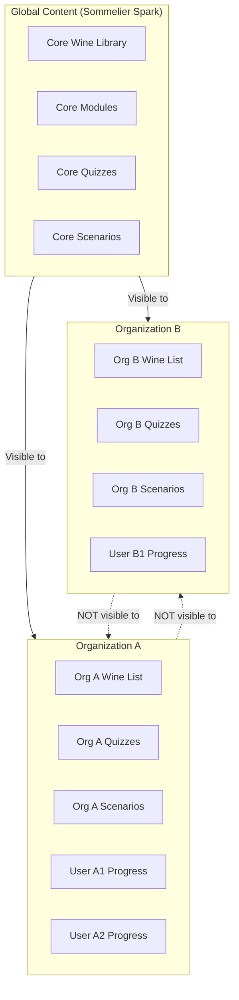
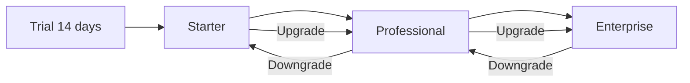
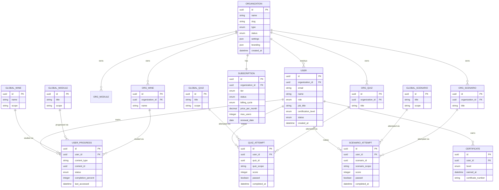
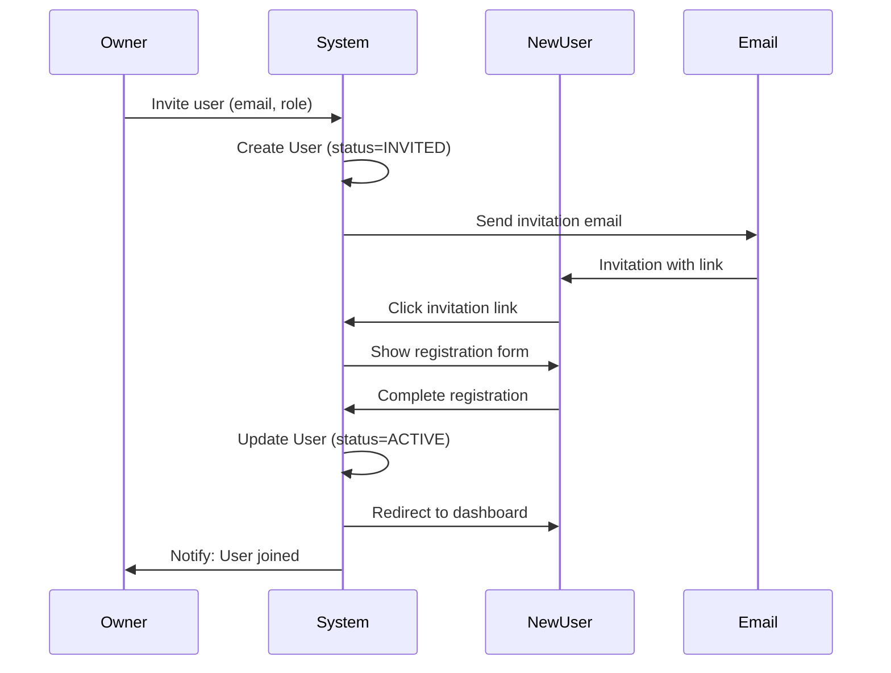
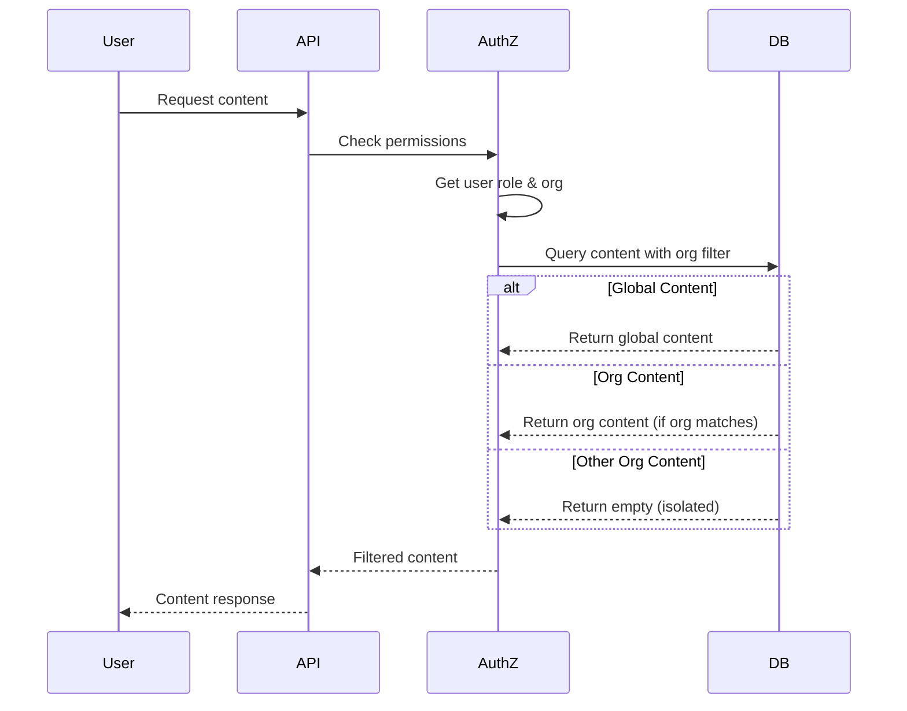

# Organization Model

## Document Information

| Field | Value |
|-------|-------|
| **Document ID** | SS-WS3.0-ORG |
| **Version** | 1.0 |
| **Date** | 2026-01-20 |
| **Author** | Obi Wan |
| **Status** | DRAFT |
| **Sprint** | WS3.0-S1 |
| **Task** | S1.3 |
| **Related Documents** | SS-WS3.0-CDM (Content Domain Model), SS-WS3.0-CLS (Content Lifecycle Specification) |

---

## 1. Executive Summary

This document defines the multi-tenant organization model for Sommelier Spark. It establishes how organizations, users, and content relate to each other in a secure, isolated manner while enabling shared global content.

**Key Statistics:**
- **3 Core Entities**: Organization, User, Subscription
- **4 User Roles**: Learner, Admin, Owner, System Admin
- **3 Subscription Tiers**: Starter, Professional, Enterprise
- **2 Content Ownership Types**: Global and Organization-specific

---

## 2. Core Entities

### 2.1 Organization Entity

The Organization entity represents a business customer (venue, hotel group, retail chain) that subscribes to Sommelier Spark.

#### 2.1.1 Attributes

| Attribute | Type | Required | Description |
|-----------|------|----------|-------------|
| `id` | UUID | Yes | Unique identifier |
| `name` | String | Yes | Organization display name (e.g., "The Ivy Collection") |
| `slug` | String | Yes | URL-friendly identifier (e.g., "the-ivy-collection") |
| `type` | Enum | Yes | Business type classification |
| `subscriptionTier` | Enum | Yes | Current subscription level |
| `subscriptionStatus` | Enum | Yes | Subscription payment status |
| `status` | Enum | Yes | Organization account status |
| `settings` | JSON | Yes | Configuration options |
| `branding` | JSON | No | Custom branding configuration |
| `billingEmail` | String | Yes | Email for invoices |
| `billingAddress` | JSON | No | Billing address |
| `createdAt` | DateTime | Yes | When organization was created |
| `updatedAt` | DateTime | Yes | Last modification |
| `trialEndsAt` | DateTime | No | Trial expiration date (if applicable) |
| `suspendedAt` | DateTime | No | When suspended (if applicable) |
| `cancelledAt` | DateTime | No | When cancelled (if applicable) |

#### 2.1.2 Organization Types

| Type | Code | Description | Typical Size |
|------|------|-------------|--------------|
| Restaurant | `RESTAURANT` | Single or multi-location restaurants | 5-50 staff |
| Hotel | `HOTEL` | Hotels with F&B operations | 10-200 staff |
| Wine Bar | `WINE_BAR` | Dedicated wine-focused venues | 3-20 staff |
| Wine Retail | `WINE_RETAIL` | Wine shops and merchants | 5-30 staff |
| Hospitality Group | `HOSPITALITY_GROUP` | Multi-venue operators | 50-500 staff |
| Education | `EDUCATION` | Wine schools and training providers | 10-100 students |
| Other | `OTHER` | Other wine-related businesses | Varies |

#### 2.1.3 Organization Status

| Status | Code | Description | User Access |
|--------|------|-------------|-------------|
| Active | `ACTIVE` | Fully operational | Full access |
| Trial | `TRIAL` | In trial period | Full access |
| Suspended | `SUSPENDED` | Payment overdue or policy violation | Read-only access |
| Cancelled | `CANCELLED` | Subscription cancelled | No access (data retained 90 days) |

---

### 2.2 User Entity

The User entity represents an individual person who uses the Sommelier Spark platform.

#### 2.2.1 Attributes

| Attribute | Type | Required | Description |
|-----------|------|----------|-------------|
| `id` | UUID | Yes | Unique identifier |
| `email` | String | Yes | Login email (unique) |
| `passwordHash` | String | Yes | Hashed password |
| `name` | String | Yes | Display name |
| `firstName` | String | No | First name |
| `lastName` | String | No | Last name |
| `role` | Enum | Yes | User role within organization |
| `organizationId` | UUID | Yes | Organization membership |
| `jobTitle` | String | No | Role at the venue (e.g., "Sommelier", "Server") |
| `department` | String | No | Department (e.g., "Restaurant", "Bar") |
| `hireDate` | Date | No | Employment start date |
| `certificationLevel` | Enum | No | Current achieved certification |
| `avatarUrl` | String | No | Profile picture URL |
| `preferences` | JSON | No | User preferences |
| `status` | Enum | Yes | Account status |
| `lastLoginAt` | DateTime | No | Last login timestamp |
| `createdAt` | DateTime | Yes | When account created |
| `updatedAt` | DateTime | Yes | Last modification |
| `invitedAt` | DateTime | No | When invitation sent |
| `invitedBy` | UUID | No | Who sent invitation |
| `activatedAt` | DateTime | No | When user accepted invitation |

#### 2.2.2 User Status

| Status | Code | Description | Can Login |
|--------|------|-------------|-----------|
| Active | `ACTIVE` | Fully operational account | Yes |
| Invited | `INVITED` | Invitation sent, not yet accepted | No |
| Disabled | `DISABLED` | Account disabled by admin | No |
| Locked | `LOCKED` | Temporarily locked (failed logins) | No |

#### 2.2.3 Certification Levels

| Level | Code | Description |
|-------|------|-------------|
| None | `NONE` | No certification achieved |
| Bronze | `BRONZE` | Bronze level passed |
| Silver | `SILVER` | Silver level passed |
| Gold | `GOLD` | Gold level passed |

---

### 2.3 Subscription Entity

The Subscription entity tracks the commercial relationship between an organization and Sommelier Spark.

#### 2.3.1 Attributes

| Attribute | Type | Required | Description |
|-----------|------|----------|-------------|
| `id` | UUID | Yes | Unique identifier |
| `organizationId` | UUID | Yes | Associated organization |
| `tier` | Enum | Yes | Subscription tier |
| `status` | Enum | Yes | Payment/subscription status |
| `billingCycle` | Enum | Yes | Monthly or Annual |
| `pricePerMonth` | Decimal | Yes | Monthly price in GBP |
| `maxUsers` | Integer | Yes | Maximum allowed users |
| `currentUsers` | Integer | Yes | Current user count |
| `features` | JSON | Yes | Enabled features for this subscription |
| `startDate` | Date | Yes | Subscription start |
| `renewalDate` | Date | Yes | Next renewal date |
| `trialEndsAt` | DateTime | No | Trial end date |
| `cancelledAt` | DateTime | No | Cancellation date |
| `paymentMethod` | JSON | No | Stored payment method reference |
| `stripeCustomerId` | String | No | Stripe customer ID |
| `stripeSubscriptionId` | String | No | Stripe subscription ID |

#### 2.3.2 Subscription Status

| Status | Code | Description |
|--------|------|-------------|
| Active | `ACTIVE` | Paid and current |
| Trialing | `TRIALING` | In free trial |
| Past Due | `PAST_DUE` | Payment failed, grace period |
| Cancelled | `CANCELLED` | Cancelled, access until period end |
| Expired | `EXPIRED` | Access revoked |

---

## 3. User Roles and Permissions

### 3.1 Role Definitions

| Role | Code | Scope | Description |
|------|------|-------|-------------|
| Learner | `LEARNER` | Own data | Standard user who consumes content and tracks progress |
| Admin | `ADMIN` | Organization | Manages users and views organization reports |
| Owner | `OWNER` | Organization | Full control including billing and settings |
| System Admin | `SYSTEM_ADMIN` | Global | Sommelier Spark internal staff only |

### 3.2 Permission Matrix

| Permission | Learner | Admin | Owner | System Admin |
|------------|---------|-------|-------|--------------|
| **Content Access** |
| View global content | ✓ | ✓ | ✓ | ✓ |
| View org content | ✓ | ✓ | ✓ | ✓ |
| Create org content | — | ✓ | ✓ | ✓ |
| Edit org content | — | ✓ | ✓ | ✓ |
| Delete org content | — | ✓ | ✓ | ✓ |
| **Learning** |
| Take quizzes | ✓ | ✓ | ✓ | ✓ |
| Play scenarios | ✓ | ✓ | ✓ | ✓ |
| View own progress | ✓ | ✓ | ✓ | ✓ |
| Earn certifications | ✓ | ✓ | ✓ | ✓ |
| **User Management** |
| View own profile | ✓ | ✓ | ✓ | ✓ |
| Edit own profile | ✓ | ✓ | ✓ | ✓ |
| View org users | — | ✓ | ✓ | ✓ |
| Invite users | — | ✓ | ✓ | ✓ |
| Edit org users | — | ✓ | ✓ | ✓ |
| Disable users | — | ✓ | ✓ | ✓ |
| Delete users | — | — | ✓ | ✓ |
| Change user roles | — | — | ✓ | ✓ |
| **Reporting** |
| View own reports | ✓ | ✓ | ✓ | ✓ |
| View team reports | — | ✓ | ✓ | ✓ |
| View org reports | — | ✓ | ✓ | ✓ |
| Export reports | — | ✓ | ✓ | ✓ |
| **Organization** |
| View org settings | — | ✓ | ✓ | ✓ |
| Edit org settings | — | — | ✓ | ✓ |
| Edit branding | — | — | ✓ | ✓ |
| **Billing** |
| View billing | — | — | ✓ | ✓ |
| Manage subscription | — | — | ✓ | ✓ |
| Update payment method | — | — | ✓ | ✓ |
| View invoices | — | — | ✓ | ✓ |
| **Administrative** |
| Delete organization | — | — | ✓ | ✓ |
| Access all orgs | — | — | — | ✓ |
| Manage global content | — | — | — | ✓ |
| View system logs | — | — | — | ✓ |

### 3.3 Role Hierarchy



---

## 4. Content Ownership Model

### 4.1 Ownership Types

| Ownership | Code | Description | Managed By |
|-----------|------|-------------|------------|
| Global | `GLOBAL` | Shared across all organizations | Sommelier Spark |
| Organization | `ORGANIZATION` | Specific to one organization | Organization Admins |

### 4.2 Content Ownership by Type

| Content Type | Ownership | Who Can See | Who Can Edit |
|--------------|-----------|-------------|--------------|
| Core Wine Library | Global | All organizations | System Admin |
| Core Modules | Global | All organizations | System Admin |
| Core Lessons | Global | All organizations | System Admin |
| Core Quizzes | Global | All organizations | System Admin |
| Core Scenarios | Global | All organizations | System Admin |
| Org Wine List | Organization | Only that org | Org Admin, Owner |
| Org Custom Modules | Organization | Only that org | Org Admin, Owner |
| Org Custom Quizzes | Organization | Only that org | Org Admin, Owner |
| Org Custom Scenarios | Organization | Only that org | Org Admin, Owner |
| User Progress | User | User + Org Admins | System (automatic) |
| User Certificates | User | User + Org Admins | System (automatic) |

### 4.3 Content Visibility Rules



### 4.4 Content Inheritance

Organizations can extend global content:

| Extension Type | Description | Example |
|----------------|-------------|---------|
| Supplement | Add org wines to global library | Org adds their house wines |
| Customize | Create org-specific quiz from template | Modify global quiz questions |
| Override | Replace global content with org version | Custom training module |

---

## 5. Tenant Isolation

### 5.1 Isolation Principles

| Principle | Implementation |
|-----------|----------------|
| **Data Isolation** | Organization A cannot access Organization B's data |
| **User Isolation** | Users belong to exactly one organization |
| **Content Isolation** | Org-specific content invisible to other orgs |
| **Progress Isolation** | User progress is private to user and their org admins |
| **Billing Isolation** | Each organization has separate billing |

### 5.2 Database Isolation Strategy

All organization-specific data includes an `organizationId` foreign key:

```sql
-- Every org-scoped table includes:
organization_id UUID NOT NULL REFERENCES organizations(id)

-- Row-level security policy example:
CREATE POLICY org_isolation ON org_wines
    USING (organization_id = current_setting('app.current_org_id')::uuid);
```

### 5.3 Isolation Enforcement Points

| Layer | Enforcement Method |
|-------|-------------------|
| Database | Row-level security policies |
| API | Middleware validates org context |
| Application | Service layer org filtering |
| UI | Components scoped to current org |

### 5.4 Cross-Tenant Data Sharing

| Data Type | Shareable? | Method |
|-----------|------------|--------|
| Global content | Yes | No org filter applied |
| Org content | No | Strict org isolation |
| User data | No | Strict user + org isolation |
| Aggregated analytics | Yes (anonymized) | System Admin only |
| Benchmarks | Yes (anonymized) | Feature-flagged per tier |

---

## 6. Organization Settings

### 6.1 Settings Schema

```json
{
  "branding": {
    "logoUrl": "https://...",
    "primaryColor": "#1a365d",
    "secondaryColor": "#e2e8f0",
    "faviconUrl": "https://...",
    "customCss": null
  },
  "features": {
    "scenariosEnabled": true,
    "customContentEnabled": true,
    "apiAccessEnabled": false,
    "ssoEnabled": false,
    "benchmarksEnabled": false
  },
  "training": {
    "requiredLevel": "BRONZE",
    "deadlineDays": 30,
    "autoEnrollNewUsers": true,
    "mandatoryModules": ["wine-fundamentals", "food-pairing"]
  },
  "notifications": {
    "emailEnabled": true,
    "weeklyDigest": true,
    "progressReminders": true,
    "deadlineWarnings": true,
    "achievementAlerts": true
  },
  "security": {
    "passwordMinLength": 8,
    "requireMfa": false,
    "sessionTimeoutMinutes": 480,
    "maxFailedLogins": 5
  },
  "locale": {
    "timezone": "Europe/London",
    "dateFormat": "DD/MM/YYYY",
    "language": "en-GB"
  }
}
```

### 6.2 Settings by Subscription Tier

| Setting | Starter | Professional | Enterprise |
|---------|---------|--------------|------------|
| Custom logo | ✓ | ✓ | ✓ |
| Custom colours | ✓ | ✓ | ✓ |
| Custom CSS | — | — | ✓ |
| Scenarios | ✓ | ✓ | ✓ |
| Custom content | — | ✓ | ✓ |
| API access | — | — | ✓ |
| SSO/SAML | — | — | ✓ |
| Training deadlines | ✓ | ✓ | ✓ |
| Mandatory modules | — | ✓ | ✓ |
| Industry benchmarks | — | ✓ | ✓ |
| Advanced analytics | — | ✓ | ✓ |
| Dedicated support | — | — | ✓ |

---

## 7. Subscription Tiers

### 7.1 Tier Comparison

| Feature | Starter | Professional | Enterprise |
|---------|---------|--------------|------------|
| **Pricing** |
| Monthly price | £149 | £449 | Custom |
| Annual price | £1,490 (17% off) | £4,490 (17% off) | Custom |
| **Users** |
| Maximum users | 15 | 50 | Unlimited |
| Admin accounts | 2 | 5 | Unlimited |
| **Content** |
| Core wine library | ✓ | ✓ | ✓ |
| Core modules & quizzes | ✓ | ✓ | ✓ |
| Core scenarios | ✓ | ✓ | ✓ |
| Custom wine list | — | ✓ | ✓ |
| Custom quizzes | — | ✓ | ✓ |
| Custom scenarios | — | ✓ | ✓ |
| Content API | — | — | ✓ |
| **Reporting** |
| Individual progress | ✓ | ✓ | ✓ |
| Team dashboard | ✓ | ✓ | ✓ |
| Export to CSV | ✓ | ✓ | ✓ |
| Advanced analytics | — | ✓ | ✓ |
| Industry benchmarks | — | ✓ | ✓ |
| Custom reports | — | — | ✓ |
| **Features** |
| Training deadlines | ✓ | ✓ | ✓ |
| Mandatory modules | — | ✓ | ✓ |
| Certification tracking | ✓ | ✓ | ✓ |
| Leaderboards | ✓ | ✓ | ✓ |
| **Integration** |
| SSO/SAML | — | — | ✓ |
| HRIS integration | — | — | ✓ |
| LMS integration (SCORM) | — | — | ✓ |
| Webhooks | — | — | ✓ |
| **Support** |
| Email support | ✓ | ✓ | ✓ |
| Priority support | — | ✓ | ✓ |
| Dedicated CSM | — | — | ✓ |
| Onboarding assistance | — | ✓ | ✓ |
| **Branding** |
| Logo & colours | ✓ | ✓ | ✓ |
| Custom domain | — | — | ✓ |
| White-label option | — | — | ✓ |

### 7.2 Tier Upgrade Path



### 7.3 Overage Handling

| Situation | Starter | Professional | Enterprise |
|-----------|---------|--------------|------------|
| Exceed user limit | Blocked, must upgrade | Blocked, must upgrade | Unlimited |
| Exceed storage | N/A | N/A | Contact CSM |
| Exceed API calls | N/A | N/A | Soft limit, overage charges |

---

## 8. Entity Relationship Diagram



---

## 9. Data Flow Diagrams

### 9.1 User Onboarding Flow



### 9.2 Content Access Flow



---

## 10. Security Considerations

### 10.1 Authentication

| Method | Support | Notes |
|--------|---------|-------|
| Email/Password | All tiers | Default method |
| Magic Link | All tiers | Optional passwordless |
| SSO/SAML | Enterprise | Okta, Azure AD, Google Workspace |
| MFA/2FA | Optional | TOTP-based |

### 10.2 Authorization Rules

```
Rule 1: Users can only access their organization's data
Rule 2: Users can only access content matching their subscription tier
Rule 3: Learners can only view/modify their own progress
Rule 4: Admins can view all users in their organization
Rule 5: Owners can modify organization settings and billing
Rule 6: System Admins bypass organization isolation
```

### 10.3 Data Protection

| Data Type | Protection | Retention |
|-----------|------------|-----------|
| Passwords | bcrypt hash (cost 12) | Never stored plaintext |
| PII (email, name) | Encrypted at rest | Until account deletion |
| Progress data | Encrypted at rest | 2 years after last activity |
| Payment data | Handled by Stripe | Not stored locally |
| Session tokens | JWT, 8hr expiry | Redis, auto-expire |

---

## 11. Appendix

### 11.1 Entity Summary

| Entity | Key Attributes | Relationships |
|--------|----------------|---------------|
| Organization | id, name, slug, type, tier, status | → Users, Content, Subscription |
| User | id, email, name, role, org_id, status | → Organization, Progress |
| Subscription | id, tier, status, max_users, price | → Organization |

### 11.2 Role Summary

| Role | Count in System | Scope | Key Permissions |
|------|-----------------|-------|-----------------|
| Learner | Many | Own data | Learn, track progress |
| Admin | Few per org | Organization | Manage users, reports |
| Owner | 1-2 per org | Organization | Billing, settings |
| System Admin | Internal only | Global | Full platform access |

### 11.3 Subscription Tier Summary

| Tier | Max Users | Monthly Price | Key Features |
|------|-----------|---------------|--------------|
| Starter | 15 | £149 | Core content, basic reports |
| Professional | 50 | £449 | + Custom content, advanced analytics |
| Enterprise | Unlimited | Custom | + API, SSO, dedicated support |

### 11.4 Revision History

| Version | Date | Author | Changes |
|---------|------|--------|---------|
| 1.0 | 2026-01-20 | Obi Wan | Initial draft |

---

*End of Document*
