# Data Model — Sommelier Spark

## Document Information

| Field | Value |
|-------|-------|
| **Document ID** | SS-WS3-DATA |
| **Version** | 1.0 |
| **Date** | 2026-01-21 |
| **Author** | Obi Wan |
| **Status** | DRAFT |
| **Classification** | CONFIDENTIAL |
| **Related Documents** | SS-WS3.0-CDM, SS-WS3.0-ORG, SS-WS3.0-CLS, SS-WS3-HLD, SS-WS3-API |

---

## CONFIDENTIALITY NOTICE

This document contains proprietary database schema specifications for the Sommelier Spark platform. Distribution is restricted to authorised personnel only.

---

## Table of Contents

1. [Overview](#1-overview)
2. [Entity Relationship Diagram](#2-entity-relationship-diagram)
3. [Schema Definitions](#3-schema-definitions)
4. [Enumerations](#4-enumerations)
5. [Indexes](#5-indexes)
6. [Row-Level Security](#6-row-level-security)
7. [Prisma Schema](#7-prisma-schema)
8. [Migration Strategy](#8-migration-strategy)
9. [Data Retention](#9-data-retention)
10. [Appendices](#10-appendices)

---

## 1. Overview

### 1.1 Database Technology

| Aspect | Specification |
|--------|---------------|
| **Database** | PostgreSQL 15 |
| **ORM** | Prisma 5.x |
| **Connection Pooling** | PgBouncer |
| **Hosting** | AWS RDS (Multi-AZ) |

### 1.2 Naming Conventions

| Element | Convention | Example |
|---------|------------|---------|
| Tables | snake_case, plural | `wines`, `quiz_attempts` |
| Columns | snake_case | `created_at`, `organisation_id` |
| Primary Keys | `id` | `id UUID` |
| Foreign Keys | `{table}_id` | `user_id`, `quiz_id` |
| Indexes | `idx_{table}_{columns}` | `idx_wines_organisation_id` |
| Constraints | `{table}_{type}_{columns}` | `wines_unique_name_vintage` |
| Enums | snake_case | `content_status`, `wine_type` |

### 1.3 Multi-Tenancy Approach

All tenant-scoped tables include an `organisation_id` column that enforces data isolation:

```sql
-- Every tenant-scoped query includes organisation context
SELECT * FROM wines
WHERE organisation_id = current_setting('app.current_org_id')::uuid
  AND deleted_at IS NULL;
```

**Tenant Isolation Enforcement:**
- Application middleware sets `app.current_org_id` session variable
- Row-Level Security (RLS) policies enforce isolation at database level
- All queries include `organisation_id` filter

### 1.4 Soft Delete Pattern

Deletable entities use a soft delete pattern:

```sql
-- Soft delete column
deleted_at TIMESTAMP NULL

-- Soft delete operation
UPDATE wines SET deleted_at = NOW() WHERE id = $1;

-- Query excludes deleted records by default
SELECT * FROM wines WHERE deleted_at IS NULL;
```

### 1.5 Standard Column Sets

**Base Columns (All Tables):**
```sql
id UUID PRIMARY KEY DEFAULT gen_random_uuid(),
created_at TIMESTAMP NOT NULL DEFAULT NOW(),
updated_at TIMESTAMP NOT NULL DEFAULT NOW()
```

**Tenant-Scoped Tables:**
```sql
organisation_id UUID NOT NULL REFERENCES organisations(id)
```

**Soft-Deletable Tables:**
```sql
deleted_at TIMESTAMP NULL
```

**Content Tables:**
```sql
status content_status NOT NULL DEFAULT 'DRAFT',
version INTEGER NOT NULL DEFAULT 1,
created_by UUID REFERENCES users(id),
updated_by UUID REFERENCES users(id),
published_at TIMESTAMP NULL,
published_by UUID REFERENCES users(id),
archived_at TIMESTAMP NULL,
archived_by UUID REFERENCES users(id)
```

---

## 2. Entity Relationship Diagram

```mermaid
erDiagram
    %% Organisation & Auth
    organisations ||--o{ users : "has"
    organisations ||--|| subscriptions : "has"
    organisations ||--o{ wines : "owns"
    organisations ||--o{ modules : "owns"
    organisations ||--o{ quizzes : "owns"
    organisations ||--o{ scenarios : "owns"
    organisations ||--o{ imports : "has"

    %% Users
    users ||--o{ user_sessions : "has"
    users ||--o{ password_reset_tokens : "has"
    users ||--o{ user_progress : "tracks"
    users ||--o{ quiz_attempts : "makes"
    users ||--o{ scenario_attempts : "makes"
    users ||--o{ certifications : "earns"
    users ||--o{ notifications : "receives"

    %% Content - Modules & Lessons
    modules ||--o{ lessons : "contains"
    modules ||--o| quizzes : "assessed_by"

    %% Content - Quizzes
    quizzes ||--o{ questions : "contains"
    questions ||--o{ question_options : "has"

    %% Content - Scenarios
    scenarios ||--o{ scenario_steps : "contains"
    scenario_steps ||--o{ scenario_choices : "offers"
    scenario_choices ||--o| scenario_steps : "leads_to"
    scenarios ||--o{ scenario_wines : "features"
    wines ||--o{ scenario_wines : "appears_in"

    %% Content Lifecycle
    wines ||--o{ content_versions : "has_versions"
    modules ||--o{ content_versions : "has_versions"
    quizzes ||--o{ content_versions : "has_versions"
    scenarios ||--o{ content_versions : "has_versions"
    content_versions ||--o{ content_reviews : "reviewed_in"
    content_reviews ||--o{ review_comments : "has"

    %% Progress & Attempts
    quiz_attempts ||--o{ quiz_answers : "contains"
    scenario_attempts ||--o{ scenario_attempt_choices : "contains"

    %% Imports
    imports ||--o{ import_rows : "contains"

    %% Tables
    organisations {
        uuid id PK
        varchar name
        varchar slug UK
        organisation_type type
        organisation_status status
        subscription_tier subscription_tier
        jsonb settings
        jsonb branding
        varchar billing_email
        timestamp created_at
        timestamp updated_at
        timestamp deleted_at
    }

    users {
        uuid id PK
        uuid organisation_id FK
        varchar email UK
        varchar password_hash
        varchar name
        varchar first_name
        varchar last_name
        user_role role
        user_status status
        certification_level certification_level
        varchar job_title
        varchar department
        varchar avatar_url
        timestamp last_login_at
        timestamp created_at
        timestamp updated_at
        timestamp deleted_at
    }

    subscriptions {
        uuid id PK
        uuid organisation_id FK
        subscription_tier tier
        subscription_status status
        billing_cycle billing_cycle
        decimal price_per_month
        integer max_users
        integer current_users
        date start_date
        date renewal_date
        timestamp trial_ends_at
        timestamp created_at
        timestamp updated_at
    }

    wines {
        uuid id PK
        uuid organisation_id FK
        varchar name
        varchar producer
        integer vintage
        varchar region
        varchar country
        wine_type wine_type
        text grape_varieties
        price_tier price_tier
        decimal price
        text tasting_notes
        text food_pairings
        varchar serving_temperature
        jsonb quick_facts
        jsonb detailed_profile
        jsonb expert_insights
        varchar image_url
        content_status status
        integer version
        uuid created_by FK
        uuid updated_by FK
        timestamp published_at
        timestamp archived_at
        timestamp created_at
        timestamp updated_at
        timestamp deleted_at
    }

    modules {
        uuid id PK
        uuid organisation_id FK
        varchar title
        text description
        varchar category
        tier tier
        integer sort_order
        integer estimated_minutes
        varchar image_url
        content_status status
        integer version
        uuid created_by FK
        uuid updated_by FK
        timestamp created_at
        timestamp updated_at
        timestamp deleted_at
    }

    lessons {
        uuid id PK
        uuid module_id FK
        varchar title
        text content
        integer sort_order
        integer estimated_minutes
        timestamp created_at
        timestamp updated_at
        timestamp deleted_at
    }

    quizzes {
        uuid id PK
        uuid organisation_id FK
        uuid module_id FK
        varchar title
        text description
        tier tier
        varchar category
        integer passing_score
        integer time_limit
        content_status status
        integer version
        uuid created_by FK
        uuid updated_by FK
        timestamp created_at
        timestamp updated_at
        timestamp deleted_at
    }

    questions {
        uuid id PK
        uuid quiz_id FK
        text question_text
        question_type question_type
        text explanation
        difficulty difficulty
        integer sort_order
        timestamp created_at
        timestamp updated_at
    }

    question_options {
        uuid id PK
        uuid question_id FK
        text option_text
        boolean is_correct
        integer sort_order
    }

    scenarios {
        uuid id PK
        uuid organisation_id FK
        varchar title
        text description
        scenario_category category
        tier difficulty
        integer estimated_time
        varchar customer_name
        text customer_persona
        text situation
        content_status status
        integer version
        uuid created_by FK
        uuid updated_by FK
        timestamp created_at
        timestamp updated_at
        timestamp deleted_at
    }

    scenario_steps {
        uuid id PK
        uuid scenario_id FK
        integer step_order
        step_type step_type
        text customer_text
        varchar customer_mood
        text context
        text hint
    }

    scenario_choices {
        uuid id PK
        uuid step_id FK
        uuid next_step_id FK
        text choice_text
        boolean is_optimal
        integer points
        text feedback
        text customer_reaction
        integer sort_order
    }

    scenario_wines {
        uuid id PK
        uuid scenario_id FK
        uuid wine_id FK
        text talking_points
    }

    quiz_attempts {
        uuid id PK
        uuid user_id FK
        uuid quiz_id FK
        integer score
        boolean passed
        integer time_spent
        timestamp started_at
        timestamp completed_at
    }

    quiz_answers {
        uuid id PK
        uuid attempt_id FK
        uuid question_id FK
        text selected_options
        boolean is_correct
    }

    scenario_attempts {
        uuid id PK
        uuid user_id FK
        uuid scenario_id FK
        integer score
        integer max_score
        boolean passed
        timestamp started_at
        timestamp completed_at
    }

    scenario_attempt_choices {
        uuid id PK
        uuid attempt_id FK
        uuid step_id FK
        uuid choice_id FK
        integer points_awarded
        timestamp chosen_at
    }

    user_progress {
        uuid id PK
        uuid user_id FK
        varchar content_type
        uuid content_id
        integer completion_percent
        boolean completed
        timestamp last_accessed_at
        timestamp completed_at
    }

    certifications {
        uuid id PK
        uuid user_id FK
        certification_level level
        varchar certificate_number UK
        varchar certificate_url
        timestamp earned_at
    }

    imports {
        uuid id PK
        uuid organisation_id FK
        uuid created_by FK
        varchar file_name
        integer file_size
        import_status status
        integer total_rows
        integer valid_rows
        integer error_rows
        integer imported_rows
        timestamp validated_at
        timestamp completed_at
        timestamp created_at
    }

    import_rows {
        uuid id PK
        uuid import_id FK
        integer row_number
        jsonb row_data
        import_row_status status
        jsonb errors
    }

    audit_logs {
        uuid id PK
        timestamp timestamp
        uuid user_id
        varchar user_email
        varchar action
        varchar resource_type
        uuid resource_id
        varchar resource_title
        jsonb previous_state
        jsonb new_state
        varchar reason
        inet ip_address
        uuid organisation_id
    }
```



---

## 3. Schema Definitions

### 3.1 Organisation & Auth Tables

#### 3.1.1 organisations

Represents a business customer (venue, hotel group, retail chain).

| Column | Type | Nullable | Default | Description |
|--------|------|----------|---------|-------------|
| id | UUID | NO | gen_random_uuid() | Primary key |
| name | VARCHAR(255) | NO | - | Organisation display name |
| slug | VARCHAR(100) | NO | - | URL-friendly identifier |
| type | organisation_type | NO | - | Business type classification |
| status | organisation_status | NO | 'ACTIVE' | Account status |
| subscription_tier | subscription_tier | NO | 'STARTER' | Current subscription level |
| settings | JSONB | NO | '{}' | Configuration options |
| branding | JSONB | YES | NULL | Custom branding (logo, colors) |
| billing_email | VARCHAR(255) | NO | - | Email for invoices |
| billing_address | JSONB | YES | NULL | Billing address |
| trial_ends_at | TIMESTAMP | YES | NULL | Trial expiration date |
| suspended_at | TIMESTAMP | YES | NULL | Suspension timestamp |
| cancelled_at | TIMESTAMP | YES | NULL | Cancellation timestamp |
| created_at | TIMESTAMP | NO | NOW() | Creation timestamp |
| updated_at | TIMESTAMP | NO | NOW() | Last update timestamp |
| deleted_at | TIMESTAMP | YES | NULL | Soft delete timestamp |

**Primary Key:** `id`

**Unique Constraints:**
- `organisations_slug_unique` ON (slug)

**Indexes:**
- `idx_organisations_slug` ON (slug)
- `idx_organisations_status` ON (status)

---

#### 3.1.2 users

Represents individuals using the platform.

| Column | Type | Nullable | Default | Description |
|--------|------|----------|---------|-------------|
| id | UUID | NO | gen_random_uuid() | Primary key |
| organisation_id | UUID | NO | - | Organisation membership |
| email | VARCHAR(255) | NO | - | Login email (unique) |
| password_hash | VARCHAR(255) | NO | - | Bcrypt hashed password |
| name | VARCHAR(255) | NO | - | Display name |
| first_name | VARCHAR(100) | YES | NULL | First name |
| last_name | VARCHAR(100) | YES | NULL | Last name |
| role | user_role | NO | 'LEARNER' | Role within organisation |
| status | user_status | NO | 'ACTIVE' | Account status |
| certification_level | certification_level | NO | 'NONE' | Achieved certification |
| job_title | VARCHAR(100) | YES | NULL | Role at venue |
| department | VARCHAR(100) | YES | NULL | Department |
| hire_date | DATE | YES | NULL | Employment start date |
| avatar_url | VARCHAR(500) | YES | NULL | Profile picture URL |
| preferences | JSONB | YES | '{}' | User preferences |
| last_login_at | TIMESTAMP | YES | NULL | Last login timestamp |
| invited_at | TIMESTAMP | YES | NULL | Invitation timestamp |
| invited_by | UUID | YES | NULL | Who sent invitation |
| activated_at | TIMESTAMP | YES | NULL | Account activation timestamp |
| created_at | TIMESTAMP | NO | NOW() | Creation timestamp |
| updated_at | TIMESTAMP | NO | NOW() | Last update timestamp |
| deleted_at | TIMESTAMP | YES | NULL | Soft delete timestamp |

**Primary Key:** `id`

**Foreign Keys:**
- `organisation_id` → `organisations(id)` ON DELETE CASCADE
- `invited_by` → `users(id)` ON DELETE SET NULL

**Unique Constraints:**
- `users_email_unique` ON (email)

**Indexes:**
- `idx_users_organisation_id` ON (organisation_id)
- `idx_users_email` ON (email)
- `idx_users_status` ON (status)
- `idx_users_role` ON (role)
- `idx_users_certification_level` ON (certification_level)

**RLS Policy:**
```sql
CREATE POLICY users_tenant_isolation ON users
    USING (organisation_id = current_setting('app.current_org_id')::uuid);
```

---

#### 3.1.3 subscriptions

Tracks commercial relationship between organisation and platform.

| Column | Type | Nullable | Default | Description |
|--------|------|----------|---------|-------------|
| id | UUID | NO | gen_random_uuid() | Primary key |
| organisation_id | UUID | NO | - | Associated organisation |
| tier | subscription_tier | NO | - | Subscription tier |
| status | subscription_status | NO | 'ACTIVE' | Payment status |
| billing_cycle | billing_cycle | NO | 'MONTHLY' | Monthly or Annual |
| price_per_month | DECIMAL(10,2) | NO | - | Monthly price in GBP |
| max_users | INTEGER | NO | - | Maximum allowed users |
| current_users | INTEGER | NO | 0 | Current user count |
| features | JSONB | NO | '{}' | Enabled features |
| start_date | DATE | NO | - | Subscription start |
| renewal_date | DATE | NO | - | Next renewal date |
| trial_ends_at | TIMESTAMP | YES | NULL | Trial end date |
| cancelled_at | TIMESTAMP | YES | NULL | Cancellation date |
| stripe_customer_id | VARCHAR(255) | YES | NULL | Stripe customer ID |
| stripe_subscription_id | VARCHAR(255) | YES | NULL | Stripe subscription ID |
| created_at | TIMESTAMP | NO | NOW() | Creation timestamp |
| updated_at | TIMESTAMP | NO | NOW() | Last update timestamp |

**Primary Key:** `id`

**Foreign Keys:**
- `organisation_id` → `organisations(id)` ON DELETE CASCADE

**Unique Constraints:**
- `subscriptions_organisation_id_unique` ON (organisation_id)

**Indexes:**
- `idx_subscriptions_organisation_id` ON (organisation_id)
- `idx_subscriptions_status` ON (status)
- `idx_subscriptions_renewal_date` ON (renewal_date)

---

#### 3.1.4 user_sessions

Active user sessions for token management.

| Column | Type | Nullable | Default | Description |
|--------|------|----------|---------|-------------|
| id | UUID | NO | gen_random_uuid() | Primary key (JTI) |
| user_id | UUID | NO | - | Session owner |
| refresh_token_hash | VARCHAR(255) | NO | - | Hashed refresh token |
| user_agent | VARCHAR(500) | YES | NULL | Browser/device info |
| ip_address | INET | YES | NULL | Client IP address |
| expires_at | TIMESTAMP | NO | - | Session expiration |
| created_at | TIMESTAMP | NO | NOW() | Creation timestamp |
| last_used_at | TIMESTAMP | NO | NOW() | Last activity |

**Primary Key:** `id`

**Foreign Keys:**
- `user_id` → `users(id)` ON DELETE CASCADE

**Indexes:**
- `idx_user_sessions_user_id` ON (user_id)
- `idx_user_sessions_expires_at` ON (expires_at)

---

#### 3.1.5 password_reset_tokens

Temporary tokens for password reset.

| Column | Type | Nullable | Default | Description |
|--------|------|----------|---------|-------------|
| id | UUID | NO | gen_random_uuid() | Primary key |
| user_id | UUID | NO | - | Token owner |
| token_hash | VARCHAR(255) | NO | - | Hashed token |
| expires_at | TIMESTAMP | NO | - | Token expiration |
| used_at | TIMESTAMP | YES | NULL | When token was used |
| created_at | TIMESTAMP | NO | NOW() | Creation timestamp |

**Primary Key:** `id`

**Foreign Keys:**
- `user_id` → `users(id)` ON DELETE CASCADE

**Indexes:**
- `idx_password_reset_tokens_user_id` ON (user_id)
- `idx_password_reset_tokens_expires_at` ON (expires_at)

---

### 3.2 Content Tables

#### 3.2.1 wines

Core wine content entity.

| Column | Type | Nullable | Default | Description |
|--------|------|----------|---------|-------------|
| id | UUID | NO | gen_random_uuid() | Primary key |
| organisation_id | UUID | NO | - | Owner organisation |
| name | VARCHAR(255) | NO | - | Wine name |
| producer | VARCHAR(255) | YES | NULL | Producer/estate name |
| vintage | INTEGER | YES | NULL | Year produced |
| region | VARCHAR(100) | NO | - | Geographic region |
| country | CHAR(2) | NO | - | ISO 3166-1 alpha-2 |
| wine_type | wine_type | NO | - | Wine type enum |
| grape_varieties | TEXT[] | NO | - | Array of varietals |
| price_tier | price_tier | NO | - | Price tier enum |
| price | DECIMAL(10,2) | YES | NULL | Actual price |
| tasting_notes | TEXT | YES | NULL | Tasting description |
| food_pairings | TEXT[] | YES | '{}' | Food pairing suggestions |
| serving_temperature | VARCHAR(20) | YES | NULL | Recommended temp |
| decanting_time | VARCHAR(50) | YES | NULL | Decanting guidance |
| quick_facts | JSONB | YES | NULL | Level 1 content |
| detailed_profile | JSONB | YES | NULL | Level 2 content |
| expert_insights | JSONB | YES | NULL | Level 3 content |
| image_url | VARCHAR(500) | YES | NULL | Bottle image URL |
| status | content_status | NO | 'DRAFT' | Content status |
| version | INTEGER | NO | 1 | Content version |
| created_by | UUID | YES | NULL | Author user ID |
| updated_by | UUID | YES | NULL | Last editor user ID |
| published_at | TIMESTAMP | YES | NULL | Publication timestamp |
| published_by | UUID | YES | NULL | Publisher user ID |
| archived_at | TIMESTAMP | YES | NULL | Archive timestamp |
| archived_by | UUID | YES | NULL | Archiver user ID |
| review_requested_at | TIMESTAMP | YES | NULL | Review request time |
| review_requested_by | UUID | YES | NULL | Review requester |
| created_at | TIMESTAMP | NO | NOW() | Creation timestamp |
| updated_at | TIMESTAMP | NO | NOW() | Last update timestamp |
| deleted_at | TIMESTAMP | YES | NULL | Soft delete timestamp |

**Primary Key:** `id`

**Foreign Keys:**
- `organisation_id` → `organisations(id)` ON DELETE CASCADE
- `created_by` → `users(id)` ON DELETE SET NULL
- `updated_by` → `users(id)` ON DELETE SET NULL
- `published_by` → `users(id)` ON DELETE SET NULL
- `archived_by` → `users(id)` ON DELETE SET NULL

**Unique Constraints:**
- `wines_org_name_vintage_unique` ON (organisation_id, name, vintage) WHERE deleted_at IS NULL

**Indexes:**
- `idx_wines_organisation_id` ON (organisation_id)
- `idx_wines_status` ON (status)
- `idx_wines_wine_type` ON (wine_type)
- `idx_wines_region` ON (region)
- `idx_wines_country` ON (country)
- `idx_wines_price_tier` ON (price_tier)
- `idx_wines_search` ON (name, producer, region) USING gin(to_tsvector('english', name || ' ' || COALESCE(producer, '') || ' ' || region))

**RLS Policy:**
```sql
CREATE POLICY wines_tenant_isolation ON wines
    USING (organisation_id = current_setting('app.current_org_id')::uuid);
```

---

#### 3.2.2 modules

Learning module container.

| Column | Type | Nullable | Default | Description |
|--------|------|----------|---------|-------------|
| id | UUID | NO | gen_random_uuid() | Primary key |
| organisation_id | UUID | NO | - | Owner organisation |
| title | VARCHAR(255) | NO | - | Module title |
| description | TEXT | NO | - | Module description |
| category | VARCHAR(50) | NO | - | Content category |
| tier | tier | NO | 'bronze' | Difficulty tier |
| sort_order | INTEGER | NO | 0 | Display order |
| estimated_minutes | INTEGER | NO | 0 | Total time estimate |
| image_url | VARCHAR(500) | YES | NULL | Thumbnail URL |
| status | content_status | NO | 'DRAFT' | Content status |
| version | INTEGER | NO | 1 | Content version |
| created_by | UUID | YES | NULL | Author user ID |
| updated_by | UUID | YES | NULL | Last editor user ID |
| published_at | TIMESTAMP | YES | NULL | Publication timestamp |
| published_by | UUID | YES | NULL | Publisher user ID |
| archived_at | TIMESTAMP | YES | NULL | Archive timestamp |
| archived_by | UUID | YES | NULL | Archiver user ID |
| created_at | TIMESTAMP | NO | NOW() | Creation timestamp |
| updated_at | TIMESTAMP | NO | NOW() | Last update timestamp |
| deleted_at | TIMESTAMP | YES | NULL | Soft delete timestamp |

**Primary Key:** `id`

**Foreign Keys:**
- `organisation_id` → `organisations(id)` ON DELETE CASCADE
- `created_by` → `users(id)` ON DELETE SET NULL
- `updated_by` → `users(id)` ON DELETE SET NULL

**Indexes:**
- `idx_modules_organisation_id` ON (organisation_id)
- `idx_modules_status` ON (status)
- `idx_modules_tier` ON (tier)
- `idx_modules_category` ON (category)
- `idx_modules_sort_order` ON (organisation_id, sort_order)

**RLS Policy:**
```sql
CREATE POLICY modules_tenant_isolation ON modules
    USING (organisation_id = current_setting('app.current_org_id')::uuid);
```

---

#### 3.2.3 lessons

Individual learning units within modules.

| Column | Type | Nullable | Default | Description |
|--------|------|----------|---------|-------------|
| id | UUID | NO | gen_random_uuid() | Primary key |
| module_id | UUID | NO | - | Parent module |
| title | VARCHAR(255) | NO | - | Lesson title |
| content | TEXT | NO | - | Rich HTML content |
| sort_order | INTEGER | NO | 0 | Order within module |
| estimated_minutes | INTEGER | NO | 10 | Time estimate |
| created_at | TIMESTAMP | NO | NOW() | Creation timestamp |
| updated_at | TIMESTAMP | NO | NOW() | Last update timestamp |
| deleted_at | TIMESTAMP | YES | NULL | Soft delete timestamp |

**Primary Key:** `id`

**Foreign Keys:**
- `module_id` → `modules(id)` ON DELETE CASCADE

**Indexes:**
- `idx_lessons_module_id` ON (module_id)
- `idx_lessons_sort_order` ON (module_id, sort_order)

---

#### 3.2.4 quizzes

Assessment content entity.

| Column | Type | Nullable | Default | Description |
|--------|------|----------|---------|-------------|
| id | UUID | NO | gen_random_uuid() | Primary key |
| organisation_id | UUID | NO | - | Owner organisation |
| module_id | UUID | YES | NULL | Associated module |
| title | VARCHAR(255) | NO | - | Quiz title |
| description | TEXT | YES | NULL | Quiz description |
| tier | tier | NO | 'bronze' | Difficulty tier |
| category | VARCHAR(50) | YES | NULL | Content category |
| passing_score | INTEGER | NO | 70 | Required % to pass |
| time_limit | INTEGER | YES | NULL | Minutes (null=unlimited) |
| status | content_status | NO | 'DRAFT' | Content status |
| version | INTEGER | NO | 1 | Content version |
| created_by | UUID | YES | NULL | Author user ID |
| updated_by | UUID | YES | NULL | Last editor user ID |
| published_at | TIMESTAMP | YES | NULL | Publication timestamp |
| published_by | UUID | YES | NULL | Publisher user ID |
| archived_at | TIMESTAMP | YES | NULL | Archive timestamp |
| archived_by | UUID | YES | NULL | Archiver user ID |
| created_at | TIMESTAMP | NO | NOW() | Creation timestamp |
| updated_at | TIMESTAMP | NO | NOW() | Last update timestamp |
| deleted_at | TIMESTAMP | YES | NULL | Soft delete timestamp |

**Primary Key:** `id`

**Foreign Keys:**
- `organisation_id` → `organisations(id)` ON DELETE CASCADE
- `module_id` → `modules(id)` ON DELETE SET NULL
- `created_by` → `users(id)` ON DELETE SET NULL
- `updated_by` → `users(id)` ON DELETE SET NULL

**Indexes:**
- `idx_quizzes_organisation_id` ON (organisation_id)
- `idx_quizzes_module_id` ON (module_id)
- `idx_quizzes_status` ON (status)
- `idx_quizzes_tier` ON (tier)

**RLS Policy:**
```sql
CREATE POLICY quizzes_tenant_isolation ON quizzes
    USING (organisation_id = current_setting('app.current_org_id')::uuid);
```

---

#### 3.2.5 questions

Quiz questions.

| Column | Type | Nullable | Default | Description |
|--------|------|----------|---------|-------------|
| id | UUID | NO | gen_random_uuid() | Primary key |
| quiz_id | UUID | NO | - | Parent quiz |
| question_text | TEXT | NO | - | Question text |
| question_type | question_type | NO | 'multiple_choice' | Question type |
| explanation | TEXT | YES | NULL | Answer explanation |
| difficulty | difficulty | NO | 'medium' | Difficulty level |
| sort_order | INTEGER | NO | 0 | Order within quiz |
| related_wine_ids | UUID[] | YES | '{}' | Associated wine IDs |
| created_at | TIMESTAMP | NO | NOW() | Creation timestamp |
| updated_at | TIMESTAMP | NO | NOW() | Last update timestamp |

**Primary Key:** `id`

**Foreign Keys:**
- `quiz_id` → `quizzes(id)` ON DELETE CASCADE

**Indexes:**
- `idx_questions_quiz_id` ON (quiz_id)
- `idx_questions_sort_order` ON (quiz_id, sort_order)

---

#### 3.2.6 question_options

Answer options for questions.

| Column | Type | Nullable | Default | Description |
|--------|------|----------|---------|-------------|
| id | UUID | NO | gen_random_uuid() | Primary key |
| question_id | UUID | NO | - | Parent question |
| option_text | TEXT | NO | - | Option text |
| is_correct | BOOLEAN | NO | FALSE | Correct answer flag |
| sort_order | INTEGER | NO | 0 | Display order |

**Primary Key:** `id`

**Foreign Keys:**
- `question_id` → `questions(id)` ON DELETE CASCADE

**Indexes:**
- `idx_question_options_question_id` ON (question_id)

---

#### 3.2.7 scenarios

Interactive customer service simulations.

| Column | Type | Nullable | Default | Description |
|--------|------|----------|---------|-------------|
| id | UUID | NO | gen_random_uuid() | Primary key |
| organisation_id | UUID | NO | - | Owner organisation |
| title | VARCHAR(255) | NO | - | Scenario title |
| description | TEXT | NO | - | Scenario description |
| category | scenario_category | NO | - | Scenario category |
| difficulty | tier | NO | 'bronze' | Difficulty tier |
| estimated_time | INTEGER | NO | 10 | Estimated minutes |
| customer_name | VARCHAR(100) | NO | - | Customer character name |
| customer_persona | TEXT | NO | - | Customer background |
| situation | TEXT | NO | - | Setup description |
| status | content_status | NO | 'DRAFT' | Content status |
| version | INTEGER | NO | 1 | Content version |
| created_by | UUID | YES | NULL | Author user ID |
| updated_by | UUID | YES | NULL | Last editor user ID |
| published_at | TIMESTAMP | YES | NULL | Publication timestamp |
| published_by | UUID | YES | NULL | Publisher user ID |
| archived_at | TIMESTAMP | YES | NULL | Archive timestamp |
| archived_by | UUID | YES | NULL | Archiver user ID |
| created_at | TIMESTAMP | NO | NOW() | Creation timestamp |
| updated_at | TIMESTAMP | NO | NOW() | Last update timestamp |
| deleted_at | TIMESTAMP | YES | NULL | Soft delete timestamp |

**Primary Key:** `id`

**Foreign Keys:**
- `organisation_id` → `organisations(id)` ON DELETE CASCADE
- `created_by` → `users(id)` ON DELETE SET NULL
- `updated_by` → `users(id)` ON DELETE SET NULL

**Indexes:**
- `idx_scenarios_organisation_id` ON (organisation_id)
- `idx_scenarios_status` ON (status)
- `idx_scenarios_difficulty` ON (difficulty)
- `idx_scenarios_category` ON (category)

**RLS Policy:**
```sql
CREATE POLICY scenarios_tenant_isolation ON scenarios
    USING (organisation_id = current_setting('app.current_org_id')::uuid);
```

---

#### 3.2.8 scenario_steps

Dialogue steps within scenarios.

| Column | Type | Nullable | Default | Description |
|--------|------|----------|---------|-------------|
| id | UUID | NO | gen_random_uuid() | Primary key |
| scenario_id | UUID | NO | - | Parent scenario |
| step_order | INTEGER | NO | - | Sequence order |
| step_type | step_type | NO | 'DIALOGUE' | Step type |
| customer_text | TEXT | NO | - | Customer dialogue |
| customer_mood | VARCHAR(50) | YES | NULL | Emotional state |
| context | TEXT | YES | NULL | Scene context |
| hint | TEXT | YES | NULL | Optional hint |

**Primary Key:** `id`

**Foreign Keys:**
- `scenario_id` → `scenarios(id)` ON DELETE CASCADE

**Indexes:**
- `idx_scenario_steps_scenario_id` ON (scenario_id)
- `idx_scenario_steps_order` ON (scenario_id, step_order)

---

#### 3.2.9 scenario_choices

Response options at each scenario step.

| Column | Type | Nullable | Default | Description |
|--------|------|----------|---------|-------------|
| id | UUID | NO | gen_random_uuid() | Primary key |
| step_id | UUID | NO | - | Parent step |
| next_step_id | UUID | YES | NULL | Next step (null=end) |
| choice_text | TEXT | NO | - | Staff response option |
| is_optimal | BOOLEAN | NO | FALSE | Best choice flag |
| points | INTEGER | NO | 0 | Points awarded (0-10) |
| feedback | TEXT | NO | - | Choice explanation |
| customer_reaction | TEXT | YES | NULL | Customer response |
| sort_order | INTEGER | NO | 0 | Display order |

**Primary Key:** `id`

**Foreign Keys:**
- `step_id` → `scenario_steps(id)` ON DELETE CASCADE
- `next_step_id` → `scenario_steps(id)` ON DELETE SET NULL

**Indexes:**
- `idx_scenario_choices_step_id` ON (step_id)
- `idx_scenario_choices_next_step_id` ON (next_step_id)

---

#### 3.2.10 scenario_wines

Wines featured in scenarios.

| Column | Type | Nullable | Default | Description |
|--------|------|----------|---------|-------------|
| id | UUID | NO | gen_random_uuid() | Primary key |
| scenario_id | UUID | NO | - | Parent scenario |
| wine_id | UUID | NO | - | Referenced wine |
| talking_points | TEXT[] | YES | '{}' | Key points to mention |
| sort_order | INTEGER | NO | 0 | Display order |

**Primary Key:** `id`

**Foreign Keys:**
- `scenario_id` → `scenarios(id)` ON DELETE CASCADE
- `wine_id` → `wines(id)` ON DELETE CASCADE

**Unique Constraints:**
- `scenario_wines_unique` ON (scenario_id, wine_id)

**Indexes:**
- `idx_scenario_wines_scenario_id` ON (scenario_id)
- `idx_scenario_wines_wine_id` ON (wine_id)

---

### 3.3 Content Lifecycle Tables

#### 3.3.1 content_versions

Version history for content items.

| Column | Type | Nullable | Default | Description |
|--------|------|----------|---------|-------------|
| id | UUID | NO | gen_random_uuid() | Primary key |
| content_type | VARCHAR(50) | NO | - | Content type |
| content_id | UUID | NO | - | Content item ID |
| version | INTEGER | NO | - | Version number |
| snapshot | JSONB | NO | - | Full content snapshot |
| change_summary | TEXT | YES | NULL | Summary of changes |
| created_by | UUID | NO | - | Version creator |
| created_at | TIMESTAMP | NO | NOW() | Creation timestamp |

**Primary Key:** `id`

**Unique Constraints:**
- `content_versions_unique` ON (content_type, content_id, version)

**Indexes:**
- `idx_content_versions_content` ON (content_type, content_id)
- `idx_content_versions_created_at` ON (created_at)

---

#### 3.3.2 content_reviews

Review records for content items.

| Column | Type | Nullable | Default | Description |
|--------|------|----------|---------|-------------|
| id | UUID | NO | gen_random_uuid() | Primary key |
| content_type | VARCHAR(50) | NO | - | Content type |
| content_id | UUID | NO | - | Content item ID |
| version | INTEGER | NO | - | Version under review |
| reviewer_id | UUID | NO | - | Assigned reviewer |
| status | review_status | NO | 'PENDING' | Review status |
| decision | review_decision | YES | NULL | Approve/Reject |
| feedback | TEXT | YES | NULL | Reviewer feedback |
| reviewed_at | TIMESTAMP | YES | NULL | Review timestamp |
| assigned_at | TIMESTAMP | NO | NOW() | Assignment timestamp |
| due_at | TIMESTAMP | YES | NULL | Review deadline |

**Primary Key:** `id`

**Foreign Keys:**
- `reviewer_id` → `users(id)` ON DELETE SET NULL

**Indexes:**
- `idx_content_reviews_content` ON (content_type, content_id)
- `idx_content_reviews_reviewer` ON (reviewer_id)
- `idx_content_reviews_status` ON (status)

---

#### 3.3.3 review_comments

Comments on content during review.

| Column | Type | Nullable | Default | Description |
|--------|------|----------|---------|-------------|
| id | UUID | NO | gen_random_uuid() | Primary key |
| review_id | UUID | NO | - | Parent review |
| user_id | UUID | NO | - | Comment author |
| comment | TEXT | NO | - | Comment text |
| field_reference | VARCHAR(100) | YES | NULL | Specific field |
| resolved | BOOLEAN | NO | FALSE | Resolution status |
| resolved_by | UUID | YES | NULL | Who resolved |
| resolved_at | TIMESTAMP | YES | NULL | Resolution time |
| created_at | TIMESTAMP | NO | NOW() | Creation timestamp |

**Primary Key:** `id`

**Foreign Keys:**
- `review_id` → `content_reviews(id)` ON DELETE CASCADE
- `user_id` → `users(id)` ON DELETE SET NULL
- `resolved_by` → `users(id)` ON DELETE SET NULL

**Indexes:**
- `idx_review_comments_review_id` ON (review_id)

---

### 3.4 Progress & Attempts Tables

#### 3.4.1 user_progress

Tracks user progress on content.

| Column | Type | Nullable | Default | Description |
|--------|------|----------|---------|-------------|
| id | UUID | NO | gen_random_uuid() | Primary key |
| user_id | UUID | NO | - | User |
| content_type | VARCHAR(50) | NO | - | Type: module, lesson, wine |
| content_id | UUID | NO | - | Content item ID |
| completion_percent | INTEGER | NO | 0 | Progress percentage |
| completed | BOOLEAN | NO | FALSE | Completion flag |
| time_spent_seconds | INTEGER | NO | 0 | Total time spent |
| last_accessed_at | TIMESTAMP | YES | NULL | Last access time |
| completed_at | TIMESTAMP | YES | NULL | Completion timestamp |
| created_at | TIMESTAMP | NO | NOW() | Creation timestamp |
| updated_at | TIMESTAMP | NO | NOW() | Last update timestamp |

**Primary Key:** `id`

**Foreign Keys:**
- `user_id` → `users(id)` ON DELETE CASCADE

**Unique Constraints:**
- `user_progress_unique` ON (user_id, content_type, content_id)

**Indexes:**
- `idx_user_progress_user_id` ON (user_id)
- `idx_user_progress_content` ON (content_type, content_id)
- `idx_user_progress_completed` ON (user_id, completed)

---

#### 3.4.2 quiz_attempts

Records of quiz attempts.

| Column | Type | Nullable | Default | Description |
|--------|------|----------|---------|-------------|
| id | UUID | NO | gen_random_uuid() | Primary key |
| user_id | UUID | NO | - | Attempt user |
| quiz_id | UUID | NO | - | Quiz taken |
| score | INTEGER | YES | NULL | Final score (0-100) |
| passed | BOOLEAN | YES | NULL | Pass/fail result |
| time_spent_seconds | INTEGER | YES | NULL | Time taken |
| started_at | TIMESTAMP | NO | NOW() | Start timestamp |
| completed_at | TIMESTAMP | YES | NULL | Completion timestamp |
| expires_at | TIMESTAMP | YES | NULL | Attempt expiration |

**Primary Key:** `id`

**Foreign Keys:**
- `user_id` → `users(id)` ON DELETE CASCADE
- `quiz_id` → `quizzes(id)` ON DELETE CASCADE

**Indexes:**
- `idx_quiz_attempts_user_id` ON (user_id)
- `idx_quiz_attempts_quiz_id` ON (quiz_id)
- `idx_quiz_attempts_user_quiz` ON (user_id, quiz_id)
- `idx_quiz_attempts_completed_at` ON (completed_at)

---

#### 3.4.3 quiz_answers

Individual answers within quiz attempts.

| Column | Type | Nullable | Default | Description |
|--------|------|----------|---------|-------------|
| id | UUID | NO | gen_random_uuid() | Primary key |
| attempt_id | UUID | NO | - | Parent attempt |
| question_id | UUID | NO | - | Answered question |
| selected_option_ids | UUID[] | NO | '{}' | Selected options |
| is_correct | BOOLEAN | NO | - | Correctness |
| answered_at | TIMESTAMP | NO | NOW() | Answer timestamp |

**Primary Key:** `id`

**Foreign Keys:**
- `attempt_id` → `quiz_attempts(id)` ON DELETE CASCADE
- `question_id` → `questions(id)` ON DELETE CASCADE

**Unique Constraints:**
- `quiz_answers_unique` ON (attempt_id, question_id)

**Indexes:**
- `idx_quiz_answers_attempt_id` ON (attempt_id)

---

#### 3.4.4 scenario_attempts

Records of scenario attempts.

| Column | Type | Nullable | Default | Description |
|--------|------|----------|---------|-------------|
| id | UUID | NO | gen_random_uuid() | Primary key |
| user_id | UUID | NO | - | Attempt user |
| scenario_id | UUID | NO | - | Scenario played |
| score | INTEGER | YES | NULL | Points earned |
| max_score | INTEGER | YES | NULL | Maximum possible |
| passed | BOOLEAN | YES | NULL | Pass/fail result |
| started_at | TIMESTAMP | NO | NOW() | Start timestamp |
| completed_at | TIMESTAMP | YES | NULL | Completion timestamp |

**Primary Key:** `id`

**Foreign Keys:**
- `user_id` → `users(id)` ON DELETE CASCADE
- `scenario_id` → `scenarios(id)` ON DELETE CASCADE

**Indexes:**
- `idx_scenario_attempts_user_id` ON (user_id)
- `idx_scenario_attempts_scenario_id` ON (scenario_id)
- `idx_scenario_attempts_user_scenario` ON (user_id, scenario_id)

---

#### 3.4.5 scenario_attempt_choices

Choices made during scenario attempts.

| Column | Type | Nullable | Default | Description |
|--------|------|----------|---------|-------------|
| id | UUID | NO | gen_random_uuid() | Primary key |
| attempt_id | UUID | NO | - | Parent attempt |
| step_id | UUID | NO | - | Step in scenario |
| choice_id | UUID | NO | - | Selected choice |
| points_awarded | INTEGER | NO | 0 | Points earned |
| chosen_at | TIMESTAMP | NO | NOW() | Choice timestamp |

**Primary Key:** `id`

**Foreign Keys:**
- `attempt_id` → `scenario_attempts(id)` ON DELETE CASCADE
- `step_id` → `scenario_steps(id)` ON DELETE CASCADE
- `choice_id` → `scenario_choices(id)` ON DELETE CASCADE

**Indexes:**
- `idx_scenario_attempt_choices_attempt_id` ON (attempt_id)

---

#### 3.4.6 certifications

User certifications earned.

| Column | Type | Nullable | Default | Description |
|--------|------|----------|---------|-------------|
| id | UUID | NO | gen_random_uuid() | Primary key |
| user_id | UUID | NO | - | Certificate holder |
| level | certification_level | NO | - | Certification level |
| certificate_number | VARCHAR(50) | NO | - | Unique cert number |
| certificate_url | VARCHAR(500) | YES | NULL | PDF download URL |
| earned_at | TIMESTAMP | NO | NOW() | Award timestamp |
| expires_at | TIMESTAMP | YES | NULL | Expiration (if any) |
| created_at | TIMESTAMP | NO | NOW() | Creation timestamp |

**Primary Key:** `id`

**Foreign Keys:**
- `user_id` → `users(id)` ON DELETE CASCADE

**Unique Constraints:**
- `certifications_certificate_number_unique` ON (certificate_number)
- `certifications_user_level_unique` ON (user_id, level)

**Indexes:**
- `idx_certifications_user_id` ON (user_id)
- `idx_certifications_level` ON (level)

---

### 3.5 Import/Export Tables

#### 3.5.1 imports

Bulk import job records.

| Column | Type | Nullable | Default | Description |
|--------|------|----------|---------|-------------|
| id | UUID | NO | gen_random_uuid() | Primary key |
| organisation_id | UUID | NO | - | Owner organisation |
| created_by | UUID | NO | - | Upload user |
| import_type | VARCHAR(50) | NO | - | Type: wines, users |
| file_name | VARCHAR(255) | NO | - | Original filename |
| file_size | INTEGER | NO | - | File size in bytes |
| file_url | VARCHAR(500) | NO | - | S3 file URL |
| status | import_status | NO | 'UPLOADED' | Import status |
| total_rows | INTEGER | YES | NULL | Total row count |
| valid_rows | INTEGER | YES | NULL | Valid row count |
| error_rows | INTEGER | YES | NULL | Error row count |
| imported_rows | INTEGER | YES | NULL | Imported count |
| skipped_rows | INTEGER | YES | NULL | Skipped count |
| duplicate_handling | VARCHAR(20) | NO | 'skip' | Duplicate strategy |
| validated_at | TIMESTAMP | YES | NULL | Validation time |
| confirmed_at | TIMESTAMP | YES | NULL | Confirmation time |
| completed_at | TIMESTAMP | YES | NULL | Completion time |
| error_message | TEXT | YES | NULL | Error details |
| created_at | TIMESTAMP | NO | NOW() | Creation timestamp |
| updated_at | TIMESTAMP | NO | NOW() | Last update timestamp |

**Primary Key:** `id`

**Foreign Keys:**
- `organisation_id` → `organisations(id)` ON DELETE CASCADE
- `created_by` → `users(id)` ON DELETE SET NULL

**Indexes:**
- `idx_imports_organisation_id` ON (organisation_id)
- `idx_imports_status` ON (status)
- `idx_imports_created_at` ON (created_at)

**RLS Policy:**
```sql
CREATE POLICY imports_tenant_isolation ON imports
    USING (organisation_id = current_setting('app.current_org_id')::uuid);
```

---

#### 3.5.2 import_rows

Individual rows from import files.

| Column | Type | Nullable | Default | Description |
|--------|------|----------|---------|-------------|
| id | UUID | NO | gen_random_uuid() | Primary key |
| import_id | UUID | NO | - | Parent import |
| row_number | INTEGER | NO | - | CSV row number |
| row_data | JSONB | NO | - | Parsed row data |
| status | import_row_status | NO | 'PENDING' | Row status |
| errors | JSONB | YES | NULL | Validation errors |
| created_record_id | UUID | YES | NULL | Created entity ID |

**Primary Key:** `id`

**Foreign Keys:**
- `import_id` → `imports(id)` ON DELETE CASCADE

**Indexes:**
- `idx_import_rows_import_id` ON (import_id)
- `idx_import_rows_status` ON (status)

---

#### 3.5.3 exports

Report export job records.

| Column | Type | Nullable | Default | Description |
|--------|------|----------|---------|-------------|
| id | UUID | NO | gen_random_uuid() | Primary key |
| organisation_id | UUID | NO | - | Owner organisation |
| created_by | UUID | NO | - | Requesting user |
| export_type | VARCHAR(50) | NO | - | Report type |
| format | VARCHAR(10) | NO | 'csv' | Output format |
| parameters | JSONB | NO | '{}' | Export parameters |
| status | export_status | NO | 'PENDING' | Export status |
| file_url | VARCHAR(500) | YES | NULL | Download URL |
| expires_at | TIMESTAMP | YES | NULL | URL expiration |
| completed_at | TIMESTAMP | YES | NULL | Completion time |
| error_message | TEXT | YES | NULL | Error details |
| created_at | TIMESTAMP | NO | NOW() | Creation timestamp |

**Primary Key:** `id`

**Foreign Keys:**
- `organisation_id` → `organisations(id)` ON DELETE CASCADE
- `created_by` → `users(id)` ON DELETE SET NULL

**Indexes:**
- `idx_exports_organisation_id` ON (organisation_id)
- `idx_exports_status` ON (status)

---

### 3.6 System Tables

#### 3.6.1 audit_logs

Comprehensive audit trail.

| Column | Type | Nullable | Default | Description |
|--------|------|----------|---------|-------------|
| id | UUID | NO | gen_random_uuid() | Primary key |
| timestamp | TIMESTAMP | NO | NOW() | Event timestamp |
| user_id | UUID | YES | NULL | Acting user |
| user_email | VARCHAR(255) | YES | NULL | User email (denorm) |
| organisation_id | UUID | YES | NULL | Organisation context |
| action | VARCHAR(50) | NO | - | Action type |
| resource_type | VARCHAR(50) | NO | - | Resource type |
| resource_id | UUID | YES | NULL | Resource ID |
| resource_title | VARCHAR(255) | YES | NULL | Resource title (denorm) |
| previous_state | JSONB | YES | NULL | State before change |
| new_state | JSONB | YES | NULL | State after change |
| reason | TEXT | YES | NULL | Reason/comment |
| ip_address | INET | YES | NULL | Client IP |
| user_agent | VARCHAR(500) | YES | NULL | Browser info |
| request_id | UUID | YES | NULL | Correlation ID |

**Primary Key:** `id`

**Indexes:**
- `idx_audit_logs_timestamp` ON (timestamp)
- `idx_audit_logs_user_id` ON (user_id)
- `idx_audit_logs_organisation_id` ON (organisation_id)
- `idx_audit_logs_action` ON (action)
- `idx_audit_logs_resource` ON (resource_type, resource_id)

**Partitioning:**
```sql
-- Partition by month for performance
CREATE TABLE audit_logs (
    ...
) PARTITION BY RANGE (timestamp);

CREATE TABLE audit_logs_2026_01 PARTITION OF audit_logs
    FOR VALUES FROM ('2026-01-01') TO ('2026-02-01');
```

---

#### 3.6.2 notifications

User notifications.

| Column | Type | Nullable | Default | Description |
|--------|------|----------|---------|-------------|
| id | UUID | NO | gen_random_uuid() | Primary key |
| user_id | UUID | NO | - | Recipient user |
| type | notification_type | NO | - | Notification type |
| title | VARCHAR(255) | NO | - | Notification title |
| message | TEXT | NO | - | Notification body |
| data | JSONB | YES | NULL | Additional data |
| read | BOOLEAN | NO | FALSE | Read status |
| read_at | TIMESTAMP | YES | NULL | Read timestamp |
| action_url | VARCHAR(500) | YES | NULL | Related link |
| created_at | TIMESTAMP | NO | NOW() | Creation timestamp |

**Primary Key:** `id`

**Foreign Keys:**
- `user_id` → `users(id)` ON DELETE CASCADE

**Indexes:**
- `idx_notifications_user_id` ON (user_id)
- `idx_notifications_user_read` ON (user_id, read)
- `idx_notifications_created_at` ON (created_at)

---

#### 3.6.3 notification_templates

Email and notification templates.

| Column | Type | Nullable | Default | Description |
|--------|------|----------|---------|-------------|
| id | UUID | NO | gen_random_uuid() | Primary key |
| code | VARCHAR(50) | NO | - | Template code |
| name | VARCHAR(100) | NO | - | Template name |
| type | notification_type | NO | - | Notification type |
| subject | VARCHAR(255) | NO | - | Email subject |
| body_text | TEXT | NO | - | Plain text body |
| body_html | TEXT | YES | NULL | HTML body |
| variables | TEXT[] | NO | '{}' | Available variables |
| active | BOOLEAN | NO | TRUE | Active status |
| created_at | TIMESTAMP | NO | NOW() | Creation timestamp |
| updated_at | TIMESTAMP | NO | NOW() | Last update timestamp |

**Primary Key:** `id`

**Unique Constraints:**
- `notification_templates_code_unique` ON (code)

**Indexes:**
- `idx_notification_templates_code` ON (code)

---

#### 3.6.4 jobs

Background job queue.

| Column | Type | Nullable | Default | Description |
|--------|------|----------|---------|-------------|
| id | UUID | NO | gen_random_uuid() | Primary key |
| type | job_type | NO | - | Job type |
| status | job_status | NO | 'PENDING' | Job status |
| priority | INTEGER | NO | 0 | Processing priority |
| payload | JSONB | NO | '{}' | Job parameters |
| result | JSONB | YES | NULL | Job result |
| error_message | TEXT | YES | NULL | Error details |
| attempts | INTEGER | NO | 0 | Retry count |
| max_attempts | INTEGER | NO | 3 | Max retries |
| scheduled_at | TIMESTAMP | NO | NOW() | Scheduled time |
| started_at | TIMESTAMP | YES | NULL | Start time |
| completed_at | TIMESTAMP | YES | NULL | Completion time |
| created_at | TIMESTAMP | NO | NOW() | Creation timestamp |

**Primary Key:** `id`

**Indexes:**
- `idx_jobs_status` ON (status)
- `idx_jobs_type` ON (type)
- `idx_jobs_scheduled_at` ON (scheduled_at)
- `idx_jobs_pending` ON (status, scheduled_at) WHERE status = 'PENDING'

---

## 4. Enumerations

### 4.1 Organisation Enums

```sql
-- Organisation type
CREATE TYPE organisation_type AS ENUM (
    'RESTAURANT',
    'HOTEL',
    'WINE_BAR',
    'WINE_RETAIL',
    'HOSPITALITY_GROUP',
    'EDUCATION',
    'OTHER'
);

-- Organisation status
CREATE TYPE organisation_status AS ENUM (
    'ACTIVE',
    'TRIAL',
    'SUSPENDED',
    'CANCELLED'
);

-- Subscription tier
CREATE TYPE subscription_tier AS ENUM (
    'STARTER',
    'PROFESSIONAL',
    'ENTERPRISE'
);

-- Subscription status
CREATE TYPE subscription_status AS ENUM (
    'ACTIVE',
    'TRIALING',
    'PAST_DUE',
    'CANCELLED',
    'EXPIRED'
);

-- Billing cycle
CREATE TYPE billing_cycle AS ENUM (
    'MONTHLY',
    'ANNUAL'
);
```

### 4.2 User Enums

```sql
-- User role
CREATE TYPE user_role AS ENUM (
    'LEARNER',
    'MANAGER',
    'ADMIN',
    'OWNER',
    'SYSTEM_ADMIN'
);

-- User status
CREATE TYPE user_status AS ENUM (
    'ACTIVE',
    'INVITED',
    'SUSPENDED',
    'DEACTIVATED'
);

-- Certification level
CREATE TYPE certification_level AS ENUM (
    'NONE',
    'BRONZE',
    'SILVER',
    'GOLD'
);
```

### 4.3 Content Enums

```sql
-- Content status
CREATE TYPE content_status AS ENUM (
    'DRAFT',
    'REVIEW',
    'APPROVED',
    'PUBLISHED',
    'ARCHIVED'
);

-- Wine type
CREATE TYPE wine_type AS ENUM (
    'red',
    'white',
    'rose',
    'sparkling',
    'dessert',
    'fortified'
);

-- Price tier
CREATE TYPE price_tier AS ENUM (
    'budget',
    'moderate',
    'premium',
    'luxury'
);

-- Tier (difficulty)
CREATE TYPE tier AS ENUM (
    'bronze',
    'silver',
    'gold'
);

-- Question type
CREATE TYPE question_type AS ENUM (
    'multiple_choice',
    'multiple_select',
    'true_false',
    'matching'
);

-- Difficulty
CREATE TYPE difficulty AS ENUM (
    'easy',
    'medium',
    'hard'
);

-- Scenario category
CREATE TYPE scenario_category AS ENUM (
    'WINE_PAIRING',
    'CUSTOMER_SERVICE',
    'UPSELLING',
    'DIETARY_ALLERGIES',
    'WINE_FAULTS',
    'SPECIAL_OCCASIONS'
);

-- Step type
CREATE TYPE step_type AS ENUM (
    'DIALOGUE',
    'ACTION',
    'OBSERVATION',
    'CONCLUSION'
);
```

### 4.4 Review Enums

```sql
-- Review status
CREATE TYPE review_status AS ENUM (
    'PENDING',
    'IN_PROGRESS',
    'COMPLETED'
);

-- Review decision
CREATE TYPE review_decision AS ENUM (
    'APPROVED',
    'REJECTED',
    'NEEDS_CHANGES'
);
```

### 4.5 Import/Export Enums

```sql
-- Import status
CREATE TYPE import_status AS ENUM (
    'UPLOADED',
    'VALIDATING',
    'VALIDATION_FAILED',
    'AWAITING_CONFIRMATION',
    'PROCESSING',
    'COMPLETED',
    'COMPLETED_WITH_ERRORS',
    'FAILED',
    'CANCELLED'
);

-- Import row status
CREATE TYPE import_row_status AS ENUM (
    'PENDING',
    'VALID',
    'INVALID',
    'DUPLICATE',
    'IMPORTED',
    'SKIPPED',
    'FAILED'
);

-- Export status
CREATE TYPE export_status AS ENUM (
    'PENDING',
    'PROCESSING',
    'COMPLETED',
    'FAILED'
);
```

### 4.6 System Enums

```sql
-- Notification type
CREATE TYPE notification_type AS ENUM (
    'REVIEW_REQUESTED',
    'REVIEW_APPROVED',
    'REVIEW_REJECTED',
    'CONTENT_PUBLISHED',
    'USER_INVITED',
    'USER_CERTIFIED',
    'DEADLINE_REMINDER',
    'IMPORT_COMPLETED',
    'EXPORT_READY',
    'SYSTEM_ALERT'
);

-- Job type
CREATE TYPE job_type AS ENUM (
    'CURRICULUM_GENERATION',
    'QUIZ_GENERATION',
    'SCENARIO_GENERATION',
    'IMPORT_PROCESSING',
    'REPORT_EXPORT',
    'EMAIL_SEND',
    'CACHE_REFRESH',
    'CLEANUP'
);

-- Job status
CREATE TYPE job_status AS ENUM (
    'PENDING',
    'PROCESSING',
    'COMPLETED',
    'FAILED',
    'CANCELLED'
);
```

---

## 5. Indexes

### 5.1 Index Summary

| Index Name | Table | Columns | Type | Purpose |
|------------|-------|---------|------|---------|
| `idx_organisations_slug` | organisations | slug | btree | Unique lookup |
| `idx_organisations_status` | organisations | status | btree | Filter by status |
| `idx_users_organisation_id` | users | organisation_id | btree | Tenant filter |
| `idx_users_email` | users | email | btree | Login lookup |
| `idx_users_status` | users | status | btree | Filter by status |
| `idx_users_role` | users | role | btree | Filter by role |
| `idx_users_certification_level` | users | certification_level | btree | Filter by cert |
| `idx_wines_organisation_id` | wines | organisation_id | btree | Tenant filter |
| `idx_wines_status` | wines | status | btree | Filter by status |
| `idx_wines_wine_type` | wines | wine_type | btree | Filter by type |
| `idx_wines_region` | wines | region | btree | Filter by region |
| `idx_wines_country` | wines | country | btree | Filter by country |
| `idx_wines_price_tier` | wines | price_tier | btree | Filter by tier |
| `idx_wines_search` | wines | name, producer, region | gin | Full-text search |
| `idx_modules_organisation_id` | modules | organisation_id | btree | Tenant filter |
| `idx_modules_status` | modules | status | btree | Filter by status |
| `idx_modules_tier` | modules | tier | btree | Filter by tier |
| `idx_modules_sort_order` | modules | organisation_id, sort_order | btree | Ordered listing |
| `idx_lessons_module_id` | lessons | module_id | btree | Parent lookup |
| `idx_lessons_sort_order` | lessons | module_id, sort_order | btree | Ordered listing |
| `idx_quizzes_organisation_id` | quizzes | organisation_id | btree | Tenant filter |
| `idx_quizzes_module_id` | quizzes | module_id | btree | Parent lookup |
| `idx_quizzes_status` | quizzes | status | btree | Filter by status |
| `idx_quizzes_tier` | quizzes | tier | btree | Filter by tier |
| `idx_questions_quiz_id` | questions | quiz_id | btree | Parent lookup |
| `idx_question_options_question_id` | question_options | question_id | btree | Parent lookup |
| `idx_scenarios_organisation_id` | scenarios | organisation_id | btree | Tenant filter |
| `idx_scenarios_status` | scenarios | status | btree | Filter by status |
| `idx_scenario_steps_scenario_id` | scenario_steps | scenario_id | btree | Parent lookup |
| `idx_scenario_choices_step_id` | scenario_choices | step_id | btree | Parent lookup |
| `idx_user_progress_user_id` | user_progress | user_id | btree | User lookup |
| `idx_user_progress_content` | user_progress | content_type, content_id | btree | Content lookup |
| `idx_quiz_attempts_user_id` | quiz_attempts | user_id | btree | User lookup |
| `idx_quiz_attempts_quiz_id` | quiz_attempts | quiz_id | btree | Quiz lookup |
| `idx_quiz_attempts_user_quiz` | quiz_attempts | user_id, quiz_id | btree | Combined lookup |
| `idx_scenario_attempts_user_id` | scenario_attempts | user_id | btree | User lookup |
| `idx_scenario_attempts_scenario_id` | scenario_attempts | scenario_id | btree | Scenario lookup |
| `idx_certifications_user_id` | certifications | user_id | btree | User lookup |
| `idx_imports_organisation_id` | imports | organisation_id | btree | Tenant filter |
| `idx_imports_status` | imports | status | btree | Filter by status |
| `idx_audit_logs_timestamp` | audit_logs | timestamp | btree | Time-based queries |
| `idx_audit_logs_organisation_id` | audit_logs | organisation_id | btree | Tenant filter |
| `idx_audit_logs_resource` | audit_logs | resource_type, resource_id | btree | Resource lookup |
| `idx_notifications_user_id` | notifications | user_id | btree | User lookup |
| `idx_notifications_user_read` | notifications | user_id, read | btree | Unread lookup |
| `idx_jobs_pending` | jobs | status, scheduled_at | btree | Queue processing |

### 5.2 Full-Text Search Index

```sql
-- Create GIN index for wine search
CREATE INDEX idx_wines_search ON wines USING gin(
    to_tsvector('english',
        COALESCE(name, '') || ' ' ||
        COALESCE(producer, '') || ' ' ||
        COALESCE(region, '') || ' ' ||
        COALESCE(array_to_string(grape_varieties, ' '), '')
    )
);

-- Search query example
SELECT * FROM wines
WHERE to_tsvector('english',
    COALESCE(name, '') || ' ' ||
    COALESCE(producer, '') || ' ' ||
    COALESCE(region, '')
) @@ plainto_tsquery('english', 'margaux bordeaux')
AND organisation_id = $1
AND deleted_at IS NULL;
```

---

## 6. Row-Level Security

### 6.1 RLS Policies

All tenant-scoped tables implement Row-Level Security for defence in depth:

```sql
-- Enable RLS on tenant tables
ALTER TABLE users ENABLE ROW LEVEL SECURITY;
ALTER TABLE wines ENABLE ROW LEVEL SECURITY;
ALTER TABLE modules ENABLE ROW LEVEL SECURITY;
ALTER TABLE quizzes ENABLE ROW LEVEL SECURITY;
ALTER TABLE scenarios ENABLE ROW LEVEL SECURITY;
ALTER TABLE imports ENABLE ROW LEVEL SECURITY;

-- Create policies
CREATE POLICY users_tenant_isolation ON users
    FOR ALL
    USING (organisation_id = current_setting('app.current_org_id', true)::uuid);

CREATE POLICY wines_tenant_isolation ON wines
    FOR ALL
    USING (organisation_id = current_setting('app.current_org_id', true)::uuid);

CREATE POLICY modules_tenant_isolation ON modules
    FOR ALL
    USING (organisation_id = current_setting('app.current_org_id', true)::uuid);

CREATE POLICY quizzes_tenant_isolation ON quizzes
    FOR ALL
    USING (organisation_id = current_setting('app.current_org_id', true)::uuid);

CREATE POLICY scenarios_tenant_isolation ON scenarios
    FOR ALL
    USING (organisation_id = current_setting('app.current_org_id', true)::uuid);

CREATE POLICY imports_tenant_isolation ON imports
    FOR ALL
    USING (organisation_id = current_setting('app.current_org_id', true)::uuid);
```

### 6.2 Setting Tenant Context

```sql
-- Set at connection/request start
SET app.current_org_id = 'organisation-uuid-here';

-- Or using a function
CREATE OR REPLACE FUNCTION set_tenant_context(org_id UUID)
RETURNS VOID AS $$
BEGIN
    PERFORM set_config('app.current_org_id', org_id::text, false);
END;
$$ LANGUAGE plpgsql;
```

### 6.3 Bypass for System Operations

```sql
-- Create service role that bypasses RLS
CREATE ROLE service_admin BYPASSRLS;

-- Or disable RLS temporarily for migrations
ALTER TABLE wines DISABLE ROW LEVEL SECURITY;
-- Run migration
ALTER TABLE wines ENABLE ROW LEVEL SECURITY;
```

---

## 7. Prisma Schema

```prisma
// This is your Prisma schema file
// Learn more: https://pris.ly/d/prisma-schema

generator client {
  provider        = "prisma-client-js"
  previewFeatures = ["multiSchema"]
}

datasource db {
  provider = "postgresql"
  url      = env("DATABASE_URL")
}

// ============ Enums ============

enum OrganisationType {
  RESTAURANT
  HOTEL
  WINE_BAR
  WINE_RETAIL
  HOSPITALITY_GROUP
  EDUCATION
  OTHER
}

enum OrganisationStatus {
  ACTIVE
  TRIAL
  SUSPENDED
  CANCELLED
}

enum SubscriptionTier {
  STARTER
  PROFESSIONAL
  ENTERPRISE
}

enum SubscriptionStatus {
  ACTIVE
  TRIALING
  PAST_DUE
  CANCELLED
  EXPIRED
}

enum BillingCycle {
  MONTHLY
  ANNUAL
}

enum UserRole {
  LEARNER
  MANAGER
  ADMIN
  OWNER
  SYSTEM_ADMIN
}

enum UserStatus {
  ACTIVE
  INVITED
  SUSPENDED
  DEACTIVATED
}

enum CertificationLevel {
  NONE
  BRONZE
  SILVER
  GOLD
}

enum ContentStatus {
  DRAFT
  REVIEW
  APPROVED
  PUBLISHED
  ARCHIVED
}

enum WineType {
  red
  white
  rose
  sparkling
  dessert
  fortified
}

enum PriceTier {
  budget
  moderate
  premium
  luxury
}

enum Tier {
  bronze
  silver
  gold
}

enum QuestionType {
  multiple_choice
  multiple_select
  true_false
  matching
}

enum Difficulty {
  easy
  medium
  hard
}

enum ScenarioCategory {
  WINE_PAIRING
  CUSTOMER_SERVICE
  UPSELLING
  DIETARY_ALLERGIES
  WINE_FAULTS
  SPECIAL_OCCASIONS
}

enum StepType {
  DIALOGUE
  ACTION
  OBSERVATION
  CONCLUSION
}

enum ImportStatus {
  UPLOADED
  VALIDATING
  VALIDATION_FAILED
  AWAITING_CONFIRMATION
  PROCESSING
  COMPLETED
  COMPLETED_WITH_ERRORS
  FAILED
  CANCELLED
}

enum ImportRowStatus {
  PENDING
  VALID
  INVALID
  DUPLICATE
  IMPORTED
  SKIPPED
  FAILED
}

enum NotificationType {
  REVIEW_REQUESTED
  REVIEW_APPROVED
  REVIEW_REJECTED
  CONTENT_PUBLISHED
  USER_INVITED
  USER_CERTIFIED
  DEADLINE_REMINDER
  IMPORT_COMPLETED
  EXPORT_READY
  SYSTEM_ALERT
}

enum JobType {
  CURRICULUM_GENERATION
  QUIZ_GENERATION
  SCENARIO_GENERATION
  IMPORT_PROCESSING
  REPORT_EXPORT
  EMAIL_SEND
  CACHE_REFRESH
  CLEANUP
}

enum JobStatus {
  PENDING
  PROCESSING
  COMPLETED
  FAILED
  CANCELLED
}

// ============ Organisation & Auth ============

model Organisation {
  id               String              @id @default(uuid()) @db.Uuid
  name             String              @db.VarChar(255)
  slug             String              @unique @db.VarChar(100)
  type             OrganisationType
  status           OrganisationStatus  @default(ACTIVE)
  subscriptionTier SubscriptionTier    @default(STARTER)
  settings         Json                @default("{}")
  branding         Json?
  billingEmail     String              @db.VarChar(255)
  billingAddress   Json?
  trialEndsAt      DateTime?
  suspendedAt      DateTime?
  cancelledAt      DateTime?
  createdAt        DateTime            @default(now())
  updatedAt        DateTime            @updatedAt
  deletedAt        DateTime?

  // Relations
  users        User[]
  subscription Subscription?
  wines        Wine[]
  modules      Module[]
  quizzes      Quiz[]
  scenarios    Scenario[]
  imports      Import[]

  @@index([slug])
  @@index([status])
  @@map("organisations")
}

model User {
  id                 String             @id @default(uuid()) @db.Uuid
  organisationId     String             @db.Uuid
  email              String             @unique @db.VarChar(255)
  passwordHash       String             @db.VarChar(255)
  name               String             @db.VarChar(255)
  firstName          String?            @db.VarChar(100)
  lastName           String?            @db.VarChar(100)
  role               UserRole           @default(LEARNER)
  status             UserStatus         @default(ACTIVE)
  certificationLevel CertificationLevel @default(NONE)
  jobTitle           String?            @db.VarChar(100)
  department         String?            @db.VarChar(100)
  hireDate           DateTime?          @db.Date
  avatarUrl          String?            @db.VarChar(500)
  preferences        Json?              @default("{}")
  lastLoginAt        DateTime?
  invitedAt          DateTime?
  invitedBy          String?            @db.Uuid
  activatedAt        DateTime?
  createdAt          DateTime           @default(now())
  updatedAt          DateTime           @updatedAt
  deletedAt          DateTime?

  // Relations
  organisation      Organisation        @relation(fields: [organisationId], references: [id], onDelete: Cascade)
  inviter           User?               @relation("UserInvites", fields: [invitedBy], references: [id])
  invitedUsers      User[]              @relation("UserInvites")
  sessions          UserSession[]
  passwordResets    PasswordResetToken[]
  progress          UserProgress[]
  quizAttempts      QuizAttempt[]
  scenarioAttempts  ScenarioAttempt[]
  certifications    Certification[]
  notifications     Notification[]
  createdWines      Wine[]              @relation("WineCreatedBy")
  updatedWines      Wine[]              @relation("WineUpdatedBy")
  createdModules    Module[]            @relation("ModuleCreatedBy")
  createdQuizzes    Quiz[]              @relation("QuizCreatedBy")
  createdScenarios  Scenario[]          @relation("ScenarioCreatedBy")

  @@index([organisationId])
  @@index([email])
  @@index([status])
  @@index([role])
  @@index([certificationLevel])
  @@map("users")
}

model Subscription {
  id                   String             @id @default(uuid()) @db.Uuid
  organisationId       String             @unique @db.Uuid
  tier                 SubscriptionTier
  status               SubscriptionStatus @default(ACTIVE)
  billingCycle         BillingCycle       @default(MONTHLY)
  pricePerMonth        Decimal            @db.Decimal(10, 2)
  maxUsers             Int
  currentUsers         Int                @default(0)
  features             Json               @default("{}")
  startDate            DateTime           @db.Date
  renewalDate          DateTime           @db.Date
  trialEndsAt          DateTime?
  cancelledAt          DateTime?
  stripeCustomerId     String?            @db.VarChar(255)
  stripeSubscriptionId String?            @db.VarChar(255)
  createdAt            DateTime           @default(now())
  updatedAt            DateTime           @updatedAt

  // Relations
  organisation Organisation @relation(fields: [organisationId], references: [id], onDelete: Cascade)

  @@index([status])
  @@index([renewalDate])
  @@map("subscriptions")
}

model UserSession {
  id               String   @id @default(uuid()) @db.Uuid
  userId           String   @db.Uuid
  refreshTokenHash String   @db.VarChar(255)
  userAgent        String?  @db.VarChar(500)
  ipAddress        String?
  expiresAt        DateTime
  createdAt        DateTime @default(now())
  lastUsedAt       DateTime @default(now())

  // Relations
  user User @relation(fields: [userId], references: [id], onDelete: Cascade)

  @@index([userId])
  @@index([expiresAt])
  @@map("user_sessions")
}

model PasswordResetToken {
  id        String    @id @default(uuid()) @db.Uuid
  userId    String    @db.Uuid
  tokenHash String    @db.VarChar(255)
  expiresAt DateTime
  usedAt    DateTime?
  createdAt DateTime  @default(now())

  // Relations
  user User @relation(fields: [userId], references: [id], onDelete: Cascade)

  @@index([userId])
  @@index([expiresAt])
  @@map("password_reset_tokens")
}

// ============ Content ============

model Wine {
  id                  String        @id @default(uuid()) @db.Uuid
  organisationId      String        @db.Uuid
  name                String        @db.VarChar(255)
  producer            String?       @db.VarChar(255)
  vintage             Int?
  region              String        @db.VarChar(100)
  country             String        @db.Char(2)
  wineType            WineType
  grapeVarieties      String[]
  priceTier           PriceTier
  price               Decimal?      @db.Decimal(10, 2)
  tastingNotes        String?
  foodPairings        String[]      @default([])
  servingTemperature  String?       @db.VarChar(20)
  decantingTime       String?       @db.VarChar(50)
  quickFacts          Json?
  detailedProfile     Json?
  expertInsights      Json?
  imageUrl            String?       @db.VarChar(500)
  status              ContentStatus @default(DRAFT)
  version             Int           @default(1)
  createdBy           String?       @db.Uuid
  updatedBy           String?       @db.Uuid
  publishedAt         DateTime?
  publishedBy         String?       @db.Uuid
  archivedAt          DateTime?
  archivedBy          String?       @db.Uuid
  reviewRequestedAt   DateTime?
  reviewRequestedBy   String?       @db.Uuid
  createdAt           DateTime      @default(now())
  updatedAt           DateTime      @updatedAt
  deletedAt           DateTime?

  // Relations
  organisation   Organisation    @relation(fields: [organisationId], references: [id], onDelete: Cascade)
  creator        User?           @relation("WineCreatedBy", fields: [createdBy], references: [id])
  updater        User?           @relation("WineUpdatedBy", fields: [updatedBy], references: [id])
  scenarioWines  ScenarioWine[]

  @@unique([organisationId, name, vintage])
  @@index([organisationId])
  @@index([status])
  @@index([wineType])
  @@index([region])
  @@index([country])
  @@index([priceTier])
  @@map("wines")
}

model Module {
  id               String        @id @default(uuid()) @db.Uuid
  organisationId   String        @db.Uuid
  title            String        @db.VarChar(255)
  description      String
  category         String        @db.VarChar(50)
  tier             Tier          @default(bronze)
  sortOrder        Int           @default(0)
  estimatedMinutes Int           @default(0)
  imageUrl         String?       @db.VarChar(500)
  status           ContentStatus @default(DRAFT)
  version          Int           @default(1)
  createdBy        String?       @db.Uuid
  updatedBy        String?       @db.Uuid
  publishedAt      DateTime?
  publishedBy      String?       @db.Uuid
  archivedAt       DateTime?
  archivedBy       String?       @db.Uuid
  createdAt        DateTime      @default(now())
  updatedAt        DateTime      @updatedAt
  deletedAt        DateTime?

  // Relations
  organisation Organisation @relation(fields: [organisationId], references: [id], onDelete: Cascade)
  creator      User?        @relation("ModuleCreatedBy", fields: [createdBy], references: [id])
  lessons      Lesson[]
  quiz         Quiz?

  @@index([organisationId])
  @@index([status])
  @@index([tier])
  @@index([category])
  @@index([organisationId, sortOrder])
  @@map("modules")
}

model Lesson {
  id               String    @id @default(uuid()) @db.Uuid
  moduleId         String    @db.Uuid
  title            String    @db.VarChar(255)
  content          String
  sortOrder        Int       @default(0)
  estimatedMinutes Int       @default(10)
  createdAt        DateTime  @default(now())
  updatedAt        DateTime  @updatedAt
  deletedAt        DateTime?

  // Relations
  module Module @relation(fields: [moduleId], references: [id], onDelete: Cascade)

  @@index([moduleId])
  @@index([moduleId, sortOrder])
  @@map("lessons")
}

model Quiz {
  id            String        @id @default(uuid()) @db.Uuid
  organisationId String       @db.Uuid
  moduleId      String?       @unique @db.Uuid
  title         String        @db.VarChar(255)
  description   String?
  tier          Tier          @default(bronze)
  category      String?       @db.VarChar(50)
  passingScore  Int           @default(70)
  timeLimit     Int?
  status        ContentStatus @default(DRAFT)
  version       Int           @default(1)
  createdBy     String?       @db.Uuid
  updatedBy     String?       @db.Uuid
  publishedAt   DateTime?
  publishedBy   String?       @db.Uuid
  archivedAt    DateTime?
  archivedBy    String?       @db.Uuid
  createdAt     DateTime      @default(now())
  updatedAt     DateTime      @updatedAt
  deletedAt     DateTime?

  // Relations
  organisation Organisation  @relation(fields: [organisationId], references: [id], onDelete: Cascade)
  module       Module?       @relation(fields: [moduleId], references: [id])
  creator      User?         @relation("QuizCreatedBy", fields: [createdBy], references: [id])
  questions    Question[]
  attempts     QuizAttempt[]

  @@index([organisationId])
  @@index([status])
  @@index([tier])
  @@map("quizzes")
}

model Question {
  id             String       @id @default(uuid()) @db.Uuid
  quizId         String       @db.Uuid
  questionText   String
  questionType   QuestionType @default(multiple_choice)
  explanation    String?
  difficulty     Difficulty   @default(medium)
  sortOrder      Int          @default(0)
  relatedWineIds String[]     @default([]) @db.Uuid
  createdAt      DateTime     @default(now())
  updatedAt      DateTime     @updatedAt

  // Relations
  quiz    Quiz             @relation(fields: [quizId], references: [id], onDelete: Cascade)
  options QuestionOption[]
  answers QuizAnswer[]

  @@index([quizId])
  @@index([quizId, sortOrder])
  @@map("questions")
}

model QuestionOption {
  id         String  @id @default(uuid()) @db.Uuid
  questionId String  @db.Uuid
  optionText String
  isCorrect  Boolean @default(false)
  sortOrder  Int     @default(0)

  // Relations
  question Question @relation(fields: [questionId], references: [id], onDelete: Cascade)

  @@index([questionId])
  @@map("question_options")
}

model Scenario {
  id              String           @id @default(uuid()) @db.Uuid
  organisationId  String           @db.Uuid
  title           String           @db.VarChar(255)
  description     String
  category        ScenarioCategory
  difficulty      Tier             @default(bronze)
  estimatedTime   Int              @default(10)
  customerName    String           @db.VarChar(100)
  customerPersona String
  situation       String
  status          ContentStatus    @default(DRAFT)
  version         Int              @default(1)
  createdBy       String?          @db.Uuid
  updatedBy       String?          @db.Uuid
  publishedAt     DateTime?
  publishedBy     String?          @db.Uuid
  archivedAt      DateTime?
  archivedBy      String?          @db.Uuid
  createdAt       DateTime         @default(now())
  updatedAt       DateTime         @updatedAt
  deletedAt       DateTime?

  // Relations
  organisation Organisation      @relation(fields: [organisationId], references: [id], onDelete: Cascade)
  creator      User?             @relation("ScenarioCreatedBy", fields: [createdBy], references: [id])
  steps        ScenarioStep[]
  wines        ScenarioWine[]
  attempts     ScenarioAttempt[]

  @@index([organisationId])
  @@index([status])
  @@index([difficulty])
  @@index([category])
  @@map("scenarios")
}

model ScenarioStep {
  id           String   @id @default(uuid()) @db.Uuid
  scenarioId   String   @db.Uuid
  stepOrder    Int
  stepType     StepType @default(DIALOGUE)
  customerText String
  customerMood String?  @db.VarChar(50)
  context      String?
  hint         String?

  // Relations
  scenario             Scenario                 @relation(fields: [scenarioId], references: [id], onDelete: Cascade)
  choices              ScenarioChoice[]         @relation("StepChoices")
  incomingChoices      ScenarioChoice[]         @relation("NextStep")
  attemptChoices       ScenarioAttemptChoice[]

  @@index([scenarioId])
  @@index([scenarioId, stepOrder])
  @@map("scenario_steps")
}

model ScenarioChoice {
  id               String  @id @default(uuid()) @db.Uuid
  stepId           String  @db.Uuid
  nextStepId       String? @db.Uuid
  choiceText       String
  isOptimal        Boolean @default(false)
  points           Int     @default(0)
  feedback         String
  customerReaction String?
  sortOrder        Int     @default(0)

  // Relations
  step           ScenarioStep            @relation("StepChoices", fields: [stepId], references: [id], onDelete: Cascade)
  nextStep       ScenarioStep?           @relation("NextStep", fields: [nextStepId], references: [id])
  attemptChoices ScenarioAttemptChoice[]

  @@index([stepId])
  @@index([nextStepId])
  @@map("scenario_choices")
}

model ScenarioWine {
  id            String   @id @default(uuid()) @db.Uuid
  scenarioId    String   @db.Uuid
  wineId        String   @db.Uuid
  talkingPoints String[] @default([])
  sortOrder     Int      @default(0)

  // Relations
  scenario Scenario @relation(fields: [scenarioId], references: [id], onDelete: Cascade)
  wine     Wine     @relation(fields: [wineId], references: [id], onDelete: Cascade)

  @@unique([scenarioId, wineId])
  @@index([scenarioId])
  @@index([wineId])
  @@map("scenario_wines")
}

// ============ Progress & Attempts ============

model UserProgress {
  id                String    @id @default(uuid()) @db.Uuid
  userId            String    @db.Uuid
  contentType       String    @db.VarChar(50)
  contentId         String    @db.Uuid
  completionPercent Int       @default(0)
  completed         Boolean   @default(false)
  timeSpentSeconds  Int       @default(0)
  lastAccessedAt    DateTime?
  completedAt       DateTime?
  createdAt         DateTime  @default(now())
  updatedAt         DateTime  @updatedAt

  // Relations
  user User @relation(fields: [userId], references: [id], onDelete: Cascade)

  @@unique([userId, contentType, contentId])
  @@index([userId])
  @@index([contentType, contentId])
  @@index([userId, completed])
  @@map("user_progress")
}

model QuizAttempt {
  id               String    @id @default(uuid()) @db.Uuid
  userId           String    @db.Uuid
  quizId           String    @db.Uuid
  score            Int?
  passed           Boolean?
  timeSpentSeconds Int?
  startedAt        DateTime  @default(now())
  completedAt      DateTime?
  expiresAt        DateTime?

  // Relations
  user    User         @relation(fields: [userId], references: [id], onDelete: Cascade)
  quiz    Quiz         @relation(fields: [quizId], references: [id], onDelete: Cascade)
  answers QuizAnswer[]

  @@index([userId])
  @@index([quizId])
  @@index([userId, quizId])
  @@index([completedAt])
  @@map("quiz_attempts")
}

model QuizAnswer {
  id                String   @id @default(uuid()) @db.Uuid
  attemptId         String   @db.Uuid
  questionId        String   @db.Uuid
  selectedOptionIds String[] @default([]) @db.Uuid
  isCorrect         Boolean
  answeredAt        DateTime @default(now())

  // Relations
  attempt  QuizAttempt @relation(fields: [attemptId], references: [id], onDelete: Cascade)
  question Question    @relation(fields: [questionId], references: [id], onDelete: Cascade)

  @@unique([attemptId, questionId])
  @@index([attemptId])
  @@map("quiz_answers")
}

model ScenarioAttempt {
  id          String    @id @default(uuid()) @db.Uuid
  userId      String    @db.Uuid
  scenarioId  String    @db.Uuid
  score       Int?
  maxScore    Int?
  passed      Boolean?
  startedAt   DateTime  @default(now())
  completedAt DateTime?

  // Relations
  user     User                    @relation(fields: [userId], references: [id], onDelete: Cascade)
  scenario Scenario                @relation(fields: [scenarioId], references: [id], onDelete: Cascade)
  choices  ScenarioAttemptChoice[]

  @@index([userId])
  @@index([scenarioId])
  @@index([userId, scenarioId])
  @@map("scenario_attempts")
}

model ScenarioAttemptChoice {
  id            String   @id @default(uuid()) @db.Uuid
  attemptId     String   @db.Uuid
  stepId        String   @db.Uuid
  choiceId      String   @db.Uuid
  pointsAwarded Int      @default(0)
  chosenAt      DateTime @default(now())

  // Relations
  attempt ScenarioAttempt @relation(fields: [attemptId], references: [id], onDelete: Cascade)
  step    ScenarioStep    @relation(fields: [stepId], references: [id], onDelete: Cascade)
  choice  ScenarioChoice  @relation(fields: [choiceId], references: [id], onDelete: Cascade)

  @@index([attemptId])
  @@map("scenario_attempt_choices")
}

model Certification {
  id                String             @id @default(uuid()) @db.Uuid
  userId            String             @db.Uuid
  level             CertificationLevel
  certificateNumber String             @unique @db.VarChar(50)
  certificateUrl    String?            @db.VarChar(500)
  earnedAt          DateTime           @default(now())
  expiresAt         DateTime?
  createdAt         DateTime           @default(now())

  // Relations
  user User @relation(fields: [userId], references: [id], onDelete: Cascade)

  @@unique([userId, level])
  @@index([userId])
  @@index([level])
  @@map("certifications")
}

// ============ Import/Export ============

model Import {
  id                String       @id @default(uuid()) @db.Uuid
  organisationId    String       @db.Uuid
  createdBy         String       @db.Uuid
  importType        String       @db.VarChar(50)
  fileName          String       @db.VarChar(255)
  fileSize          Int
  fileUrl           String       @db.VarChar(500)
  status            ImportStatus @default(UPLOADED)
  totalRows         Int?
  validRows         Int?
  errorRows         Int?
  importedRows      Int?
  skippedRows       Int?
  duplicateHandling String       @default("skip") @db.VarChar(20)
  validatedAt       DateTime?
  confirmedAt       DateTime?
  completedAt       DateTime?
  errorMessage      String?
  createdAt         DateTime     @default(now())
  updatedAt         DateTime     @updatedAt

  // Relations
  organisation Organisation @relation(fields: [organisationId], references: [id], onDelete: Cascade)
  rows         ImportRow[]

  @@index([organisationId])
  @@index([status])
  @@index([createdAt])
  @@map("imports")
}

model ImportRow {
  id              String          @id @default(uuid()) @db.Uuid
  importId        String          @db.Uuid
  rowNumber       Int
  rowData         Json
  status          ImportRowStatus @default(PENDING)
  errors          Json?
  createdRecordId String?         @db.Uuid

  // Relations
  import Import @relation(fields: [importId], references: [id], onDelete: Cascade)

  @@index([importId])
  @@index([status])
  @@map("import_rows")
}

// ============ System ============

model AuditLog {
  id             String   @id @default(uuid()) @db.Uuid
  timestamp      DateTime @default(now())
  userId         String?  @db.Uuid
  userEmail      String?  @db.VarChar(255)
  organisationId String?  @db.Uuid
  action         String   @db.VarChar(50)
  resourceType   String   @db.VarChar(50)
  resourceId     String?  @db.Uuid
  resourceTitle  String?  @db.VarChar(255)
  previousState  Json?
  newState       Json?
  reason         String?
  ipAddress      String?
  userAgent      String?  @db.VarChar(500)
  requestId      String?  @db.Uuid

  @@index([timestamp])
  @@index([userId])
  @@index([organisationId])
  @@index([action])
  @@index([resourceType, resourceId])
  @@map("audit_logs")
}

model Notification {
  id        String           @id @default(uuid()) @db.Uuid
  userId    String           @db.Uuid
  type      NotificationType
  title     String           @db.VarChar(255)
  message   String
  data      Json?
  read      Boolean          @default(false)
  readAt    DateTime?
  actionUrl String?          @db.VarChar(500)
  createdAt DateTime         @default(now())

  // Relations
  user User @relation(fields: [userId], references: [id], onDelete: Cascade)

  @@index([userId])
  @@index([userId, read])
  @@index([createdAt])
  @@map("notifications")
}

model NotificationTemplate {
  id        String           @id @default(uuid()) @db.Uuid
  code      String           @unique @db.VarChar(50)
  name      String           @db.VarChar(100)
  type      NotificationType
  subject   String           @db.VarChar(255)
  bodyText  String
  bodyHtml  String?
  variables String[]         @default([])
  active    Boolean          @default(true)
  createdAt DateTime         @default(now())
  updatedAt DateTime         @updatedAt

  @@index([code])
  @@map("notification_templates")
}

model Job {
  id           String    @id @default(uuid()) @db.Uuid
  type         JobType
  status       JobStatus @default(PENDING)
  priority     Int       @default(0)
  payload      Json      @default("{}")
  result       Json?
  errorMessage String?
  attempts     Int       @default(0)
  maxAttempts  Int       @default(3)
  scheduledAt  DateTime  @default(now())
  startedAt    DateTime?
  completedAt  DateTime?
  createdAt    DateTime  @default(now())

  @@index([status])
  @@index([type])
  @@index([scheduledAt])
  @@index([status, scheduledAt])
  @@map("jobs")
}
```

---

## 8. Migration Strategy

### 8.1 Migration Structure

```
prisma/
├── migrations/
│   ├── 20260121000000_initial_schema/
│   │   └── migration.sql
│   ├── 20260121000001_create_enums/
│   │   └── migration.sql
│   ├── 20260121000002_create_organisation_tables/
│   │   └── migration.sql
│   ├── 20260121000003_create_content_tables/
│   │   └── migration.sql
│   ├── 20260121000004_create_progress_tables/
│   │   └── migration.sql
│   ├── 20260121000005_create_system_tables/
│   │   └── migration.sql
│   ├── 20260121000006_create_indexes/
│   │   └── migration.sql
│   ├── 20260121000007_enable_rls/
│   │   └── migration.sql
│   └── migration_lock.toml
├── schema.prisma
└── seed.ts
```

### 8.2 Initial Migration

```sql
-- 20260121000000_initial_schema/migration.sql

-- Enable required extensions
CREATE EXTENSION IF NOT EXISTS "uuid-ossp";
CREATE EXTENSION IF NOT EXISTS "pgcrypto";

-- Create updated_at trigger function
CREATE OR REPLACE FUNCTION trigger_set_updated_at()
RETURNS TRIGGER AS $$
BEGIN
    NEW.updated_at = NOW();
    RETURN NEW;
END;
$$ LANGUAGE plpgsql;
```

### 8.3 Versioning Approach

| Aspect | Strategy |
|--------|----------|
| **Tool** | Prisma Migrate |
| **Naming** | `YYYYMMDDHHMMSS_description` |
| **Direction** | Forward-only (no down migrations) |
| **Review** | All migrations reviewed before deployment |
| **Environments** | Dev → Staging → Production |

### 8.4 Rollback Procedures

1. **Schema Rollback** - Restore from backup + replay subset of migrations
2. **Data Rollback** - Point-in-time recovery from RDS snapshots
3. **Partial Rollback** - Custom migration to undo specific changes

```bash
# Rollback procedure (emergency)
1. Stop application
2. Restore database from snapshot
3. Deploy previous application version
4. Verify data integrity
5. Resume service
```

### 8.5 Seeding

```typescript
// prisma/seed.ts
import { PrismaClient } from '@prisma/client';

const prisma = new PrismaClient();

async function main() {
  // Create demo organisation
  const org = await prisma.organisation.create({
    data: {
      name: 'Demo Organisation',
      slug: 'demo-org',
      type: 'RESTAURANT',
      status: 'ACTIVE',
      subscriptionTier: 'PROFESSIONAL',
      billingEmail: 'demo@example.com',
    },
  });

  // Create admin user
  await prisma.user.create({
    data: {
      organisationId: org.id,
      email: 'admin@example.com',
      passwordHash: await hashPassword('password123'),
      name: 'Admin User',
      role: 'OWNER',
      status: 'ACTIVE',
    },
  });

  // Create notification templates
  await prisma.notificationTemplate.createMany({
    data: [
      {
        code: 'USER_INVITED',
        name: 'User Invitation',
        type: 'USER_INVITED',
        subject: 'You have been invited to Sommelier Spark',
        bodyText: 'Hello {{name}}, you have been invited...',
        variables: ['name', 'inviterName', 'organisationName', 'inviteLink'],
      },
      // ... more templates
    ],
  });
}

main()
  .catch((e) => {
    console.error(e);
    process.exit(1);
  })
  .finally(async () => {
    await prisma.$disconnect();
  });
```

---

## 9. Data Retention

### 9.1 Retention Policies

| Data Type | Active Retention | Archive Period | Permanent Delete |
|-----------|------------------|----------------|------------------|
| **User data** | While active | 90 days after account deletion | On request (GDPR) |
| **Content (published)** | Indefinite | 2 years after archive | Manual only |
| **Content (drafts)** | 90 days inactive | N/A | Auto-cleanup |
| **Progress data** | While user active | 2 years after user deletion | Auto-cleanup |
| **Quiz attempts** | 2 years | Archive to cold storage | 7 years total |
| **Audit logs** | 1 year (hot) | 6 years (cold) | 7 years total |
| **Sessions** | Until expiry | N/A | Auto-cleanup |
| **Password resets** | 24 hours | N/A | Auto-cleanup |
| **Notifications** | 90 days | N/A | Auto-cleanup |
| **Imports** | 30 days | N/A | Auto-cleanup |
| **Job records** | 7 days | N/A | Auto-cleanup |

### 9.2 Soft Delete Cleanup

```sql
-- Weekly cleanup job: permanently delete soft-deleted records older than 30 days
DELETE FROM wines
WHERE deleted_at IS NOT NULL
AND deleted_at < NOW() - INTERVAL '30 days';

DELETE FROM users
WHERE deleted_at IS NOT NULL
AND deleted_at < NOW() - INTERVAL '30 days';

-- Similar for other soft-delete tables
```

### 9.3 Audit Log Archiving

```sql
-- Monthly archive: move audit logs older than 1 year to archive table
INSERT INTO audit_logs_archive
SELECT * FROM audit_logs
WHERE timestamp < NOW() - INTERVAL '1 year';

DELETE FROM audit_logs
WHERE timestamp < NOW() - INTERVAL '1 year';
```

### 9.4 Progress Data Archiving

```sql
-- Archive progress data for deleted users after 2 years
CREATE TABLE user_progress_archive (LIKE user_progress INCLUDING ALL);

INSERT INTO user_progress_archive
SELECT up.* FROM user_progress up
JOIN users u ON up.user_id = u.id
WHERE u.deleted_at IS NOT NULL
AND u.deleted_at < NOW() - INTERVAL '2 years';

-- Then delete from active table
```

---

## 10. Appendices

### 10.1 Sample Queries

**Get wines with pagination and filtering:**
```sql
SELECT w.*, u.name as created_by_name
FROM wines w
LEFT JOIN users u ON w.created_by = u.id
WHERE w.organisation_id = $1
  AND w.deleted_at IS NULL
  AND w.status = 'PUBLISHED'
  AND ($2::wine_type IS NULL OR w.wine_type = $2)
  AND ($3::text IS NULL OR w.region ILIKE '%' || $3 || '%')
ORDER BY w.name ASC
LIMIT $4 OFFSET $5;
```

**Get user progress summary:**
```sql
SELECT
  u.id,
  u.name,
  u.certification_level,
  COUNT(DISTINCT CASE WHEN up.content_type = 'module' AND up.completed THEN up.content_id END) as modules_completed,
  COUNT(DISTINCT CASE WHEN qa.passed THEN qa.quiz_id END) as quizzes_passed,
  AVG(CASE WHEN qa.passed IS NOT NULL THEN qa.score END) as avg_quiz_score
FROM users u
LEFT JOIN user_progress up ON u.id = up.user_id
LEFT JOIN quiz_attempts qa ON u.id = qa.user_id AND qa.completed_at IS NOT NULL
WHERE u.organisation_id = $1
  AND u.deleted_at IS NULL
GROUP BY u.id, u.name, u.certification_level;
```

**Get quiz with questions for attempt:**
```sql
SELECT
  q.*,
  json_agg(
    json_build_object(
      'id', qu.id,
      'question_text', qu.question_text,
      'question_type', qu.question_type,
      'sort_order', qu.sort_order,
      'options', (
        SELECT json_agg(
          json_build_object(
            'id', qo.id,
            'option_text', qo.option_text,
            'sort_order', qo.sort_order
          ) ORDER BY qo.sort_order
        )
        FROM question_options qo
        WHERE qo.question_id = qu.id
      )
    ) ORDER BY qu.sort_order
  ) as questions
FROM quizzes q
JOIN questions qu ON q.id = qu.quiz_id
WHERE q.id = $1
  AND q.deleted_at IS NULL
GROUP BY q.id;
```

### 10.2 Performance Considerations

| Scenario | Optimization |
|----------|-------------|
| Large wine lists | Pagination with cursor-based navigation |
| Search queries | GIN indexes on text columns |
| Dashboard queries | Materialized views for aggregations |
| Progress tracking | Denormalized counters on user table |
| Audit logs | Table partitioning by month |
| Report generation | Read replicas for heavy queries |

### 10.3 Reference Documents

| Document ID | Title |
|-------------|-------|
| SS-WS3.0-CDM | Content Domain Model |
| SS-WS3.0-ORG | Organization Model |
| SS-WS3.0-CLS | Content Lifecycle Specification |
| SS-WS3-HLD | High-Level Design |
| SS-WS3-API | API Specification |

### 10.4 Revision History

| Version | Date | Author | Changes |
|---------|------|--------|---------|
| 1.0 | 2026-01-21 | Obi Wan | Initial draft |

---

*End of Document*

**CONFIDENTIAL — Sommelier Spark**
