# High-Level Design — Sommelier Spark

## Document Information

| Field | Value |
|-------|-------|
| **Document ID** | SS-WS3-HLD |
| **Version** | 1.0 |
| **Date** | 2026-01-20 |
| **Author** | Obi Wan |
| **Status** | DRAFT |
| **Classification** | CONFIDENTIAL |
| **Related Documents** | SS-WS3-PRD, SS-WS3-EARS, SS-WS3.0-CDM, SS-WS3.0-CLS, SS-WS3.0-ORG |

---

## CONFIDENTIALITY NOTICE

This document contains proprietary and confidential information relating to the Sommelier Spark platform architecture, including the patent-pending Learning Content Engine. Distribution is restricted to authorised personnel only.

---

## Table of Contents

1. [Executive Summary](#1-executive-summary)
2. [Architecture Principles](#2-architecture-principles)
3. [System Context](#3-system-context)
4. [Container Architecture](#4-container-architecture)
5. [Component Architecture](#5-component-architecture)
6. [Data Architecture](#6-data-architecture)
7. [Integration Architecture](#7-integration-architecture)
8. [Security Architecture](#8-security-architecture)
9. [Infrastructure Architecture](#9-infrastructure-architecture)
10. [Observability](#10-observability)
11. [State Machine Diagrams](#11-state-machine-diagrams)
12. [Sequence Diagrams](#12-sequence-diagrams)
13. [Cross-Cutting Concerns](#13-cross-cutting-concerns)
14. [Technology Stack Summary](#14-technology-stack-summary)
15. [Appendices](#15-appendices)

---

## 1. Executive Summary

### 1.1 Architecture Overview

Sommelier Spark is a multi-tenant SaaS platform for hospitality wine education. The architecture is designed around four core principles: **separation of concerns**, **API-first design**, **event-driven processing**, and **security by design**.

The system comprises:
- **Web Applications**: Next.js-based frontends for learners/managers and CMS administration
- **API Gateway**: Centralised routing, authentication, and rate limiting
- **Core API Service**: Business logic orchestration and CRUD operations
- **Learning Engine Service**: Patent-pending content generation (isolated, secure)
- **Supporting Services**: Authentication, Content Management, Notifications
- **Data Layer**: PostgreSQL primary store, Redis cache, S3 file storage

### 1.2 Key Design Decisions

| Decision | Choice | Rationale |
|----------|--------|-----------|
| **Multi-tenancy Model** | Shared database, tenant ID filtering | Cost-efficient, simpler operations, adequate isolation |
| **Learning Engine Isolation** | Separate service, secured environment | IP protection, independent scaling, security |
| **API Design** | RESTful with consistent conventions | Industry standard, wide tooling support, developer familiarity |
| **Event Architecture** | Redis Streams (MVP), AWS SQS (scale) | Async processing, decoupled services, reliability |
| **Frontend Framework** | Next.js 14 with React 18 | SSR support, performance, developer experience |
| **Primary Database** | PostgreSQL 15 | Relational integrity, JSON support, mature ecosystem |

### 1.3 Technology Recommendations

| Layer | Primary Technology | Alternative |
|-------|-------------------|-------------|
| Frontend | Next.js 14, React 18, Tailwind CSS | — |
| API Gateway | AWS API Gateway / Kong | Nginx with Lua |
| Backend Services | Node.js 20, Express/Fastify | NestJS |
| Learning Engine | Python 3.11, FastAPI | — |
| Database | PostgreSQL 15 | — |
| Cache | Redis 7 | — |
| Message Queue | Redis Streams (MVP) / AWS SQS | RabbitMQ |
| File Storage | AWS S3 | Azure Blob |
| Container Orchestration | AWS ECS / EKS | Docker Compose (dev) |
| CDN | CloudFront | Cloudflare |

### 1.4 Deployment Model

| Environment | Purpose | Infrastructure |
|-------------|---------|----------------|
| Development | Feature development | Local Docker / Dev AWS |
| Staging | Integration testing | AWS (reduced capacity) |
| Production | Live system | AWS (full capacity, multi-AZ) |

---

## 2. Architecture Principles

### 2.1 Guiding Principles

| Principle | Description | Implementation |
|-----------|-------------|----------------|
| **Multi-tenancy with Data Isolation** | Single deployment serves all customers with strict data boundaries | Tenant ID in all queries, middleware enforcement, no cross-tenant access |
| **Separation of Concerns** | Clear boundaries between system components | Microservices for distinct domains, layered architecture within services |
| **API-First Design** | All functionality exposed via well-defined APIs | RESTful conventions, OpenAPI documentation, versioned endpoints |
| **Event-Driven Processing** | Async processing for non-critical paths | Message queues for content generation, notifications, analytics |
| **Security by Design** | Security built into every layer | JWT authentication, RBAC, encryption, audit logging |
| **Scalability** | Support growth from MVP to enterprise scale | Horizontal scaling, stateless services, caching strategies |
| **Maintainability** | Easy to understand, modify, and extend | Consistent patterns, comprehensive documentation, automated testing |

### 2.2 Design Constraints

| Constraint | Impact | Mitigation |
|------------|--------|------------|
| MVP timeline (March 2026) | Limited feature scope | Prioritise must-have requirements |
| UK market focus (initially) | Single timezone/locale | Design for i18n from start |
| IP protection requirements | Learning Engine isolation | Separate service, restricted access |
| Budget constraints | Technology choices | Use managed AWS services |
| Team size | Architecture complexity | Prefer simplicity, avoid microservice sprawl |

### 2.3 Quality Attributes

| Attribute | Target | Measurement |
|-----------|--------|-------------|
| **Availability** | 99.5% uptime | Monthly availability calculation |
| **Performance** | p95 < 500ms for API calls | Latency monitoring |
| **Scalability** | 10,000 concurrent users | Load testing |
| **Security** | No critical vulnerabilities | Penetration testing, audits |
| **Maintainability** | < 2 hours to deploy hotfix | Deployment time tracking |

---

## 3. System Context

### 3.1 Context Diagram

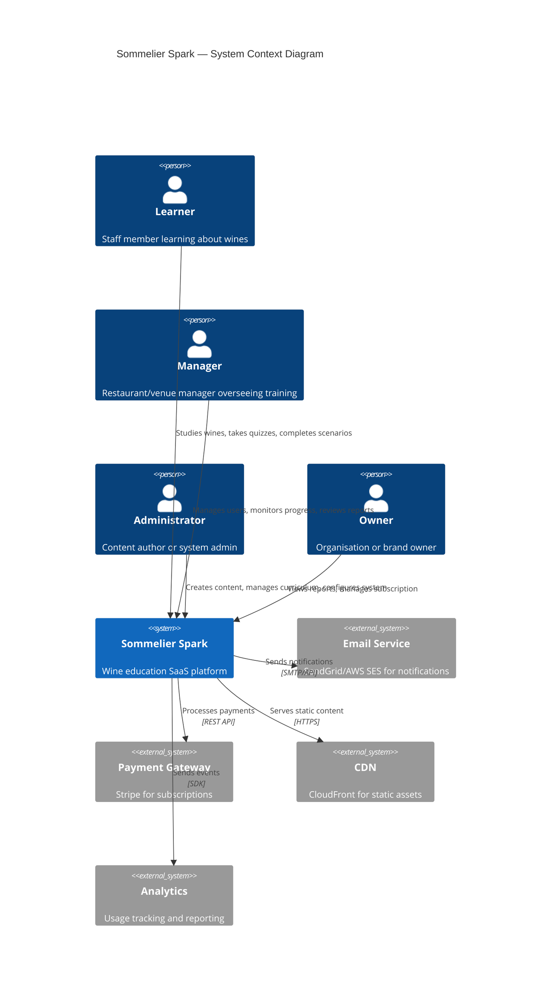
```mermaid
C4Context
    title Sommelier Spark — System Context Diagram

    Person(learner, "Learner", "Staff member learning about wines")
    Person(manager, "Manager", "Restaurant/venue manager overseeing training")
    Person(admin, "Administrator", "Content author or system admin")
    Person(owner, "Owner", "Organisation or brand owner")

    System(sommelier, "Sommelier Spark", "Wine education SaaS platform")

    System_Ext(email, "Email Service", "SendGrid/AWS SES for notifications")
    System_Ext(payment, "Payment Gateway", "Stripe for subscriptions")
    System_Ext(cdn, "CDN", "CloudFront for static assets")
    System_Ext(analytics, "Analytics", "Usage tracking and reporting")

    Rel(learner, sommelier, "Studies wines, takes quizzes, completes scenarios")
    Rel(manager, sommelier, "Manages users, monitors progress, reviews reports")
    Rel(admin, sommelier, "Creates content, manages curriculum, configures system")
    Rel(owner, sommelier, "Views reports, manages subscription")

    Rel(sommelier, email, "Sends notifications", "SMTP/API")
    Rel(sommelier, payment, "Processes payments", "REST API")
    Rel(sommelier, cdn, "Serves static content", "HTTPS")
    Rel(sommelier, analytics, "Sends events", "SDK")
```

### 3.2 External Interfaces

| Interface | Direction | Purpose | Protocol | Authentication |
|-----------|-----------|---------|----------|----------------|
| **Email Service** | Outbound | User notifications, invitations, alerts | REST API / SMTP | API Key |
| **Payment Gateway** | Bidirectional | Subscription billing, plan changes | REST API + Webhooks | API Key + Signature |
| **CDN** | Outbound | Static assets, images, documents | HTTPS | Signed URLs |
| **Analytics** | Outbound | Usage tracking, business metrics | SDK / REST | API Key |
| **Error Tracking** | Outbound | Error reporting, monitoring | SDK | DSN |

### 3.3 Actor Definitions

| Actor | Role | Primary Actions |
|-------|------|-----------------|
| **Learner** | End user (staff) | Study content, take quizzes, complete scenarios, track progress |
| **Manager** | Team supervisor | Invite users, assign content, monitor progress, generate reports |
| **Content Author** | Content creator | Create/edit wines, modules, quizzes, scenarios |
| **Content Admin** | Content manager | Approve content, manage workflows, configure generation |
| **Domain Expert** | Subject expert | Review content accuracy, provide feedback |
| **Organisation Admin** | Org administrator | Manage organisation, brands, locations, users |
| **System Admin** | Platform admin | System configuration, cross-tenant operations |

---

## 4. Container Architecture

### 4.1 Container Diagram

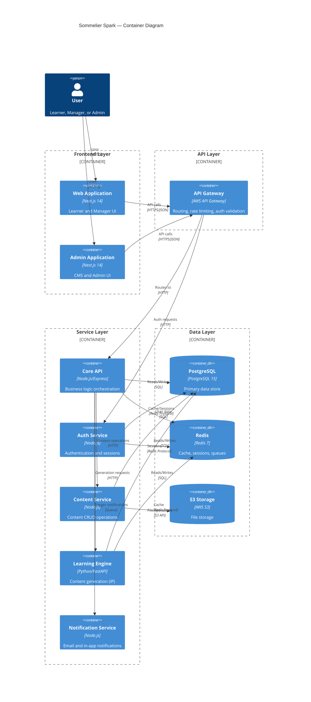
```mermaid
C4Container
    title Sommelier Spark — Container Diagram

    Person(user, "User", "Learner, Manager, or Admin")

    Container_Boundary(frontend, "Frontend Layer") {
        Container(webapp, "Web Application", "Next.js 14", "Learner and Manager UI")
        Container(adminapp, "Admin Application", "Next.js 14", "CMS and Admin UI")
    }

    Container_Boundary(gateway, "API Layer") {
        Container(apigw, "API Gateway", "AWS API Gateway", "Routing, rate limiting, auth validation")
    }

    Container_Boundary(services, "Service Layer") {
        Container(coreapi, "Core API", "Node.js/Express", "Business logic orchestration")
        Container(authsvc, "Auth Service", "Node.js", "Authentication and sessions")
        Container(contentsvc, "Content Service", "Node.js", "Content CRUD operations")
        Container(learningeng, "Learning Engine", "Python/FastAPI", "Content generation (IP)")
        Container(notifysvc, "Notification Service", "Node.js", "Email and in-app notifications")
    }

    Container_Boundary(data, "Data Layer") {
        ContainerDb(postgres, "PostgreSQL", "PostgreSQL 15", "Primary data store")
        ContainerDb(redis, "Redis", "Redis 7", "Cache, sessions, queues")
        ContainerDb(s3, "S3 Storage", "AWS S3", "File storage")
    }

    Rel(user, webapp, "Uses", "HTTPS")
    Rel(user, adminapp, "Uses", "HTTPS")

    Rel(webapp, apigw, "API calls", "HTTPS/JSON")
    Rel(adminapp, apigw, "API calls", "HTTPS/JSON")

    Rel(apigw, coreapi, "Routes to", "HTTP")
    Rel(apigw, authsvc, "Auth requests", "HTTP")

    Rel(coreapi, contentsvc, "Content operations", "HTTP")
    Rel(coreapi, learningeng, "Generation requests", "HTTP")
    Rel(coreapi, notifysvc, "Trigger notifications", "Queue")

    Rel(coreapi, postgres, "Reads/Writes", "SQL")
    Rel(coreapi, redis, "Cache/Sessions", "Redis Protocol")
    Rel(contentsvc, postgres, "Reads/Writes", "SQL")
    Rel(contentsvc, s3, "File operations", "S3 API")
    Rel(learningeng, postgres, "Reads/Writes", "SQL")
    Rel(learningeng, redis, "Cache", "Redis Protocol")
    Rel(authsvc, postgres, "User data", "SQL")
    Rel(authsvc, redis, "Sessions", "Redis Protocol")
```

### 4.2 Container Descriptions

| Container | Technology | Purpose | Scaling Strategy |
|-----------|------------|---------|------------------|
| **Web Application** | Next.js 14, React 18, Tailwind | Learner and Manager UI | Horizontal (CDN edge caching) |
| **Admin Application** | Next.js 14, React 18, Tailwind | CMS and Admin UI | Horizontal |
| **API Gateway** | AWS API Gateway / Kong | Request routing, rate limiting, JWT validation | Managed service |
| **Core API** | Node.js 20, Express/Fastify | Business logic orchestration, CRUD coordination | Horizontal auto-scaling |
| **Auth Service** | Node.js 20 | Authentication, session management, JWT issuance | Horizontal |
| **Content Service** | Node.js 20 | Content CRUD, file management, search indexing | Horizontal |
| **Learning Engine** | Python 3.11, FastAPI | Content generation (curriculum, quiz, scenario) | Horizontal (queue-based) |
| **Notification Service** | Node.js 20 | Email dispatch, in-app notifications, templating | Horizontal (queue workers) |
| **PostgreSQL** | PostgreSQL 15 | Primary relational data store | Vertical + Read replicas |
| **Redis** | Redis 7 | Cache, session store, message queues | Redis Cluster |
| **S3 Storage** | AWS S3 | Static files, imports/exports, backups | Managed (unlimited) |

### 4.3 Container Communication

| From | To | Protocol | Purpose | Sync/Async |
|------|-----|----------|---------|------------|
| Web App | API Gateway | HTTPS | All API calls | Sync |
| API Gateway | Core API | HTTP | Request routing | Sync |
| Core API | Auth Service | HTTP | Token validation, user lookup | Sync |
| Core API | Content Service | HTTP | Content CRUD | Sync |
| Core API | Learning Engine | HTTP + Queue | Generation requests | Async |
| Core API | Notification Service | Queue | Notification triggers | Async |
| All Services | PostgreSQL | TCP/SQL | Data persistence | Sync |
| All Services | Redis | TCP/RESP | Caching, sessions | Sync |
| Content Service | S3 | HTTPS | File operations | Sync |

---

## 5. Component Architecture

### 5.1 Core API Components

```
Core API Service
├── Controllers
│   ├── UserController              # User CRUD, profile management
│   ├── OrganisationController      # Organisation/Brand/Location management
│   ├── WineController              # Wine CRUD operations
│   ├── ModuleController            # Module and Lesson management
│   ├── QuizController              # Quiz management and attempts
│   ├── ScenarioController          # Scenario management and attempts
│   ├── ProgressController          # Progress tracking and reporting
│   ├── ReportController            # Analytics and report generation
│   ├── ImportController            # Bulk import operations
│   └── ExportController            # Data export operations
├── Services
│   ├── AuthService                 # JWT validation, permission checks
│   ├── ContentService              # Content orchestration
│   ├── WorkflowService             # State transitions, approvals
│   ├── GenerationService           # Learning Engine integration
│   ├── NotificationService         # Notification dispatch
│   ├── SearchService               # Content search
│   └── AuditService                # Audit log recording
├── Repositories
│   ├── UserRepository              # User data access
│   ├── OrganisationRepository      # Organisation data access
│   ├── ContentRepository           # Generic content data access
│   ├── ProgressRepository          # Progress data access
│   └── AuditRepository             # Audit log data access
├── Middleware
│   ├── AuthMiddleware              # JWT extraction and validation
│   ├── TenantMiddleware            # Organisation context injection
│   ├── RateLimitMiddleware         # Request rate limiting
│   ├── ValidationMiddleware        # Request body validation
│   └── AuditMiddleware             # Request/response logging
└── Utils
    ├── ErrorHandler                # Centralised error handling
    ├── ResponseFormatter           # Consistent response format
    └── Validators                  # Shared validation logic
```

### 5.2 Learning Engine Components

```
Learning Engine Service (CONFIDENTIAL)
├── API
│   ├── GenerationController        # Generation request handling
│   └── HealthController            # Health checks
├── Transformers
│   ├── WineListParser              # Parse wine list inputs
│   ├── CurriculumGenerator         # Generate module structure
│   └── ModuleStructurer            # Organise lessons within modules
├── Generators
│   ├── QuizGenerator               # Generate quiz structure
│   ├── QuestionGenerator           # Generate individual questions
│   ├── DistractorGenerator         # Generate plausible wrong answers
│   ├── ScenarioGenerator           # Generate scenario structure
│   ├── DialogueGenerator           # Generate customer dialogue
│   └── PersonaGenerator            # Generate customer personas
├── Adapters
│   ├── PerformanceAnalyser         # Analyse learner performance
│   ├── GapIdentifier               # Identify knowledge gaps
│   ├── PathOptimiser               # Optimise learning paths
│   └── MasteryDetector             # Detect content mastery
├── Templates
│   ├── QuestionTemplates           # 18 question generation templates
│   ├── ScenarioTemplates           # 12 scenario generation templates
│   └── ModuleTemplates             # Module structure templates
├── Validators
│   ├── ContentValidator            # Validate generated content
│   └── QualityChecker              # Check content quality metrics
└── Services
    ├── TemplateService             # Template management
    ├── CacheService                # Generation result caching
    └── MetricsService              # Generation metrics tracking
```

### 5.3 Content Service Components

```
Content Service
├── Managers
│   ├── WineManager                 # Wine CRUD operations
│   ├── ModuleManager               # Module and Lesson operations
│   ├── QuizManager                 # Quiz and Question operations
│   └── ScenarioManager             # Scenario operations
├── Lifecycle
│   ├── StateManager                # State transition logic
│   ├── VersionManager              # Version tracking and comparison
│   └── WorkflowEngine              # Approval workflow orchestration
├── Import
│   ├── CSVImporter                 # CSV file parsing and import
│   ├── ExcelImporter               # Excel file parsing and import
│   ├── JSONImporter                # JSON file parsing and import
│   ├── ValidationEngine            # Import data validation
│   └── ImportProcessor             # Background import processing
├── Export
│   ├── CSVExporter                 # CSV export generation
│   ├── ExcelExporter               # Excel export generation
│   ├── JSONExporter                # JSON export generation
│   └── PDFExporter                 # PDF report generation
├── Search
│   ├── ContentIndexer              # Index content for search
│   └── SearchEngine                # Full-text search (PostgreSQL FTS)
└── Files
    ├── FileManager                 # File upload/download
    ├── ImageProcessor              # Image optimisation
    └── StorageAdapter              # S3 integration
```

### 5.4 Auth Service Components

```
Auth Service
├── Controllers
│   ├── AuthController              # Login, logout, token refresh
│   ├── PasswordController          # Password reset, change
│   └── SessionController           # Session management
├── Services
│   ├── TokenService                # JWT generation and validation
│   ├── SessionService              # Session storage and retrieval
│   ├── PasswordService             # Password hashing and verification
│   └── InvitationService           # User invitation handling
├── Providers
│   ├── LocalProvider               # Email/password authentication
│   └── SSOProvider (Phase 2)       # SAML/OIDC integration
└── Middleware
    └── SessionMiddleware           # Session extraction and refresh
```

---

## 6. Data Architecture

### 6.1 Logical Data Model

Reference: SS-WS3.0-CDM (Content Domain Model)

#### Core Entities

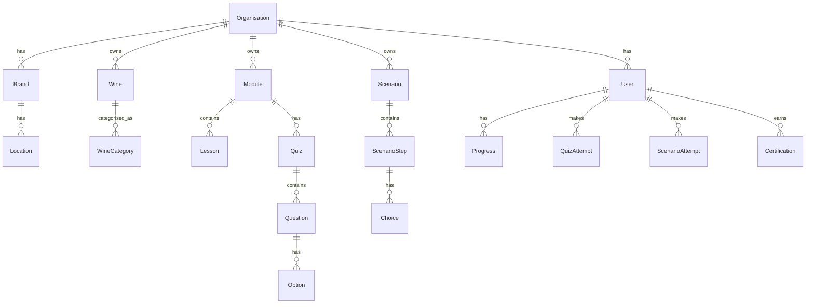
```mermaid
erDiagram
    Organisation ||--o{ Brand : has
    Brand ||--o{ Location : has
    Organisation ||--o{ User : has
    Organisation ||--o{ Wine : owns
    Organisation ||--o{ Module : owns

    Wine ||--o{ WineCategory : categorised_as
    Module ||--o{ Lesson : contains
    Module ||--o{ Quiz : has
    Quiz ||--o{ Question : contains
    Question ||--o{ Option : has

    Organisation ||--o{ Scenario : owns
    Scenario ||--o{ ScenarioStep : contains
    ScenarioStep ||--o{ Choice : has

    User ||--o{ Progress : has
    User ||--o{ QuizAttempt : makes
    User ||--o{ ScenarioAttempt : makes
    User ||--o{ Certification : earns
```

#### Entity Summaries

| Entity | Purpose | Key Attributes |
|--------|---------|----------------|
| **Organisation** | Top-level tenant | id, name, subscriptionTier, settings |
| **Brand** | Brand within organisation | id, name, organisationId |
| **Location** | Physical venue | id, name, brandId, address |
| **User** | System user | id, email, role, organisationId |
| **Wine** | Wine content item | id, name, region, type, contentTier |
| **Module** | Learning module | id, title, category, lessons |
| **Lesson** | Module lesson | id, title, content, moduleId |
| **Quiz** | Assessment | id, title, tier, passingScore |
| **Question** | Quiz question | id, text, type, options |
| **Scenario** | Service simulation | id, title, difficulty, steps |
| **Progress** | User progress | userId, contentType, contentId, completed |
| **Certification** | Achievement | userId, tier, achievedAt |

### 6.2 Data Partitioning Strategy

| Strategy | Scope | Implementation |
|----------|-------|----------------|
| **Tenant Isolation** | All tables | organisationId column, enforced via middleware |
| **Logical Partitioning** | Large tables (Progress, Attempts) | PostgreSQL table partitioning by organisation |
| **Archival** | Historical data | Move to archive tables after 2 years |
| **Soft Delete** | All content | deletedAt timestamp, excluded from queries |

### 6.3 Caching Strategy

| Data Type | Cache Location | TTL | Invalidation Strategy |
|-----------|----------------|-----|----------------------|
| **User Session** | Redis | 8 hours | Logout, timeout, password change |
| **JWT Token** | Redis (blacklist) | Token lifetime | Logout, revocation |
| **Published Content** | Redis | 1 hour | On publish/update |
| **Wine List** | Redis | 24 hours | On import, manual refresh |
| **Generated Curriculum** | Redis | Until regenerate | Manual regeneration |
| **Organisation Config** | Redis | 1 hour | On settings change |
| **Static Assets** | CDN | 7 days | Version hash in filename |
| **API Responses** | Redis | 5 minutes | Content change events |

### 6.4 Database Schema Highlights

#### Multi-tenancy Pattern

```sql
-- All tables include organisationId for tenant isolation
CREATE TABLE wines (
    id UUID PRIMARY KEY DEFAULT gen_random_uuid(),
    organisation_id UUID NOT NULL REFERENCES organisations(id),
    name VARCHAR(255) NOT NULL,
    -- ... other columns
    created_at TIMESTAMP DEFAULT NOW(),
    updated_at TIMESTAMP DEFAULT NOW(),
    deleted_at TIMESTAMP,

    -- Composite unique constraint within organisation
    CONSTRAINT unique_wine_name_per_org UNIQUE (organisation_id, name, vintage)
);

-- Row-level security policy (optional, additional layer)
CREATE POLICY wine_tenant_isolation ON wines
    USING (organisation_id = current_setting('app.current_org_id')::uuid);
```

#### Content Lifecycle Fields

```sql
-- All content tables include lifecycle fields
ALTER TABLE wines ADD COLUMN status VARCHAR(20) DEFAULT 'DRAFT';
ALTER TABLE wines ADD COLUMN version INTEGER DEFAULT 1;
ALTER TABLE wines ADD COLUMN published_at TIMESTAMP;
ALTER TABLE wines ADD COLUMN published_by UUID REFERENCES users(id);
ALTER TABLE wines ADD COLUMN archived_at TIMESTAMP;
ALTER TABLE wines ADD COLUMN archived_by UUID REFERENCES users(id);
ALTER TABLE wines ADD COLUMN review_requested_at TIMESTAMP;
ALTER TABLE wines ADD COLUMN review_requested_by UUID REFERENCES users(id);
```

---

## 7. Integration Architecture

### 7.1 API Design Principles

| Principle | Implementation |
|-----------|----------------|
| **RESTful** | Resource-based URLs, HTTP verbs, status codes |
| **Consistent Response Format** | Standard envelope: `{ data, meta, errors }` |
| **Pagination** | Cursor-based for large lists, offset for small |
| **Filtering** | Query params: `?status=PUBLISHED&type=RED` |
| **Sorting** | Query params: `?sort=createdAt:desc` |
| **Partial Responses** | Field selection: `?fields=id,name,region` |
| **HATEOAS** | Links to related resources in responses |

### 7.2 API Versioning

| Aspect | Strategy |
|--------|----------|
| **Versioning Method** | URL path versioning: `/api/v1/`, `/api/v2/` |
| **Current Version** | v1 (MVP) |
| **Deprecation Policy** | 6 months notice before version sunset |
| **Breaking Changes** | Major version increment only |
| **Non-Breaking Changes** | Additive changes within current version |

### 7.3 Standard Response Format

```json
{
  "data": {
    "id": "uuid",
    "type": "wine",
    "attributes": { /* resource data */ }
  },
  "meta": {
    "timestamp": "2026-01-20T10:30:00Z",
    "requestId": "uuid",
    "pagination": {
      "page": 1,
      "pageSize": 20,
      "totalPages": 5,
      "totalItems": 100
    }
  },
  "links": {
    "self": "/api/v1/wines/uuid",
    "related": {
      "module": "/api/v1/modules/uuid"
    }
  }
}
```

### 7.4 Event Architecture

#### Event Categories

| Category | Events | Purpose |
|----------|--------|---------|
| **Content Events** | content.created, content.updated, content.submitted, content.approved, content.published, content.archived | Track content lifecycle |
| **Learning Events** | curriculum.generated, quiz.attempted, quiz.completed, scenario.completed, certification.achieved | Track learning progress |
| **User Events** | user.invited, user.activated, user.login, user.logout, user.role_changed | Track user actions |
| **System Events** | import.started, import.completed, export.completed, generation.started, generation.completed | Track system operations |

#### Event Schema

```json
{
  "eventId": "uuid",
  "eventType": "content.published",
  "timestamp": "2026-01-20T10:30:00Z",
  "source": "content-service",
  "data": {
    "contentType": "wine",
    "contentId": "uuid",
    "organisationId": "uuid",
    "userId": "uuid",
    "previousState": "REVIEW",
    "newState": "PUBLISHED"
  },
  "metadata": {
    "correlationId": "uuid",
    "causationId": "uuid"
  }
}
```

### 7.5 External Integrations

| System | Integration Type | Purpose | Authentication |
|--------|-----------------|---------|----------------|
| **SendGrid/AWS SES** | REST API | Email notifications | API Key |
| **Stripe** | REST API + Webhooks | Subscription billing | API Key + Webhook Signature |
| **CloudFront** | CDN | Asset delivery | Signed URLs |
| **Sentry** | SDK | Error tracking | DSN |
| **Analytics (Phase 2)** | SDK | Usage tracking | API Key |

### 7.6 Webhook Security

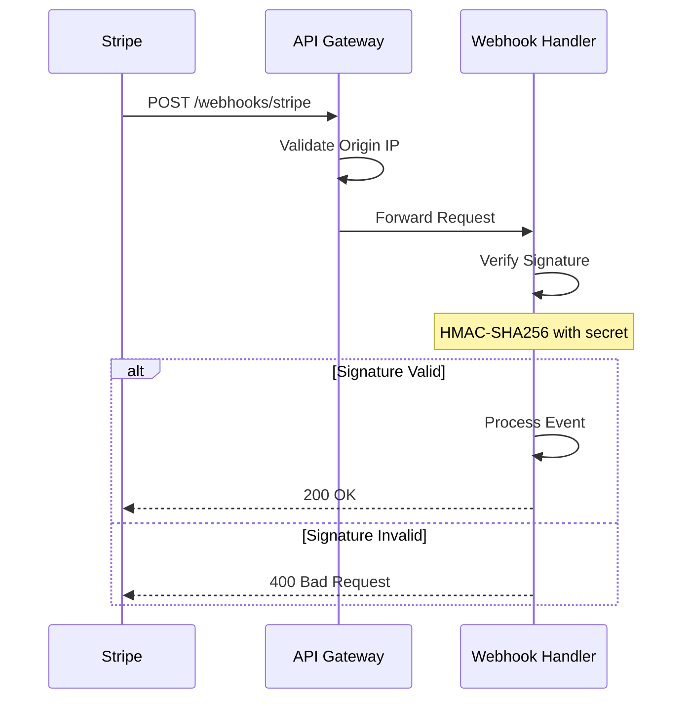
```mermaid
sequenceDiagram
    participant Stripe
    participant Gateway as API Gateway
    participant Webhook as Webhook Handler

    Stripe->>Gateway: POST /webhooks/stripe
    Gateway->>Gateway: Validate Origin IP
    Gateway->>Webhook: Forward Request

    Webhook->>Webhook: Verify Signature
    Note over Webhook: HMAC-SHA256 with secret

    alt Signature Valid
        Webhook->>Webhook: Process Event
        Webhook-->>Stripe: 200 OK
    else Signature Invalid
        Webhook-->>Stripe: 400 Bad Request
    end
```

---

## 8. Security Architecture

### 8.1 Authentication Flow

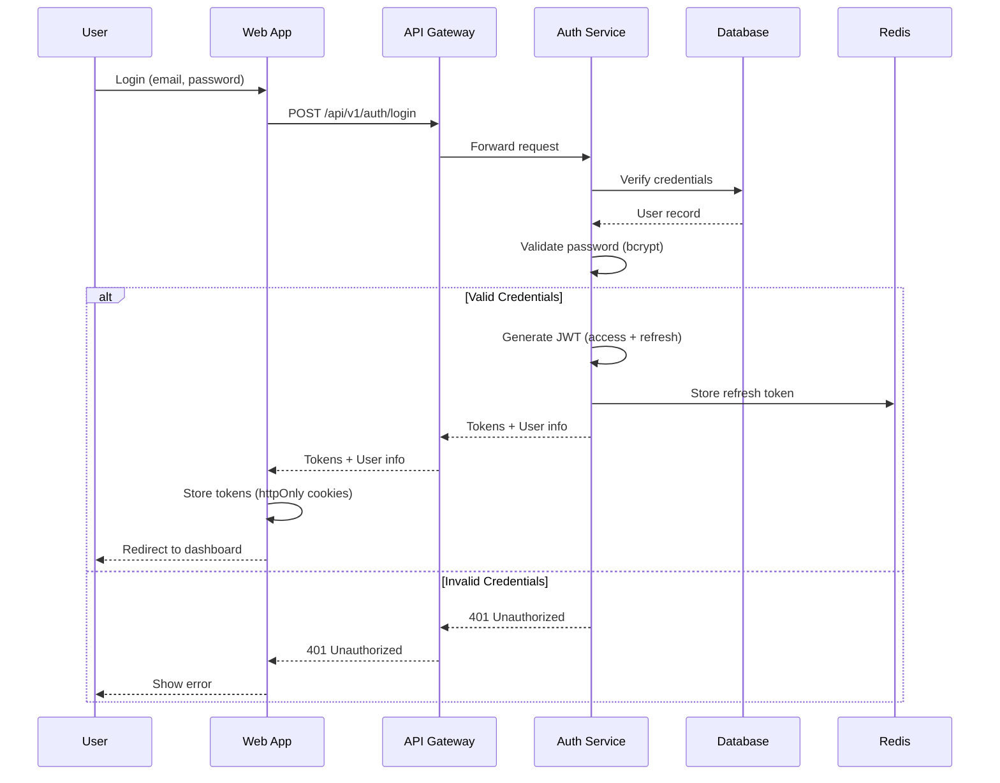
```mermaid
sequenceDiagram
    participant U as User
    participant W as Web App
    participant G as API Gateway
    participant A as Auth Service
    participant D as Database
    participant R as Redis

    U->>W: Login (email, password)
    W->>G: POST /api/v1/auth/login
    G->>A: Forward request

    A->>D: Verify credentials
    D-->>A: User record

    A->>A: Validate password (bcrypt)

    alt Valid Credentials
        A->>A: Generate JWT (access + refresh)
        A->>R: Store refresh token
        A-->>G: Tokens + User info
        G-->>W: Tokens + User info
        W->>W: Store tokens (httpOnly cookies)
        W-->>U: Redirect to dashboard
    else Invalid Credentials
        A-->>G: 401 Unauthorized
        G-->>W: 401 Unauthorized
        W-->>U: Show error
    end
```

### 8.2 Token Refresh Flow

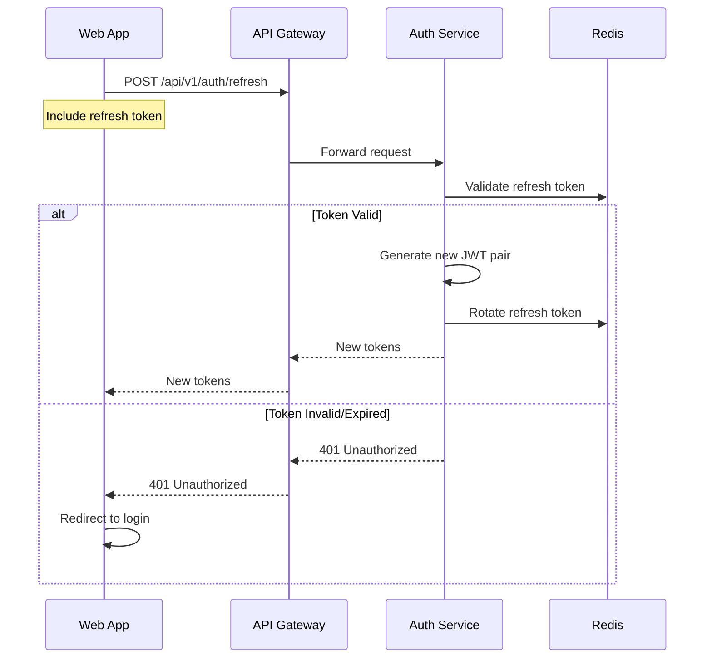
```mermaid
sequenceDiagram
    participant W as Web App
    participant G as API Gateway
    participant A as Auth Service
    participant R as Redis

    W->>G: POST /api/v1/auth/refresh
    Note over W: Include refresh token

    G->>A: Forward request
    A->>R: Validate refresh token

    alt Token Valid
        A->>A: Generate new JWT pair
        A->>R: Rotate refresh token
        A-->>G: New tokens
        G-->>W: New tokens
    else Token Invalid/Expired
        A-->>G: 401 Unauthorized
        G-->>W: 401 Unauthorized
        W->>W: Redirect to login
    end
```

### 8.3 Authorization Model

#### JWT Claims Structure

```json
{
  "sub": "user-uuid",
  "email": "user@example.com",
  "organisationId": "org-uuid",
  "role": "MANAGER",
  "permissions": ["content:read", "users:read", "progress:read"],
  "iat": 1705750200,
  "exp": 1705753800,
  "iss": "sommelier-spark",
  "aud": "sommelier-spark-api"
}
```

#### Role-Based Access Control (RBAC)

| Role | Permissions | Scope |
|------|-------------|-------|
| **Learner** | content:read, progress:read, progress:write | Own data |
| **Manager** | Above + users:read, reports:read | Location/Brand |
| **Content Author** | content:read, content:write (draft) | Own content |
| **Content Admin** | content:* | Organisation |
| **Domain Expert** | content:review | Assigned content |
| **Organisation Admin** | users:*, content:*, settings:* | Organisation |
| **System Admin** | All permissions | System-wide |

### 8.4 Data Security

| Aspect | Implementation | Standard |
|--------|----------------|----------|
| **Encryption at Rest** | AES-256 | AWS KMS managed keys |
| **Encryption in Transit** | TLS 1.3 | All communications |
| **Password Storage** | bcrypt (cost factor 12) | OWASP recommendation |
| **API Authentication** | JWT (RS256) | RSA 2048-bit keys |
| **Secrets Management** | AWS Secrets Manager | Rotated regularly |
| **PII Handling** | Encrypted, access logged | GDPR compliant |

### 8.5 Security Controls

| Control | Implementation | Threshold |
|---------|----------------|-----------|
| **Rate Limiting** | Token bucket algorithm | 100 req/min per user, 1000 req/min per org |
| **Input Validation** | JSON Schema validation | All endpoints |
| **SQL Injection** | Parameterised queries | No string concatenation |
| **XSS Prevention** | Content Security Policy | Strict CSP headers |
| **CSRF Protection** | SameSite cookies + tokens | Double-submit pattern |
| **Brute Force** | Account lockout | 5 failed attempts → 15 min lockout |
| **Session Fixation** | Regenerate on login | New session ID |

### 8.6 Security Headers

```
Strict-Transport-Security: max-age=31536000; includeSubDomains; preload
Content-Security-Policy: default-src 'self'; script-src 'self'; style-src 'self' 'unsafe-inline'
X-Content-Type-Options: nosniff
X-Frame-Options: DENY
X-XSS-Protection: 1; mode=block
Referrer-Policy: strict-origin-when-cross-origin
Permissions-Policy: geolocation=(), microphone=(), camera=()
```

---

## 9. Infrastructure Architecture

### 9.1 Deployment Topology

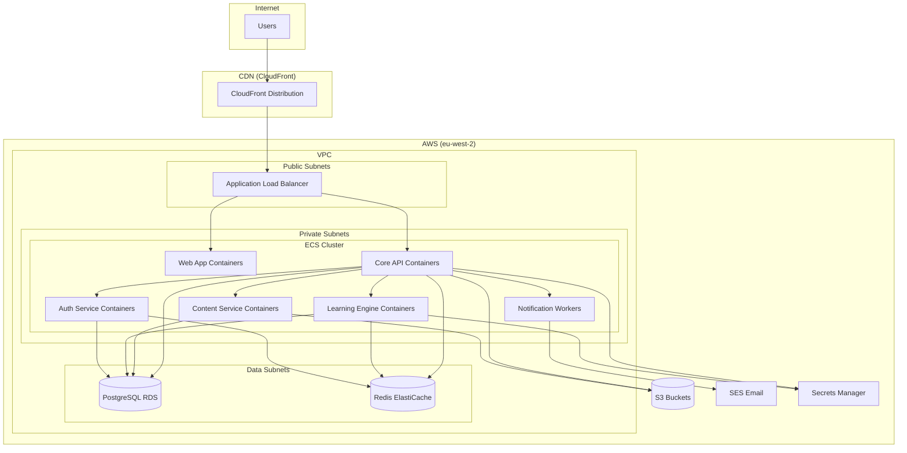
```mermaid
graph TB
    subgraph Internet
        Users[Users]
    end

    subgraph CDN["CDN (CloudFront)"]
        CF[CloudFront Distribution]
    end

    subgraph AWS["AWS (eu-west-2)"]
        subgraph VPC["VPC"]
            subgraph Public["Public Subnets"]
                ALB[Application Load Balancer]
            end

            subgraph Private["Private Subnets"]
                subgraph ECS["ECS Cluster"]
                    WEB[Web App Containers]
                    API[Core API Containers]
                    AUTH[Auth Service Containers]
                    CONTENT[Content Service Containers]
                    LE[Learning Engine Containers]
                    NOTIFY[Notification Workers]
                end
            end

            subgraph Data["Data Subnets"]
                PG[(PostgreSQL RDS)]
                RD[(Redis ElastiCache)]
            end
        end

        S3[(S3 Buckets)]
        SES[SES Email]
        SM[Secrets Manager]
    end

    Users --> CF
    CF --> ALB
    ALB --> WEB
    ALB --> API

    API --> AUTH
    API --> CONTENT
    API --> LE
    API --> NOTIFY

    API --> PG
    API --> RD
    API --> S3

    CONTENT --> PG
    CONTENT --> S3
    LE --> PG
    LE --> RD
    AUTH --> PG
    AUTH --> RD
    NOTIFY --> SES

    API --> SM
    LE --> SM
```

### 9.2 Environment Strategy

| Environment | Purpose | Data | Access |
|-------------|---------|------|--------|
| **Development** | Feature development | Synthetic/seed | Dev team |
| **Staging** | Integration testing | Anonymised production copy | QA + Dev |
| **Production** | Live system | Real customer data | Restricted |

### 9.3 Scaling Strategy

| Component | Scaling Type | Trigger | Min/Max |
|-----------|-------------|---------|---------|
| **Web App** | Horizontal (auto) | CPU > 70% | 2/10 |
| **Core API** | Horizontal (auto) | CPU > 70%, Requests > 1000/min | 2/20 |
| **Auth Service** | Horizontal (auto) | CPU > 70% | 2/6 |
| **Content Service** | Horizontal (auto) | CPU > 70% | 2/10 |
| **Learning Engine** | Horizontal (auto) | Queue depth > 100 | 1/10 |
| **Notification Workers** | Horizontal (auto) | Queue depth > 500 | 1/5 |
| **PostgreSQL** | Vertical + Read replicas | Connection count > 80% | 1 primary + 2 replicas |
| **Redis** | Cluster mode | Memory > 80% | 3-node cluster |

### 9.4 High Availability

| Component | HA Strategy | RPO | RTO |
|-----------|-------------|-----|-----|
| **Application** | Multi-AZ ECS tasks | N/A | < 1 minute |
| **Database** | Multi-AZ RDS, automated backups | 5 minutes | 30 minutes |
| **Cache** | Redis cluster, multi-AZ | N/A | < 1 minute |
| **Storage** | S3 cross-region replication | 15 minutes | 1 hour |
| **Load Balancer** | AWS managed, multi-AZ | N/A | Automatic |

### 9.5 Disaster Recovery

| Scenario | Recovery Procedure | RTO |
|----------|-------------------|-----|
| **Single AZ failure** | Automatic failover to healthy AZ | < 5 minutes |
| **Database failure** | Automatic failover to standby | < 30 minutes |
| **Region failure** | Manual failover to DR region | < 4 hours |
| **Data corruption** | Point-in-time recovery from backups | < 1 hour |

---

## 10. Observability

### 10.1 Logging

| Aspect | Implementation |
|--------|----------------|
| **Format** | Structured JSON |
| **Correlation** | Request ID propagated across services |
| **Levels** | DEBUG, INFO, WARN, ERROR, FATAL |
| **Collection** | CloudWatch Logs |
| **Retention** | 30 days hot, 1 year cold (S3) |

#### Log Entry Structure

```json
{
  "timestamp": "2026-01-20T10:30:00.123Z",
  "level": "INFO",
  "service": "core-api",
  "requestId": "uuid",
  "userId": "uuid",
  "organisationId": "uuid",
  "message": "Wine created successfully",
  "context": {
    "wineId": "uuid",
    "wineName": "Château Margaux 2015"
  },
  "duration": 145
}
```

### 10.2 Metrics

| Category | Metrics | Source |
|----------|---------|--------|
| **Application** | Request rate, error rate, latency (p50/p95/p99) | Application code |
| **Business** | Active users, quizzes completed, certifications, content created | Application events |
| **Infrastructure** | CPU, memory, disk, network, connections | CloudWatch |
| **Database** | Query latency, connection pool, replication lag | RDS metrics |
| **Cache** | Hit rate, memory usage, evictions | ElastiCache metrics |

### 10.3 Alerting

| Alert | Condition | Severity | Response |
|-------|-----------|----------|----------|
| **Error Rate Spike** | > 1% for 5 minutes | Critical | Immediate investigation |
| **Latency Degradation** | p95 > 2s for 5 minutes | Warning | Investigate within 1 hour |
| **Database Connections** | > 80% pool for 10 minutes | Warning | Scale or investigate |
| **Disk Space** | > 85% | Warning | Cleanup or expand |
| **Memory Pressure** | > 90% for 5 minutes | Critical | Scale or restart |
| **Certificate Expiry** | < 14 days | Warning | Renew certificate |
| **Failed Logins** | > 10 per user in 5 minutes | Warning | Potential brute force |

### 10.4 Dashboards

| Dashboard | Audience | Key Widgets |
|-----------|----------|-------------|
| **System Overview** | Engineering | Request rate, error rate, latency, active containers |
| **Database Performance** | Engineering | Query latency, connections, replication lag |
| **Business Metrics** | Product/Business | DAU, quizzes completed, certifications, content growth |
| **Security** | Security | Failed logins, blocked requests, suspicious activity |
| **Cost** | Finance/Engineering | AWS spend by service, projected monthly |

### 10.5 Distributed Tracing

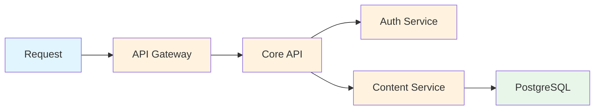
```mermaid
flowchart LR
    A[Request] --> B[API Gateway]
    B --> C[Core API]
    C --> D[Auth Service]
    C --> E[Content Service]
    E --> F[PostgreSQL]

    style A fill:#e1f5fe
    style B fill:#fff3e0
    style C fill:#fff3e0
    style D fill:#fff3e0
    style E fill:#fff3e0
    style F fill:#e8f5e9
```

| Span | Service | Duration |
|------|---------|----------|
| request | api-gateway | 245ms |
| ├─ auth.validate | auth-service | 15ms |
| ├─ content.get | content-service | 180ms |
| │  └─ db.query | postgresql | 120ms |
| └─ response.format | core-api | 10ms |

---

## 11. State Machine Diagrams

### 11.1 Content Lifecycle State Machine

Reference: SS-WS3.0-CLS (Content Lifecycle Specification)

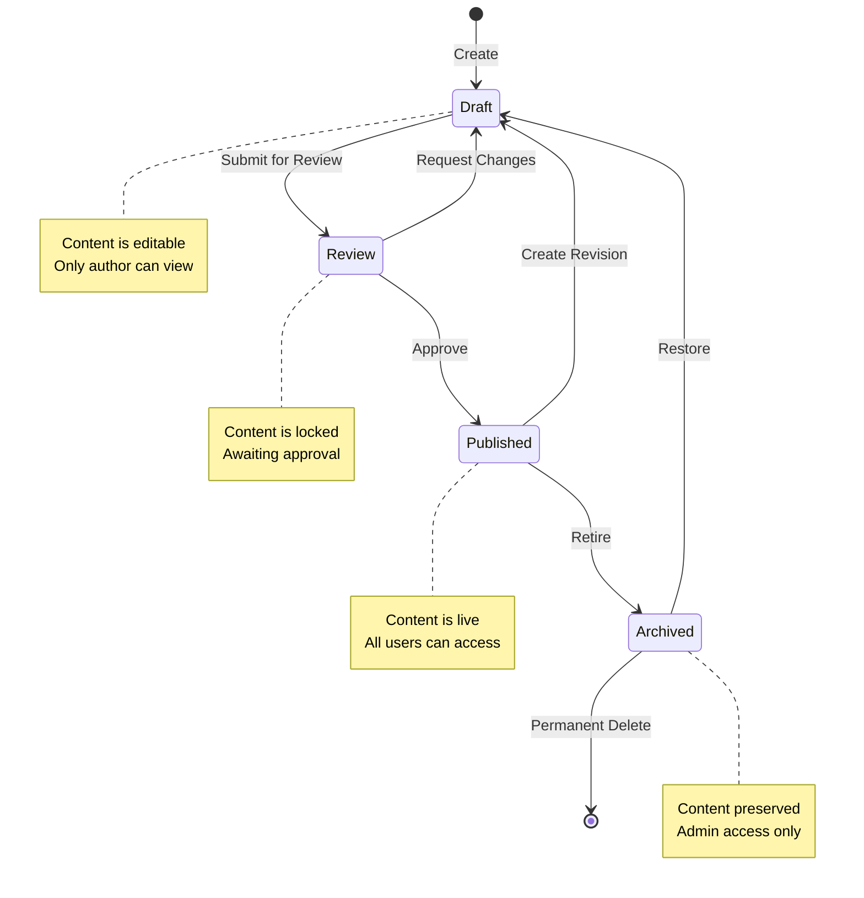
```mermaid
stateDiagram-v2
    [*] --> Draft : Create

    Draft --> Review : Submit for Review
    Review --> Draft : Request Changes
    Review --> Published : Approve

    Published --> Draft : Create Revision
    Published --> Archived : Retire

    Archived --> Draft : Restore
    Archived --> [*] : Permanent Delete

    note right of Draft
        Content is editable
        Only author can view
    end note

    note right of Review
        Content is locked
        Awaiting approval
    end note

    note right of Published
        Content is live
        All users can access
    end note

    note right of Archived
        Content preserved
        Admin access only
    end note
```

### 11.2 User Invitation State Machine

Reference: SS-WS3.0-ORG (Organization Model)

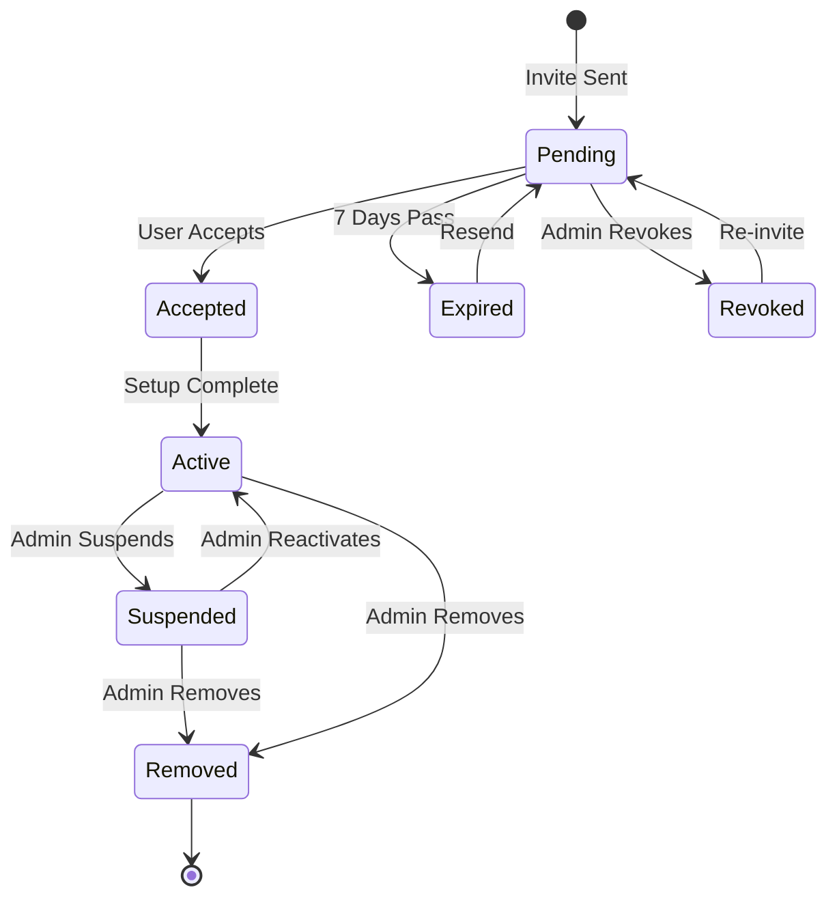
```mermaid
stateDiagram-v2
    [*] --> Pending : Invite Sent

    Pending --> Accepted : User Accepts
    Pending --> Expired : 7 Days Pass
    Pending --> Revoked : Admin Revokes

    Expired --> Pending : Resend
    Revoked --> Pending : Re-invite

    Accepted --> Active : Setup Complete
    Active --> Suspended : Admin Suspends
    Suspended --> Active : Admin Reactivates
    Suspended --> Removed : Admin Removes
    Active --> Removed : Admin Removes

    Removed --> [*]
```

### 11.3 Quiz Attempt State Machine

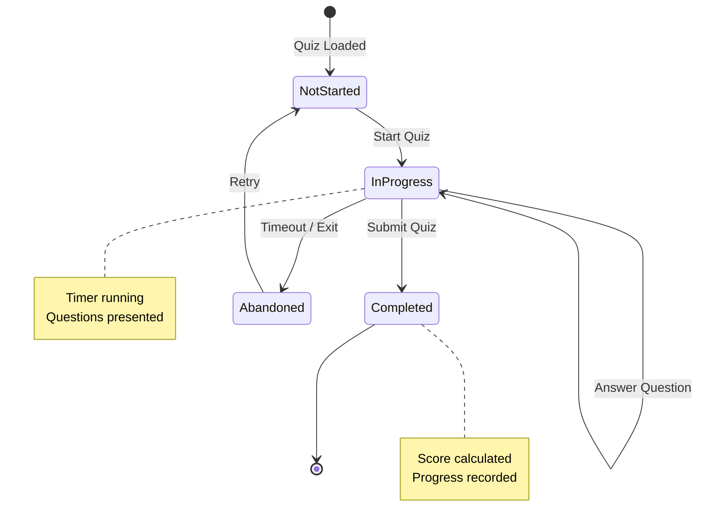
```mermaid
stateDiagram-v2
    [*] --> NotStarted : Quiz Loaded

    NotStarted --> InProgress : Start Quiz
    InProgress --> InProgress : Answer Question

    InProgress --> Completed : Submit Quiz
    InProgress --> Abandoned : Timeout / Exit

    Completed --> [*]
    Abandoned --> NotStarted : Retry

    note right of InProgress
        Timer running
        Questions presented
    end note

    note right of Completed
        Score calculated
        Progress recorded
    end note
```

### 11.4 Scenario Attempt State Machine


```mermaid
stateDiagram-v2
    [*] --> NotStarted : Scenario Loaded

    NotStarted --> InProgress : Start Scenario
    InProgress --> InProgress : Make Choice

    InProgress --> Completed : Reach Ending
    InProgress --> Abandoned : Exit Early

    Completed --> [*]
    Abandoned --> NotStarted : Retry

    note right of InProgress
        Customer interaction
        Branching dialogue
    end note

    note right of Completed
        Score calculated
        Feedback shown
    end note
```

### 11.5 Generation Job State Machine

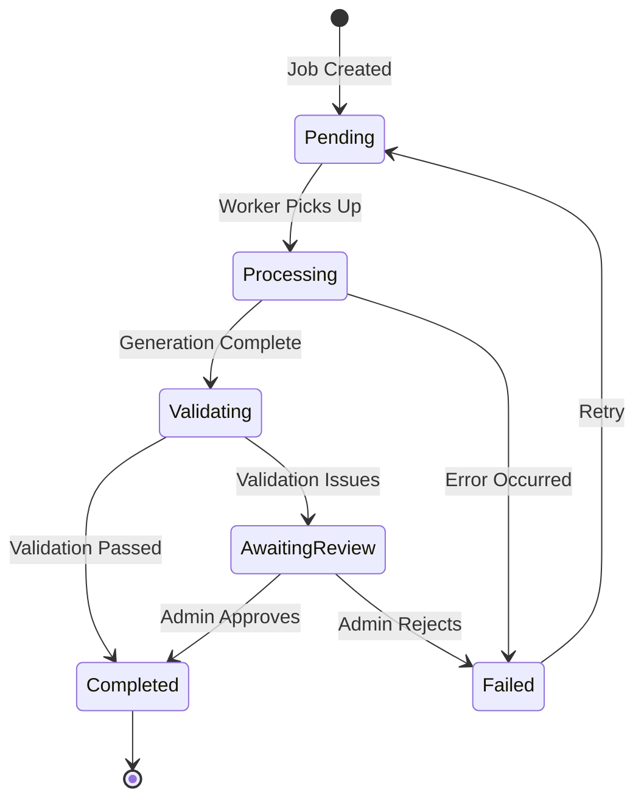
```mermaid
stateDiagram-v2
    [*] --> Pending : Job Created

    Pending --> Processing : Worker Picks Up
    Processing --> Validating : Generation Complete

    Validating --> AwaitingReview : Validation Issues
    Validating --> Completed : Validation Passed

    AwaitingReview --> Completed : Admin Approves
    AwaitingReview --> Failed : Admin Rejects

    Processing --> Failed : Error Occurred
    Failed --> Pending : Retry

    Completed --> [*]
```

### 11.6 Import Job State Machine

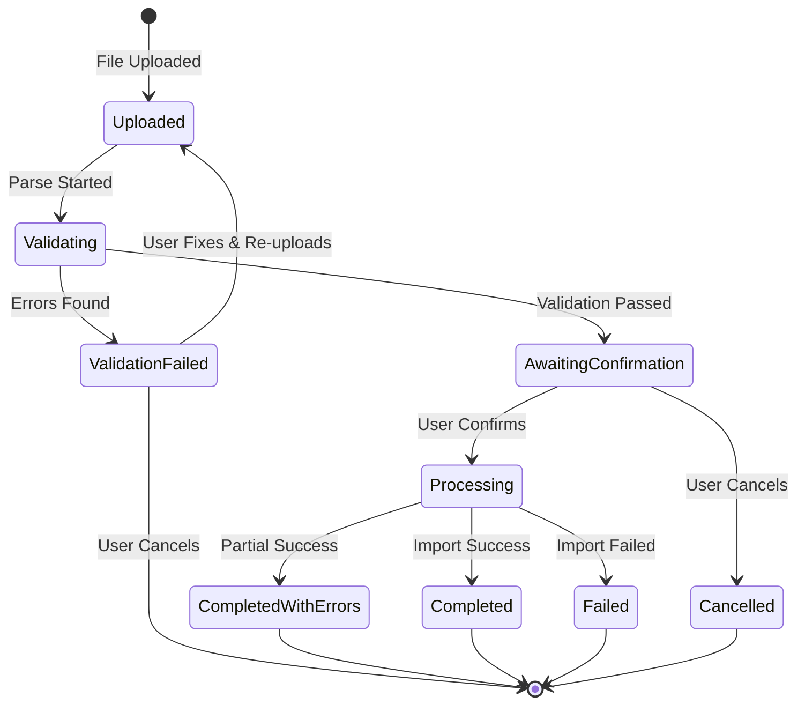
```mermaid
stateDiagram-v2
    [*] --> Uploaded : File Uploaded

    Uploaded --> Validating : Parse Started
    Validating --> ValidationFailed : Errors Found
    Validating --> AwaitingConfirmation : Validation Passed

    ValidationFailed --> [*] : User Cancels
    ValidationFailed --> Uploaded : User Fixes & Re-uploads

    AwaitingConfirmation --> Processing : User Confirms
    AwaitingConfirmation --> Cancelled : User Cancels

    Processing --> Completed : Import Success
    Processing --> CompletedWithErrors : Partial Success
    Processing --> Failed : Import Failed

    CompletedWithErrors --> [*]
    Completed --> [*]
    Failed --> [*]
    Cancelled --> [*]
```

---

## 12. Sequence Diagrams

### 12.1 Wine List Import Flow

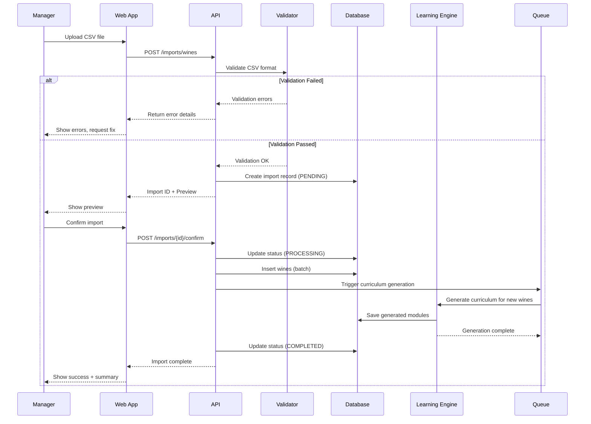
```mermaid
sequenceDiagram
    participant M as Manager
    participant W as Web App
    participant A as API
    participant V as Validator
    participant D as Database
    participant LE as Learning Engine
    participant Q as Queue

    M->>W: Upload CSV file
    W->>A: POST /imports/wines
    A->>V: Validate CSV format

    alt Validation Failed
        V-->>A: Validation errors
        A-->>W: Return error details
        W-->>M: Show errors, request fix
    else Validation Passed
        V-->>A: Validation OK
        A->>D: Create import record (PENDING)
        A-->>W: Import ID + Preview
        W-->>M: Show preview

        M->>W: Confirm import
        W->>A: POST /imports/{id}/confirm
        A->>D: Update status (PROCESSING)
        A->>D: Insert wines (batch)
        A->>Q: Trigger curriculum generation

        Q->>LE: Generate curriculum for new wines
        LE->>D: Save generated modules
        LE-->>Q: Generation complete

        A->>D: Update status (COMPLETED)
        A-->>W: Import complete
        W-->>M: Show success + summary
    end
```

### 12.2 Quiz Generation Flow

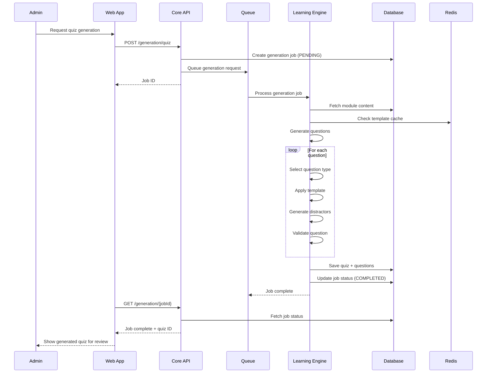
```mermaid
sequenceDiagram
    participant A as Admin
    participant W as Web App
    participant API as Core API
    participant Q as Queue
    participant LE as Learning Engine
    participant D as Database
    participant R as Redis

    A->>W: Request quiz generation
    W->>API: POST /generation/quiz
    API->>D: Create generation job (PENDING)
    API->>Q: Queue generation request
    API-->>W: Job ID

    Q->>LE: Process generation job
    LE->>D: Fetch module content
    LE->>R: Check template cache
    LE->>LE: Generate questions

    loop For each question
        LE->>LE: Select question type
        LE->>LE: Apply template
        LE->>LE: Generate distractors
        LE->>LE: Validate question
    end

    LE->>D: Save quiz + questions
    LE->>D: Update job status (COMPLETED)
    LE-->>Q: Job complete

    W->>API: GET /generation/{jobId}
    API->>D: Fetch job status
    API-->>W: Job complete + quiz ID
    W-->>A: Show generated quiz for review
```

### 12.3 Quiz Attempt Flow

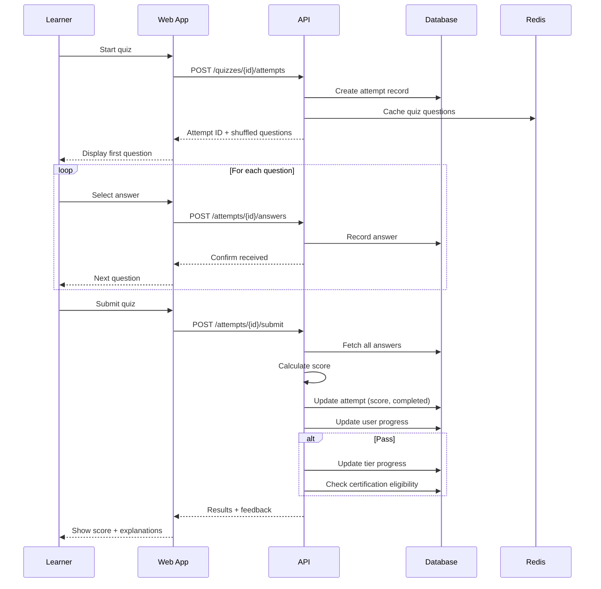
```mermaid
sequenceDiagram
    participant L as Learner
    participant W as Web App
    participant A as API
    participant D as Database
    participant R as Redis

    L->>W: Start quiz
    W->>A: POST /quizzes/{id}/attempts
    A->>D: Create attempt record
    A->>R: Cache quiz questions
    A-->>W: Attempt ID + shuffled questions
    W-->>L: Display first question

    loop For each question
        L->>W: Select answer
        W->>A: POST /attempts/{id}/answers
        A->>D: Record answer
        A-->>W: Confirm received
        W-->>L: Next question
    end

    L->>W: Submit quiz
    W->>A: POST /attempts/{id}/submit

    A->>D: Fetch all answers
    A->>A: Calculate score
    A->>D: Update attempt (score, completed)
    A->>D: Update user progress

    alt Pass
        A->>D: Update tier progress
        A->>D: Check certification eligibility
    end

    A-->>W: Results + feedback
    W-->>L: Show score + explanations
```

### 12.4 Content Approval Flow

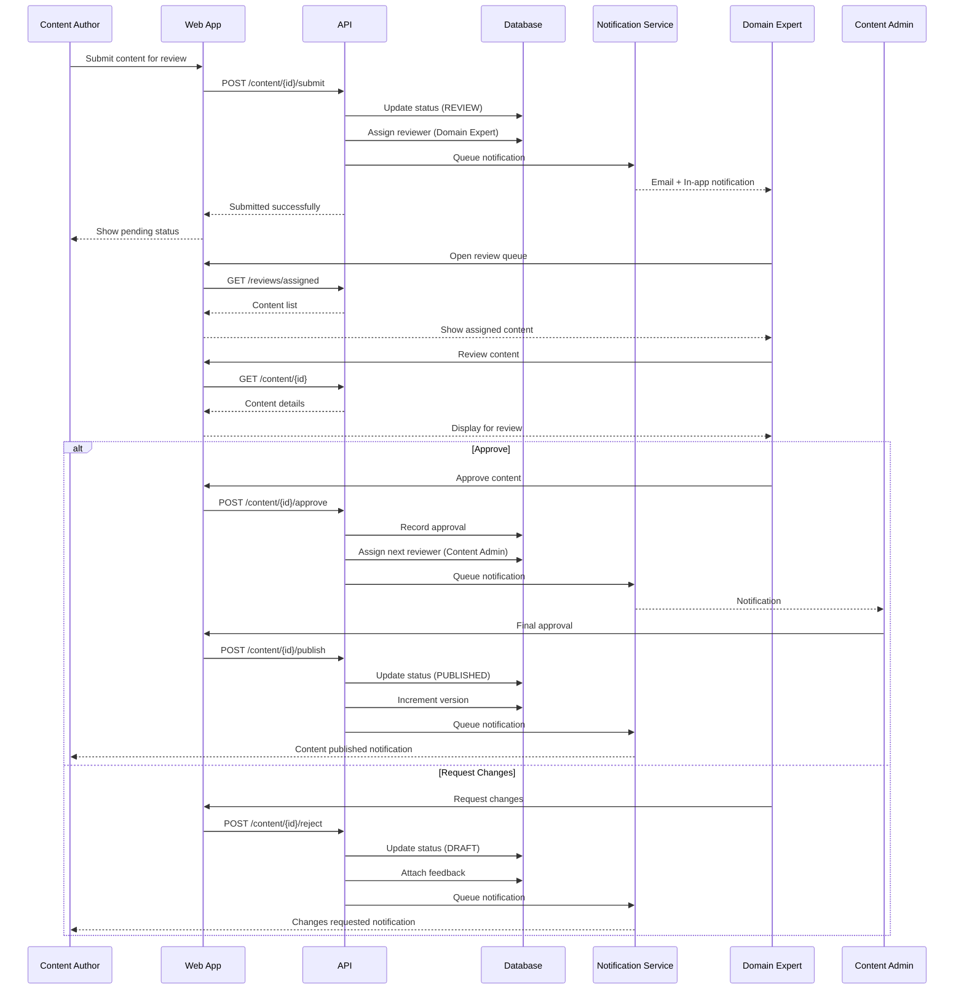
```mermaid
sequenceDiagram
    participant CA as Content Author
    participant W as Web App
    participant A as API
    participant D as Database
    participant N as Notification Service
    participant DE as Domain Expert
    participant AD as Content Admin

    CA->>W: Submit content for review
    W->>A: POST /content/{id}/submit
    A->>D: Update status (REVIEW)
    A->>D: Assign reviewer (Domain Expert)
    A->>N: Queue notification
    N-->>DE: Email + In-app notification
    A-->>W: Submitted successfully
    W-->>CA: Show pending status

    DE->>W: Open review queue
    W->>A: GET /reviews/assigned
    A-->>W: Content list
    W-->>DE: Show assigned content

    DE->>W: Review content
    W->>A: GET /content/{id}
    A-->>W: Content details
    W-->>DE: Display for review

    alt Approve
        DE->>W: Approve content
        W->>A: POST /content/{id}/approve
        A->>D: Record approval
        A->>D: Assign next reviewer (Content Admin)
        A->>N: Queue notification
        N-->>AD: Notification

        AD->>W: Final approval
        W->>A: POST /content/{id}/publish
        A->>D: Update status (PUBLISHED)
        A->>D: Increment version
        A->>N: Queue notification
        N-->>CA: Content published notification
    else Request Changes
        DE->>W: Request changes
        W->>A: POST /content/{id}/reject
        A->>D: Update status (DRAFT)
        A->>D: Attach feedback
        A->>N: Queue notification
        N-->>CA: Changes requested notification
    end
```

### 12.5 User Authentication Flow

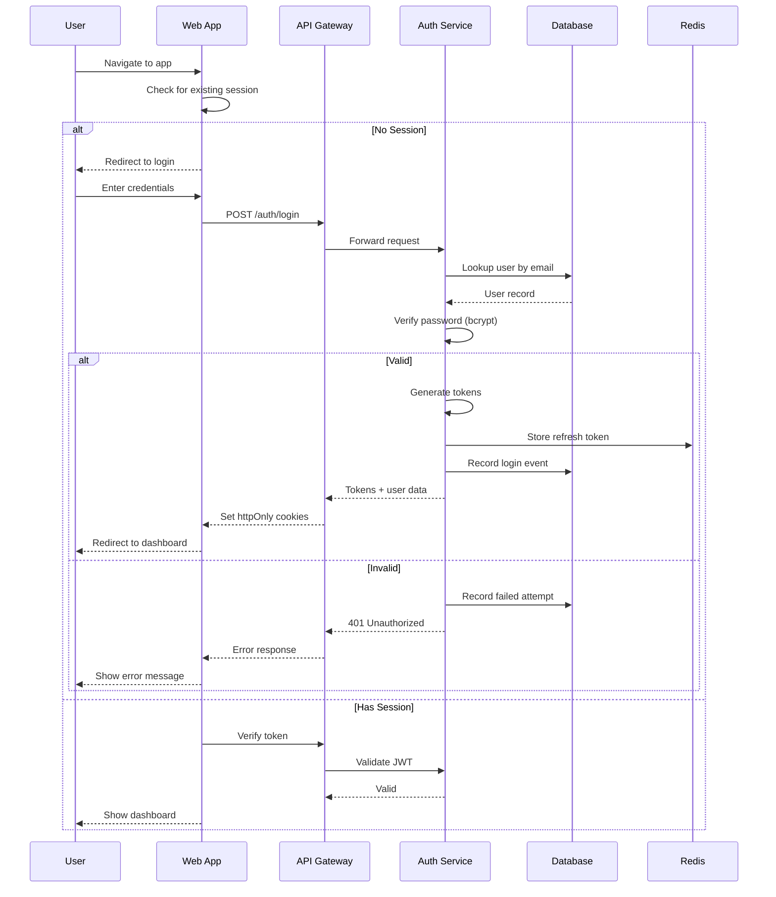
```mermaid
sequenceDiagram
    participant U as User
    participant W as Web App
    participant G as API Gateway
    participant A as Auth Service
    participant D as Database
    participant R as Redis

    U->>W: Navigate to app
    W->>W: Check for existing session

    alt No Session
        W-->>U: Redirect to login

        U->>W: Enter credentials
        W->>G: POST /auth/login
        G->>A: Forward request

        A->>D: Lookup user by email
        D-->>A: User record

        A->>A: Verify password (bcrypt)

        alt Valid
            A->>A: Generate tokens
            A->>R: Store refresh token
            A->>D: Record login event
            A-->>G: Tokens + user data
            G-->>W: Set httpOnly cookies
            W-->>U: Redirect to dashboard
        else Invalid
            A->>D: Record failed attempt
            A-->>G: 401 Unauthorized
            G-->>W: Error response
            W-->>U: Show error message
        end

    else Has Session
        W->>G: Verify token
        G->>A: Validate JWT
        A-->>G: Valid
        W-->>U: Show dashboard
    end
```

---

## 13. Cross-Cutting Concerns

### 13.1 Multi-Tenancy

| Aspect | Implementation |
|--------|----------------|
| **Data Isolation** | organisationId in all tables, enforced in middleware |
| **Query Filtering** | All queries include WHERE organisation_id = ? |
| **API Context** | Organisation ID extracted from JWT, injected into request context |
| **Validation** | Resource access validated against user's organisation |
| **Cross-Tenant** | Explicitly prohibited; no queries can span organisations |

```typescript
// Tenant middleware example
const tenantMiddleware = (req, res, next) => {
  const organisationId = req.user.organisationId;
  if (!organisationId) {
    return res.status(403).json({ error: 'No organisation context' });
  }
  req.tenantId = organisationId;
  // Inject into database queries
  req.db = req.db.where({ organisation_id: organisationId });
  next();
};
```

### 13.2 Audit Trail

| Aspect | Implementation |
|--------|----------------|
| **Scope** | All content changes, user actions, system events |
| **Storage** | Dedicated audit_logs table, immutable |
| **Retention** | 7 years for compliance |
| **Access** | Admin-only, filterable by user/content/action |

#### Audit Log Schema

| Field | Type | Description |
|-------|------|-------------|
| id | UUID | Audit entry ID |
| timestamp | DateTime | When action occurred |
| organisationId | UUID | Tenant context |
| userId | UUID | Who performed action |
| userEmail | String | User email (denormalised) |
| action | Enum | Action type (CREATED, UPDATED, etc.) |
| resourceType | String | Entity type (wine, module, etc.) |
| resourceId | UUID | Entity ID |
| resourceTitle | String | Entity title (denormalised) |
| previousState | JSON | State before change |
| newState | JSON | State after change |
| reason | String | Optional reason/comment |
| ipAddress | String | Client IP |
| userAgent | String | Client user agent |

### 13.3 Internationalisation Readiness

| Aspect | Implementation | Status |
|--------|----------------|--------|
| **Locale Field** | All content entities have locale field | MVP (en-GB only) |
| **UI Strings** | Extracted to resource files | MVP ready |
| **Date/Time** | Stored as UTC, displayed in user timezone | MVP ready |
| **Currency** | Abstracted formatting | MVP ready (GBP) |
| **Number Formats** | Locale-aware formatting | MVP ready |
| **Translations** | Infrastructure ready, content Phase 2 | Planned |

### 13.4 Feature Flags

| Purpose | Implementation |
|---------|----------------|
| **Gradual Rollout** | Feature flags for new features |
| **A/B Testing** | Variant flags for experiments |
| **Kill Switch** | Disable features without deployment |
| **Beta Features** | Enable for specific organisations |

```json
{
  "features": {
    "adaptive-learning": { "enabled": false, "phase": "phase-2" },
    "sso-integration": { "enabled": false, "phase": "phase-2" },
    "advanced-analytics": { "enabled": false, "phase": "phase-3" },
    "scenario-branching-v2": { "enabled": true, "rollout": 100 }
  }
}
```

### 13.5 Error Handling

| Layer | Strategy |
|-------|----------|
| **Controller** | Catch known errors, format response |
| **Service** | Throw domain-specific errors |
| **Repository** | Throw data access errors |
| **Middleware** | Global error handler, logging |

#### Error Response Format

```json
{
  "error": {
    "code": "RESOURCE_NOT_FOUND",
    "message": "Wine not found",
    "details": {
      "resourceType": "wine",
      "resourceId": "uuid"
    },
    "requestId": "uuid",
    "timestamp": "2026-01-20T10:30:00Z"
  }
}
```

#### Error Codes

| Code | HTTP Status | Description |
|------|-------------|-------------|
| VALIDATION_ERROR | 400 | Invalid request data |
| AUTHENTICATION_REQUIRED | 401 | Missing or invalid token |
| PERMISSION_DENIED | 403 | Insufficient permissions |
| RESOURCE_NOT_FOUND | 404 | Resource does not exist |
| CONFLICT | 409 | Resource state conflict |
| RATE_LIMITED | 429 | Too many requests |
| INTERNAL_ERROR | 500 | Unexpected server error |
| SERVICE_UNAVAILABLE | 503 | Temporary unavailability |

---

## 14. Technology Stack Summary

### 14.1 Technology Choices

| Layer | Technology | Version | Rationale |
|-------|------------|---------|-----------|
| **Frontend** | Next.js | 14.x | SSR, performance, React ecosystem |
| | React | 18.x | Component model, hooks, concurrent features |
| | Tailwind CSS | 3.x | Utility-first, rapid development |
| | TypeScript | 5.x | Type safety, developer experience |
| **API Gateway** | AWS API Gateway | — | Managed service, AWS integration |
| **Backend** | Node.js | 20.x LTS | JavaScript ecosystem, async I/O |
| | Express/Fastify | 4.x/4.x | Mature, performant, well-documented |
| | TypeScript | 5.x | Type safety, maintainability |
| **Learning Engine** | Python | 3.11 | ML libraries, text processing |
| | FastAPI | 0.109+ | Async, automatic docs, validation |
| **Database** | PostgreSQL | 15.x | Relational, JSON, FTS, mature |
| **Cache** | Redis | 7.x | Performance, pub/sub, queues |
| **Search** | PostgreSQL FTS | — | MVP simplicity (Elasticsearch Phase 2) |
| **Queue** | Redis Streams | — | MVP (AWS SQS for scale) |
| **Storage** | AWS S3 | — | Scalable, cost-effective |
| **CDN** | CloudFront | — | AWS integration, global |
| **Container** | Docker | 24.x | Standardisation, portability |
| **Orchestration** | AWS ECS | — | Simplicity (EKS for scale) |
| **IaC** | Terraform | 1.x | Cloud-agnostic, reproducible |
| **CI/CD** | GitHub Actions | — | Repository integration |

### 14.2 Development Tools

| Tool | Purpose |
|------|---------|
| ESLint + Prettier | Code linting and formatting |
| Jest + Testing Library | Unit and component testing |
| Playwright | End-to-end testing |
| Storybook | Component documentation |
| OpenAPI/Swagger | API documentation |
| Docker Compose | Local development |
| pgAdmin | Database management |
| Redis Commander | Cache inspection |

### 14.3 Monitoring Tools

| Tool | Purpose |
|------|---------|
| CloudWatch | Logs, metrics, alarms |
| Sentry | Error tracking |
| X-Ray (Phase 2) | Distributed tracing |

---

## 15. Appendices

### 15.1 Glossary

| Term | Definition |
|------|------------|
| **Tenant** | An organisation using the platform (multi-tenant isolation) |
| **Learning Engine** | The patent-pending system that generates training content |
| **Curriculum** | Complete set of learning modules for an organisation |
| **Distractor** | Plausible but incorrect answer option in a quiz question |
| **Progressive Disclosure** | Content layering (Bronze/Silver/Gold depth) |
| **EARS** | Easy Approach to Requirements Syntax |
| **C4 Model** | Context, Container, Component, Code architecture diagrams |
| **SLA** | Service Level Agreement |
| **RPO** | Recovery Point Objective (data loss tolerance) |
| **RTO** | Recovery Time Objective (downtime tolerance) |

### 15.2 Architecture Decision Records (ADRs)

#### ADR-001: Multi-Tenant Data Model

| Aspect | Decision |
|--------|----------|
| **Context** | Need to support multiple organisations with data isolation |
| **Decision** | Shared database with tenant ID filtering |
| **Rationale** | Cost-efficient, simpler operations, adequate isolation for B2B SaaS |
| **Alternatives** | Separate databases per tenant (rejected: operational complexity) |
| **Consequences** | All queries must include tenant filter; middleware enforcement |

#### ADR-002: Learning Engine as Separate Service

| Aspect | Decision |
|--------|----------|
| **Context** | Learning Engine contains patent-pending IP |
| **Decision** | Deploy as isolated, separately secured service |
| **Rationale** | IP protection, independent scaling, security boundary |
| **Alternatives** | Embedded in Core API (rejected: security risk) |
| **Consequences** | Additional service to maintain; async communication pattern |

#### ADR-003: Event-Driven Curriculum Generation

| Aspect | Decision |
|--------|----------|
| **Context** | Curriculum generation can take 1-5 minutes |
| **Decision** | Queue-based async processing with job tracking |
| **Rationale** | Non-blocking, scalable, progress visibility |
| **Alternatives** | Synchronous generation (rejected: timeout issues) |
| **Consequences** | Polling/webhook for completion; job status UI |

#### ADR-004: JWT-Based Authentication

| Aspect | Decision |
|--------|----------|
| **Context** | Need stateless authentication for API |
| **Decision** | JWT with RS256 signing, short-lived access + refresh tokens |
| **Rationale** | Industry standard, stateless, scalable |
| **Alternatives** | Session-based (rejected: scaling complexity) |
| **Consequences** | Token refresh flow; blacklist for revocation |

#### ADR-005: PostgreSQL for Primary Database

| Aspect | Decision |
|--------|----------|
| **Context** | Need relational data with some JSON flexibility |
| **Decision** | PostgreSQL 15 as primary data store |
| **Rationale** | Relational integrity, JSON support, FTS, mature ecosystem |
| **Alternatives** | MySQL (less JSON support), MongoDB (less relational) |
| **Consequences** | Full-text search via PostgreSQL FTS; consider Elasticsearch later |

### 15.3 Reference Documents

| Document ID | Title | Relevance |
|-------------|-------|-----------|
| SS-WS3-PRD | Product Requirements Document | Feature scope, personas, user journeys |
| SS-WS3-EARS | Formal Requirements Specification | 285 requirements with traceability |
| SS-WS3.0-CDM | Content Domain Model | Entity definitions, relationships |
| SS-WS3.0-CLS | Content Lifecycle Specification | State machines, workflows |
| SS-WS3.0-ORG | Organization Model | Multi-tenant structure, roles |
| SS-WS3.0-CMS-FR | CMS Functional Requirements | CMS feature requirements |
| SS-WS3.0-CMS-WF | CMS Workflow Specification | Detailed workflow processes |
| SS-WS3.0-CMS-IE | Content Import/Export Specification | Import/export schemas |
| SS-WS3.0-LE-REQ | Learning Engine Requirements | Content generation requirements |

### 15.4 Diagram Summary

| Section | Diagram | Type |
|---------|---------|------|
| 3.1 | System Context | C4 Context |
| 4.1 | Container Architecture | C4 Container |
| 8.1 | Authentication Flow | Sequence |
| 8.2 | Token Refresh Flow | Sequence |
| 9.1 | Deployment Topology | Infrastructure |
| 11.1 | Content Lifecycle | State Machine |
| 11.2 | User Invitation | State Machine |
| 11.3 | Quiz Attempt | State Machine |
| 11.4 | Scenario Attempt | State Machine |
| 11.5 | Generation Job | State Machine |
| 11.6 | Import Job | State Machine |
| 12.1 | Wine Import Flow | Sequence |
| 12.2 | Quiz Generation Flow | Sequence |
| 12.3 | Quiz Attempt Flow | Sequence |
| 12.4 | Content Approval Flow | Sequence |
| 12.5 | User Authentication | Sequence |

**Total: 16 diagrams**

### 15.5 Revision History

| Version | Date | Author | Changes |
|---------|------|--------|---------|
| 1.0 | 2026-01-20 | Obi Wan | Initial draft |

---

*End of High-Level Design Document*

**CONFIDENTIAL — Sommelier Spark**
