# Product Requirements Document
# Sommelier Spark

## Document Information

| Field | Value |
|-------|-------|
| **Document ID** | SS-WS3-PRD |
| **Version** | 1.0 |
| **Date** | 2026-01-20 |
| **Author** | Obi Wan |
| **Status** | DRAFT |
| **Classification** | CONFIDENTIAL |
| **Workstream** | WS3 (Specification Suite) |
| **Related Documents** | SS-WS3.0-CDM, SS-WS3.0-CLS, SS-WS3.0-ORG, SS-WS3.0-CMS-FR, SS-WS3.0-CMS-WF, SS-WS3.0-LE-REQ, SS-WS3.0-LE-CGR, SS-WS3.0-LE-CLM |

---

## Table of Contents

1. [Executive Summary](#1-executive-summary)
2. [Problem Statement](#2-problem-statement)
3. [User Personas](#3-user-personas)
4. [Product Overview](#4-product-overview)
5. [Functional Requirements Summary](#5-functional-requirements-summary)
6. [User Journeys](#6-user-journeys)
7. [Non-Functional Requirements](#7-non-functional-requirements)
8. [Release Strategy](#8-release-strategy)
9. [Success Metrics & KPIs](#9-success-metrics--kpis)
10. [Risks & Mitigations](#10-risks--mitigations)
11. [Dependencies](#11-dependencies)
12. [Appendices](#12-appendices)

---

## 1. Executive Summary

### 1.1 Product Vision

**Sommelier Spark** is an AI-powered wine training platform designed specifically for the hospitality industry. The platform transforms any venue's wine list into a tailored training curriculum, enabling front-of-house staff to develop deep wine knowledge specific to the wines they actually serve.

### 1.2 Value Proposition

> *"Transform any wine list into a tailored training curriculum in minutes, not months."*

Sommelier Spark solves the fundamental disconnect between generic wine education and venue-specific wine knowledge. Unlike traditional wine courses that teach abstract theory, Sommelier Spark generates training content directly from a venue's wine list, ensuring staff learn exactly what they need to recommend, describe, and sell the wines on their menu.

### 1.3 Target Market

| Segment | Description | UK Market Size |
|---------|-------------|----------------|
| **Restaurants** | Fine dining, casual dining, gastropubs | ~85,000 establishments |
| **Wine Bars** | Dedicated wine-focused venues | ~5,000 establishments |
| **Hotels** | F&B operations in hotels | ~10,000 establishments |
| **Hospitality Groups** | Multi-venue operators | ~2,000 groups |

**Primary Geographic Focus:** United Kingdom (MVP)

### 1.4 MVP Launch Target

**Target Date:** 1 March 2026

### 1.5 Success Metrics Preview

| Metric | 6-Month Target | 12-Month Target |
|--------|----------------|-----------------|
| Organisations Onboarded | 50 | 200 |
| Active Users | 1,250 | 5,000 |
| Monthly Recurring Revenue | £25,000 | £100,000 |
| Bronze Certifications Issued | 500 | 2,500 |
| Net Promoter Score | 40+ | 50+ |

---

## 2. Problem Statement

### 2.1 Current State of Wine Training

The hospitality industry faces a persistent challenge: staff wine knowledge is inconsistent, expensive to develop, and difficult to maintain. Current approaches fail to meet the needs of modern hospitality operations.

#### Traditional Training Methods

| Method | Limitations |
|--------|-------------|
| **WSET/Court of Master Sommeliers** | Expensive (£200-£2,000+), generic curriculum, time-intensive |
| **Supplier-led Training** | Biased toward specific producers, inconsistent quality |
| **On-the-job Learning** | Unstructured, dependent on senior staff availability |
| **Generic E-learning** | Not venue-specific, low engagement, poor retention |

### 2.2 Pain Points

#### For Venue Managers

| Pain Point | Impact |
|------------|--------|
| **High staff turnover** | Average 30% annual turnover in hospitality; training investment lost |
| **Inconsistent guest experience** | Staff knowledge varies wildly; guest recommendations unreliable |
| **Time constraints** | No time for structured training during service hours |
| **No visibility into competency** | Cannot identify knowledge gaps or track improvement |
| **Wine list changes** | Menu updates require retraining; no systematic approach |

#### For Staff

| Pain Point | Impact |
|------------|--------|
| **Information overload** | Generic courses cover thousands of wines; irrelevant to daily work |
| **No venue context** | Courses teach theory, not how to sell specific wines on their list |
| **Lack of confidence** | Fear of customer questions leads to avoidance behaviour |
| **Career progression unclear** | No structured path from novice to expert |

#### For Venue Owners

| Pain Point | Impact |
|------------|--------|
| **ROI unclear** | Cannot measure training impact on wine sales |
| **Compliance risk** | No documentation of staff competency |
| **Competitive disadvantage** | Better-trained competitors win customers |

### 2.3 Market Opportunity

#### Why Now?

| Factor | Opportunity |
|--------|-------------|
| **Post-pandemic recovery** | Hospitality rebuilding; investment in staff quality |
| **Staff shortages** | Upskilling existing staff more efficient than recruiting |
| **Digital transformation** | Industry adoption of technology accelerated |
| **Wine premiumisation** | Consumers trading up; staff knowledge critical for upselling |
| **Experience economy** | Guests expect knowledgeable service; wine as theatre |

#### Competitive Landscape

| Competitor Type | Weakness Sommelier Spark Addresses |
|-----------------|-----------------------------------|
| Traditional wine schools | Not venue-specific, expensive, time-intensive |
| Generic LMS platforms | No wine domain expertise, no content generation |
| Supplier apps | Biased content, limited to specific portfolios |
| Paper-based training | No tracking, no assessment, not scalable |

### 2.4 The Sommelier Spark Solution

Sommelier Spark addresses these problems through:

1. **Venue-Specific Curriculum**: Training generated directly from each venue's wine list
2. **Intelligent Assessment**: Bronze/Silver/Gold certification pathway with adaptive difficulty
3. **Scenario-Based Learning**: Interactive customer simulations for practical skills
4. **Real-Time Visibility**: Manager dashboards showing team progress and gaps
5. **Continuous Updates**: Curriculum automatically refreshes when wine list changes

---

## 3. User Personas

### 3.1 Trainee/Learner (Primary User)

```
Name: Sophie Chen
Role: Server / Junior Sommelier
Age: 24
Experience: 2 years in hospitality
```

#### Background and Context

Sophie works at a mid-market restaurant with a 75-wine list. She has basic wine knowledge from a brief induction but struggles to confidently recommend wines to customers. She's interested in building a career in hospitality and sees wine expertise as valuable for progression.

#### Goals and Motivations

| Goal | Motivation |
|------|------------|
| Build confidence recommending wines | Avoid awkward moments when customers ask questions |
| Learn the specific wines on her venue's list | Be genuinely helpful to guests |
| Earn certifications | Career advancement, recognition from management |
| Fit learning around work schedule | Cannot attend day-long courses |
| Track personal progress | Feel sense of achievement and growth |

#### Pain Points

| Pain Point | Current Workaround |
|------------|-------------------|
| Doesn't know wines on the list | Asks senior staff (when available) |
| Forgets information quickly | Writes notes, but loses them |
| No time for courses | Skips training, feels guilty |
| Afraid of customer questions | Deflects to manager or makes generic suggestions |
| No clear learning path | Picks up random facts, no structure |

#### Key Tasks in Sommelier Spark

1. Complete daily 10-minute learning sessions
2. Study wines on venue's list
3. Take Bronze/Silver/Gold certification quizzes
4. Practice customer scenarios
5. Review weak areas flagged by the system
6. Track personal progress against team

#### Success Criteria

- Achieve Bronze certification within 2 weeks
- Confidence to recommend wines without referring to manager
- Ability to describe any wine on the list
- Achieve Silver certification within 3 months

---

### 3.2 Restaurant Manager (Key Decision Maker)

```
Name: James Morrison
Role: Restaurant Manager
Age: 38
Experience: 15 years in hospitality, 5 as manager
```

#### Background and Context

James manages a busy restaurant with 25 front-of-house staff. He's responsible for training, scheduling, and guest satisfaction. He has solid wine knowledge himself but struggles to transfer this to his team consistently. He reports to the venue owner on staff development metrics.

#### Goals and Motivations

| Goal | Motivation |
|------|------------|
| Ensure all staff meet minimum wine competency | Guest satisfaction, reduce complaints |
| Track team progress at a glance | Report to owner, identify issues early |
| Reduce time spent on ad-hoc training | Focus on operations, not teaching |
| Onboard new staff efficiently | High turnover requires fast ramp-up |
| Demonstrate ROI on training investment | Justify subscription cost to owner |

#### Pain Points

| Pain Point | Current Workaround |
|------------|-------------------|
| Cannot assess staff knowledge objectively | Relies on gut feel, informal observation |
| Training is inconsistent | Different staff get different information |
| No time for structured training | Squeezes in 5-minute chats before service |
| New starters take months to be effective | Pairs with experienced staff, hope for best |
| Cannot prove training value to owner | Anecdotal feedback only |

#### Key Tasks in Sommelier Spark

1. Upload/import venue wine list
2. Invite and onboard team members
3. Set training requirements and deadlines
4. Monitor team progress dashboard
5. Identify struggling staff for additional support
6. Generate reports for owner
7. Update wine list when menu changes

#### Success Criteria

- 100% of staff achieve Bronze within 30 days
- Visible improvement in guest satisfaction scores
- Reduced time spent on ad-hoc training
- Clear data to present in owner meetings

---

### 3.3 Venue Owner (Budget Holder)

```
Name: Eleanor Ashworth
Role: Restaurant Owner / Director
Age: 52
Experience: 20 years in hospitality, owns 3 venues
```

#### Background and Context

Eleanor owns a small hospitality group with three restaurants. She's focused on profitability, brand consistency, and long-term business growth. She doesn't manage day-to-day operations but reviews KPIs monthly and approves significant investments.

#### Goals and Motivations

| Goal | Motivation |
|------|------------|
| Increase wine sales revenue | Higher margins than food; key profit driver |
| Ensure consistent brand experience across venues | Reputation management |
| Retain and develop talented staff | Reduce recruitment costs |
| Demonstrate professionalism to investors | Documented training = operational maturity |
| Competitive differentiation | Known for wine expertise |

#### Pain Points

| Pain Point | Current Workaround |
|------------|-------------------|
| Cannot quantify training ROI | Approves training budget on faith |
| Inconsistency between venues | Each manager does training differently |
| No certification or proof of competency | Verbal assurances only |
| Wine knowledge lost when staff leave | Starts from scratch with each hire |

#### Key Tasks in Sommelier Spark

1. Review certification metrics across venues (quarterly)
2. Compare team progress across locations
3. Assess ROI of training investment
4. Approve subscription tier/budget

#### Success Criteria

- Measurable increase in wine sales
- Consistent certification rates across venues
- Staff retention improvement
- Professional documentation for stakeholders

---

### 3.4 Content Author (Internal Role)

```
Name: Marcus Webb
Role: Content Author / Wine Buyer
Age: 34
Experience: WSET Diploma, 10 years in wine trade
```

#### Background and Context

Marcus is a wine professional who creates custom training content for organisations. He has deep wine expertise but isn't necessarily a technical writer. He works with organisations to create content that reflects their specific wine programmes and service standards.

#### Goals and Motivations

| Goal | Motivation |
|------|------------|
| Create accurate, engaging wine content | Professional pride, user engagement |
| Efficiently produce high-quality materials | Manage workload across multiple clients |
| Get content approved quickly | Meet deadlines, satisfy clients |
| Build library of reusable content | Improve efficiency over time |

#### Pain Points

| Pain Point | Current Workaround |
|------------|-------------------|
| Content creation is time-consuming | Templates, copy-paste from previous work |
| Review cycles are unpredictable | Follow up repeatedly, delays |
| No standard format or structure | Each client wants different things |
| Hard to track what content exists | Spreadsheets, folder structures |

#### Key Tasks in Sommelier Spark

1. Create custom quizzes and questions
2. Build venue-specific scenarios
3. Add tasting notes and pairing information
4. Submit content for review
5. Respond to reviewer feedback
6. Update content when wines change

#### Success Criteria

- Content published within review SLA
- High learner engagement with content
- Minimal revision cycles
- Content reusability across organisations

---

### 3.5 Content Admin (Platform Role)

```
Name: Dr. Rachel Tomlinson
Role: Content Administrator / Head of Content
Age: 45
Experience: Master of Wine, 20 years in wine education
```

#### Background and Context

Rachel oversees all content on the Sommelier Spark platform. She ensures content quality, accuracy, and pedagogical effectiveness. She manages the global wine library and approves content for publication.

#### Goals and Motivations

| Goal | Motivation |
|------|------------|
| Maintain highest content quality | Platform reputation, learner outcomes |
| Ensure accuracy of wine information | Professional credibility |
| Efficient content workflow | Scale content production |
| Consistent tone and style | Brand coherence |
| Build comprehensive wine library | Platform value proposition |

#### Pain Points

| Pain Point | Current Workaround |
|------------|-------------------|
| Volume of content to review | Prioritise, risk missing issues |
| Inconsistent submissions | Detailed style guides, reject poor work |
| Tracking review status | Manual tracking, status meetings |
| Maintaining accuracy as wine info changes | Periodic audits, flag outdated content |

#### Key Tasks in Sommelier Spark

1. Review and approve submitted content
2. Provide feedback to content authors
3. Manage global wine library
4. Archive outdated content
5. Monitor content quality metrics
6. Train and support content authors

#### Success Criteria

- Review turnaround within SLA
- Zero critical errors in published content
- Growing wine library with comprehensive coverage
- Positive author satisfaction with review process

---

### 3.6 Domain Expert (Reviewer Role)

```
Name: Olivier Durand MS
Role: Domain Expert / Master Sommelier
Age: 50
Experience: Master Sommelier, 25 years in fine dining
```

#### Background and Context

Olivier is a Master Sommelier who reviews content for technical accuracy. He doesn't create content but ensures what's published meets the highest standards of wine knowledge. He may review content part-time alongside other professional commitments.

#### Goals and Motivations

| Goal | Motivation |
|------|------------|
| Ensure wine content is accurate | Professional reputation |
| Educate the next generation | Give back to industry |
| Efficient review process | Balance with other commitments |
| Share expertise effectively | Impact at scale |

#### Pain Points

| Pain Point | Current Workaround |
|------------|-------------------|
| Reviewing poorly-prepared content | Extensive comments, reject |
| Limited time for reviews | Prioritise, batch review |
| Lack of context on content purpose | Ask for clarification |
| No feedback on how reviews help | Hope content improves |

#### Key Tasks in Sommelier Spark

1. Review assigned content for accuracy
2. Provide expert feedback and corrections
3. Approve or reject submissions
4. Advise on complex wine topics

#### Success Criteria

- Reviews completed within SLA
- Authors learn from feedback
- Published content reflects expert standards
- Efficient use of limited time

---

### 3.7 Persona Summary

| Persona | Type | Primary Goal | Key Metric |
|---------|------|--------------|------------|
| Trainee/Learner | End User | Learn wines, earn certifications | Certifications achieved |
| Restaurant Manager | Admin/Buyer | Team competency, visibility | % team certified |
| Venue Owner | Budget Holder | ROI, consistency | Wine sales uplift |
| Content Author | Contributor | Create quality content | Content published |
| Content Admin | Platform Admin | Content quality | Review turnaround |
| Domain Expert | Reviewer | Accuracy assurance | Reviews completed |

---

## 4. Product Overview

### 4.1 Core Components

Sommelier Spark comprises four integrated components that together deliver the complete wine training solution.

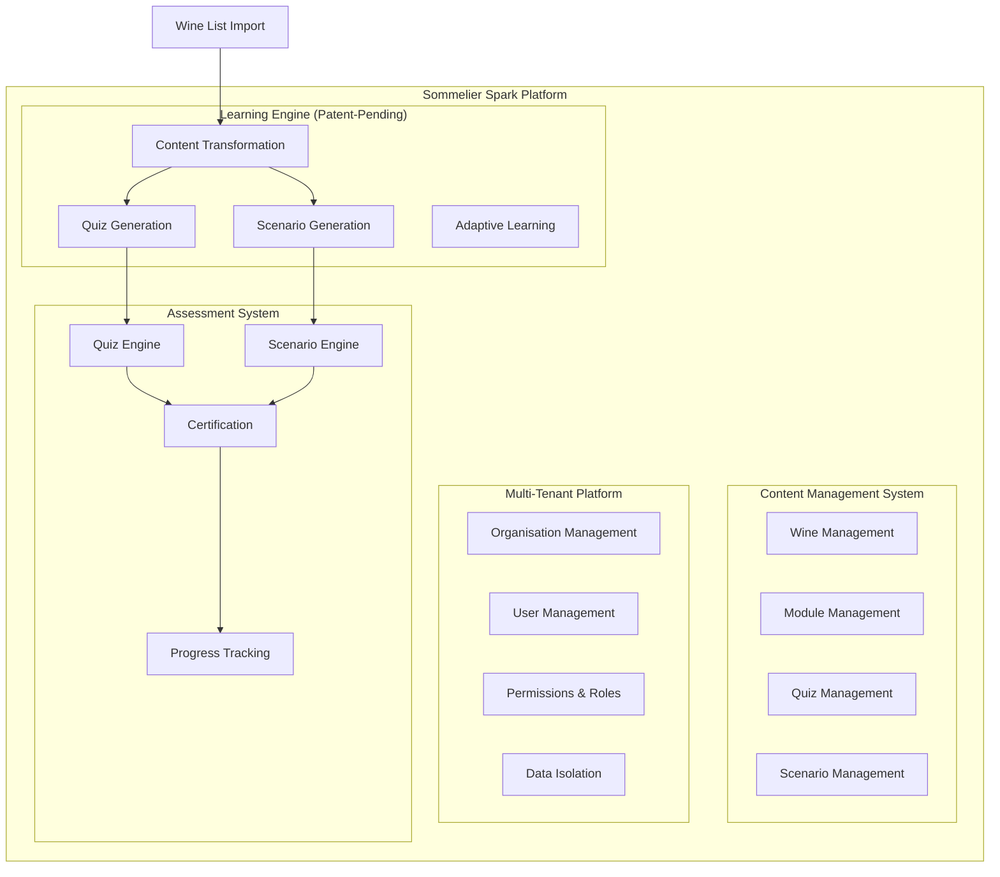

#### 4.1.1 Learning Engine (Patent-Pending)

The Learning Engine is Sommelier Spark's core intellectual property. It automatically transforms a venue's wine list into a tailored training curriculum.

| Capability | Description | Source Document |
|------------|-------------|-----------------|
| **Content Transformation** | Converts wine list data into learning modules | SS-WS3.0-LE-CLM |
| **Quiz Generation** | Creates assessment questions from wine attributes | SS-WS3.0-LE-CGR |
| **Scenario Generation** | Builds interactive customer simulations | SS-WS3.0-LE-CGR |
| **Adaptive Learning** | Adjusts difficulty based on learner performance | SS-WS3.0-LE-REQ |
| **Gap Analysis** | Identifies knowledge gaps and recommends focus areas | SS-WS3.0-LE-CLM |

#### 4.1.2 Content Management System

The CMS enables creation, review, and publication of all educational content.

| Capability | Requirements | Source Document |
|------------|--------------|-----------------|
| **Wine Management** | 24 requirements (CMS-W-001 to CMS-W-024) | SS-WS3.0-CMS-FR |
| **Module Management** | 16 requirements (CMS-M-001 to CMS-M-016) | SS-WS3.0-CMS-FR |
| **Quiz Management** | 29 requirements (CMS-Q-001 to CMS-Q-029) | SS-WS3.0-CMS-FR |
| **Scenario Management** | 25 requirements (CMS-SC-001 to CMS-SC-025) | SS-WS3.0-CMS-FR |
| **Workflow Management** | 6 workflows documented | SS-WS3.0-CMS-WF |

#### 4.1.3 Multi-Tenant Platform

The platform supports multiple organisations with complete data isolation.

| Capability | Description | Source Document |
|------------|-------------|-----------------|
| **Organisation Management** | Create and configure organisations | SS-WS3.0-ORG |
| **User Management** | Invite, manage, and deactivate users | SS-WS3.0-ORG |
| **Role-Based Access Control** | Learner, Admin, Owner, System Admin roles | SS-WS3.0-ORG |
| **Data Isolation** | Row-level security, organisation boundaries | SS-WS3.0-ORG |
| **Subscription Management** | Tier-based feature access | SS-WS3.0-ORG |

#### 4.1.4 Assessment System

The assessment system evaluates learner knowledge through quizzes and scenarios.

| Capability | Description | Source Document |
|------------|-------------|-----------------|
| **Quiz Engine** | Timed, scored assessments with feedback | SS-WS3.0-CDM |
| **Scenario Engine** | Branching dialogue simulations | SS-WS3.0-CDM |
| **Certification** | Bronze (70%), Silver (80%), Gold (90%) | SS-WS3.0-CDM |
| **Progress Tracking** | Individual and team progress visibility | SS-WS3.0-LE-REQ |

### 4.2 Key Differentiators

| Differentiator | Description | Competitive Advantage |
|----------------|-------------|----------------------|
| **Wine List → Curriculum Transformation** | Automatically generate training from any wine list | No competitor offers this; unique IP |
| **Venue-Specific Training** | Content specific to wines staff actually serve | vs. generic wine courses |
| **Scenario-Based Learning** | Interactive customer simulations with branching | vs. passive video/reading |
| **Real-Time Gap Analysis** | Identifies exactly what each learner needs | vs. one-size-fits-all courses |
| **Three-Tier Certification** | Clear progression path: Bronze → Silver → Gold | vs. pass/fail or no certification |
| **Manager Visibility** | Dashboard showing team progress, gaps, trends | vs. no visibility into competency |

### 4.3 Platform Architecture Overview

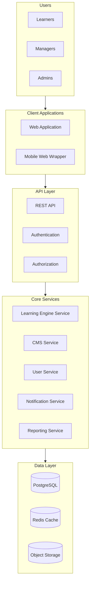

### 4.4 Content Model Summary

The platform manages the following content entities:

| Entity | Description | Key Attributes |
|--------|-------------|----------------|
| **Wine** | Individual wines in the learning library | name, producer, vintage, region, type, tiers of content |
| **Module** | Learning units containing lessons | title, description, category, estimated time |
| **Lesson** | Individual learning content within modules | title, rich text content, order |
| **Quiz** | Assessment containing questions | title, tier, passing score, time limit |
| **Question** | Individual assessment items | text, type, options, explanation |
| **Scenario** | Interactive customer simulations | title, customer persona, decision tree |

See SS-WS3.0-CDM (Content Domain Model) for complete entity definitions.

---

## 5. Functional Requirements Summary

### 5.1 CMS Requirements (159 Total)

The Content Management System requirements are fully documented in SS-WS3.0-CMS-FR. This section provides a summary by category.

#### 5.1.1 Requirements by Category

| Category | Code Prefix | Count | Must | Should | Could |
|----------|-------------|-------|------|--------|-------|
| Wine Management | CMS-W | 24 | 15 | 7 | 2 |
| Module Management | CMS-M | 16 | 10 | 4 | 2 |
| Quiz Management | CMS-Q | 29 | 16 | 10 | 3 |
| Scenario Management | CMS-SC | 25 | 14 | 9 | 2 |
| Search & Filtering | CMS-SR | 16 | 9 | 5 | 2 |
| Bulk Operations | CMS-BK | 15 | 5 | 9 | 1 |
| Reporting | CMS-RP | 13 | 2 | 9 | 2 |
| Audit Logging | CMS-AU | 12 | 8 | 4 | 0 |
| Non-Functional | CMS-NF | 9 | 6 | 3 | 0 |
| **Total** | | **159** | **85** | **60** | **14** |

#### 5.1.2 Priority Distribution

| Priority | Count | Percentage | MVP Inclusion |
|----------|-------|------------|---------------|
| **Must** | 85 | 53% | All included in MVP |
| **Should** | 60 | 38% | Prioritised subset |
| **Could** | 14 | 9% | Post-MVP |

#### 5.1.3 Key CMS Capabilities

**Wine Management (CMS-W)**
- Create, edit, view, delete wine entries
- Three-level progressive disclosure content (Quick Facts, Detailed Profile, Expert Insights)
- Wine relationships to quizzes and scenarios
- Bulk import from CSV
- Duplicate detection

**Module Management (CMS-M)**
- Create modules with lessons
- Drag-and-drop lesson reordering
- Tier classification (Bronze/Silver/Gold)
- Prerequisites and dependencies
- Estimated completion time

**Quiz Management (CMS-Q)**
- Multiple question types (single choice, multiple choice, true/false, matching)
- Question bank with reuse
- Pass threshold configuration by tier
- Time limits and randomisation
- Detailed explanations for learning

**Scenario Management (CMS-SC)**
- Decision tree building
- Customer persona configuration
- Branching dialogue paths
- Scoring and feedback
- Path validation (no dead ends)

### 5.2 Learning Engine Requirements (112 Total)

The Learning Engine requirements are fully documented in SS-WS3.0-LE-REQ. This section provides a summary by category.

#### 5.2.1 Requirements by Category

| Category | Code Prefix | Count | Must | Should | Could |
|----------|-------------|-------|------|--------|-------|
| Curriculum Generation | LE-CG | 18 | 10 | 7 | 1 |
| Quiz Generation | LE-QG | 19 | 12 | 6 | 1 |
| Scenario Generation | LE-SG | 17 | 9 | 7 | 1 |
| Adaptive Learning | LE-AL | 14 | 7 | 6 | 1 |
| Learning Paths | LE-LP | 12 | 7 | 4 | 1 |
| Quality Assurance | LE-QA | 13 | 9 | 4 | 0 |
| IP Protection | LE-IP | 10 | 6 | 4 | 0 |
| Performance | LE-PF | 9 | 4 | 4 | 1 |
| **Total** | | **112** | **64** | **42** | **6** |

#### 5.2.2 Priority Distribution

| Priority | Count | Percentage | MVP Inclusion |
|----------|-------|------------|---------------|
| **Must** | 64 | 57% | All included in MVP |
| **Should** | 42 | 38% | Prioritised subset |
| **Could** | 6 | 5% | Post-MVP |

#### 5.2.3 Key Learning Engine Capabilities

**Curriculum Generation (LE-CG)**
- Transform wine list into learning modules
- Automatic content organisation by region, type, category
- Coverage analysis and gap identification
- Module generation rules (minimum 3 wines, balanced difficulty)
- Refresh when wine list changes

**Quiz Generation (LE-QG)**
- Generate questions from wine attributes (region, grape, vintage, price, etc.)
- 18 question templates by attribute type
- Plausible distractor generation (12 distractor rules)
- Difficulty calibration (Bronze/Silver/Gold)
- Prevent question repetition

**Scenario Generation (LE-SG)**
- Generate customer scenarios from wine list
- 12 scenario templates by category
- Customer persona generation (8 persona attributes)
- Wine recommendation paths
- Dynamic scoring based on wine knowledge

**Adaptive Learning (LE-AL)**
- Track learner performance patterns
- Identify weak areas automatically
- Recommend focused study sessions
- Spaced repetition for retention
- Difficulty progression

### 5.3 Combined Requirements Summary

| Area | Document | Requirements | Must Have |
|------|----------|--------------|-----------|
| CMS | SS-WS3.0-CMS-FR | 159 | 85 (53%) |
| Learning Engine | SS-WS3.0-LE-REQ | 112 | 64 (57%) |
| **Total** | | **271** | **149 (55%)** |

---

## 6. User Journeys

### 6.1 Learner Journeys

#### 6.1.1 First-Time Onboarding

**Trigger:** Learner receives email invitation from manager

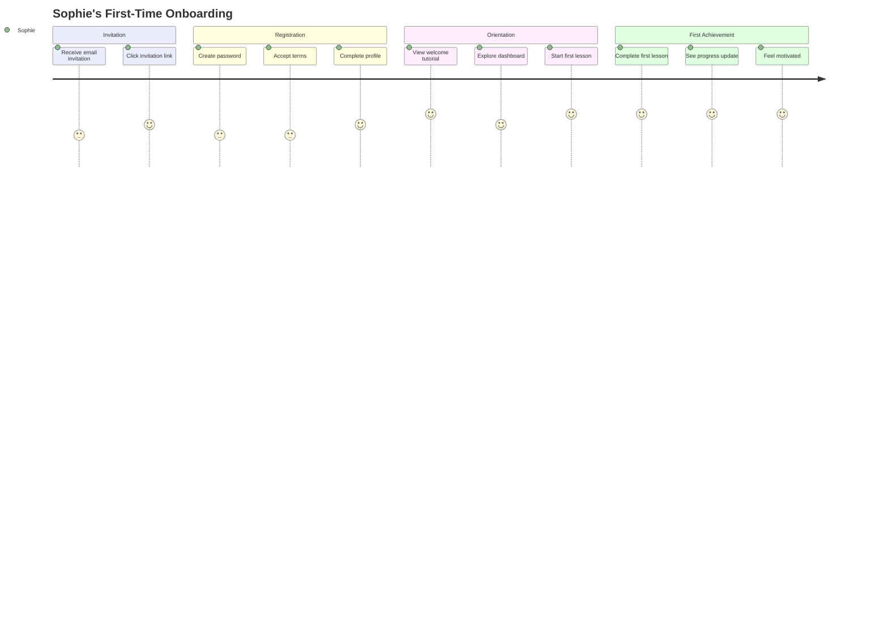

**Detailed Steps:**

| Step | Actor | Action | System Response | Success Criteria |
|------|-------|--------|-----------------|------------------|
| 1 | System | Send invitation email | Email delivered with unique link | Email delivered within 1 minute |
| 2 | Sophie | Click invitation link | Open registration page | Link works, shows venue context |
| 3 | Sophie | Create password | Validate password strength | Clear feedback on requirements |
| 4 | Sophie | Accept terms & privacy | Record acceptance | Timestamped consent |
| 5 | Sophie | Complete profile (name, job title) | Save profile | Profile saved, optional fields clear |
| 6 | System | Show welcome tutorial | 60-second orientation video | Skippable but encouraged |
| 7 | Sophie | View dashboard | Display personalised home | Shows venue wine list focus |
| 8 | Sophie | Start first recommended lesson | Open lesson content | Engaging, relevant content |
| 9 | Sophie | Complete lesson | Record completion, update progress | Progress visually updated |
| 10 | Sophie | View achievement | Show "First Lesson Complete" badge | Dopamine hit, motivation |

**Touchpoints:** Email, Web Application, Mobile Web

**Time to Complete:** 10-15 minutes

---

#### 6.1.2 Daily Practice Session

**Trigger:** Learner opens app for daily practice (target: 10 minutes)

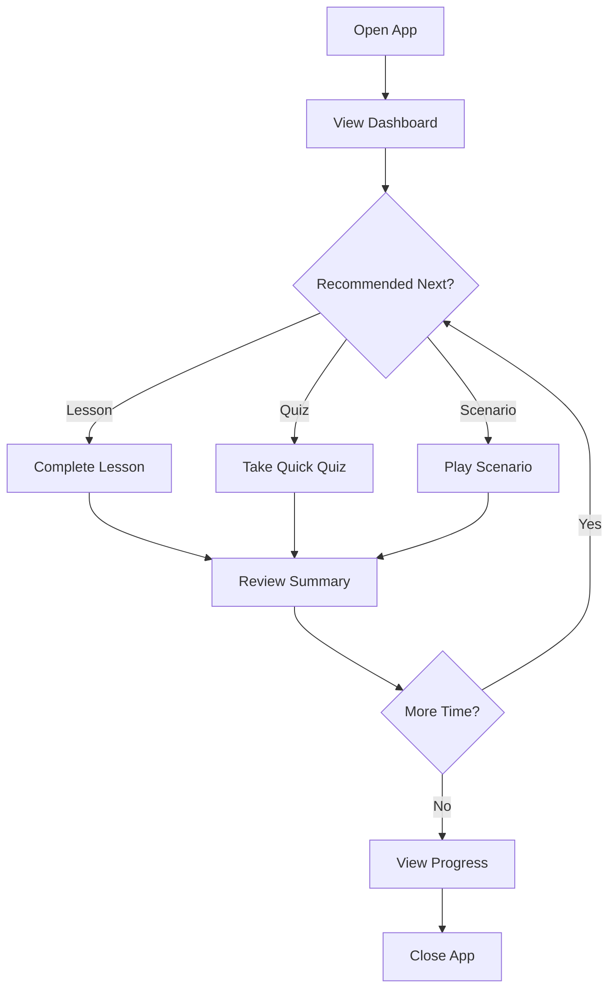

**Detailed Steps:**

| Step | Actor | Action | System Response | Success Criteria |
|------|-------|--------|-----------------|------------------|
| 1 | Sophie | Open app | Show dashboard with streak | Load < 2 seconds |
| 2 | System | Display recommendations | Show "Continue where you left off" | Relevant to progress |
| 3 | Sophie | Select recommended activity | Open lesson/quiz/scenario | Smooth transition |
| 4 | Sophie | Complete activity | Track time, record completion | Progress updated |
| 5 | System | Show activity summary | Points earned, next recommendation | Encouraging feedback |
| 6 | Sophie | Decide: continue or stop | Allow easy continuation or exit | No friction either way |
| 7 | Sophie | View daily progress | Show streak, badges, rankings | Motivating visualisation |

**Touchpoints:** Web Application, Mobile Web

**Time to Complete:** 5-15 minutes (user controlled)

---

#### 6.1.3 Taking a Certification Quiz

**Trigger:** Learner ready to attempt Bronze/Silver/Gold certification

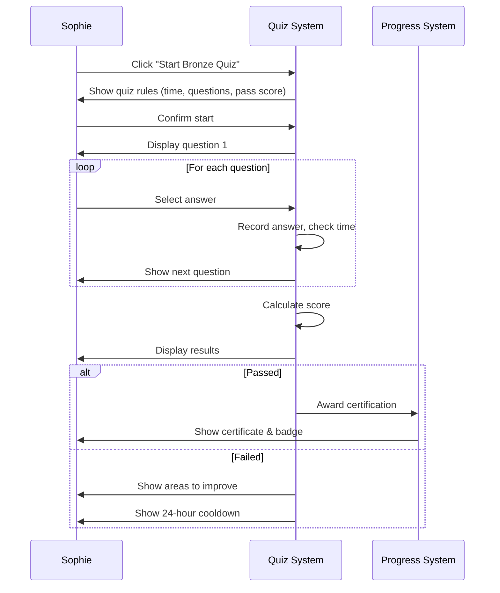

**Detailed Steps:**

| Step | Actor | Action | System Response | Success Criteria |
|------|-------|--------|-----------------|------------------|
| 1 | Sophie | Navigate to certification quiz | Show quiz overview (tier, questions, time) | Clear expectations |
| 2 | System | Check eligibility | Verify prerequisites met, cooldown clear | Block if ineligible with reason |
| 3 | Sophie | Click "Start Quiz" | Show confirmation modal | Confirm commitment |
| 4 | Sophie | Confirm start | Begin timer, show first question | Smooth quiz start |
| 5 | Sophie | Answer questions | Record answers, update timer | No lag, clear feedback |
| 6 | System | Calculate final score | Process all answers | Accurate calculation |
| 7 | System | Display results | Show score, pass/fail, breakdown | Clear, non-judgemental |
| 8a | System (Pass) | Award certification | Update user record, trigger badge | Celebration moment |
| 8b | System (Fail) | Show improvement areas | Recommend study topics | Constructive guidance |
| 9 | System | Record attempt | Store in attempt history | Available in progress view |

**Business Rules:**
- Bronze: 70% pass threshold
- Silver: 80% pass threshold (requires Bronze)
- Gold: 90% pass threshold (requires Silver)
- 24-hour cooldown between attempts of same quiz
- Best score retained

**Time to Complete:** 15-25 minutes depending on tier

---

#### 6.1.4 Completing a Customer Scenario

**Trigger:** Learner practices customer interaction skills

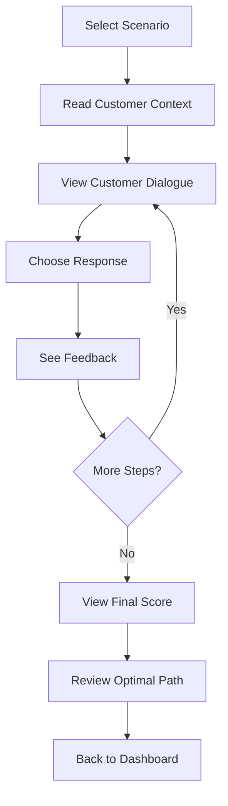

**Detailed Steps:**

| Step | Actor | Action | System Response | Success Criteria |
|------|-------|--------|-----------------|------------------|
| 1 | Sophie | Select scenario from list | Show scenario overview | Clear context, estimated time |
| 2 | Sophie | Click "Start Scenario" | Show customer persona and situation | Engaging setup |
| 3 | System | Display customer dialogue | Show what customer says | Realistic dialogue |
| 4 | Sophie | Choose from 3-4 response options | Record choice | Clear options, no time pressure |
| 5 | System | Show immediate feedback | Explain why choice was good/bad | Educational, not punitive |
| 6 | System | Show customer reaction | Display next customer dialogue | Natural conversation flow |
| 7 | Repeat | Steps 4-6 for all scenario steps | Progress through scenario | Engaging narrative |
| 8 | System | Calculate final score | Process all choices | Fair scoring |
| 9 | System | Show results with optimal path | Compare learner path vs optimal | Learning opportunity |
| 10 | Sophie | Return to dashboard | Update progress | Sense of completion |

**Time to Complete:** 5-15 minutes depending on scenario

---

#### 6.1.5 Reviewing Weak Areas

**Trigger:** Learner wants to improve based on gap analysis

```mermaid
flowchart TD
    A[View Progress Dashboard] --> B[See Gap Analysis]
    B --> C[System shows weak areas]
    C --> D[Click "Improve French Wines"]
    D --> E[Study recommended lessons]
    E --> F[Take focused quiz]
    F --> G{Improved?}
    G -->|Yes| H[Gap reduced]
    G -->|No| I[More practice recommended]
    I --> E
    H --> J[Next weak area]
```

**Detailed Steps:**

| Step | Actor | Action | System Response | Success Criteria |
|------|-------|--------|-----------------|------------------|
| 1 | Sophie | View progress dashboard | Display overall progress | Clear visualisation |
| 2 | System | Show gap analysis | Highlight weak areas with recommendations | Actionable insights |
| 3 | Sophie | Click on weak area | Show targeted learning path | Relevant content |
| 4 | Sophie | Complete recommended lessons | Track completion | Progress visible |
| 5 | Sophie | Take focused quiz | Assess improvement | Fair assessment |
| 6 | System | Update gap analysis | Reflect improvement | Encouraging feedback |

**Time to Complete:** 15-30 minutes per weak area

---

### 6.2 Manager Journeys

#### 6.2.1 Setting Up Venue and Uploading Wine List

**Trigger:** Manager starts using Sommelier Spark for their venue

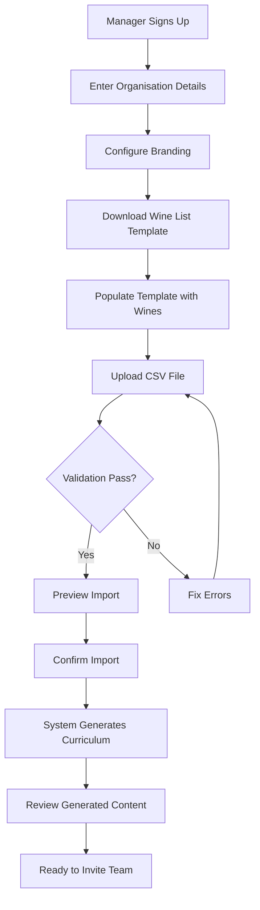

**Detailed Steps:**

| Step | Actor | Action | System Response | Success Criteria |
|------|-------|--------|-----------------|------------------|
| 1 | James | Sign up / log in as manager | Create organisation record | Smooth onboarding |
| 2 | James | Enter organisation details | Save name, type, industry | Clear fields |
| 3 | James | Upload logo, set colours | Apply branding | Visual confirmation |
| 4 | James | Download CSV template | Provide formatted template | Template works in Excel/Sheets |
| 5 | James | Fill template with wine list | (Offline in Excel) | Clear instructions in template |
| 6 | James | Upload completed CSV | Validate file format | Clear error messages |
| 7 | System | Validate wine data | Show validation report | Row-by-row feedback |
| 8 | James | Fix any validation errors | Re-validate | Errors clearly explained |
| 9 | James | Preview import | Show wines to be imported | Confirm data looks correct |
| 10 | James | Confirm import | Import wines to organisation | Success message |
| 11 | System | Generate curriculum | Transform wines into modules | Progress indicator |
| 12 | James | Review generated curriculum | Show modules, quizzes created | Quality check |
| 13 | System | Notify ready for team | Show "Invite Team" CTA | Clear next step |

**Time to Complete:** 30-60 minutes (depending on wine list size)

---

#### 6.2.2 Inviting Team Members

**Trigger:** Manager ready to add staff to the platform

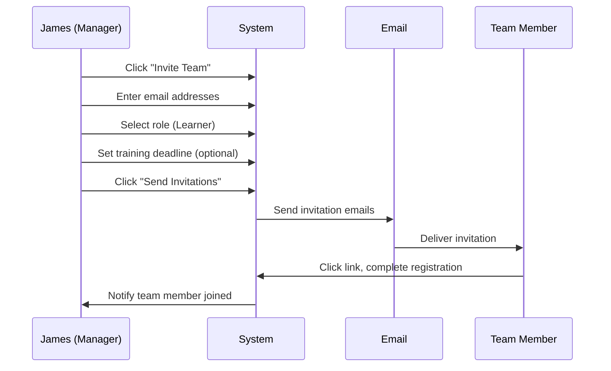

**Detailed Steps:**

| Step | Actor | Action | System Response | Success Criteria |
|------|-------|--------|-----------------|------------------|
| 1 | James | Navigate to Team page | Show current team members | Clear list |
| 2 | James | Click "Invite Team Members" | Show invitation form | Simple interface |
| 3 | James | Enter email addresses (bulk) | Parse multiple emails | Accept various formats |
| 4 | James | Select role for invitees | Default to Learner | Clear role descriptions |
| 5 | James | Set training deadline (optional) | Calendar picker | Optional but encouraged |
| 6 | James | Click "Send Invitations" | Validate emails, send | Confirmation |
| 7 | System | Send invitation emails | Branded email with link | Delivered quickly |
| 8 | Team Member | Receive and click invitation | Open registration | Smooth experience |
| 9 | System | Notify manager | In-app notification | Real-time awareness |

**Time to Complete:** 5-10 minutes

---

#### 6.2.3 Monitoring Team Progress Dashboard

**Trigger:** Manager reviews team training status

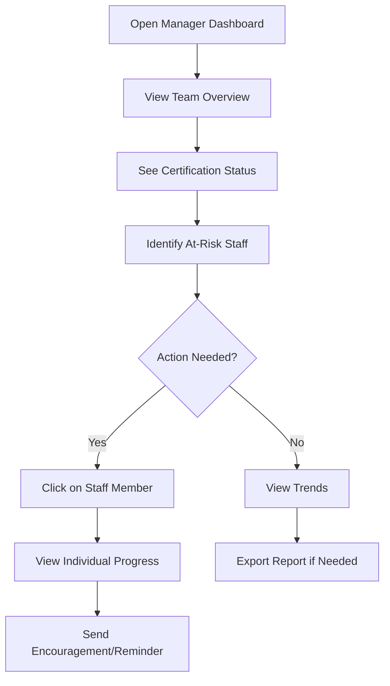

**Detailed Steps:**

| Step | Actor | Action | System Response | Success Criteria |
|------|-------|--------|-----------------|------------------|
| 1 | James | Open manager dashboard | Display team overview | Load < 2 seconds |
| 2 | System | Show certification summary | Bronze/Silver/Gold counts | At-a-glance status |
| 3 | System | Highlight at-risk staff | Show who's behind deadline | Proactive alerting |
| 4 | James | Click on staff member | Show individual progress | Detailed view |
| 5 | James | Review their weak areas | Display gap analysis | Actionable insight |
| 6 | James | Send encouragement message | In-app message or reminder | Non-punitive support |
| 7 | James | View team trends | Show improvement over time | Motivating trends |

**Time to Complete:** 5-10 minutes (regular check-in)

---

#### 6.2.4 Generating Completion Reports

**Trigger:** Manager needs to report to venue owner

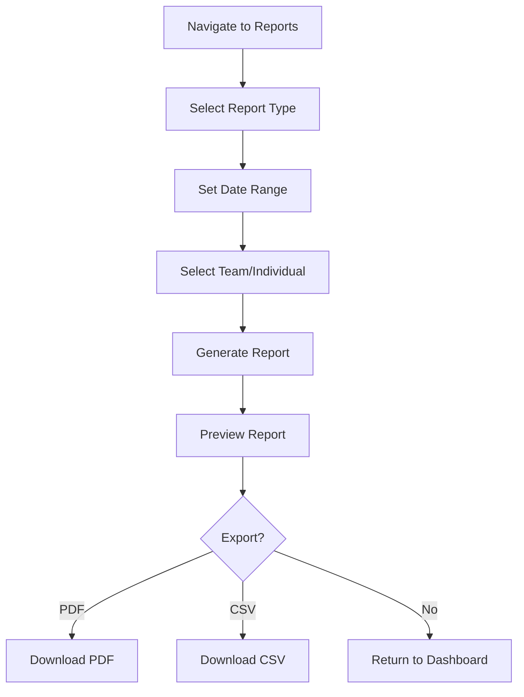

**Detailed Steps:**

| Step | Actor | Action | System Response | Success Criteria |
|------|-------|--------|-----------------|------------------|
| 1 | James | Navigate to Reports section | Show report options | Clear categories |
| 2 | James | Select report type | Show configuration options | Appropriate options |
| 3 | James | Set date range | Calendar picker | Default to useful range |
| 4 | James | Select scope (team/individual) | Update preview | Real-time preview |
| 5 | James | Click "Generate Report" | Process and display | < 5 seconds |
| 6 | James | Review report | Show data visualisations | Professional appearance |
| 7 | James | Export if needed | Download PDF or CSV | Clean formatting |

**Time to Complete:** 5 minutes

---

### 6.3 Content Author Journeys

#### 6.3.1 Creating a Custom Quiz

**Trigger:** Author creates venue-specific assessment

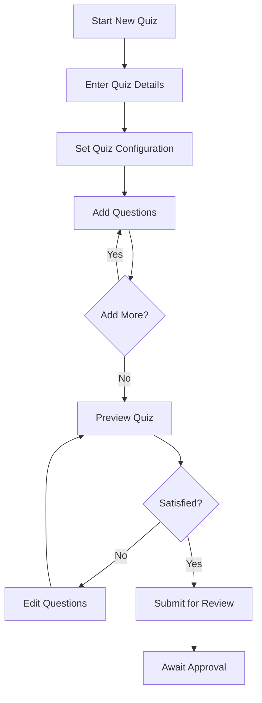

**Detailed Steps:**

| Step | Actor | Action | System Response | Success Criteria |
|------|-------|--------|-----------------|------------------|
| 1 | Marcus | Click "Create New Quiz" | Open quiz editor | Clean interface |
| 2 | Marcus | Enter title and description | Auto-save | Immediate feedback |
| 3 | Marcus | Set tier and passing score | Suggest defaults by tier | Smart defaults |
| 4 | Marcus | Add first question | Show question editor | Intuitive form |
| 5 | Marcus | Enter question text | Rich text support | Formatting options |
| 6 | Marcus | Add answer options | 2-6 options | Easy add/remove |
| 7 | Marcus | Mark correct answer(s) | Visual indication | Clear selection |
| 8 | Marcus | Add explanation | Rich text | Help learners |
| 9 | Marcus | Repeat for all questions | Auto-save each | Progress saved |
| 10 | Marcus | Preview quiz | Show learner view | Accurate preview |
| 11 | Marcus | Submit for review | Change status to REVIEW | Confirmation |

**Time to Complete:** 30-60 minutes depending on quiz length

---

#### 6.3.2 Responding to Reviewer Feedback

**Trigger:** Author receives change request from reviewer

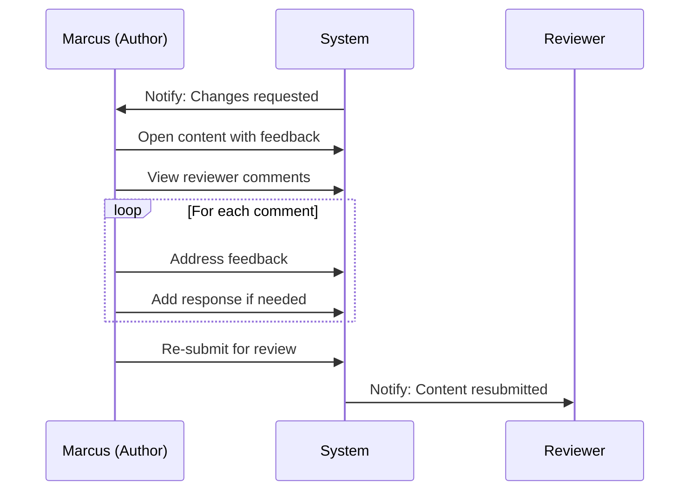

**Detailed Steps:**

| Step | Actor | Action | System Response | Success Criteria |
|------|-------|--------|-----------------|------------------|
| 1 | System | Send notification | Email + in-app | Timely notification |
| 2 | Marcus | Open content | Show content with feedback | Comments visible |
| 3 | Marcus | Review each comment | Inline comments highlighted | Easy to find |
| 4 | Marcus | Make requested changes | Update content | Changes tracked |
| 5 | Marcus | Respond to reviewer | Add response comment | Clear communication |
| 6 | Marcus | Re-submit for review | Status back to REVIEW | Confirmation |
| 7 | System | Notify reviewer | Email + in-app | Close the loop |

**Time to Complete:** Varies by feedback volume

---

## 7. Non-Functional Requirements

### 7.1 Performance

| Requirement | Target | Measurement |
|-------------|--------|-------------|
| **Page Load Time** | < 2 seconds | Time to interactive (P95) |
| **Quiz Generation** | < 30 seconds | Time from wine list upload to quiz availability |
| **Scenario Generation** | < 1 minute | Time to generate complete scenario |
| **API Response Time** | < 500ms | P95 response time for API calls |
| **Search Response** | < 1 second | Full-text search results |
| **Report Generation** | < 5 seconds | Standard reports |

### 7.2 Scalability

| Dimension | MVP Target | Growth Target |
|-----------|------------|---------------|
| **Organisations** | 100 | 500+ |
| **Total Users** | 2,500 | 50,000+ |
| **Concurrent Users** | 500 | 5,000+ |
| **Wines per Organisation** | 500 | 10,000 |
| **Questions in System** | 10,000 | 100,000+ |
| **Daily Quiz Attempts** | 5,000 | 50,000 |

### 7.3 Security

#### 7.3.1 Data Protection

| Control | Implementation |
|---------|----------------|
| **Encryption at Rest** | AES-256 for database, object storage |
| **Encryption in Transit** | TLS 1.3 for all connections |
| **Password Storage** | bcrypt with cost factor 12 |
| **Session Management** | JWT with 8-hour expiry, refresh tokens |
| **API Security** | Rate limiting, API keys for integrations |

#### 7.3.2 Access Control

| Control | Implementation |
|---------|----------------|
| **Authentication** | Email/password (MVP), MFA optional |
| **Authorization** | Role-based access control (RBAC) |
| **Organisation Isolation** | Row-level security policies |
| **Audit Logging** | All content and user actions logged |

#### 7.3.3 Compliance

| Requirement | Approach |
|-------------|----------|
| **GDPR** | Data minimisation, consent tracking, deletion rights |
| **Data Retention** | Configurable retention, automatic archival |
| **Right to Erasure** | User deletion workflow with data anonymisation |
| **Data Portability** | Export functionality for user data |

### 7.4 Availability

| Tier | Uptime SLA | Maintenance Window |
|------|------------|-------------------|
| **Starter** | 99.5% | Sunday 02:00-06:00 GMT |
| **Professional** | 99.5% | Sunday 02:00-06:00 GMT |
| **Enterprise** | 99.9% | Coordinated with customer |

**Recovery Objectives:**

| Metric | Target |
|--------|--------|
| **Recovery Time Objective (RTO)** | 4 hours |
| **Recovery Point Objective (RPO)** | 1 hour |
| **Backup Frequency** | Hourly incremental, daily full |
| **Backup Retention** | 30 days |

### 7.5 Accessibility

| Standard | Target |
|----------|--------|
| **WCAG Level** | 2.1 AA Compliance |
| **Screen Reader** | Full support (NVDA, VoiceOver) |
| **Keyboard Navigation** | All functions accessible via keyboard |
| **Colour Contrast** | Minimum 4.5:1 ratio |
| **Focus Indicators** | Visible focus states |
| **Alt Text** | All images have descriptive alt text |

### 7.6 Internationalisation Readiness

**MVP Scope:** English (UK) only

**Architecture Provisions for Future i18n:**

| Element | MVP Implementation |
|---------|-------------------|
| **Content Locale Field** | Database field present, set to `en-GB` |
| **UI Strings** | Externalised to translation files |
| **Date Formatting** | Abstracted, locale-aware |
| **Currency Formatting** | Abstracted, locale-aware |
| **Number Formatting** | Abstracted, locale-aware |
| **Right-to-Left Support** | CSS framework supports RTL |

**Future Language Roadmap:**

| Phase | Languages |
|-------|-----------|
| Phase 2 (Q3 2026) | French, German, Spanish |
| Phase 3 (Q1 2027) | Italian, Portuguese, Dutch |
| Phase 4 (Q3 2027) | Mandarin, Japanese |

---

## 8. Release Strategy

### 8.1 MVP Scope (1 March 2026)

#### 8.1.1 In Scope

**Platform Features:**

| Feature | Description | Priority |
|---------|-------------|----------|
| Learner Web Application | Full learning experience | Must |
| Mobile Web Wrapper | Responsive mobile access | Must |
| Manager Dashboard | Team progress visibility | Must |
| Admin Panel | Content and user management | Must |

**Learning Features:**

| Feature | Description | Priority |
|---------|-------------|----------|
| Wine List Import (CSV) | Bulk upload venue wines | Must |
| Auto-Curriculum Generation | Transform wine list to modules | Must |
| Progressive Disclosure Content | Three levels of wine detail | Must |
| Quiz System | Bronze/Silver/Gold assessments | Must |
| 4 Scenario Templates | Customer interaction practice | Must |
| Progress Tracking | Individual and team progress | Must |
| Certification System | Bronze/Silver/Gold certificates | Must |

**CMS Features:**

| Feature | Description | Priority |
|---------|-------------|----------|
| Wine Management | CRUD operations for wines | Must |
| Module Management | Create/edit learning modules | Must |
| Quiz Management | Create/edit quizzes | Must |
| Review Workflow | Submit/review/approve cycle | Must |
| Basic Search | Find content by keyword | Must |

**Business Features:**

| Feature | Description | Priority |
|---------|-------------|----------|
| Email/Password Auth | Standard authentication | Must |
| Starter Tier | Basic subscription | Must |
| Professional Tier | Advanced subscription | Must |
| Basic Reporting | Progress reports | Must |
| Email Notifications | System notifications | Must |

#### 8.1.2 Out of Scope (Future Phases)

| Feature | Phase | Rationale |
|---------|-------|-----------|
| Offline Mobile Mode | Phase 3 | Technical complexity |
| SSO/SAML | Phase 2 | Enterprise only |
| LLM-Powered Explanations | Phase 3 | AI maturity |
| Multi-Language Content | Phase 3 | Localisation effort |
| Native iOS/Android Apps | Phase 3 | Development effort |
| Enterprise Tier | Phase 2 | Market development |
| Advanced Gamification | Phase 2 | Core functionality first |
| Team Competitions | Phase 2 | Core functionality first |
| API Access (External) | Phase 2 | Partner ecosystem |

### 8.2 Phase 2 (Q2 2026)

**Target Date:** 1 June 2026

| Feature | Description |
|---------|-------------|
| **Enterprise Tier Launch** | SLA, dedicated support, custom pricing |
| **SSO/SAML Integration** | Okta, Azure AD, Google Workspace |
| **Advanced Scenario Templates** | 8 additional templates |
| **Team Competitions** | Leaderboards, challenges |
| **API Access** | External integrations |
| **Advanced Reporting** | Custom reports, BI exports |
| **Gamification Enhancements** | Badges, streaks, achievements |

### 8.3 Phase 3 (Q3-Q4 2026)

**Target Date:** 1 October 2026

| Feature | Description |
|---------|-------------|
| **Multi-Language Support** | French, German, Spanish |
| **Offline Mobile Mode** | Download content for offline use |
| **AI-Enhanced Explanations** | LLM-powered personalised feedback |
| **Native iOS App** | Full native experience |
| **Native Android App** | Full native experience |
| **Advanced Analytics** | Predictive insights, benchmarks |

### 8.4 Release Timeline

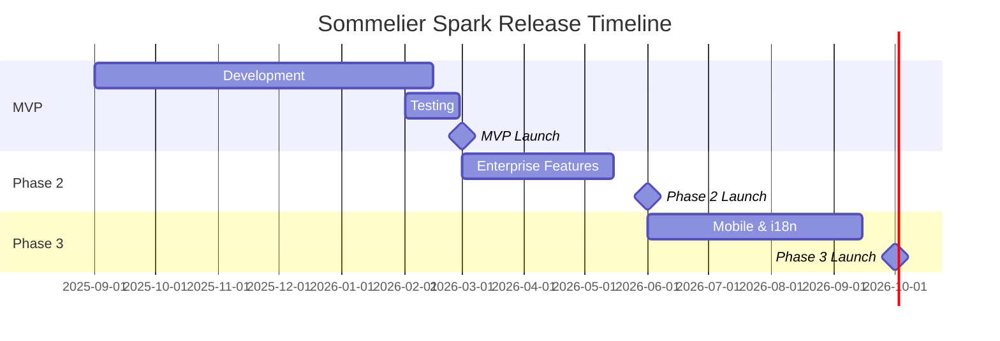

---

## 9. Success Metrics & KPIs

### 9.1 User Engagement Metrics

| Metric | Definition | MVP Target | 12-Month Target |
|--------|------------|------------|-----------------|
| **Daily Active Users (DAU)** | Unique users per day | 250 | 1,500 |
| **Weekly Active Users (WAU)** | Unique users per week | 800 | 4,000 |
| **Monthly Active Users (MAU)** | Unique users per month | 1,500 | 5,000 |
| **DAU/MAU Ratio** | Engagement stickiness | 15%+ | 25%+ |
| **Avg Session Duration** | Time in app per session | 8 minutes | 12 minutes |
| **Sessions per User per Week** | Frequency | 3 | 5 |
| **Lessons Completed per Week** | Content consumption | 5,000 | 25,000 |
| **Quiz Attempt Rate** | % users attempting quizzes | 60% | 75% |
| **Scenario Completion Rate** | % scenarios completed once started | 80% | 85% |

### 9.2 Learning Outcome Metrics

| Metric | Definition | MVP Target | 12-Month Target |
|--------|------------|------------|-----------------|
| **Bronze Certification Rate** | % users achieving Bronze | 70% | 80% |
| **Silver Certification Rate** | % Bronze holders achieving Silver | 40% | 55% |
| **Gold Certification Rate** | % Silver holders achieving Gold | 20% | 35% |
| **Time to Bronze** | Median days from signup | 14 days | 10 days |
| **Time to Silver** | Median days from Bronze | 45 days | 30 days |
| **Time to Gold** | Median days from Silver | 60 days | 45 days |
| **Average Quiz Score** | Mean score across all attempts | 72% | 78% |
| **Knowledge Retention** | Re-test score after 30 days | 70% | 80% |
| **Weak Area Improvement** | % improvement in flagged areas | 15% | 25% |

### 9.3 Business Metrics

| Metric | Definition | MVP Target | 12-Month Target |
|--------|------------|------------|-----------------|
| **Organisations Onboarded** | Total paying organisations | 50 | 200 |
| **Monthly Recurring Revenue (MRR)** | Recurring subscription revenue | £25,000 | £100,000 |
| **Annual Recurring Revenue (ARR)** | Annualised MRR | £300,000 | £1,200,000 |
| **Average Revenue per Organisation** | MRR / Organisations | £500 | £500 |
| **Customer Acquisition Cost (CAC)** | Cost to acquire customer | £1,000 | £800 |
| **Customer Lifetime Value (LTV)** | Total revenue per customer | £6,000 | £9,000 |
| **LTV:CAC Ratio** | Unit economics health | 6:1 | 11:1 |
| **Monthly Churn Rate** | % organisations leaving | <3% | <2% |
| **Net Revenue Retention (NRR)** | Revenue including expansion/churn | 105% | 115% |
| **Net Promoter Score (NPS)** | Customer satisfaction | 40 | 55 |

### 9.4 Content Metrics

| Metric | Definition | MVP Target | 12-Month Target |
|--------|------------|------------|-----------------|
| **Wines in Platform** | Total wine records | 5,000 | 50,000 |
| **Questions Generated** | Total quiz questions | 10,000 | 100,000 |
| **Scenarios Available** | Unique scenarios | 50 | 200 |
| **Content Review Turnaround** | Days from submission to publish | 3 days | 2 days |
| **Content Quality Score** | % content passing review first time | 70% | 85% |
| **Wine List Coverage** | % org wines with full content | 90% | 95% |

### 9.5 Operational Metrics

| Metric | Definition | Target |
|--------|------------|--------|
| **Platform Uptime** | % time available | 99.5% |
| **Page Load Time (P95)** | 95th percentile load time | <2s |
| **API Response Time (P95)** | 95th percentile API latency | <500ms |
| **Support Ticket Resolution** | Time to resolve tickets | <24h (Starter), <4h (Enterprise) |
| **Critical Bug Resolution** | Time to fix P1 bugs | <4h |

---

## 10. Risks & Mitigations

### 10.1 Risk Register

| ID | Risk | Category | Likelihood | Impact | Risk Score | Mitigation Strategy |
|----|------|----------|------------|--------|------------|---------------------|
| R1 | Content quality issues (inaccurate wine information) | Quality | Medium | High | High | Domain expert review workflow, quality thresholds, version control |
| R2 | Low user engagement (staff don't use platform) | Adoption | Medium | High | High | Gamification, manager visibility, mobile-first design, short sessions |
| R3 | Wine list import errors (bad data) | Technical | Medium | Medium | Medium | Robust validation, clear error messages, template with examples |
| R4 | Competitor launches similar product | Market | Low | Medium | Low | Patent protection, rapid feature iteration, customer relationships |
| R5 | Data breach or security incident | Security | Low | Critical | High | Security audit, encryption, access controls, incident response plan |
| R6 | Learning Engine patent not granted | Legal | Low | High | Medium | Alternative IP protection (trade secrets), defensive patents |
| R7 | Key personnel departure | Operational | Medium | Medium | Medium | Documentation, knowledge sharing, succession planning |
| R8 | Subscription payment failures | Revenue | Medium | Medium | Medium | Dunning management, payment retry logic, grace periods |
| R9 | Platform performance issues at scale | Technical | Low | High | Medium | Load testing, horizontal scaling, CDN, caching |
| R10 | GDPR compliance failure | Legal | Low | Critical | Medium | Privacy by design, DPO review, user consent management |

### 10.2 Risk Matrix

```
Impact
  ▲
  │ Critical │ R5, R10 │           │           │ R6        │
  │ High     │         │           │ R1, R2    │ R9        │
  │ Medium   │         │ R7, R8    │ R3        │ R4        │
  │ Low      │         │           │           │           │
  └──────────┴─────────┴───────────┴───────────┴───────────┴──────► Likelihood
             Very Low   Low         Medium      High
```

### 10.3 Mitigation Details

#### R1: Content Quality Issues

| Mitigation | Implementation |
|------------|----------------|
| Domain expert review | All content reviewed by qualified wine experts |
| Quality thresholds | Minimum content standards enforced by system |
| Version control | All changes tracked, rollback capability |
| User feedback | Report mechanism for content issues |
| Regular audits | Quarterly content quality reviews |

#### R2: Low User Engagement

| Mitigation | Implementation |
|------------|----------------|
| Gamification | Badges, streaks, leaderboards |
| Manager visibility | Dashboard showing who's engaged |
| Mobile-first | Easy access on personal devices |
| Short sessions | 10-minute daily learning target |
| Relevant content | Venue-specific, not generic |
| Progress rewards | Visible certification journey |

#### R5: Data Breach

| Mitigation | Implementation |
|------------|----------------|
| Security audit | Annual third-party penetration testing |
| Encryption | AES-256 at rest, TLS 1.3 in transit |
| Access controls | RBAC, least privilege |
| Audit logging | All access logged |
| Incident response | Documented IR plan, 24h response |
| Cyber insurance | Coverage for breach costs |

---

## 11. Dependencies

### 11.1 Internal Dependencies

| Dependency | Owner | Status | Impact if Delayed |
|------------|-------|--------|-------------------|
| WS3.0 Core Domain Requirements | Complete | ✅ Done | N/A - Complete |
| WS3 Specification Suite | In Progress | 🔄 This document first | Blocks detailed design |
| UI/UX Design System | Design Team | ⏳ Pending | Delays frontend development |
| Wine Content Library | Content Team | ⏳ Pending | Delays demo quality |
| Test Automation Framework | QA Team | ⏳ Pending | Delays release confidence |

### 11.2 External Dependencies

| Dependency | Vendor/Partner | Status | Impact if Delayed |
|------------|----------------|--------|-------------------|
| Cloud Infrastructure | AWS/GCP/Azure | ⏳ Pending selection | Blocks deployment |
| Payment Processing | Stripe | ⏳ Pending integration | Blocks subscription billing |
| Email Service | SendGrid/Postmark | ⏳ Pending selection | Blocks notifications |
| CDN | CloudFlare/Fastly | ⏳ Pending selection | Performance impact |
| Domain/SSL | Registrar/CA | ⏳ Pending | Blocks launch |
| Legal Review | External Counsel | ⏳ Pending | Blocks terms of service |

### 11.3 Dependency Timeline

| Dependency | Required By | Lead Time |
|------------|-------------|-----------|
| Cloud Infrastructure | 1 Dec 2025 | 4 weeks |
| Payment Processing | 1 Jan 2026 | 6 weeks |
| Email Service | 1 Jan 2026 | 2 weeks |
| Legal Review | 1 Feb 2026 | 8 weeks |
| Content Library (initial) | 15 Feb 2026 | 8 weeks |
| QA Complete | 28 Feb 2026 | Ongoing |

---

## 12. Appendices

### 12.1 Glossary

| Term | Definition |
|------|------------|
| **Appellation** | Legally defined wine-growing region with specific rules |
| **Bronze Certification** | Entry-level certification requiring 70% pass score |
| **Content Author** | User role that creates educational content |
| **Content Admin** | User role that manages and approves all content |
| **Curriculum** | Structured learning path generated from wine list |
| **Decision Tree** | Branching narrative structure in scenarios |
| **Distractor** | Plausible but incorrect answer option in a quiz |
| **Domain Expert** | Subject matter expert who reviews content accuracy |
| **Gap Analysis** | Identification of knowledge gaps based on performance |
| **Gold Certification** | Advanced certification requiring 90% pass score |
| **Learner** | User role consuming educational content |
| **Learning Engine** | System that transforms wine lists into curricula |
| **Module** | Collection of related lessons on a topic |
| **Multi-tenant** | Architecture supporting multiple isolated organisations |
| **Organisation** | Customer entity (restaurant, hotel, etc.) |
| **Progressive Disclosure** | Revealing content in stages (Quick Facts → Detailed → Expert) |
| **Scenario** | Interactive customer simulation with branching dialogue |
| **Silver Certification** | Intermediate certification requiring 80% pass score |
| **Sommelier** | Wine professional responsible for wine service |
| **Tier** | Difficulty/certification level (Bronze, Silver, Gold) |
| **Wine List** | Venue's menu of available wines |

### 12.2 Reference Documents

| Document ID | Title | Description |
|-------------|-------|-------------|
| SS-WS3.0-CDM | Content Domain Model | Entity definitions and relationships |
| SS-WS3.0-CLS | Content Lifecycle Specification | Content states and transitions |
| SS-WS3.0-ORG | Organization Model | Multi-tenant and role definitions |
| SS-WS3.0-CMS-FR | CMS Functional Requirements | 159 CMS requirements |
| SS-WS3.0-CMS-WF | CMS Workflow Specification | Content management workflows |
| SS-WS3.0-CMS-IE | Content Import/Export Specification | Import/export schemas |
| SS-WS3.0-LE-REQ | Learning Engine Requirements | 112 learning engine requirements |
| SS-WS3.0-LE-CGR | Content Generation Rules | Question and scenario templates |
| SS-WS3.0-LE-CLM | Content-to-Learning Mapping | Transformation logic |
| SS-WS3.0-SUM | WS3.0 Completion Summary | Workstream summary |

### 12.3 Requirement Traceability Matrix

| PRD Section | WS3.0 Source Documents |
|-------------|------------------------|
| 3. User Personas | SS-WS3.0-ORG (Section 3), SS-WS3.0-CMS-FR (Section 2) |
| 4. Product Overview | SS-WS3.0-CDM, SS-WS3.0-ORG, SS-WS3.0-LE-REQ |
| 5.1 CMS Requirements | SS-WS3.0-CMS-FR |
| 5.2 Learning Engine Requirements | SS-WS3.0-LE-REQ |
| 6. User Journeys | SS-WS3.0-CMS-WF, SS-WS3.0-LE-CLM |
| 7. Non-Functional Requirements | SS-WS3.0-CMS-FR (Section 12), SS-WS3.0-LE-REQ (Section 11) |
| 8. Release Strategy | SS-WS3.0-SUM (Section 8) |

### 12.4 Business Rules Reference

| Rule | Value | Source |
|------|-------|--------|
| Bronze Pass Threshold | 70% | SS-WS3.0-CDM |
| Silver Pass Threshold | 80% | SS-WS3.0-CDM |
| Gold Pass Threshold | 90% | SS-WS3.0-CDM |
| Quiz Retake Cooldown | 24 hours | Confirmed |
| Content Version Retention | 2 years | SS-WS3.0-CLS |
| Soft Delete Recovery | 30 days | SS-WS3.0-CLS |
| Archive Warning Period | 7 days | SS-WS3.0-CLS |
| Review Escalation | 3 / 5 / 7 days | SS-WS3.0-CMS-WF |
| Small Wine List | < 10 wines (compressed curriculum) | Confirmed |
| Standard Wine List | 10-200 wines (10 modules) | Confirmed |
| Large Wine List | > 200 wines (tiered: 50/100/all) | Confirmed |

### 12.5 Subscription Tier Summary

| Feature | Starter (£149/mo) | Professional (£449/mo) | Enterprise (Custom) |
|---------|-------------------|------------------------|---------------------|
| Users | Up to 25 | Up to 100 | Unlimited |
| Core Learning | ✓ | ✓ | ✓ |
| Quiz System | ✓ | ✓ | ✓ |
| Scenarios | ✓ | ✓ | ✓ |
| Manager Dashboard | ✓ | ✓ | ✓ |
| Wine List Import | ✓ | ✓ | ✓ |
| Custom Branding | Basic | Full | Full |
| API Access | — | ✓ | ✓ |
| Advanced Reports | — | ✓ | ✓ |
| SSO/SAML | — | — | ✓ (Phase 2) |
| SLA | — | — | 99.9% |
| Dedicated Support | Email | Priority | Dedicated CSM |

### 12.6 Revision History

| Version | Date | Author | Changes |
|---------|------|--------|---------|
| 1.0 | 2026-01-20 | Obi Wan | Initial draft |

---

**Document Classification:** CONFIDENTIAL

*This document contains proprietary information about Sommelier Spark's product strategy, intellectual property, and business model. Distribution is restricted to authorised personnel only.*

---

*End of Product Requirements Document*
